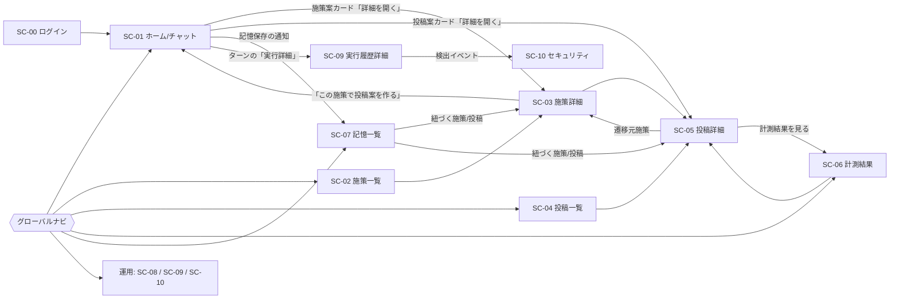

# 画面設計（v0.1 ドラフト）

対象: hiromeru（AI支援型Xマーケティングシステム MVP）
根拠資料: `docs/v.0.1/REQUIREMENTS.md`、`docs/v.0.1/DATABASE.dbml`

---

# 1. 設計方針

## 1.1 確定事項（ヒアリング結果）

| # | 項目 | 決定内容 |
|---|------|----------|
| 1 | UI構成 | チャット中心＋業務画面。ホームは親エージェントとのチャット。施策・投稿・記憶・計測は一覧/詳細画面で管理する。承認・投稿操作はチャット内カードと詳細画面の両方から行える |
| 2 | 可観測性 | コスト・実行履歴・セキュリティの3画面を設ける |
| 3 | 投稿方式 | 即時投稿のみ。`posts.scheduled_at` は「投稿予定日（メモ）」として記録するだけで、自動投稿はしない |
| 4 | デバイス/認証 | PCブラウザ中心。外部IdPログイン（1ボタン）。パスワード登録・ユーザー管理画面は作らない（MVPは1ユーザー＝1会社） |
| 5 | 成果物 | Markdown設計書 |

## 1.2 設計原則（要件から導出）

1. **承認ゲートを画面で強制する**: 施策の確定、投稿内容の確定、Xへの投稿は、必ず明示的なボタン操作（承認カードまたは詳細画面）を経る。エージェントの発話だけでは状態が進まない。
2. **承認済み改訂だけが公開できる**: 「Xに投稿」ボタンは `status = approved` かつ `approved_revision = revision` のときだけ有効にする。
3. **承認後の編集は再承認**: 承認済みの施策・投稿を編集して保存すると `revision` が増え、承認済みではなくなる。保存前に画面で明示する。
4. **削除より保存（アーカイブ）**: 公開済み投稿・完了済み監査記録は削除UIを出さない。外部キーが `restrict` のため、投稿を持つ施策も削除ではなくアーカイブに誘導する。
5. **コストは常に見える**: チャットの各ターンにコスト・所要時間を小さく表示し、詳細は運用画面へ誘導する。
6. **MVP外の指標は出さない**: 計測画面はX投稿初週PV数と流入ユーザー数の2指標のみ。いいね、CTR、CVRなどは表示しない（両者の比率も出さない）。

---

# 2. 画面一覧

| ID | 画面名 | パス | 主な参照テーブル |
|----|--------|------|------------------|
| SC-00 | ログイン | `/login` | users |
| SC-01 | ホーム（親エージェントチャット） | `/` , `/chat/:sessionId` | agent_sessions, agent_turns, agent_items, tool_executions |
| SC-02 | 施策一覧 | `/campaigns` | campaigns |
| SC-03 | 施策詳細・編集 | `/campaigns/:id` | campaigns, posts, memory_campaigns |
| SC-04 | 投稿一覧 | `/posts` | posts, campaigns, post_metrics |
| SC-05 | 投稿詳細・編集・承認・投稿 | `/posts/:id` | posts, post_tracking_links, post_metrics, post_metric_failures |
| SC-06 | 計測結果 | `/metrics` | post_metrics, post_metric_failures, posts, campaigns |
| SC-07 | 記憶一覧 | `/memories` | agent_memories, memory_campaigns, memory_posts |
| SC-08 | コスト | `/ops/cost` | llm_calls, agent_turns, agent_sessions |
| SC-09 | 実行履歴（一覧・詳細） | `/ops/sessions`, `/ops/sessions/:id` | agent_sessions, agent_turns, agent_items, tool_executions, llm_calls |
| SC-10 | セキュリティイベント | `/ops/security` | security_events, agent_items |

共通コンポーネント: グローバルナビ、承認カード、ステータスバッジ、確認ダイアログ、エラーバナー。

---

# 3. 画面遷移



---

# 4. 共通レイアウト

```
┌────────────────────────────────────────────────────────────┐
│ hiromeru            [会社名]                  [ユーザー ▼] │  ヘッダー
├──────────┬─────────────────────────────────────────────────┤
│ ホーム   │                                                 │
│ 施策     │                                                 │
│ 投稿     │              メインコンテンツ                   │
│ 計測結果 │                                                 │
│ 記憶     │                                                 │
│ ─ 運用 ─ │                                                 │
│ コスト   │                                                 │
│ 実行履歴 │                                                 │
│ セキュリ │                                                 │
│ ティ     │                                                 │
└──────────┴─────────────────────────────────────────────────┘
```

- ナビの各項目に「対応が必要な件数」バッジを付ける（施策=承認待ち件数、投稿=承認待ち＋投稿失敗件数、計測結果=計測失敗件数、セキュリティ=直近24時間の検出件数）。
- ヘッダーのユーザーメニュー: ログアウトのみ。
- 会社名は `companies.name` を表示（編集UIはMVPでは作らない）。

## 4.1 ステータスバッジ

| 種別 | 値 | 表示ラベル | 色の意味 |
|------|----|-----------|----------|
| 施策 | draft | 下書き | 灰 |
| | pending_approval | 承認待ち | 黄（要対応） |
| | approved | 承認済み | 緑 |
| | rejected | 却下 | 赤 |
| | archived | アーカイブ | 薄灰 |
| 投稿 | draft | 下書き | 灰 |
| | pending_approval | 承認待ち | 黄（要対応） |
| | approved | 承認済み（未投稿） | 青 |
| | publishing | 投稿中 | 青（スピナー） |
| | published | 投稿済み | 緑 |
| | publish_failed | 投稿失敗 | 赤（要対応） |
| | archived | アーカイブ | 薄灰 |
| 計測 | pending | 計測待ち | 灰 |
| | processing | 計測中 | 青 |
| | completed | 計測完了 | 緑 |
| | failed | 計測失敗 | 赤 |

承認済みの施策・投稿には常に `r{revision}`（例: r2）を併記する。

---

# 5. 画面詳細

## SC-00 ログイン

```
        hiromeru
  AIで回す、Xマーケティングの改善サイクル

     [ Googleでログイン ]   ← IdPは実装時に決定
```

- 認証成功時、`users` を `(auth_provider, auth_subject)` で照合し、`last_signed_in_at` を更新してSC-01へ。
- `users.status = disabled` の場合は「このアカウントは利用できません」を表示。
- 初回ログイン時にユーザー・会社・マーケターをどう作るかは未確定（§7 U-1）。

---

## SC-01 ホーム（親エージェントチャット）

システムの中心画面。要件2.1の親エージェントとの対話窓口であり、2.2/2.3のサブエージェントの作業もこのスレッド内に表示する。

### レイアウト

```
┌ セッション一覧 ┬──────────────── チャット ────────────────────┐
│ [＋新しい会話] │ 会話タイトル                         [アーカイブ] │
│                │                                                  │
│ ● エンジニア採 │ 👤 エンジニア採用向けの施策を考えて               │
│   用の施策     │                                                  │
│ ○ 6月の投稿案  │ 🤖 親エージェント                                │
│ ○ ...          │   過去の記憶を検索しました（3件）  [▼詳細]       │
│                │   Web検索: 「エンジニア 採用 X」   [▼詳細]       │
│                │                                                  │
│                │ 🤖 施策立案エージェント                          │
│                │   ターゲットの職種を教えてください。             │
│                │                                                  │
│                │ 👤 バックエンドエンジニア中心です                │
│                │                                                  │
│                │ ┌─ 施策案（未承認）───────────────────────┐    │
│                │ │ タイトル / ターゲット像 / 背景 / 目的 / 内容 │    │
│                │ │ [承認して保存] [修正を依頼] [詳細を開く]   │    │
│                │ └──────────────────────────────────────────┘    │
│                │  ターン完了 $0.12 ・ 8.4秒 ・ [実行詳細]          │
│                ├──────────────────────────────────────────────────┤
│                │ [メッセージを入力…                     ] [送信]  │
└────────────────┴──────────────────────────────────────────────────┘
```

### 表示要素

| 要素 | 内容 | データ元 |
|------|------|----------|
| セッション一覧 | 親エージェント（`agent = parent`）のセッション。更新日時の降順。アーカイブ済みは既定で非表示 | agent_sessions（title, status, updated_at） |
| メッセージ | ユーザー/アシスタント発話 | agent_items（user_message / assistant_message） |
| 発話者ラベル | 親／施策立案／コンテンツ制作を色とラベルで区別 | サブエージェントは `parent_session_id` を持つ別セッション。親スレッド内にインライン展開 |
| ツール実行行 | ツール名と状態（実行中/完了/失敗/ブロック）を1行で表示。クリックで入出力を展開 | agent_items（tool_call / tool_result）、tool_executions.status |
| 施策案カード | エージェントが生成した施策案。承認まではエージェント履歴内の提案であり、施策一覧には出ない | tool_result の内容（DB不変条件: 承認後に業務データ化） |
| 投稿案カード | 本文、文字数、遷移先URL、UTM付きURLのプレビュー、対象施策 | 同上（承認後に posts へ保存） |
| ターンフッター | ターン単位のコスト・所要時間・「実行詳細」リンク | llm_calls（cost_usd, response_time_ms）の合計 |
| ブロック表示 | 検出により隔離された内容は本文の代わりに「安全のため表示を省略しました」を表示 | agent_items.context_status = quarantined |

### 承認カード（共通コンポーネント）

外部への副作用・確定を伴う操作は、チャット内では必ず承認カードとして表示する。`tool_executions.status = waiting_for_approval` のツール実行に対応する。

| 種別 | カードの内容 | ボタン | 承認時の結果 |
|------|--------------|--------|--------------|
| 施策の確定 | 施策案の全項目 | 承認して保存 / 修正を依頼 / 詳細を開く | `campaigns` を `approved`（`revision = approved_revision = 1`）で保存 |
| 投稿内容の確定 | 本文・URL・対象施策 | 承認して保存 / 修正を依頼 / 詳細を開く | `posts` を `approved` で保存し、`post_tracking_links` を生成 |
| Xへの投稿 | 最終本文、UTM付きURL、「公開されます」の注意 | 今すぐ投稿 / キャンセル | 投稿実行（SC-05と同じ処理）。`publishing` → 結果 |
| データ削除 | 削除対象と影響範囲 | 削除する / キャンセル | 該当データ削除（記憶削除は内容とベクトルを完全削除） |

- 「修正を依頼」は入力欄に切り替え、修正指示をそのままエージェントに送る。
- 承認待ちのカードは、ターン終了後も画面上に残り続ける（NFR-REL-006の「人間の承認待ち」終了に対応）。会話を開き直しても復元する。
- 承認済み/却下済みのカードは結果を表示し、ボタンを無効化する。

### ターン状態の表現

| turn.status | UI表現 |
|-------------|--------|
| pending / running | 「考え中…」インジケータ、途中のツール実行行をリアルタイム表示、[停止]ボタン |
| completed | 通常表示 |
| cancelled | 「停止しました」 |
| failed | エラーバナー（マスク済みの理由）＋[再試行]。上限到達（ステップ数/コスト）は専用文言 |
| blocked | 「セキュリティ検査によりこの処理をブロックしました」＋SC-10へのリンク |

### 空状態

会話が0件のとき、依頼例（「エンジニア採用の施策を考えて」「先月の投稿結果を教えて」「これを覚えておいて: …」）をクリックで入力できるチップとして表示する。

---

## SC-02 施策一覧

```
施策                                          [＋新規作成]
[すべて▼] [承認待ち] [承認済み] ...   検索[          ]

タイトル              ステータス   改訂  投稿数  更新日
エンジニア採用_夏     承認済み r2   r2    3       09/18
新卒向け認知拡大      承認待ち      r1    0       09/20
```

- 列: `title`, `status`, `revision`, 紐づく投稿数、`updated_at`。既定は `archived` を除外。
- 「新規作成」は手動作成（要件3.1のCRUD）。エージェントに依頼する導線として「チャットで施策を相談する」も併置。
- 承認待ちが上に来るよう並び替え可能。

## SC-03 施策詳細・編集

| セクション | 内容 | カラム |
|-----------|------|--------|
| 見出し | タイトル、ステータスバッジ、改訂番号 | title, status, revision |
| 内容 | ターゲット像、実施背景、施策目的、施策内容（編集可能テキスト） | target_profile, background, objective, plan |
| 承認情報 | 承認申請日時、承認日時、承認済み改訂 | submitted_at, approved_at, approved_revision |
| 関連投稿 | この施策の投稿一覧（ステータス・投稿日・PV・流入ユーザー数） | posts, post_metrics |
| 関連記憶 | この施策に紐づく記憶 | memory_campaigns → agent_memories |
| 集計 | 投稿済み件数、PV合計、流入ユーザー数合計 | post_metrics |

### ステータス別の操作

| ステータス | 使える操作 |
|-----------|------------|
| draft | 編集、承認申請、アーカイブ、削除（投稿がない場合のみ） |
| pending_approval | 承認、却下、編集（編集すると改訂が上がる） |
| approved | 「この施策で投稿案を作る」（→SC-01。施策IDを文脈として渡す）、編集（再承認）、アーカイブ |
| rejected | 編集して再申請、アーカイブ |
| archived | 閲覧のみ、復元 |

- 承認済みの施策を編集して保存する際、確認ダイアログを出す: 「保存すると承認が取り消され、改訂が r{n+1} になります。再承認が必要です」。
- 削除ボタンは、紐づく投稿が1件でもある場合は非表示（アーカイブのみ）。

---

## SC-04 投稿一覧

```
投稿                                          [＋新規作成]
[すべて▼] [承認待ち] [承認済み] [投稿失敗] ...   施策[すべて▼]

本文（冒頭）           施策            ステータス    投稿予定  投稿日時   PV
新卒向けの…           エンジニア採用   承認済み r1   09/25     -          -
夏のインターン…        エンジニア採用   投稿済み      -         09/10      1,240
```

- 列: 本文冒頭（1行）、施策名、`status`+`revision`、`scheduled_at`（見出しは「投稿予定（メモ）」）、`published_at`、初週PV（計測完了のもののみ）。
- 「対応が必要」（承認待ち、投稿失敗）を先頭にピン留めできるフィルタを用意する。
- 「新規作成」は施策を選んで手動作成。ステータスは `draft`。承認済みの施策のみ選択可能（想定。§7 U-4）。

## SC-05 投稿詳細・編集・承認・投稿

投稿を扱う中心画面。「承認」と「Xに投稿」をここで完結できる。

```
← 投稿一覧            投稿 #12  [承認済み r2]      施策: エンジニア採用_夏 →

┌ 本文 ───────────────────────────────────────────┐
│ （テキストエリア）                                │
│                                                   │
│                                        残り 87 文字│
└───────────────────────────────────────────────────┘

投稿予定日（メモ）: [2026/09/25 ▼]  ※自動投稿はされません

┌ 遷移先とトラッキング ─────────────────────────────┐
│ 遷移先URL   [https://example.com/apply          ] │
│ UTM         source=x / medium=social              │
│             campaign=eng_summer / content=post12  │
│ 投稿されるURL: https://example.com/apply?utm_...  │
└───────────────────────────────────────────────────┘

[編集を保存]            [承認する]         [Xに投稿…]
```

### セクション

| セクション | 内容 | カラム |
|-----------|------|--------|
| ヘッダー | 投稿ID、ステータス、改訂、対象施策へのリンク | id, status, revision, campaign_id |
| 本文 | 編集可能。現行のXテキスト文字数規則に基づく残り文字数カウンタ（超過時は保存不可） | body |
| 投稿予定日 | 日付入力。補足「自動投稿はされません」を常時表示 | scheduled_at |
| 遷移先/UTM | 遷移先URL（入力）、UTM各値（読み取り専用）、UTM付きURLのプレビュー。UTMはアプリが決定論的に生成 | post_tracking_links |
| 承認情報 | 承認日時、承認済み改訂 | approved_at, approved_revision |
| 投稿結果 | 投稿日時、X投稿ID、Xで開くリンク | published_at, x_post_id |
| 投稿エラー | 失敗時のマスク済みエラー | last_publish_error |
| 計測 | 計測予定日時、状況、PV、流入ユーザー数、失敗履歴（あれば） | post_metrics, post_metric_failures |

### ステータス別の操作

| ステータス | 編集 | 承認 | Xに投稿 | その他 |
|-----------|:----:|:----:|:-------:|--------|
| draft | 可 | 承認申請 | 不可 | アーカイブ、削除 |
| pending_approval | 可（改訂+1） | 承認する | 不可 | アーカイブ |
| approved（`approved_revision = revision`） | 可（改訂+1で再承認へ） | - | **可** | アーカイブ |
| publishing | 不可 | - | 不可（ボタン無効・スピナー） | - |
| published | 不可（本文は読み取り専用） | - | 不可 | Xで開く、計測結果を見る。削除UIなし |
| publish_failed | 可 | - | 再投稿可（承認済み改訂のまま） | エラー詳細を表示 |
| archived | 不可 | - | 不可 | 復元 |

### 「Xに投稿」の確認ダイアログ

```
Xに投稿しますか？

本文:  （最終本文を表示）
URL :  https://example.com/apply?utm_...
対象施策: エンジニア採用_夏 ／ 承認済み r2

※ 投稿は公開されます。この画面から取り消すことはできません。
                              [キャンセル] [今すぐ投稿]
```

- 押下後は `publishing` に遷移し、ボタンを二重押しできないよう無効化（二重投稿防止）。数秒間ポーリングして結果を反映する。
- 成功: `published`、X投稿ID・Xリンクを表示し、計測予定日（公開から7日後）を提示。
- 失敗: `publish_failed` とマスク済みエラーを表示し、[再投稿]を有効化。

### 承認済み改訂と本文の同一性

編集中に本文が変わった場合、「未保存の変更があります。保存すると承認が取り消されます」を表示し、「Xに投稿」は無効にする。投稿の実行内容は、承認された改訂の本文とURLと常に一致させる。

---

## SC-06 計測結果

要件3.3/7の評価結果を確認する画面。指標は2つだけ。

```
計測結果            期間[すべて▼]  施策[すべて▼]  状態[すべて▼]

▼ エンジニア採用_夏          PV合計 3,420   流入ユーザー 88
   投稿           投稿日    計測予定  状態      初週PV   流入ユーザー
   夏のインター…   09/10     09/17     計測完了   1,240    41
   新卒向けの…     09/12     09/19     計測失敗   -        -    ⚠ GA4 ・再試行可能
   ...
```

| 要素 | 内容 | カラム |
|------|------|--------|
| 施策グループ | 施策ごとに折りたたみ。PV合計・流入ユーザー数合計を表示 | posts.campaign_id、post_metrics の合計 |
| 投稿行 | 投稿日、計測予定日、計測状態、初週PV、流入ユーザー数 | posts.published_at、post_metrics.scheduled_at / status / x_pv_count / landing_user_count |
| 失敗表示 | 最新の失敗の発生元（X/GA4/システム）、再試行可否、失敗回数 | post_metric_failures（source, retryable, failed_at） |
| 比較バー | 施策内の投稿ごとのPV・流入ユーザー数を横棒で比較（グラフは2指標のみ） | 同上 |

- 未完了（pending/processing/failed）の投稿は値を「-」にして、状態をバッジで示す。
- **表示しない**: いいね、リポスト、CTR、CVR、フォロワー増。PVと流入数の比率も、CTR相当になるため出さない。
- 計測はcronで自動実行される。画面に「手動で再計測」は置かない（要件7に無いため。必要なら §7 U-6）。
- 「この結果は記憶に保存されました」の表示（評価結果→記憶保存のあと）は、記憶一覧への導線として投稿行に小さく表示する（`memory_posts` に紐づく記憶が存在する場合）。

---

## SC-07 記憶一覧

要件8の記憶の保存・想起・忘却を扱う。記憶の整理・統合・重要度評価はスコープ外のため、画面にも置かない。

```
記憶                              [＋覚えさせる]
意味検索 [エンジニア採用で反応が良かった投稿      ] [検索]

・バックエンド職向けの「技術の裏側」系投稿は初週PVが高かった
   関連: 施策「エンジニア採用_夏」  投稿 #12                 [忘却]
・新卒向けは応募ページの流入が少ない
   関連: 施策「新卒向け認知拡大」                            [忘却]
```

| 要素 | 内容 | データ元 |
|------|------|----------|
| 記憶リスト | 記憶の全文（長い場合は折りたたみ） | agent_memories.content |
| 関連リンク | 紐づく施策・投稿へのリンク（0件でも可） | memory_campaigns / memory_posts |
| 意味検索 | 入力文のベクトル検索。結果は類似度順。エージェントの想起と同じ検索を手動で確認できる | agent_memories.embedding |
| 覚えさせる | 「覚えておいて」相当の自然言語入力。保存時に埋め込みを生成 | agent_memories |
| 忘却 | 確認ダイアログ: 「内容と埋め込みベクトルを完全に削除します。元に戻せません」 | 物理削除（紐づけ行はcascade） |

- **編集機能は設けない**: 内容を変えると埋め込みの再生成が必要で、記憶の再構成はスコープ外のため。修正したい場合は「忘却して覚えさせ直す」。
- 現在のDBには記憶の作成日時・種別（良い/悪い/ユーザー指定）がないため、日付順の並び替えや種別フィルタは出せない（§7 U-7）。

---

## SC-08 コスト

NFR-COST-003の「各LLM呼び出しのコスト確認」に対応。

```
コスト                期間[過去7日▼]

 合計 $12.40 (約¥1,860)   呼び出し 342   成功率 98.5%   平均応答 3.2秒

 ┌ 日別コスト ─────────────┐   ┌ エージェント別 ──────────┐
 │  ▁▂▅▃▆▂▁               │   │ 親            $4.10      │
 └─────────────────────────┘   │ 施策立案       $6.20      │
                               │ コンテンツ制作 $2.10      │
                               └───────────────────────────┘

 直近の呼び出し
 日時         エージェント   入力tok  出力tok  コスト     応答    結果
 09/21 10:02  施策立案       4,210    980     $0.031     6.1s    成功
 09/21 10:01  親            1,020    120     $0.002     1.2s    失敗 (RATE_LIMIT)
```

| 要素 | 集計方法 |
|------|----------|
| 合計コスト | `llm_calls.cost_usd` の合計（NULLは除外し、「取得できなかった呼び出し N件」を注記） |
| 円換算 | 表示時のみ換算（DB仕様）。為替レートの出所は未確定（§7 U-8） |
| 成功率・平均応答 | `succeeded`、`response_time_ms` |
| エージェント別 | `llm_calls → agent_turns → agent_sessions.agent` で集計 |
| 行クリック | 該当ターンの実行履歴詳細（SC-09）へ |

- **モデル別の集計は現行DBでは出せない**: `llm_calls` に使用モデル名がない。NFR-COST-003/OBS-002は「使用モデルの確認」を求めているため、DB追加またはOrcaRouterから取得する方針を決める必要がある（§7 U-5）。
- 上限到達（ステップ数/コスト）で終了したターンは、失敗一覧とは区別してカウントする。

---

## SC-09 実行履歴（一覧・詳細）

NFR-OBS-001/003に対応。「どのエージェントの、どの処理で、何が失敗したか」を辿れる。

### 一覧 `/ops/sessions`

| 列 | データ元 |
|----|----------|
| 日時 | agent_sessions.created_at / updated_at |
| エージェント | agent_sessions.agent |
| タイトル | agent_sessions.title |
| ターン数・失敗数 | agent_turns |
| コスト合計 | llm_calls |
| 親子関係 | parent_session_id（サブエージェントは親の下にインデント表示） |

フィルタ: エージェント種別、期間、失敗のみ、ブロックあり。

### 詳細 `/ops/sessions/:id`

```
セッション #45  親エージェント  ステータス: active    コスト $0.18

Turn 1  completed  10:02:11 → 10:02:19   $0.12  LLM呼び出し 4回
 ├ 👤 user_message      「エンジニア採用の施策を考えて」
 ├ 🔧 tool_call         search_memories        完了   [入力/出力を表示]
 ├ 🔧 tool_call         web_search             完了   [入力/出力を表示]
 │    └ ⚠ untrusted_data / 隔離済み → 代替内容を表示  [SC-10で見る]
 ├ 🔧 tool_call         call_campaign_planner  完了   → サブエージェントセッション #46
 └ 🤖 assistant_message 「施策案を作成しました」
Turn 2  failed  (STEP_LIMIT)  ...
```

| 要素 | 内容 | データ元 |
|------|------|----------|
| ターン | 状態、開始/完了、エラーコード、コスト | agent_turns, llm_calls |
| アイテム | item_number順に種別アイコンと内容（マスク済み）。ツール入出力は展開表示 | agent_items.content |
| ツール実行 | 状態（承認待ち/失敗/ブロック含む）、試行回数 | tool_executions |
| 隔離 | 隔離アイテムはバッジと隔離理由、LLMに渡された代替内容を表示 | agent_items.context_status / quarantine_reason / context_override |
| サブエージェント | tool_call から子セッションへのリンク | agent_sessions.parent_session_id |

- **表示しないもの**: 生の推論内容・非公開のChain of Thought（DBに保存しない仕様）。
- 内容は追記のみで変更できないため、編集・削除UIは持たない（読み取り専用）。

---

## SC-10 セキュリティイベント

NFR-SEC-006の「検出・記録する」を可視化する画面。ハッカソンでは受入条件（Web内の命令でX投稿が実行されない）を見せる場でもある。

```
セキュリティイベント    種別[すべて▼]  検出主体[すべて▼]  制御[すべて▼]

日時         種別               検出主体     取得元      制御      概要
09/21 10:02  prompt_injection   Guardrail    web_content ブロック  「以前の指示を無視して…」を含むWebコンテンツ
09/21 10:02  unauthorized_tool… Firewall     web_content ブロック  外部コンテンツを根拠としたX投稿ツール呼び出し
```

| 要素 | 内容 | データ元 |
|------|------|----------|
| 一覧 | 検出日時、イベント種別、検出主体、取得元、制御内容、概要 | security_events |
| 詳細（パネル） | 概要、許可リスト済みメタデータ、外部イベントID、対象アイテム・LLM呼び出しへのリンク | security_events.metadata / external_event_id / agent_item_id / llm_call_id |
| ターンへの導線 | 「実行履歴で見る」→SC-09の該当ターン・アイテム | agent_turn_id |

- 検出した機密値そのものは保存されない仕様のため、概要も常にマスク済みで表示される。
- 追記専用の監査記録なので、削除・編集UIは持たない。
- 成功した検査は記録されない（検出結果のみ）ため、「0件」は「問題が検出されていない」の意味で、空状態にそう表示する。

---

# 6. 横断的な画面仕様

## 6.1 エラー・障害時の表示（NFR-REL）

| 事象 | 表示 |
|------|------|
| LLM障害（フォールバック後も失敗） | チャット内エラーバナー＋[再試行]。他画面は通常どおり操作可能 |
| X API障害 | 投稿画面のエラー表示と `publish_failed`。アプリ全体は継続 |
| GA4/X計測障害 | SC-06に発生元と再試行可否を表示。アプリ全体は継続 |
| Web取得失敗 | ツール実行行に失敗表示。エージェントは失敗を成功として扱わず、その旨を発話する |
| ステップ/コスト上限到達 | ターンを終了し、専用文言（「上限に達したため処理を中断しました」）を表示 |

## 6.2 確認ダイアログが必須の操作

Xへの投稿、承認済みの施策・投稿の編集保存（再承認発生）、記憶の忘却、施策・投稿の削除。文言には必ず影響（公開される／承認が取り消される／完全に削除される）を書く。

## 6.3 ロード・非同期

- チャットの応答はストリーミングまたは進捗表示で待たせない（NFR-PERF-001）。
- 投稿処理・承認処理はボタンをロック状態にして結果をポーリングする。

## 6.4 権限

MVPは1ユーザー＝1会社＝1マーケターのため、ロール別の出し分けはしない（高度なRBACはスコープ外）。運用系3画面も同じユーザーに表示する。

---

# 7. 未確定事項・要判断事項

ヒアリングで確定しなかった点と、要件・DBを突き合わせて見つかった点。仮置きの内容で設計している箇所には「仮」と記す。

| ID | 論点 | 現在の仮置き／影響 |
|----|------|--------------------|
| U-1 | 初回ログイン時に `users`／`companies`／`marketers` をどう作るか（自動作成か、事前登録か）。IdPも未定 | SC-00は「初回は自動作成」を仮置き |
| U-2 | 施策の未承認案の置き場所。DB注記は「承認までエージェント履歴に保持し、承認後に業務データとして保存」だが、`campaigns.status` には `draft / pending_approval / rejected` がある | チャット内提案は履歴のみ、手動作成やSC-03経由の編集で `draft/pending_approval/rejected` を使う想定。「承認カードで却下」した場合は履歴上の状態にとどまり `rejected` 行は作らない |
| U-3 | サブエージェントとの対話の見せ方（ユーザーが直接答えるか、親が中継か） | 同一スレッド内で発話者ラベル付きで表示し、ユーザー入力はそのターンを担当するエージェントが受ける仮置き |
| U-4 | 手動での投稿新規作成の可否と対象施策の条件 | 承認済みの施策のみ選択可能と仮置き |
| U-5 | 使用モデルの記録先。`llm_calls` にモデル名カラムがなく、SC-08のモデル別集計とNFR-OBS-002を満たせない | モデル別集計は出さない仮置き。`llm_calls.model` の追加、またはOrcaRouterへの照会（request idで取得）を要判断 |
| U-6 | 計測失敗時の手動再計測ボタンの要否 | 置かない（要件7はcron前提）。リトライ上限到達後の扱いも要判断 |
| U-7 | 記憶に作成日時・種別カラムがない。SC-07で日付順・「反応が良い/悪い」フィルタが出せない | 出さない仮置き。必要ならDBに `created_at`／`kind` を追加 |
| U-8 | 円換算の為替レートの出所（DBはUSDのみ保存し、円は表示時換算） | 固定レートを設定値とする仮置き |
| U-9 | 遷移先URL（応募ページ）の入力主体。`post_tracking_links.landing_url` は必須だが、施策・会社の設定にはない | 投稿ごとに入力する仮置き。会社共通の設定値にするか要判断 |
| U-10 | 承認済み投稿を編集した際の戻り先ステータス | `pending_approval`（再承認待ち）と仮置き |
| U-11 | 施策承認が投稿に及ぼす影響（承認済み施策を再承認待ちにしたとき、配下の承認済み投稿を投稿可能のままにするか） | 影響なし（投稿は独立に承認済み改訂で判断）と仮置き |

---

# 8. 要件トレーサビリティ（抜粋）

| 要件 | 対応画面 |
|------|----------|
| 2.1 親エージェント | SC-01 |
| 2.2 施策立案エージェント（承認なしに確定しない） | SC-01 施策案カード、SC-03 |
| 2.3 コンテンツ制作エージェント（承認なしに投稿しない） | SC-01 投稿案カード、SC-05 |
| 3.1 施策CRUD | SC-02, SC-03 |
| 3.2 投稿CRUD（予定日、投稿日時、X投稿ID、UTM） | SC-04, SC-05 |
| 3.3 / 7 指標の保存・評価 | SC-05（計測セクション）、SC-06 |
| 4 X連携 / 6 UTM生成 | SC-05（投稿、UTMプレビュー） |
| 5 GA4連携 | SC-06（流入ユーザー数、失敗表示） |
| 8 記憶管理（保存・想起・忘却） | SC-07、SC-01（エージェントの記憶検索表示） |
| 9 Web情報取得 | SC-01（ツール実行行）、SC-09 |
| 10 投稿頻度（UIからの操作のみ） | SC-05（即時投稿のみ） |
| NFR-SEC-003 副作用の制御 | 承認カード、確認ダイアログ |
| NFR-SEC-006 プロンプトインジェクション | SC-10、SC-01 ブロック表示 |
| NFR-COST-003 / NFR-OBS-001〜003 | SC-08、SC-09（U-5を除く） |
| NFR-REL-005/006 | SC-01 ターン状態表示、§6.1 |
