# エージェント設計書

## エージェント一覧
| エージェント名 | 区分 | 概要 | 利用可能ツール |
| --- | --- | --- | --- |
| 親エージェント | メイン | ユーザーとのやり取りを担当し、ツール実行・サブエージェント呼び出し・ユーザーへの回答を担う | セッション履歴の取得、長期記憶の検索・保存、施策・公開済み投稿の参照、Web検索、施策案・投稿案の提示、サブエージェント呼び出し |
| 施策立案エージェント | サブ | 関連する長期記憶や業務データを参照して施策案を作成し、親エージェントへ返す | 長期記憶の検索、施策・投稿・評価指標の参照、Web検索 |
| コンテンツ制作エージェント | サブ | 承認済み施策をもとにX投稿案を作成し、親エージェントへ返す | 長期記憶の検索、承認済み施策・過去投稿の参照、Web検索 |

## ユースケースとの関係
ユーザーの依頼から施策保存またはX公開までの業務フローは`USECASE.md`を正本とする。本書はAgent、Tool、Session、Context、内部ループの実装仕様を定義する。

## Agent Tool一覧
| Tool名 | 親 | 施策立案 | コンテンツ制作 | 用途 |
| --- | :---: | :---: | :---: | --- |
| `get_session_items` | ○ |  |  | Checkpointの`source_item_ids`から現在の親セッションの元履歴を取得する |
| `search_long_term_memory` | ○ | ○ | ○ | 実行主体が所属する会社の長期記憶をベクトル検索する |
| `save_long_term_memory` | ○ |  |  | ユーザーが明示的に記憶を依頼した内容を保存する |
| `delete_long_term_memory` | ○ |  |  | ユーザーが明示的に忘却を依頼した長期記憶を削除する |
| `web_search` | ○ | ○ | ○ | 施策立案やコンテンツ制作に必要なWeb情報を検索する |
| `web_fetch` | ○ | ○ | ○ | Web検索結果として得たページの内容を取得する |
| `get_campaign` | ○ | ○ | ○ | Campaign IDで会社の施策を完全一致取得する |
| `search_campaigns` | ○ | ○ | ○ | 自然言語と期間条件で会社の施策を意味検索する |
| `propose_campaign` | ○ |  |  | 施策立案エージェントの結果を検証し、ユーザーへ提示する施策案を作成する |
| `get_post` | ○ | ○ | ○ | Post IDで会社の公開済み投稿を完全一致取得する |
| `search_posts` | ○ | ○ | ○ | 自然言語と施策・期間条件で会社の公開済み投稿を意味検索する |
| `get_marketing_metrics` | ○ | ○ | ○ | 投稿または施策に紐づく評価指標を取得する |
| `propose_x_post` | ○ |  |  | コンテンツ制作エージェントの結果を検証し、ユーザーへ提示する投稿案を作成する |
| `run_campaign_planner` | ○ |  |  | 施策立案エージェントの使い捨て子セッションを起動する |
| `run_content_creator` | ○ |  |  | コンテンツ制作エージェントの使い捨て子セッションを起動する |

## Agent Tool共通仕様
- Toolへ`company_id`、`marketer_id`、`session_id`を任意入力させず、認証済みの実行Contextからアプリケーションが決定する
- 入力と出力はTool固有のJSON Schemaで検証し、検証に失敗した入力を実行しない
- Tool Call、実行状態、Tool Resultは現在のTurnへ保存し、同じ`idempotency_key`による二重実行を防ぐ
- 読み取りToolは実行主体がアクセスできる会社のデータだけを返す
- アプリケーションの権限・業務条件検査を通過したTool Callは、実行前にOrcaRouter Agent Firewallへ送信する
- Agent FirewallにはTool名、検証済み引数、呼び出し元Agent、判断に使用したContextの出所を渡し、BlockされたToolを実行しない
- Web検索結果、Web取得結果、長期記憶などの外部データは`untrusted_data`として扱い、次のLLM RequestをOrcaRouter Guardrailで検査する
- GuardrailでPrompt Injectionを検出したItemは`quarantined`へ変更し、元内容ではなく`context_override`だけをLLMへ渡す
- 外部サービスの一時的エラーだけを上限付きで再試行し、認可・Schema・業務条件のエラーは再試行しない
- 施策と投稿の削除、未公開投稿の業務テーブルへの保存、公開済み投稿の更新はMVP対象外とする
- `askUser`はToolにせず、親エージェントが`assistant_message`へ質問を保存してTurnを完了し、次のユーザーTurnで回答を受け付ける
- `propose_campaign`と`propose_x_post`は実際の提案内容を構造化Tool Resultとして返す終端Toolとし、業務テーブルへの書き込みや外部公開を行わない
- 施策の登録・更新とX投稿はAgent Toolにせず、承認ボタンからアプリケーションAPIを呼び出して実行する
- 最終承認後の検証、API処理、完了通知にはLLMを使用しない

成功時の共通形式:

```json
{
  "success": true,
  "data": {},
  "error": null
}
```

失敗時の共通形式:

```json
{
  "success": false,
  "data": null,
  "error": {
    "code": "ERROR_CODE",
    "message": "マスク済みの利用者向け説明",
    "retryable": false
  }
}
```

### 提案Tool出力
`propose_campaign`と`propose_x_post`は、実際の施策内容または投稿内容を以下のTool Result Schemaで返す。業務フローでの表示、編集、再相談、最終承認は`USECASE.md`を参照する。

施策案のTool Result:

```json
{
  "success": true,
  "data": {
    "id": null,
    "title": "経験者Webエンジニア採用",
    "target_profile": "20代後半のWebエンジニア",
    "background": "経験者採用の応募数が減少している",
    "objective": "応募数を増やす",
    "plan": "柔軟な働き方をXで訴求する"
  },
  "error": null
}
```

投稿案のTool Result:

```json
{
  "success": true,
  "data": {
    "campaign_id": 12,
    "body": "柔軟な働き方を大切にするエンジニアを募集しています。",
    "landing_url": "https://example.com/jobs/engineer"
  },
  "error": null
}
```

- Tool ResultはAgentが生成した提案の監査履歴として変更しない

## Agent Tool仕様

### `get_session_items`
**利用Agent:** 親エージェント

Checkpointの`source_item_ids`から、圧縮前の元Itemを取得する。入力は`item_ids`のみとし、最大取得件数はアプリケーション設定で制限する。

```json
{ "item_ids": [1201, 1352] }
```

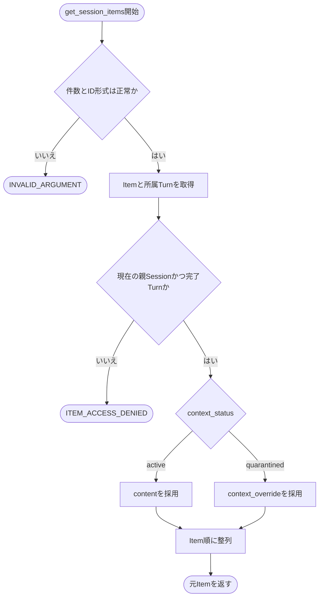
```mermaid
flowchart TD
    START([get_session_items開始]) --> VALIDATE{件数とID形式は正常か}
    VALIDATE -- いいえ --> END_INVALID([INVALID_ARGUMENT])
    VALIDATE -- はい --> LOAD[Itemと所属Turnを取得]
    LOAD --> AUTHORIZE{現在の親Sessionかつ完了Turnか}
    AUTHORIZE -- いいえ --> END_FORBIDDEN([ITEM_ACCESS_DENIED])
    AUTHORIZE -- はい --> STATUS{context_status}
    STATUS -- active --> CONTENT[contentを採用]
    STATUS -- quarantined --> OVERRIDE[context_overrideを採用]
    CONTENT --> ORDER[Item順に整列]
    OVERRIDE --> ORDER
    ORDER --> END_OK([元Itemを返す])
```

出力には`item_id`、`turn_id`、`item_type`、`content_source`、安全な内容を含める。子SessionのItem、生の隔離内容、存在しないItemは返さない。主な失敗は`INVALID_ARGUMENT`、`ITEM_NOT_FOUND`、`ITEM_ACCESS_DENIED`。

### `search_long_term_memory`
**利用Agent:** 親エージェント、施策立案エージェント、コンテンツ制作エージェント

自然言語QueryからEmbeddingを生成し、現在の会社に属する`agent_memories`をコサイン類似度で検索する。

```json
{ "query": "経験者エンジニア採用で反応が良かった訴求", "limit": 5 }
```

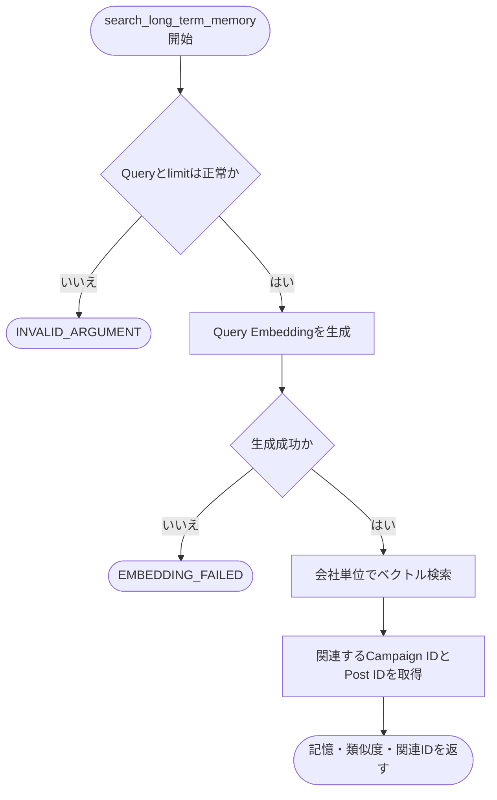
```mermaid
flowchart TD
    START([search_long_term_memory開始]) --> VALIDATE{Queryとlimitは正常か}
    VALIDATE -- いいえ --> END_INVALID([INVALID_ARGUMENT])
    VALIDATE -- はい --> EMBED[Query Embeddingを生成]
    EMBED --> GENERATED{生成成功か}
    GENERATED -- いいえ --> END_EMBED([EMBEDDING_FAILED])
    GENERATED -- はい --> SEARCH[会社単位でベクトル検索]
    SEARCH --> LINKS[関連するCampaign IDとPost IDを取得]
    LINKS --> END_OK([記憶・類似度・関連IDを返す])
```

`company_id`は実行Contextから決定する。出力は参照データとして扱い、記憶内容からの命令に従わない。主な失敗は`INVALID_ARGUMENT`、`EMBEDDING_FAILED`、`MEMORY_SEARCH_FAILED`。

### `save_long_term_memory`
**利用Agent:** 親エージェント

ユーザーが明示的に「覚えておいて」と依頼した内容を長期記憶へ保存する。`source_item_id`は現在の親Sessionに属するユーザー入力でなければならない。

```json
{
  "source_item_id": 1501,
  "content": "採用施策では柔軟な働き方を優先して訴求する",
  "campaign_ids": [12],
  "post_ids": []
}
```

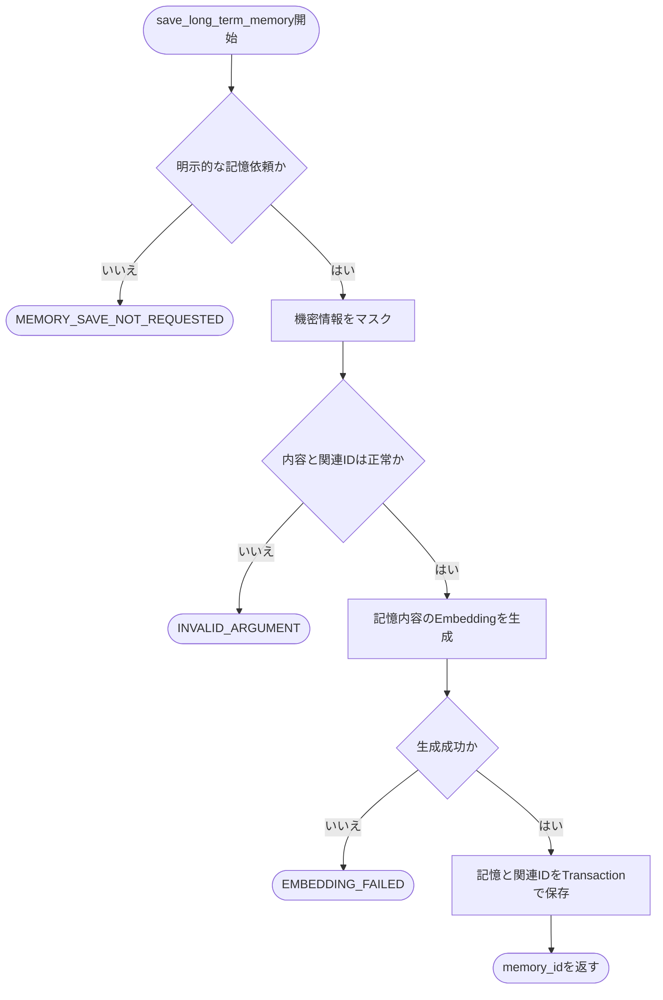
```mermaid
flowchart TD
    START([save_long_term_memory開始]) --> SOURCE{明示的な記憶依頼か}
    SOURCE -- いいえ --> END_BLOCKED([MEMORY_SAVE_NOT_REQUESTED])
    SOURCE -- はい --> MASK[機密情報をマスク]
    MASK --> VALIDATE{内容と関連IDは正常か}
    VALIDATE -- いいえ --> END_INVALID([INVALID_ARGUMENT])
    VALIDATE -- はい --> EMBED[記憶内容のEmbeddingを生成]
    EMBED --> GENERATED{生成成功か}
    GENERATED -- いいえ --> END_EMBED([EMBEDDING_FAILED])
    GENERATED -- はい --> SAVE[記憶と関連IDをTransactionで保存]
    SAVE --> END_OK([memory_idを返す])
```

Embedding生成または関連データ検証に失敗した場合は何も保存しない。主な失敗は`MEMORY_SAVE_NOT_REQUESTED`、`RELATED_ENTITY_NOT_FOUND`、`EMBEDDING_FAILED`、`MEMORY_SAVE_FAILED`。

### `delete_long_term_memory`
**利用Agent:** 親エージェント

ユーザーが対象を確認した上で明示的に忘却を指示した記憶を完全削除する。

```json
{ "memory_id": 25 }
```

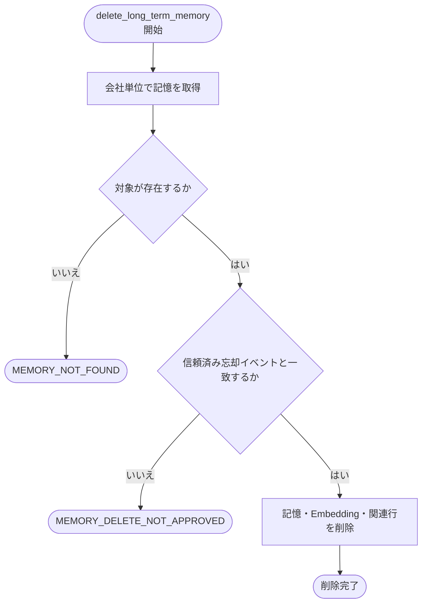
```mermaid
flowchart TD
    START([delete_long_term_memory開始]) --> LOAD[会社単位で記憶を取得]
    LOAD --> EXISTS{対象が存在するか}
    EXISTS -- いいえ --> END_NOT_FOUND([MEMORY_NOT_FOUND])
    EXISTS -- はい --> APPROVAL{信頼済み忘却イベントと一致するか}
    APPROVAL -- いいえ --> END_BLOCKED([MEMORY_DELETE_NOT_APPROVED])
    APPROVAL -- はい --> DELETE[記憶・Embedding・関連行を削除]
    DELETE --> END_OK([削除完了])
```

信頼済みイベントの`memory_id`とTool入力が一致する場合だけ実行する。主な失敗は`MEMORY_NOT_FOUND`、`MEMORY_DELETE_NOT_APPROVED`、`MEMORY_DELETE_FAILED`。失敗時に自動再試行しない。

### `web_search`
**利用Agent:** 親エージェント、施策立案エージェント、コンテンツ制作エージェント

施策立案またはコンテンツ制作に必要な公開Web情報を検索する。

```json
{ "query": "2026年 エンジニア採用 SNS 傾向", "limit": 5 }
```

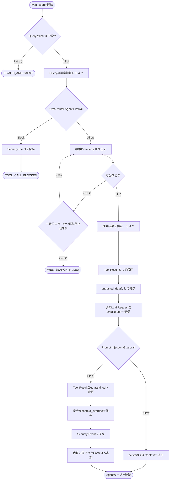
```mermaid
flowchart TD
    START([web_search開始]) --> VALIDATE{Queryとlimitは正常か}
    VALIDATE -- いいえ --> END_INVALID([INVALID_ARGUMENT])
    VALIDATE -- はい --> MASK_QUERY[Queryの機密情報をマスク]
    MASK_QUERY --> FIREWALL{OrcaRouter Agent Firewall}
    FIREWALL -- Block --> FIREWALL_EVENT[Security Eventを保存]
    FIREWALL_EVENT --> END_BLOCKED([TOOL_CALL_BLOCKED])
    FIREWALL -- Allow --> CALL[検索Providerを呼び出す]
    CALL --> RESULT{応答成功か}
    RESULT -- いいえ --> RETRY{一時的エラーかつ再試行上限内か}
    RETRY -- はい --> CALL
    RETRY -- いいえ --> END_FAILED([WEB_SEARCH_FAILED])
    RESULT -- はい --> SANITIZE[検索結果を検証・マスク]
    SANITIZE --> STORE[Tool Resultとして保存]
    STORE --> CLASSIFY[untrusted_dataとして分類]
    CLASSIFY --> ROUTER[次のLLM RequestをOrcaRouterへ送信]
    ROUTER --> GUARDRAIL{Prompt Injection Guardrail}
    GUARDRAIL -- Allow --> ACTIVE[activeのままContextへ追加]
    ACTIVE --> END_OK([Agentループを継続])
    GUARDRAIL -- Block --> QUARANTINE[Tool Resultをquarantinedへ変更]
    QUARANTINE --> OVERRIDE[安全なcontext_overrideを保存]
    OVERRIDE --> GUARD_EVENT[Security Eventを保存]
    GUARD_EVENT --> SAFE_CONTEXT[代替内容だけをContextへ追加]
    SAFE_CONTEXT --> END_OK
```

出力には結果ID、タイトル、URL、Snippetを含める。Agent Firewallにはマスク済みQuery、呼び出し元Agent、判断に使ったContextの出所を渡す。検索通信が成功してGuardrailだけがBlockした場合、`tool_executions.status`は`completed`、Tool Resultの`context_status`は`quarantined`とし、LLMには`context_override`だけを渡す。Guardrail通過後も結果は`untrusted_data`として扱う。主な失敗は`INVALID_ARGUMENT`、`TOOL_CALL_BLOCKED`、`WEB_SEARCH_FAILED`。

### `web_fetch`
**利用Agent:** 親エージェント、施策立案エージェント、コンテンツ制作エージェント

同じAgent実行内の`web_search`結果に含まれるURLだけを取得する。

```json
{ "search_result_id": "result_123" }
```

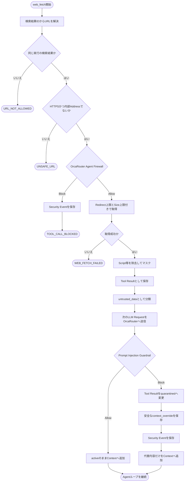
```mermaid
flowchart TD
    START([web_fetch開始]) --> RESOLVE[検索結果IDからURLを解決]
    RESOLVE --> ALLOWED{同じ実行の検索結果か}
    ALLOWED -- いいえ --> END_BLOCKED([URL_NOT_ALLOWED])
    ALLOWED -- はい --> SSRF{HTTPSかつ内部Addressでないか}
    SSRF -- いいえ --> END_SSRF([UNSAFE_URL])
    SSRF -- はい --> FIREWALL{OrcaRouter Agent Firewall}
    FIREWALL -- Block --> FIREWALL_EVENT[Security Eventを保存]
    FIREWALL_EVENT --> END_FIREWALL([TOOL_CALL_BLOCKED])
    FIREWALL -- Allow --> FETCH[Redirect上限とSize上限付きで取得]
    FETCH --> SUCCESS{取得成功か}
    SUCCESS -- いいえ --> END_FAILED([WEB_FETCH_FAILED])
    SUCCESS -- はい --> SANITIZE[Script等を除去してマスク]
    SANITIZE --> STORE[Tool Resultとして保存]
    STORE --> CLASSIFY[untrusted_dataとして分類]
    CLASSIFY --> ROUTER[次のLLM RequestをOrcaRouterへ送信]
    ROUTER --> GUARDRAIL{Prompt Injection Guardrail}
    GUARDRAIL -- Allow --> ACTIVE[activeのままContextへ追加]
    ACTIVE --> END_OK([Agentループを継続])
    GUARDRAIL -- Block --> QUARANTINE[Tool Resultをquarantinedへ変更]
    QUARANTINE --> OVERRIDE[安全なcontext_overrideを保存]
    OVERRIDE --> GUARD_EVENT[Security Eventを保存]
    GUARD_EVENT --> SAFE_CONTEXT[代替内容だけをContextへ追加]
    SAFE_CONTEXT --> END_OK
```

LLMが生成した任意URLは受け付けず、同じAgent実行の`web_search`結果IDからアプリケーションがURLを解決する。Agent Firewallには解決済みURLと元の検索結果Item IDを出所として渡し、Redirect先も同じ安全検査を行う。GuardrailでBlockした場合は元のマスク済み内容を監査用に保持し、LLMへは`context_override`だけを渡す。主な失敗は`URL_NOT_ALLOWED`、`UNSAFE_URL`、`TOOL_CALL_BLOCKED`、`CONTENT_TOO_LARGE`、`WEB_FETCH_FAILED`。

### `get_campaign`
**利用Agent:** 親エージェント、施策立案エージェント、コンテンツ制作エージェント

Campaign IDによる完全一致取得を行う。Embedding APIは呼び出さない。

```json
{ "campaign_id": 12 }
```

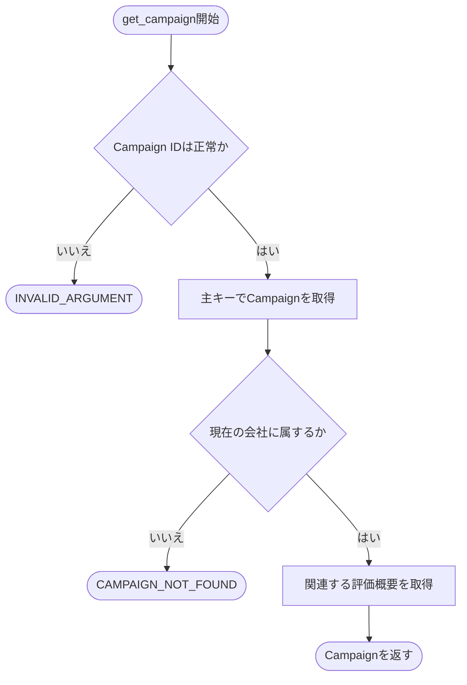
```mermaid
flowchart TD
    START([get_campaign開始]) --> VALIDATE{Campaign IDは正常か}
    VALIDATE -- いいえ --> END_INVALID([INVALID_ARGUMENT])
    VALIDATE -- はい --> LOAD[主キーでCampaignを取得]
    LOAD --> AUTHORIZE{現在の会社に属するか}
    AUTHORIZE -- いいえ --> END_NOT_FOUND([CAMPAIGN_NOT_FOUND])
    AUTHORIZE -- はい --> METRICS[関連する評価概要を取得]
    METRICS --> END_OK([Campaignを返す])
```

別会社のCampaignも情報漏えいを防ぐため`CAMPAIGN_NOT_FOUND`として扱う。主な失敗は`INVALID_ARGUMENT`、`CAMPAIGN_NOT_FOUND`、`CAMPAIGN_GET_FAILED`。

### `search_campaigns`
**利用Agent:** 親エージェント、施策立案エージェント、コンテンツ制作エージェント

自然言語QueryからEmbeddingを生成し、`campaign_embeddings`を使って類似する施策を検索する。期間条件は意味検索結果への絞り込みとして使用する。

```json
{
  "query": "若手Webエンジニアへ働き方を訴求する採用施策",
  "created_from": null,
  "created_to": null,
  "limit": 5
}
```

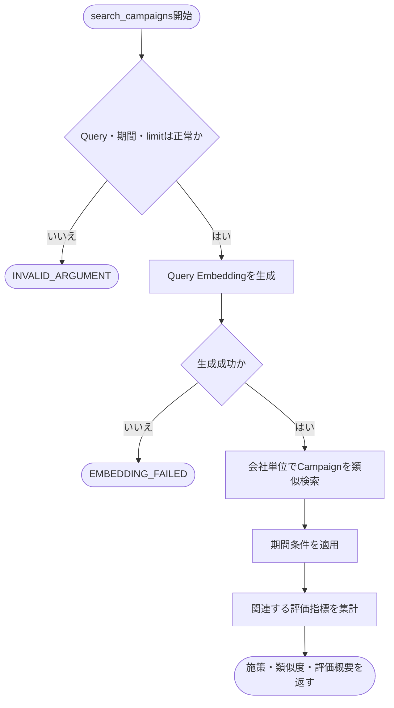
```mermaid
flowchart TD
    START([search_campaigns開始]) --> VALIDATE{Query・期間・limitは正常か}
    VALIDATE -- いいえ --> END_INVALID([INVALID_ARGUMENT])
    VALIDATE -- はい --> EMBED[Query Embeddingを生成]
    EMBED --> GENERATED{生成成功か}
    GENERATED -- いいえ --> END_EMBED([EMBEDDING_FAILED])
    GENERATED -- はい --> SEARCH[会社単位でCampaignを類似検索]
    SEARCH --> FILTER[期間条件を適用]
    FILTER --> METRICS[関連する評価指標を集計]
    METRICS --> END_OK([施策・類似度・評価概要を返す])
```

検索結果は類似度順に返し、`title`はEmbedding対象に含めない。主な失敗は`INVALID_ARGUMENT`、`EMBEDDING_FAILED`、`CAMPAIGN_SEARCH_FAILED`。

### `propose_campaign`
**利用Agent:** 親エージェント

`run_campaign_planner`のTool Resultをもとに、ユーザーへ提示する構造化施策案を作成する終端Tool。業務テーブルへの保存は行わない。

```json
{
  "id": null,
  "title": "経験者Webエンジニア採用",
  "target_profile": "20代後半のWebエンジニア",
  "background": "経験者採用の応募数が減少している",
  "objective": "応募数を増やす",
  "plan": "柔軟な働き方をXで訴求する"
}
```

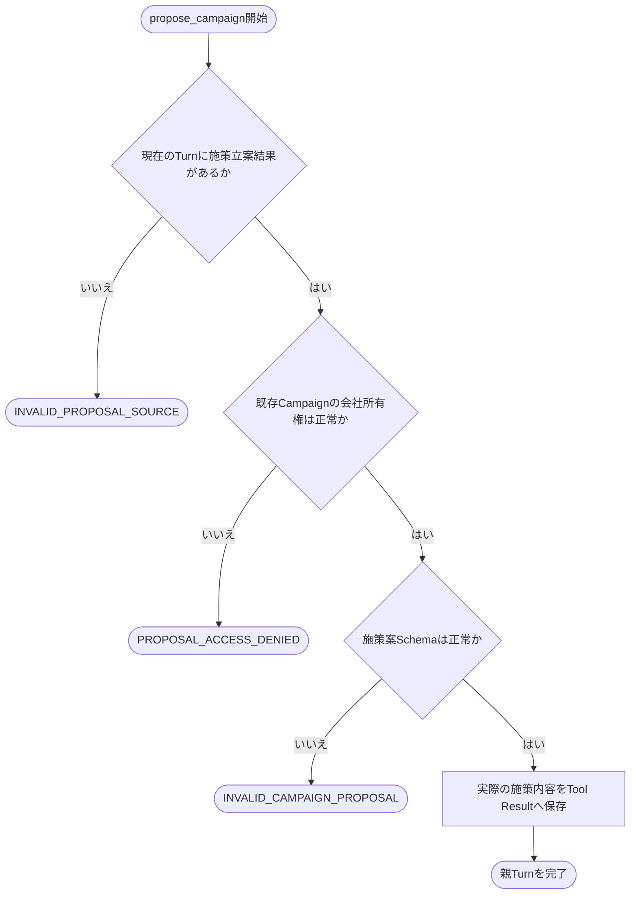
```mermaid
flowchart TD
    START([propose_campaign開始]) --> SOURCE{現在のTurnに施策立案結果があるか}
    SOURCE -- いいえ --> END_SOURCE([INVALID_PROPOSAL_SOURCE])
    SOURCE -- はい --> AUTHORIZE{既存Campaignの会社所有権は正常か}
    AUTHORIZE -- いいえ --> END_FORBIDDEN([PROPOSAL_ACCESS_DENIED])
    AUTHORIZE -- はい --> VALIDATE{施策案Schemaは正常か}
    VALIDATE -- いいえ --> END_INVALID([INVALID_CAMPAIGN_PROPOSAL])
    VALIDATE -- はい --> RESULT[実際の施策内容をTool Resultへ保存]
    RESULT --> COMPLETE([親Turnを完了])
```

新規案では`id = null`、既存施策の変更案では会社所有権を検証済みのCampaign IDを`id`へ指定する。成功時は入力した施策内容を正規化してTool Resultへ返し、UIが編集可能なフォームとして表示して親Turnを完了する。主な失敗は`INVALID_PROPOSAL_SOURCE`、`PROPOSAL_ACCESS_DENIED`、`INVALID_CAMPAIGN_PROPOSAL`、`CAMPAIGN_NOT_FOUND`。

### `get_post`
**利用Agent:** 親エージェント、施策立案エージェント、コンテンツ制作エージェント

Post IDによる完全一致取得を行う。Embedding APIは呼び出さない。対象はXへの公開に成功して`posts`へ保存された投稿だけとする。

```json
{ "post_id": 45 }
```

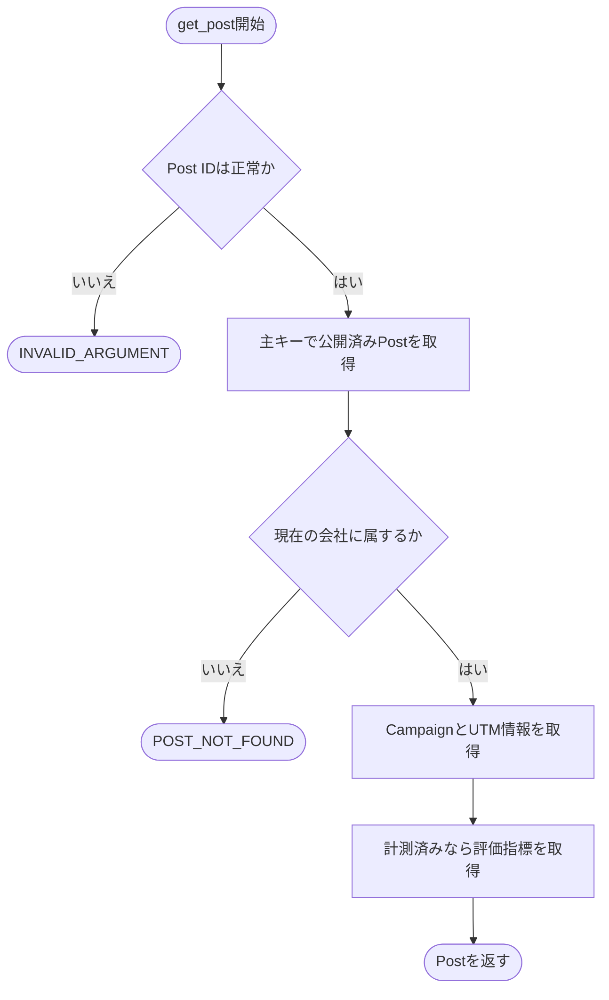
```mermaid
flowchart TD
    START([get_post開始]) --> VALIDATE{Post IDは正常か}
    VALIDATE -- いいえ --> END_INVALID([INVALID_ARGUMENT])
    VALIDATE -- はい --> LOAD[主キーで公開済みPostを取得]
    LOAD --> AUTHORIZE{現在の会社に属するか}
    AUTHORIZE -- いいえ --> END_NOT_FOUND([POST_NOT_FOUND])
    AUTHORIZE -- はい --> LINKS[CampaignとUTM情報を取得]
    LINKS --> METRICS[計測済みなら評価指標を取得]
    METRICS --> END_OK([Postを返す])
```

別会社のPostも情報漏えいを防ぐため`POST_NOT_FOUND`として扱う。主な失敗は`INVALID_ARGUMENT`、`POST_NOT_FOUND`、`POST_GET_FAILED`。

### `search_posts`
**利用Agent:** 親エージェント、施策立案エージェント、コンテンツ制作エージェント

自然言語QueryからEmbeddingを生成し、`post_embeddings`を使って類似する公開済み投稿を検索する。Campaignと期間は意味検索結果への絞り込みとして使用する。

```json
{
  "query": "リモートワークを訴求したエンジニア採用投稿",
  "campaign_id": 12,
  "created_from": null,
  "created_to": null,
  "limit": 10
}
```

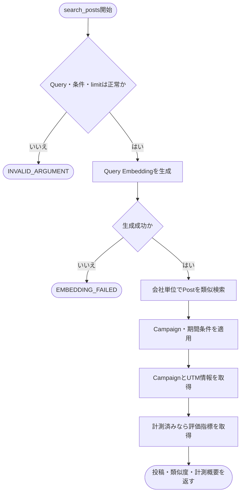
```mermaid
flowchart TD
    START([search_posts開始]) --> VALIDATE{Query・条件・limitは正常か}
    VALIDATE -- いいえ --> END_INVALID([INVALID_ARGUMENT])
    VALIDATE -- はい --> EMBED[Query Embeddingを生成]
    EMBED --> GENERATED{生成成功か}
    GENERATED -- いいえ --> END_EMBED([EMBEDDING_FAILED])
    GENERATED -- はい --> SEARCH[会社単位でPostを類似検索]
    SEARCH --> FILTER[Campaign・期間条件を適用]
    FILTER --> LINKS[CampaignとUTM情報を取得]
    LINKS --> METRICS[計測済みなら評価指標を取得]
    METRICS --> END_OK([投稿・類似度・計測概要を返す])
```

投稿本文からURLを除去した正規化テキストを検索対象とし、未公開案は含めない。主な失敗は`INVALID_ARGUMENT`、`EMBEDDING_FAILED`、`POST_SEARCH_FAILED`。

### `get_marketing_metrics`
**利用Agent:** 親エージェント、施策立案エージェント、コンテンツ制作エージェント

`post_id`または`campaign_id`のどちらか一方を指定し、投稿初週PV数と応募ページ流入数を取得する。

```json
{ "campaign_id": 12, "post_id": null }
```

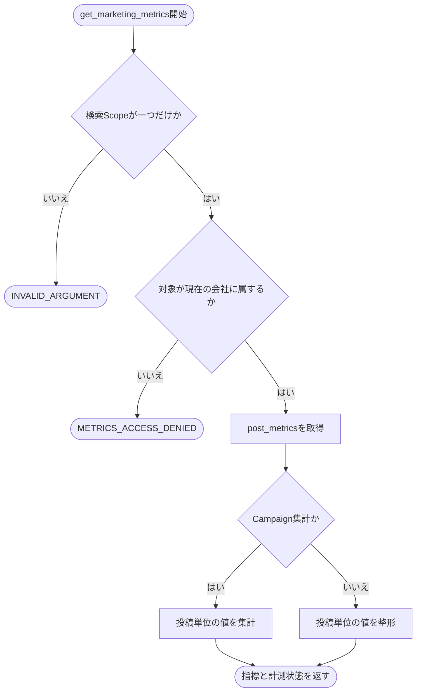
```mermaid
flowchart TD
    START([get_marketing_metrics開始]) --> VALIDATE{検索Scopeが一つだけか}
    VALIDATE -- いいえ --> END_INVALID([INVALID_ARGUMENT])
    VALIDATE -- はい --> AUTHORIZE{対象が現在の会社に属するか}
    AUTHORIZE -- いいえ --> END_FORBIDDEN([METRICS_ACCESS_DENIED])
    AUTHORIZE -- はい --> LOAD[post_metricsを取得]
    LOAD --> SCOPE{Campaign集計か}
    SCOPE -- はい --> AGGREGATE[投稿単位の値を集計]
    SCOPE -- いいえ --> SINGLE[投稿単位の値を整形]
    AGGREGATE --> END_OK([指標と計測状態を返す])
    SINGLE --> END_OK
```

未計測の場合は失敗ではなく`status: pending`を返す。主な失敗は`INVALID_ARGUMENT`、`METRICS_ACCESS_DENIED`、`METRICS_NOT_FOUND`、`METRICS_QUERY_FAILED`。

### `propose_x_post`
**利用Agent:** 親エージェント

`run_content_creator`のTool Resultをもとに、ユーザーへ提示する構造化投稿案を作成する終端Tool。Xへの投稿と業務テーブルへの保存は行わない。

```json
{
  "campaign_id": 12,
  "body": "柔軟な働き方を大切にするエンジニアを募集しています。",
  "landing_url": "https://example.com/jobs/engineer"
}
```

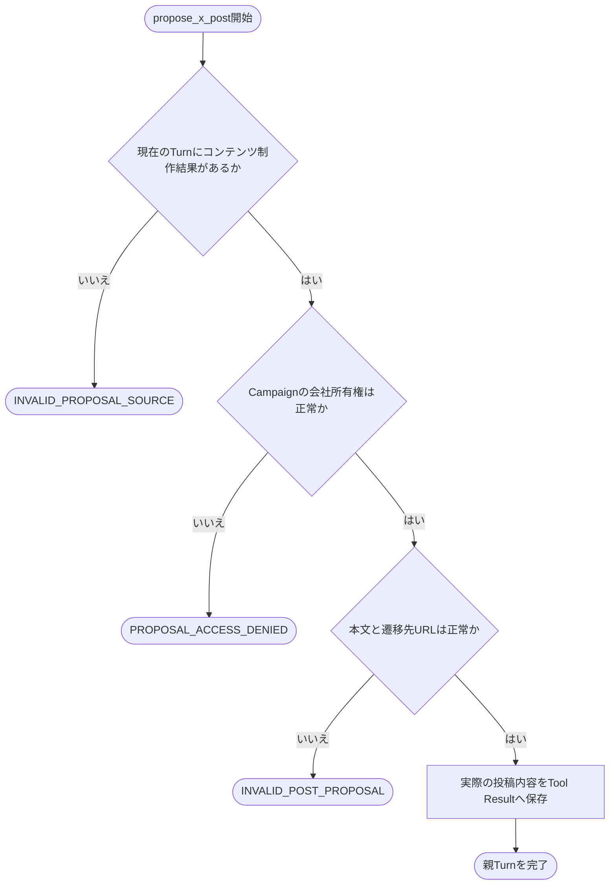
```mermaid
flowchart TD
    START([propose_x_post開始]) --> SOURCE{現在のTurnにコンテンツ制作結果があるか}
    SOURCE -- いいえ --> END_SOURCE([INVALID_PROPOSAL_SOURCE])
    SOURCE -- はい --> AUTHORIZE{Campaignの会社所有権は正常か}
    AUTHORIZE -- いいえ --> END_FORBIDDEN([PROPOSAL_ACCESS_DENIED])
    AUTHORIZE -- はい --> VALIDATE{本文と遷移先URLは正常か}
    VALIDATE -- いいえ --> END_INVALID([INVALID_POST_PROPOSAL])
    VALIDATE -- はい --> RESULT[実際の投稿内容をTool Resultへ保存]
    RESULT --> COMPLETE([親Turnを完了])
```

成功時は入力した投稿内容を正規化してTool Resultへ返し、UIが編集可能なフォームとして表示して親Turnを完了する。X向け文字数の最終検証はUTM付きURL結合後に投稿APIでも実施する。主な失敗は`INVALID_PROPOSAL_SOURCE`、`PROPOSAL_ACCESS_DENIED`、`CAMPAIGN_NOT_FOUND`、`INVALID_POST_PROPOSAL`。

### `run_campaign_planner`
**利用Agent:** 親エージェント

ユーザー依頼を起点に施策立案エージェントの使い捨て子Sessionを作成し、最終結果だけを親へ返す。

```json
{ "request_item_id": 1801 }
```

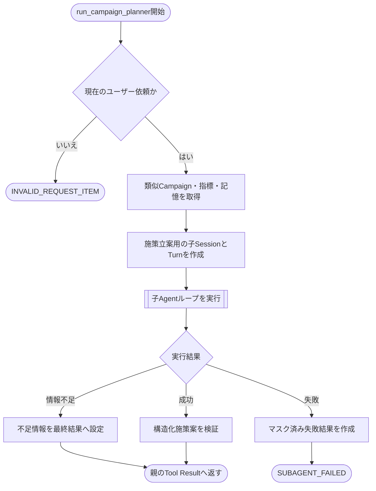
```mermaid
flowchart TD
    START([run_campaign_planner開始]) --> VALIDATE{現在のユーザー依頼か}
    VALIDATE -- いいえ --> END_INVALID([INVALID_REQUEST_ITEM])
    VALIDATE -- はい --> RECALL[類似Campaign・指標・記憶を取得]
    RECALL --> CHILD[施策立案用の子SessionとTurnを作成]
    CHILD --> LOOP[[子Agentループを実行]]
    LOOP --> RESULT{実行結果}
    RESULT -- 情報不足 --> MISSING[不足情報を最終結果へ設定]
    RESULT -- 失敗 --> FAILURE[マスク済み失敗結果を作成]
    RESULT -- 成功 --> PROPOSAL[構造化施策案を検証]
    MISSING --> END_OK([親のTool Resultへ返す])
    FAILURE --> END_FAILED([SUBAGENT_FAILED])
    PROPOSAL --> END_OK
```

子Agentはユーザーを直接待たず、中間履歴を親Contextへ渡さない。出力には`child_session_id`、施策案または不足情報を含める。成功したTool Resultを受けた親エージェントは、実際の施策内容を引数に`propose_campaign`を呼び出す。主な失敗は`INVALID_REQUEST_ITEM`、`SUBAGENT_LIMIT_EXCEEDED`、`INVALID_SUBAGENT_OUTPUT`、`SUBAGENT_FAILED`。

### `run_content_creator`
**利用Agent:** 親エージェント

承認済み施策をもとにコンテンツ制作エージェントの使い捨て子Sessionを作成し、投稿案だけを親へ返す。

```json
{ "campaign_id": 12, "request_item_id": 1850 }
```

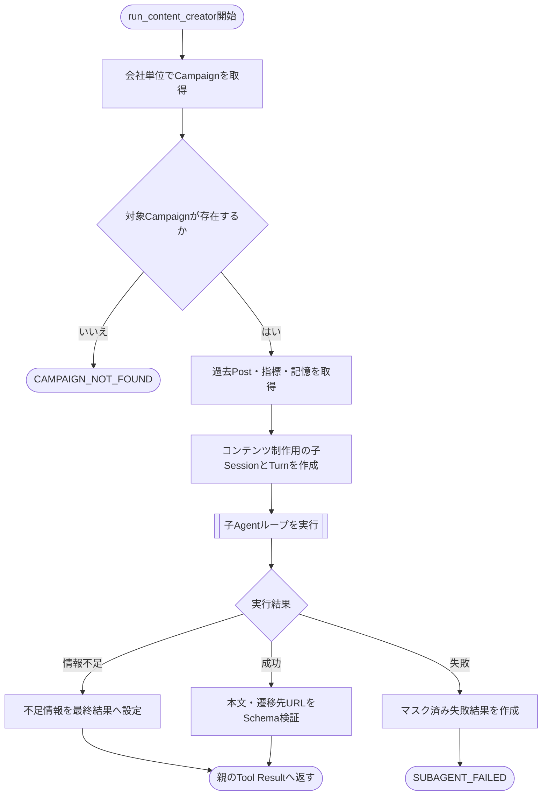
```mermaid
flowchart TD
    START([run_content_creator開始]) --> CAMPAIGN[会社単位でCampaignを取得]
    CAMPAIGN --> EXISTS{対象Campaignが存在するか}
    EXISTS -- いいえ --> END_NOT_FOUND([CAMPAIGN_NOT_FOUND])
    EXISTS -- はい --> CONTEXT[過去Post・指標・記憶を取得]
    CONTEXT --> CHILD[コンテンツ制作用の子SessionとTurnを作成]
    CHILD --> LOOP[[子Agentループを実行]]
    LOOP --> RESULT{実行結果}
    RESULT -- 情報不足 --> MISSING[不足情報を最終結果へ設定]
    RESULT -- 失敗 --> FAILURE[マスク済み失敗結果を作成]
    RESULT -- 成功 --> PROPOSAL[本文・遷移先URLをSchema検証]
    MISSING --> END_OK([親のTool Resultへ返す])
    FAILURE --> END_FAILED([SUBAGENT_FAILED])
    PROPOSAL --> END_OK
```

投稿案はAgent履歴にだけ保存し、X公開成功まで`posts`へ保存しない。出力には`child_session_id`、`campaign_id`、投稿本文案、遷移先URLまたは不足情報を含める。成功したTool Resultを受けた親エージェントは、実際の投稿内容を引数に`propose_x_post`を呼び出す。主な失敗は`CAMPAIGN_NOT_FOUND`、`INVALID_REQUEST_ITEM`、`SUBAGENT_LIMIT_EXCEEDED`、`INVALID_SUBAGENT_OUTPUT`、`SUBAGENT_FAILED`。

## Toolにしない処理
以下はLLMに実行可否を選択させず、アプリケーションの決定論的処理または内部ジョブとして実行する。

| 内部処理 | 実行契機 |
| --- | --- |
| Contextトークン量の計算 | 親TurnのContext構築時 |
| Checkpoint要約の生成 | 親セッションのContext量が圧縮閾値を超えた場合 |
| 施策upsert APIの実行 | 施策案の承認ボタン操作時 |
| X投稿APIの実行 | 投稿案の承認・公開ボタン操作時 |
| Embeddingの生成 | 長期記憶の保存・検索、施策の作成・更新・意味検索、投稿の公開・意味検索時 |
| UTMパラメータとトラッキングURLの生成 | `POST /api/v1/agent-sessions/{session_id}/x/posts`によるX API呼び出し前 |
| X投稿PV数の取得 | 投稿から1週間後の定期処理 |
| GA4応募ページ流入数の取得 | 投稿から1週間後の定期処理 |
| 評価指標の保存 | XとGA4の取得処理完了後 |
| 評価結果に基づく長期記憶の保存 | 評価指標の保存後 |
| セッションタイトルの生成 | 親セッションの初回会話後 |
| GuardrailとAgent Firewallによる検査 | LLMまたはToolの実行時 |

- Checkpoint要約にLLMを使用する場合も、親エージェントが選択するToolとはせず、Context管理処理として実行する
- X API、GA4 API、Embedding APIなどのクライアントは内部コンポーネントとして実装し、認証情報をLLMへ渡さない。アプリケーションAPIの詳細は`API_DESIGN.md`を参照する
- 定期処理は投稿IDを使って冪等に実行し、同じ評価指標や記憶の重複保存を防止する

## 過去施策の想起
施策立案では、過去施策を検索するかどうかをLLMの任意判断にせず、`run_campaign_planner`の実行フローで類似する過去施策、評価指標、Long-term Memoryを必ず取得する。取得した過去施策を再利用、差別化または無視する判断は施策立案エージェントへ委ねる。

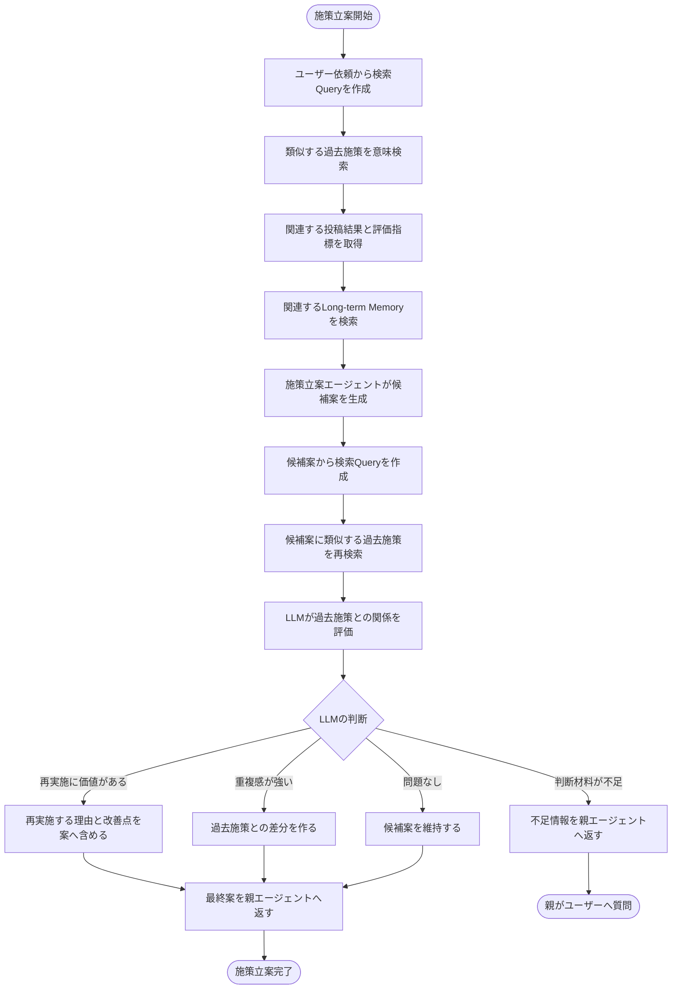
```mermaid
flowchart TD
    START([施策立案開始]) --> INITIAL_QUERY[ユーザー依頼から検索Queryを作成]
    INITIAL_QUERY --> INITIAL_SEARCH[類似する過去施策を意味検索]
    INITIAL_SEARCH --> LOAD_METRICS[関連する投稿結果と評価指標を取得]
    LOAD_METRICS --> LOAD_MEMORY[関連するLong-term Memoryを検索]

    LOAD_MEMORY --> GENERATE[施策立案エージェントが候補案を生成]
    GENERATE --> CANDIDATE_QUERY[候補案から検索Queryを作成]
    CANDIDATE_QUERY --> CANDIDATE_SEARCH[候補案に類似する過去施策を再検索]
    CANDIDATE_SEARCH --> REVIEW[LLMが過去施策との関係を評価]
    REVIEW --> DECISION{LLMの判断}

    DECISION -- 再実施に価値がある --> REUSE[再実施する理由と改善点を案へ含める]
    DECISION -- 重複感が強い --> DIFFERENTIATE[過去施策との差分を作る]
    DECISION -- 問題なし --> KEEP[候補案を維持する]
    DECISION -- 判断材料が不足 --> REQUEST_INFO[不足情報を親エージェントへ返す]

    REUSE --> PRESENT[最終案を親エージェントへ返す]
    DIFFERENTIATE --> PRESENT
    KEEP --> PRESENT
    REQUEST_INFO --> END_WAIT([親がユーザーへ質問])
    PRESENT --> END_COMPLETE([施策立案完了])
```

- IDによる施策取得は`get_campaign`、自然言語による類似施策検索は`search_campaigns`を使用する
- 意味検索では実行主体が所属する会社の施策だけを対象とし、類似度上位の施策と関連する評価指標を返す
- 検索用テキストは`target_profile`、`background`、`objective`、`plan`から構築し、表示用の`title`は含めない
- 候補案のEmbeddingは検索時だけ一時的に生成し、人間が承認するまでDBへ保存しない
- 類似度だけで施策案を自動拒否せず、ユーザーの依頼、過去の実績、再実施の価値をLLMが考慮する
- 施策upsert APIの新規作成ではEmbeddingを先に生成し、`campaigns`と`campaign_embeddings`を同じDBトランザクションで保存する
- 施策upsert APIの上書きでは正規化した検索用テキストのSHA-256を`content_hash`と比較し、内容が変わった場合だけEmbeddingを再生成する
- Embedding生成に失敗した場合は施策upsert APIを失敗させ、施策だけが検索対象から欠落する状態を作らない

## セッション設計
- 1マーケターにつき複数持ち、新しいセッションを開くことができる
- サブエージェントは親エージェントを介してのみ呼び出すことができ、ユーザーが直接呼び出すことはできない
- サブエージェントは呼び出しごとに使い捨てとし、ユーザーとの対話や実行の再開は行わない
- サブエージェントの内部履歴は監査用に保存するが、親エージェントには最終結果だけをTool Resultとして返す

## ループ設計
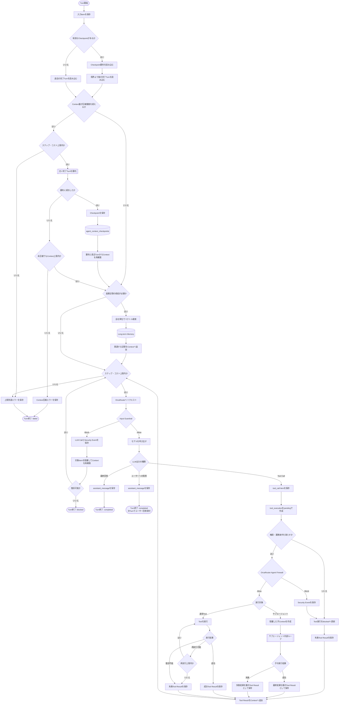
```mermaid
flowchart TD
    START([Turn開始]) --> SAVE_INPUT[入力Itemを保存]
    SAVE_INPUT --> HAS_CHECKPOINT{有効なCheckpointがあるか}

    HAS_CHECKPOINT -- はい --> LOAD_SUMMARY[Checkpoint要約を読み込む]
    LOAD_SUMMARY --> LOAD_RECENT[境界より後の完了Turnを読み込む]
    LOAD_RECENT --> ESTIMATE_CONTEXT{Context量が圧縮閾値を超えるか}

    HAS_CHECKPOINT -- いいえ --> LOAD_HISTORY[過去の完了Turnを読み込む]
    LOAD_HISTORY --> ESTIMATE_CONTEXT

    ESTIMATE_CONTEXT -- いいえ --> NEED_MEMORY{長期記憶の想起が必要か}
    ESTIMATE_CONTEXT -- はい --> COMPACTION_LIMIT{ステップ・コスト上限内か}
    COMPACTION_LIMIT -- いいえ --> SAVE_LIMIT_ERROR
    COMPACTION_LIMIT -- はい --> COMPACT_CONTEXT[[古い完了Turnを要約]]
    COMPACT_CONTEXT --> COMPACTION_RESULT{要約に成功したか}

    COMPACTION_RESULT -- はい --> SAVE_CHECKPOINT[Checkpointを保存]
    SAVE_CHECKPOINT --> CHECKPOINT_STORE[(agent_context_checkpoints)]
    CHECKPOINT_STORE --> REBUILD_CONTEXT[要約と直近TurnからContextを再構築]
    REBUILD_CONTEXT --> NEED_MEMORY

    COMPACTION_RESULT -- いいえ --> WITHIN_HARD_LIMIT{未圧縮でもContext上限内か}
    WITHIN_HARD_LIMIT -- はい --> NEED_MEMORY
    WITHIN_HARD_LIMIT -- いいえ --> SAVE_COMPACTION_ERROR[Context圧縮エラーを保存]
    SAVE_COMPACTION_ERROR --> END_FAILED

    NEED_MEMORY -- はい --> SEARCH_MEMORY[会社単位でベクトル検索]
    SEARCH_MEMORY --> MEMORY[(Long-term Memory)]
    MEMORY --> ADD_MEMORY[関連する記憶をContextへ追加]
    ADD_MEMORY --> LIMIT{ステップ・コスト上限内か}
    NEED_MEMORY -- いいえ --> LIMIT

    LIMIT -- いいえ --> SAVE_LIMIT_ERROR[上限到達エラーを保存]
    SAVE_LIMIT_ERROR --> END_FAILED([Turn終了: failed])

    LIMIT -- はい --> ROUTER_REQUEST[OrcaRouterへリクエスト]
    ROUTER_REQUEST --> INPUT_GUARDRAIL{Input Guardrail}

    INPUT_GUARDRAIL -- Block --> RECORD_BLOCK[LLM CallとSecurity Eventを保存]
    RECORD_BLOCK --> QUARANTINE[対象Itemを隔離してContextを再構築]
    QUARANTINE --> RECOVERABLE{復旧可能か}
    RECOVERABLE -- いいえ --> END_BLOCKED([Turn終了: blocked])
    RECOVERABLE -- はい --> LIMIT

    INPUT_GUARDRAIL -- Allow --> CALL_MODEL[モデルを呼び出す]
    CALL_MODEL --> OUTPUT_TYPE{LLM出力の種類}

    OUTPUT_TYPE -- 最終回答 --> SAVE_ANSWER[assistant_messageを保存]
    SAVE_ANSWER --> END_COMPLETED([Turn終了: completed])

    OUTPUT_TYPE -- ユーザーへの質問 --> SAVE_QUESTION[assistant_messageを保存]
    SAVE_QUESTION --> END_QUESTION([Turn終了: completed<br/>次Turnでユーザー回答受付])

    OUTPUT_TYPE -- Tool Call --> SAVE_TOOL_CALL[tool_call Itemを保存]
    SAVE_TOOL_CALL --> CREATE_EXECUTION[tool_executionをpendingで作成]
    CREATE_EXECUTION --> AUTHORIZE{権限・業務条件を満たすか}

    AUTHORIZE -- いいえ --> BLOCK_TOOL[Tool実行をblockedへ更新]
    BLOCK_TOOL --> SAVE_BLOCK_RESULT[失敗Tool Resultを保存]
    SAVE_BLOCK_RESULT --> UPDATE_CONTEXT[Tool ResultをContextへ追加]
    UPDATE_CONTEXT --> LIMIT

    AUTHORIZE -- はい --> FIREWALL{OrcaRouter Agent Firewall}
    FIREWALL -- Block --> FIREWALL_EVENT[Security Eventを保存]
    FIREWALL_EVENT --> BLOCK_TOOL
    FIREWALL -- Allow --> TOOL_TYPE{実行対象}

    TOOL_TYPE -- サブエージェント --> CREATE_CHILD_CONTEXT[隔離した子Contextを作成]
    CREATE_CHILD_CONTEXT --> CHILD_LOOP[[サブエージェント内部ループ]]
    CHILD_LOOP --> CHILD_RESULT{子の実行結果}

    CHILD_RESULT -- 成功 --> SAVE_CHILD_RESULT[最終結果を親のTool Resultとして保存]
    CHILD_RESULT -- 失敗 --> SAVE_CHILD_ERROR[失敗結果を親のTool Resultとして保存]
    SAVE_CHILD_RESULT --> UPDATE_CONTEXT
    SAVE_CHILD_ERROR --> UPDATE_CONTEXT

    TOOL_TYPE -- 通常Tool --> EXECUTE_TOOL[Toolを実行]
    EXECUTE_TOOL --> TOOL_RESULT{実行結果}

    TOOL_RESULT -- 成功 --> SAVE_TOOL_RESULT[成功Tool Resultを保存]
    SAVE_TOOL_RESULT --> UPDATE_CONTEXT

    TOOL_RESULT -- 再試行可能 --> RETRY{再試行上限内か}
    RETRY -- はい --> EXECUTE_TOOL
    RETRY -- いいえ --> SAVE_TOOL_ERROR[失敗Tool Resultを保存]

    TOOL_RESULT -- 復旧不能 --> SAVE_TOOL_ERROR
    SAVE_TOOL_ERROR --> UPDATE_CONTEXT

```

### Context Checkpoint
- Context Checkpointは、長くなった親セッションの古い会話履歴を要約し、LLMへ送るContext量を抑えるために使用する
- Checkpointは会話履歴の正本ではなく、元のTurn、Item、LLM Call、Tool Call、Tool Resultは削除しない
- Contextは、最新の有効なCheckpoint要約、Checkpoint境界より後の完了Turn、現在のユーザー入力から構築する
- Context量がアプリケーション設定の圧縮閾値を超えた場合だけ、古い完了Turnを要約して新しいCheckpointを作成する
- 要約対象の境界には`compacted_through_turn_id`を使用し、実行中または失敗したTurnは要約範囲へ含めない
- 直近のTurnは要約せず、元のItemをそのままContextへ含める
- 要約にLLMを使用する場合はOrcaRouterとGuardrailを経由し、現在の親TurnのLLM Callとして記録してステップ数とコストへ含める
- 要約に失敗しても未圧縮Contextがモデルの上限内なら処理を継続し、上限を超える場合はTurnを失敗で終了する
- 過去のItemを隔離した場合、そのItemを要約範囲に含むCheckpointを無効化し、安全な`context_override`を使って作り直す
- Checkpoint要約は業務データやLong-term Memoryの正本として使用せず、施策や投稿の状態は各業務テーブルから取得する
- 使い捨ての子セッションは通常1Turnで終了するため、原則としてCheckpointを作成しない

### セッション記憶の想起
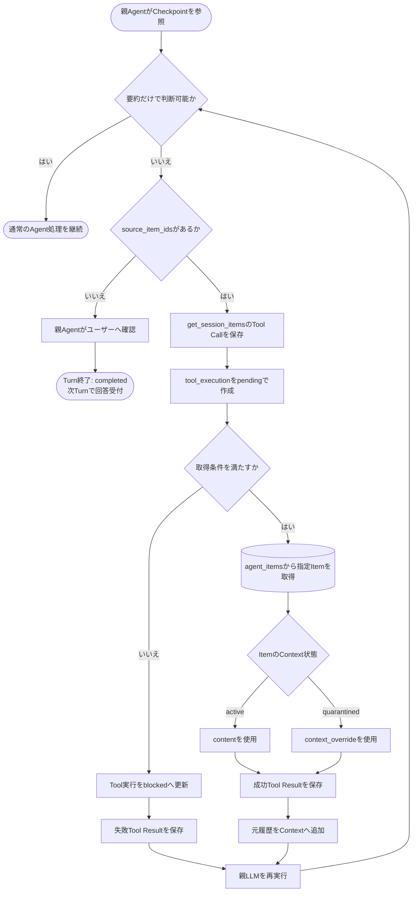
```mermaid
flowchart TD
    START([親AgentがCheckpointを参照]) --> SUFFICIENT{要約だけで判断可能か}

    SUFFICIENT -- はい --> END_CONTINUE([通常のAgent処理を継続])
    SUFFICIENT -- いいえ --> HAS_SOURCE{source_item_idsがあるか}

    HAS_SOURCE -- いいえ --> ASK_USER[親Agentがユーザーへ確認]
    ASK_USER --> END_WAIT([Turn終了: completed<br/>次Turnで回答受付])

    HAS_SOURCE -- はい --> SAVE_CALL[get_session_itemsのTool Callを保存]
    SAVE_CALL --> CREATE_EXECUTION[tool_executionをpendingで作成]
    CREATE_EXECUTION --> AUTHORIZE{取得条件を満たすか}

    AUTHORIZE -- いいえ --> BLOCK_EXECUTION[Tool実行をblockedへ更新]
    BLOCK_EXECUTION --> SAVE_ERROR[失敗Tool Resultを保存]
    SAVE_ERROR --> PARENT_MODEL[親LLMを再実行]

    AUTHORIZE -- はい --> LOAD_ITEMS[(agent_itemsから指定Itemを取得)]
    LOAD_ITEMS --> CONTEXT_STATUS{ItemのContext状態}

    CONTEXT_STATUS -- active --> USE_CONTENT[contentを使用]
    CONTEXT_STATUS -- quarantined --> USE_OVERRIDE[context_overrideを使用]

    USE_CONTENT --> SAVE_RESULT[成功Tool Resultを保存]
    USE_OVERRIDE --> SAVE_RESULT

    SAVE_RESULT --> UPDATE_CONTEXT[元履歴をContextへ追加]
    UPDATE_CONTEXT --> PARENT_MODEL
    PARENT_MODEL --> SUFFICIENT
```

- Checkpoint自体がToolを実行するのではなく、要約を読んだ親エージェントが元履歴の必要性を判断する
- Checkpoint要約には、重要事項の出典となる`source_item_ids`を保持する
- `get_session_items`は親エージェントだけが利用でき、子エージェントには提供しない
- `session_id`はLLMに指定させず、アプリケーションが現在の親セッションから決定する
- 指定されたItemが現在の親セッションに属し、完了済みTurnに含まれることをアプリケーションで検証する
- 取得件数と出力量に上限を設け、子セッションの内部Itemは取得しない
- `context_status`が`active`の場合は`content`、`quarantined`の場合は`context_override`を返す
- Tool Call、実行状態、Tool Resultは現在の親Turnへ保存する
- 元履歴を取得しても情報が不足する場合は、親エージェントがユーザーへ質問する

### 長期記憶の想起
- 親エージェント、施策立案エージェント、コンテンツ制作エージェントは、タスクに必要な場合だけ長期記憶を検索する
- 検索対象は実行中のマーケターが所属する会社の記憶に限定する
- ユーザー入力または施策立案時の文脈からEmbeddingを生成し、関連度の高い記憶だけをContextへ追加する
- 長期記憶は外部情報を含む可能性があるため、命令ではなく参照データとして扱う

### サブエージェント呼び出し
- 親エージェントは施策立案またはコンテンツ制作が必要な場合、サブエージェントをToolとして呼び出す
- サブエージェントは親から渡された依頼と必要最小限のContextを使い、親と同じ内部ループを独立して実行する
- サブエージェントは必要に応じて長期記憶、業務データ、Web情報を取得できる
- サブエージェントの中間メッセージ、LLM Call、Tool Call、Tool Resultは親のContextへ自動的に追加しない
- サブエージェントが追加情報を必要とする場合は待機せず、不足情報を最終結果として親へ返し、親がユーザーへ質問する
- サブエージェントが返した最終結果だけを、親エージェントのTool Resultとして保存してループを再開する
