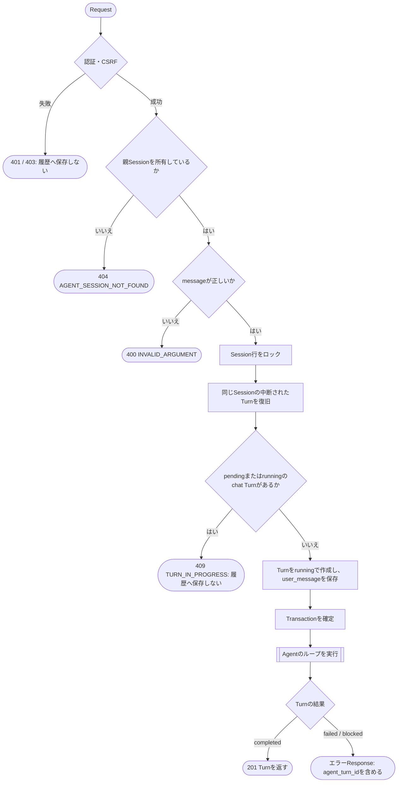
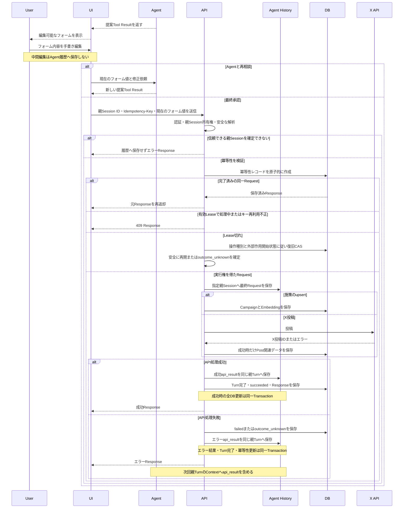

# API設計書

## 1. 目的
本書は、UI（`SCREEN_DESIGN.md`）とBackendの間のアプリケーションAPIを定義する。認証、Agentとの会話、ユーザーがUIで最終確定した施策内容と投稿内容の反映、公開済みデータと計測結果の参照、記憶の忘却を扱う。

Agentは`propose_campaign`と`propose_x_post`で編集可能な内容を提案する。UIは提案内容をフォームの初期値として表示し、ユーザーは内容を直接編集できる。施策の登録・更新とXへの投稿は、承認ボタン押下時のフォーム値をRequest Bodyへ設定して本APIから実行する。

### 1.1 章の構成
| 章 | 内容 | 主な利用画面 |
| --- | --- | --- |
| 2 | 共通仕様（入力検証、冪等性、承認監査、Response、認証とCSRF、認証API、Turnの同時実行、運用向けエンドポイント） | 全画面 |
| 3 | X投稿API | SC-02 |
| 4 | 施策API | SC-02 |
| 5 | Agent会話API（Turn、Session、履歴） | SC-02、SC-03 |
| 6 | 参照API（施策、投稿、計測結果、記憶） | SC-04からSC-09 |
| 7 | 記憶の忘却API | SC-09 |
| 8 | 編集・承認フロー | SC-02 |
| 9 | 非対象 | |
| 10 | エラーコード一覧 | 全画面 |

### 1.2 関連文書
- 画面から見たAPIの使い方: `SCREEN_DESIGN.md`、`docs/frontend/CODING_STANDARDS.md`（16章 API通信、17章 フォームと最終承認、18章 Errorと画面状態）
- 実装の規約: `docs/backend/CODING_STANDARDS.md`（7章 API層、8章 エラー処理）。エラーコードは10章に登録されたものだけを使う
- Agentの動作とTool: `AGENT_DESIGN.md`。データ構造: `DATABASE.dbml`

## 2. 共通仕様

### 2.1 API境界
- Base pathは`/api/v1`とする
- RequestとResponseのContent-Typeは`application/json`とする
- APIは署名付きCookieで認証したマーケターを使用し（2.8）、`company_id`と`marketer_id`をRequest Bodyから受け取らない
- Agent履歴を更新する状態変更APIは`/agent-sessions/{session_id}`配下とし、履歴の保存先をPathで明示する
- 施策upsert API、X投稿API、記憶の忘却API（7章）は`Idempotency-Key` Headerを必須とする。会話API（5章）と参照API（6章）は使用しない
- 参照API（6章）は読み取り専用のGETであり、Agent履歴へ保存しない。認証済みマーケターの会社のデータだけを返す
- 状態変更API（POST・PATCH・DELETE）にはCSRF対策を適用する（2.8）
- Frontendは、Browserからは同一Originの`/api/*`を呼び出し、Next.jsのServer Componentからは、Browserの認証Cookieを転送して同じAPIを呼び出す（`docs/frontend/CODING_STANDARDS.md`の16章）。Server専用のAPIと、別の権限を持つ経路は設けない
- API呼び出し自体を、Request Bodyに含まれる内容の最終承認として扱う
- 承認APIの処理（3章・4章）と記憶の忘却API（7章）ではLLM、Agent Tool、OrcaRouter Agent Firewallを使用しない。Agent Turnを実行するのは、会話API（5章）のメッセージ送信APIだけである
- X APIやEmbedding APIの認証情報はサーバー側だけで管理する

### 2.2 入力検証
APIはAgent履歴を入力元として参照せず、Request Bodyの最終フォーム値を正本として使用する。履歴保存先を安全に確定するため、最初に以下を検証する。

- Pathの`session_id`が正の整数である
- Sessionが認証済みマーケターに属する
- Sessionが`agent = parent`かつ`parent_session_id = null`の親Sessionである
- Requestがサイズ上限内（プラットフォームの上限は4.5MB）で、安全にJSON解析・マスクできる

親Sessionと安全なRequestを確定した後、冪等性を検証する。完了済みの同一RequestはSessionが後からアーカイブされていても保存済みResponseを返す。新しい処理を開始する場合はSessionがアーカイブされていないことを追加検証し、最初のRequestだけに実行権を付与する。実行権を得たRequestはAPI実行Turnを作成してマスク済みRequestを保存し、以下のSchema・業務条件を検証する。

- JSONのフィールド型がAPI Schemaに適合する
- 必須文字列が空ではなく、長さ上限を満たす
- Request内で既存Campaign IDを参照する場合、そのCampaignが存在し、認証済みマーケターの会社に属する
- URLが許可されたSchemeと形式を満たす

`company_id`、`marketer_id`、X投稿ID、UTMパラメータ、Embeddingはクライアント入力を使用せず、アプリケーションが決定する。

存在しないSession、他のマーケターが所有するSession、子Sessionは、存在確認による情報漏えいを防ぐため、すべて`404 AGENT_SESSION_NOT_FOUND`として扱う。アーカイブ済みSessionでは完了済みの同一Requestの再返却だけを許可し、新しい処理は`404 AGENT_SESSION_NOT_FOUND`とする。会社IDは検証済み親Sessionのマーケターから決定する。

Request内で参照する既存Campaign IDが存在しない場合と、別会社に属する場合も、存在確認による情報漏えいを防ぐため区別せず`404 CAMPAIGN_NOT_FOUND`として扱う。MVPにはロールの概念がないため、テナント境界違反に`403`は使用しない。

### 2.3 冪等性
UIは承認操作ごとにUUIDを生成し、`Idempotency-Key` Headerと監査内容のAction IDへ同じ値を設定する。二重クリック、通信切断後の再送、クライアント内部の再試行では同じキーを使用し、ユーザーが明示的に新しい承認操作を行った場合だけ新しいキーを生成する。

`Idempotency-Key`はUUID形式を必須とする。Headerがない、または形式が不正な場合は`400 INVALID_IDEMPOTENCY_KEY`を返し、冪等性レコードとAPI実行Turnを作成しない。

バックエンドは認証、親Session所有権、安全なJSON解析に成功した後、JSONオブジェクトのキー順など表現上の差を除去したRequest BodyのSHA-256を`request_hash`として計算する。`marketer_id`、操作種別、`Idempotency-Key`の組み合わせで`api_idempotency_requests`を原子的に作成し、作成に成功したRequestだけが業務処理を開始する。実行権取得時はサーバー生成の`execution_token`と`lease_expires_at`を設定する。

| 既存レコード | 処理 |
| --- | --- |
| 同じSession・同じRequest、`succeeded`または`failed` | 保存済みのHTTP StatusとResponse Bodyをそのまま返す。新しいAPI実行Turnと業務データは作成しない |
| 同じSession・同じRequest、`outcome_unknown` | 手動照合までは保存済みの結果不明Responseを返す。外部処理を再実行しない |
| 同じSession・同じRequest、有効なLeaseの`processing` | `409 IDEMPOTENCY_REQUEST_IN_PROGRESS`と`Retry-After`を返し、処理を重複実行しない |
| 同じSession・同じRequest、期限切れの`processing` | Campaignまたは外部作用開始前のX投稿はFencing Tokenを更新して再開する。外部作用開始後のX投稿は、X投稿結果（`external_result`）が保存済みならFencing Tokenを更新してDB保存だけを再開し、未保存なら`outcome_unknown`へ確定する |
| 異なるSessionまたは異なる`request_hash` | `409 IDEMPOTENCY_KEY_REUSED`を返し、処理を実行しない |

- 再送Responseの`agent_turn_id`は最初のRequestで作成したTurn IDとする
- 再送自体はAgent履歴へ重複保存しない
- `succeeded`と`failed`のResponseは確定後に変更しない。`outcome_unknown`のResponseだけは手動照合で`succeeded`または`failed`へ解決した際に確定Responseへ置き換え、以後の再送には解決後のResponseを返す
- `failed`の同じキーは保存済みエラーを再返却する。再実行する場合は、ユーザーの新しい承認操作と新しいキーを必要とする
- 通常の業務処理を完了する最終Transactionは、冪等性レコードが`processing`、`execution_token`が実行中のTokenと一致、かつ`lease_expires_at > now()`の場合だけCommitし、Lease切れ後の古いワーカーによる書き込みを防止する
- 施策またはPost関連データの保存、成功API Result、API実行Turnの完了、および冪等性レコードの`succeeded`への更新は同一DB Transactionで行う
- エラーAPI Result、API実行Turnの完了、および冪等性レコードの`failed`または`outcome_unknown`への更新も同一DB Transactionで行う
- CampaignのLeaseが切れた`processing`は、新しい`execution_token`とLeaseをCompare-and-setで設定してから安全に再実行できる
- X投稿のLeaseが切れた`processing`は、`external_effect_started_at = NULL`なら新しい実行TokenとLeaseで安全に再実行できる。値がある場合は、`external_result`（3章）の有無で分岐する
  - `external_result`が保存済みなら、X投稿は成功済みである。新しい実行TokenとLeaseをCompare-and-setで設定し、X APIを呼ばずDB保存だけを再開する
  - `external_result`が未保存なら、期限切れを条件とする専用の復旧Transactionで、`status`、旧`execution_token`、`lease_expires_at`をCompare-and-setし、`outcome_unknown`のAPI Result保存と元Turnの完了を同時に行う。この復旧遷移には有効なLeaseを要求せず、自動再投稿しない
- Lease再取得時に`agent_turn_id`が設定済みなら同じAPI実行Turnを再利用し、最終Request Itemは`Idempotency-Key`由来の安定したItemキーで重複保存を防ぐ。未設定の場合だけ、冪等性行をロックしたTransaction内でTurnを一度作成して関連付ける
- `retryable = true`は原則として、新しいユーザー承認と新しいキーによる再実行が可能であることを示す。同じキーの`failed` Requestを再実行する意味ではない。`IDEMPOTENCY_REQUEST_IN_PROGRESS`と`X_POST_SAVE_FAILED`だけは、同じキーで再送する
- `lease_expires_at`は、関数の最大実行時間（Vercelの`maxDuration`）より長い値とする。短いと、実行中のRequestの実行権が別のRequestへ渡る。MVPでは`maxDuration`を300秒とし、Leaseは300秒より長い値（例: 330秒）とする
- 関数が最大実行時間を超えると、Vercelが本文のない`504`を返す。UIは、本文のない`504`を処理結果の不明として扱い、`Retry-After`に従って同じ`Idempotency-Key`で再送する。サーバー側では、期限切れのLeaseと`external_effect_started_at`、`external_result`の状態で、再開または`outcome_unknown`の確定を行う
- 冪等性レコードは監査と遅延再送への応答に使用するため、MVPでは削除しない

### 2.4 承認監査とAPI Result
承認ボタンからAPIを呼び出し、認証・親Session所有権・安全なJSON解析・冪等性検証に成功して最初のRequestとして実行権を得た時点で、バックエンドはPathで指定された親Sessionに新しいTurnを作成し、APIが実際に受け取った最終内容をマスクして信頼済み`user_message`へ保存する。

```json
{
  "action": {
    "id": "action-uuid",
    "type": "publish_x_post",
    "request": {
      "campaign_id": 12,
      "body": "ユーザーが最終編集した投稿本文",
      "landing_url": "https://example.com/jobs/engineer"
    }
  }
}
```

APIはSchema検証、業務条件検証、外部API、DB処理の成功またはエラーを構造化`api_result`として同じTurnへ保存する。API処理に`tool_call`、`tool_result`、`tool_executions`は使用しない。

```json
{
  "kind": "api_result",
  "operation": "publish_x_post",
  "success": false,
  "error": {
    "code": "INVALID_X_POST",
    "message": "投稿本文が文字数上限を超えています。",
    "retryable": false
  }
}
```

- API Resultは`item_type = assistant_message`、`llm_call_id = NULL`、`content_source = system`、`context_class = conversation`、`context_status = active`で保存する
- API実行Turnを作成するとき、Sessionの`updated_at`を更新する（Session一覧の並び順に使う。5.5）
- Responseを返す前にAPI Resultを保存し、API実行Turnを終端状態へ変更する
- エラーResponseの`agent_turn_id`は、API Resultを保存したTurnを示す
- API Result保存だけでは親Agentを自動起動しない
- 次のユーザー入力で親Agent Turnを開始した際、通常のContext構築処理がAPI Resultを読み込む
- 親AgentはAPI Resultを観測して回答や修正提案へ利用できるが、副作用を伴うAPIを自動再実行しない
- 認証、親Session所有権、安全なJSON解析のいずれかに失敗した場合は安全な保存先または内容を確定できないため、Agent履歴へ保存せずResponseだけを返す
- `AGENT_SESSION_NOT_FOUND`を受けたUIは、利用可能な親Sessionを選択または作成し、マスク済みエラーを新しいユーザー入力として送信することで親Agentワークフローへ接続する。詳細は`USECASE.md`を参照する

### 2.5 成功Response

```json
{
  "success": true,
  "data": {},
  "error": null
}
```

### 2.6 エラーResponse

```json
{
  "success": false,
  "data": null,
  "error": {
    "code": "ERROR_CODE",
    "message": "利用者向けのマスク済み説明",
    "retryable": false,
    "agent_turn_id": 1902
  }
}
```

Agent履歴へ保存しない認証・Session・JSON解析・冪等性Headerエラーと、`TURN_IN_PROGRESS`では`agent_turn_id = null`とする。

### 2.7 HTTP Status
| Status | 用途 |
| --- | --- |
| `200 OK` | 既存施策の上書き成功、記憶の忘却の成功、または取得API（GET）の成功 |
| `201 Created` | 施策の新規作成、X投稿成功、Sessionの作成、またはAgent Turnの完了 |
| `400 Bad Request` | JSON、型、必須項目、Idempotency-Keyが不正 |
| `401 Unauthorized` | 未認証、または認証Cookieの期限切れ・署名不正 |
| `403 Forbidden` | CSRF検証に失敗した。テナント境界違反には使用しない |
| `404 Not Found` | Session・Campaign・Post・記憶などの対象が存在しない、または別のマーケター・別会社に属する |
| `409 Conflict` | 同じ冪等性キーの処理中、異なるRequestへのキー再利用、施策上書きの競合、または同じSessionでAgent Turnを実行中 |
| `422 Unprocessable Entity` | 施策内容やX投稿内容の業務検証に失敗、またはAgent Turnがステップ・コストの上限に達した、入力がBlockされた |
| `429 Too Many Requests` | ログインの試行回数がWAFのレート制限を超えた（2.9）。アプリケーションは返さない |
| `502 Bad Gateway` | X APIが明確な失敗を返した |
| `504 Gateway Timeout` | X APIの実行結果を確定できない、またはAgent Turnが経過時間の上限に達した |
| `500 Internal Server Error` | 内部処理またはDB保存に失敗した |
| `503 Service Unavailable` | 運用向けエンドポイントのDB接続確認に失敗した（2.11） |

### 2.8 認証とCSRF
認証はサーバー側に状態を持たない署名付きCookieで行う。

#### 認証Cookie
- 属性は`HttpOnly`、`Secure`、`SameSite=Lax`とする
- 値には`marketer_id`、ログイン日時、有効期限を含め、サーバーの署名鍵で署名する。署名鍵は環境変数から読み込む
- 有効期限は、アイドル8時間と絶対上限7日とする
  - 認証済みRequestを処理するたびに、Cookieを発行し直してアイドル期限を8時間先へ延長する
  - 絶対上限はログイン日時から7日とし、延長しない
- 署名不正、またはいずれかの期限を超過したCookieは`401 UNAUTHENTICATED`とし、Cookieを削除する
- Next.jsのServer Componentから呼び出したAPIの`Set-Cookie`は、Browserへ返せないため、この経路ではアイドル期限は延長されない。延長されるのは、Browserからの呼び出し（状態変更API、Turnのポーリングなど）だけである。参照だけの操作が8時間続くと`401 UNAUTHENTICATED`となり、UIはログインへ移動する（MVPの既知の制約。Next.jsのMiddlewareで再発行する案は未確定）
- サーバー側にSession表を持たないため、Cookieを個別に失効させる機能はない。ログアウトはブラウザのCookie削除だけで、盗まれたCookieは期限まで有効である（MVPの既知の制約）

#### CSRF対策
状態変更API（POST・PATCH・DELETE）には、次の2つをどちらも適用する。

1. `Origin` Header（なければ`Referer`）が許可リストのオリジンと一致する。許可リストは環境ごとに組み立てる。本番は環境変数`ALLOWED_ORIGINS`（カスタムドメイン）と本番ドメイン、プレビューはそのデプロイ自身のURLだけとし、ワイルドカードは使わない（`docs/backend/CODING_STANDARDS.md`の17.1）。UIとAPIは同じVercelプロジェクトから同一オリジンで公開する
2. 署名付きダブルサブミットトークンを検証する。ログイン成功時に発行する`csrf_token` Cookie（`HttpOnly`なし、`Secure`、`SameSite=Lax`）の値と、`X-CSRF-Token` Headerの値が一致し、かつトークンの署名が有効で`marketer_id`に束縛されている

ログインAPIは`csrf_token` Cookieをまだ持たないため、1だけを適用する。ログアウトAPIは未ログインでも同じ結果を返すため、同様に1だけを適用する（強制ログアウトの影響は小さいと判断）。

#### 認証・CSRFのエラー
| HTTP Status | Code | 条件 | 再試行 |
| --- | --- | --- | :---: |
| `401` | `UNAUTHENTICATED` | 認証Cookieがない、署名不正、または期限切れ。UIはログイン画面へ遷移する | × |
| `403` | `CSRF_VALIDATION_FAILED` | Origin不一致、または`X-CSRF-Token`が不正 | × |

- 認証、CSRFの順に検証し、失敗した場合はAgent履歴へ保存せずResponseだけを返す（`agent_turn_id = null`）
- 認証・CSRFに失敗したRequestでは、Session所有権の判定と冪等性の処理を行わない

### 2.9 認証API
ユーザー登録APIは設けない。マーケターは初期データ投入スクリプトで事前登録する。認証APIは`/agent-sessions`配下ではなく、Agent履歴へ保存しない。

#### ログイン
`POST /api/v1/auth/login`

```json
{
  "email": "marketer@example.com",
  "password": "********"
}
```

成功時は`200 OK`を返し、認証Cookieと`csrf_token` Cookieを設定する。

```json
{
  "success": true,
  "data": {
    "marketer_id": 3,
    "email": "marketer@example.com",
    "csrf_token": "signed-token"
  },
  "error": null
}
```

| HTTP Status | Code | 条件 | 再試行 |
| --- | --- | --- | :---: |
| `400` | `INVALID_ARGUMENT` | JSON、型、必須項目が不正 | × |
| `401` | `INVALID_CREDENTIALS` | メールアドレスまたはパスワードが正しくない | × |

- メールアドレスが存在しない場合、パスワードが一致しない場合、ユーザーにマーケタープロファイルがない場合は、`INVALID_CREDENTIALS`と同じメッセージ・同じ形式で返す。応答から登録の有無を判別できないようにする
- パスワードはargon2でハッシュ化した値と照合する。メールアドレスが存在しない場合も同等の照合処理を行い、応答時間から登録の有無を判別できないようにする
- パスワードとCookieの値はログに出さない
- ログイン試行回数の制限は、Vercel WAFのレート制限で行う。`POST /api/v1/auth/login`への同一IPからの回数に上限を設定する（例: 10分あたり10回。値は運用で調整する）。超過したRequestはWAFが`429 Too Many Requests`で拒否するため、アプリケーションのエラーコードは使わず、UIは「しばらくしてから再試行してください」と表示する
- 上記の制限は、IP単位のカウンターであり（Hobbyではルールが1プロジェクトに1つだけで、カウンターはリージョン単位）、分散したIPからの試行や、特定のメールアドレスを狙った試行は制限できない。アプリケーション側でメールアドレス単位の失敗回数は数えない。MVPの既知の制約とする

#### ログアウト
`POST /api/v1/auth/logout`

認証Cookieと`csrf_token` Cookieを削除し（`Max-Age=0`）、`200 OK`を返す。未ログインの場合も同じ結果とする。

```json
{
  "success": true,
  "data": null,
  "error": null
}
```

### 2.10 Agent Turnの同時実行
Agent Turnを開始するAPI（メッセージ送信API。5.3）は、同じ親Sessionで前のAgent Turnが実行中の場合、新しいTurnを開始せず拒否する。二重送信や、前の処理が終わる前の再送で、同じSessionに複数のTurnが並行して走ることを防ぐ。

| HTTP Status | Code | 条件 | 再試行 |
| --- | --- | --- | :---: |
| `409` | `TURN_IN_PROGRESS` | 同じSessionに、`pending`または`running`のAgent Turnがある | ○（前のTurnの完了後） |

- 判定は、Session行をロックした同じTransaction内で行う。先に、同じSessionの中断されたTurnを復旧する（`AGENT_DESIGN.md`の「中断されたTurnの復旧」）。復旧後も実行中のTurnがある場合だけ拒否する
- 拒否したRequestはAgent履歴へ保存せず、`agent_turn_id = null`とする
- 実行中のTurnとして数えるのは、`pending`または`running`のAgent Turnとする。API実行Turn（`api_idempotency_requests`から参照されるTurn）は数えない。承認APIは`IDEMPOTENCY_REQUEST_IN_PROGRESS`などの冪等性の仕組みで保護する
- `TURN_IN_PROGRESS`と`IDEMPOTENCY_REQUEST_IN_PROGRESS`は別のエラーである。前者は同じSessionの別のTurnが実行中であることを、後者は同じ`Idempotency-Key`のRequestを処理中であることを示す
- UIは、Turnの実行中は送信ボタンを無効にする。`TURN_IN_PROGRESS`を受けた場合は、前のTurnの完了を待ってから再送を促す
- Turnの実行時間には上限がある（`AGENT_DESIGN.md`の「Turnの上限」）。実行中のまま残ったTurnは、復旧判定時間の経過後に`TURN_INTERRUPTED`で終了するため、`TURN_IN_PROGRESS`は無期限には続かない

### 2.11 運用向けエンドポイント
死活と接続の確認のためのエンドポイントである。`/api/v1`配下ではなく、認証、CSRF、Agent履歴を使用しない。Responseは、2.5・2.6の共通形式ではない。

| Method / Path | 用途 | 成功 | 失敗 |
| --- | --- | --- | --- |
| `GET /api/health` | プロセスの死活確認。DBへ接続しない | `200`、`{"status": "ok"}` | なし |
| `GET /api/health/db` | DBへの接続確認 | `200`、`{"status": "ok", "database": "ok"}` | `503`、`{"detail": "database unavailable"}` |

- 認証を必要としないため、接続先、例外の内容、バージョンなどの内部情報を返さない
- OpenAPIのドキュメント（`/api/docs`、`/api/openapi.json`）は開発向けであり、本書のAPI契約に含めない。本番での公開の可否は決めていない

## 3. X投稿API

### 3.1 投稿を公開する
`POST /api/v1/agent-sessions/{session_id}/x/posts`

Request Bodyの投稿内容を最終承認済みとしてXへ投稿する。X APIへの投稿成功後にだけ、投稿と関連データを業務テーブルへ保存する。

#### Request Header

```http
Idempotency-Key: action-uuid
```

#### Request Body

```json
{
  "campaign_id": 12,
  "body": "ユーザーが最終編集した投稿本文",
  "landing_url": "https://example.com/jobs/engineer"
}
```

| Field | Type | 必須 | 説明 |
| --- | --- | :---: | --- |
| `campaign_id` | integer | ○ | 投稿を紐づける施策ID |
| `body` | string | ○ | URLを含まないX投稿本文 |
| `landing_url` | string | ○ | UTMパラメータを付与する遷移先URL |

#### Response: `201 Created`

```json
{
  "success": true,
  "data": {
    "post_id": 45,
    "agent_turn_id": 1901,
    "campaign_id": 12,
    "x_post_id": "1840000000000000000",
    "body": "ユーザーが最終編集した投稿本文",
    "tracked_url": "https://example.com/jobs/engineer?utm_source=x&utm_medium=social&utm_campaign=12&utm_content=action-uuid",
    "published_at": "2026-09-21T10:00:00Z"
  },
  "error": null
}
```

#### 処理フロー


#### X API Request
アプリケーション内部のX API Clientが`POST /2/tweets`を呼び出す。Request Bodyの`body`と、`landing_url`から生成したUTM付きURLを結合した本文を送信する。

```json
{
  "text": "ユーザーが最終編集した投稿本文\nhttps://example.com/jobs/engineer?utm_source=x&utm_medium=social&utm_campaign=12&utm_content=action-uuid"
}
```

- Xの現行文字数計算規則をURL結合後の本文へ適用する
- `utm_source`は`x`、`utm_medium`は`social`とする
- `utm_campaign`はCampaign IDから生成する
- `utm_content`は`Idempotency-Key`から生成する
- X APIへRequestを送信する直前に、現在の実行Tokenと有効なLeaseを条件として`external_effect_started_at`を原子的に設定する
- X APIが失敗した場合は`posts`を含む業務データを保存しない
- X APIが成功した直後、DB保存より先に、現在の実行Tokenと有効なLeaseを条件として、X投稿結果を`api_idempotency_requests.external_result`へ独立した短いTransactionで保存する。保存する値は`x_post_id`、X APIへ送信した`text`、`tracked_url`、`published_at`（X API成功を確認した日時）とする。X API成功後の復旧に必要な値を、DB保存の失敗に関係なく残すためである
- `external_result`の保存自体に失敗した場合は、X投稿結果を復旧できないため、`outcome_unknown`として扱う
- `external_result`の保存後にDB保存が失敗した場合は、Post関連の保存Transactionをロールバックし、`external_result`を保持したまま`processing`に留める。Leaseを即時失効させ（`lease_expires_at = now()`）、`500 X_POST_SAVE_FAILED`（`retryable = true`）を返す。このResponseは確定Responseではないため、冪等性レコードへは保存せず、`agent_turn_id`には作成済みのTurn IDを設定する。API実行Turnは同じキーの再送で完了するまで終端状態にしない
- DB保存は同じRequest内で最大3回まで指数バックオフで再試行し、それでも失敗した場合に上記の`X_POST_SAVE_FAILED`を返す
- 同じキーで再送されたら（Lease切れの`processing`）、X APIを呼ばず、`external_result`の`text`と`published_at`を使ってDB保存だけを再実行する。Embeddingは保存済み本文から再生成し、生成に失敗した場合も`X_POST_SAVE_FAILED`とする。保存に成功すれば通常どおり`succeeded`と確定Responseを保存して`201 Created`を返す
- X APIが成功した場合だけ、`posts`、`post_embeddings`、`post_tracking_links`、`post_metrics`、成功API Result、Turn完了、冪等性の成功状態を同一Transactionで保存する
- `posts.api_idempotency_request_id`には同じTransactionで`succeeded`へ変更する現在の`publish_x_post` Request IDを設定する

#### エラーコード
| HTTP Status | Code | 条件 | 再試行 |
| --- | --- | --- | :---: |
| `400` | `INVALID_ARGUMENT` | JSON、型、必須項目が不正 | × |
| `400` | `INVALID_IDEMPOTENCY_KEY` | Idempotency-Keyがない、またはUUID形式ではない | × |
| `404` | `AGENT_SESSION_NOT_FOUND` | 親Sessionが存在しない、所有していない、または利用できない | × |
| `404` | `CAMPAIGN_NOT_FOUND` | Campaignが存在しない、または別会社に属する | × |
| `409` | `IDEMPOTENCY_REQUEST_IN_PROGRESS` | 同じIdempotency-KeyのRequestを処理中 | ○ |
| `409` | `IDEMPOTENCY_KEY_REUSED` | 同じIdempotency-Keyが異なるRequestまたはSessionで使用された | × |
| `409` | `X_POST_UNRESOLVED` | 別のキーに同じRequest内容の処理中または結果不明X投稿がある | × |
| `422` | `INVALID_X_POST` | 本文、URL、結合後の文字数などが不正 | × |
| `500` | `EMBEDDING_FAILED` | 投稿検索用Embeddingを生成できない | ○ |
| `502` | `X_POST_FAILED` | X APIが失敗を確定して返した | 条件付き |
| `504` | `X_POST_OUTCOME_UNKNOWN` | TimeoutなどでX投稿結果が不明 | × |
| `500` | `X_POST_SAVE_FAILED` | X成功後にDB保存が失敗した。Xへは投稿済みで、`external_result`を保持している | ○（同じキーで再送） |

UIは`X_POST_SAVE_FAILED`を受けた場合、Xへは投稿済みであることを表示し、新しい承認操作ではなく同じ`Idempotency-Key`で再送する。新しいキーで再送するとXへ二重投稿するため、`X_POST_UNRESOLVED`で拒否される。

#### 再試行と既知の制約
- `posts.status`は設けず、API実行状態は共通の`api_idempotency_requests`で管理する
- X投稿の新しい冪等性Requestを予約するTransactionでは、マーケターと`request_hash`を単位とするTransaction-scoped Advisory Lockを取得する。候補の冪等性行とAPI実行Turnを作成したうえで、同じ内容の`processing`または`outcome_unknown`が別キーに存在する場合は候補を`failed`へ確定して`409 X_POST_UNRESOLVED`を保存する。同じキーの再送にはこの保存済みResponseを返す
- 同じキーの完了済みRequestには、Agent履歴ではなく冪等性レコードに保存した確定Responseを返す。手動照合前の`outcome_unknown`では暫定的な結果不明Responseを返す
- X APIが明確に失敗した場合も、同じキーでは保存済み失敗Responseを返す。再試行には新しい承認操作と新しいキーを必要とする
- `X_POST_OUTCOME_UNKNOWN`は`outcome_unknown`として保存し、同じキーでも新しいキーでも自動再投稿しない。X API送信後に`external_result`を保存できなかった場合と、保存前にプロセスがクラッシュした場合が該当する
- `X_POST_SAVE_FAILED`は`external_result`を保存済みのため`outcome_unknown`にせず、同じキーの再送でDB保存だけを再実行する。X APIは再度呼ばない。別キーで同じ内容が送られても、未解決の`processing`があるため`X_POST_UNRESOLVED`で拒否する
- X API送信前の障害は`external_effect_started_at = NULL`なのでLease切れ後に安全に再開できる
- X API送信後で`external_result`が未保存の古い`processing`は、`outcome_unknown`へ変更してX管理画面で手動確認する
- 再送されないまま残った`X_POST_SAVE_FAILED`（`processing`かつ`external_result`あり、Lease切れ）は、運用スクリプトで検出して同じキーの再開処理を実行する。MVPでは手動実行とする

#### 公開済みPostの取得境界
- `get_post`は`posts.api_idempotency_request_id`で`api_idempotency_requests`を内部結合し、`operation = publish_x_post`かつ`status = succeeded`だけを返す
- `search_posts`は`post_embeddings`、`posts`、`api_idempotency_requests`を内部結合し、同じ成功条件を満たすレコードだけを検索する
- `failed`、`processing`、`outcome_unknown`のRequest BodyとAgent履歴上の投稿案をPostの取得元または検索Projectionに使用しない
- `post_metrics.status = failed`は公開後の計測失敗であり、X公開失敗ではないため取得対象から除外しない

#### 結果不明の手動照合
- `outcome_unknown`はX管理画面またはX APIで外部投稿の有無を確認するまで解決しない
- X公開成功を確認した場合は、Xから実際の公開日時を取得し、管理された復旧処理で`posts.published_at`とPost関連データを作成して、元Requestを`succeeded`へ変更し確定Responseを保存する
- Xへ公開されていないことを確認した場合は、元Requestを`failed`へ変更して確定Responseを保存する。その後の投稿には新しいユーザー承認と新しいキーを必要とする
- どちらの解決でも元のAgent Itemは変更せず、元の親Sessionへ照合内容と結果を新しい監査Turnとして保存する
- Post関連データ、冪等性状態、確定Response、新しい監査Turnは同一Transactionで保存する

## 4. 施策API

### 4.1 施策をupsertする
`POST /api/v1/agent-sessions/{session_id}/campaigns`

Request Bodyの`id`が省略または`null`なら新規作成し、値があれば既存施策の編集可能な全フィールドを上書きする。部分更新は行わない。

#### Request Header

```http
Idempotency-Key: action-uuid
```

#### Request Body: 新規作成

```json
{
  "title": "経験者Webエンジニア採用",
  "target_profile": "20代後半のWebエンジニア",
  "background": "経験者採用の応募数が減少している",
  "objective": "応募数を増やす",
  "plan": "柔軟な働き方をXで訴求する"
}
```

#### Request Body: 上書き

```json
{
  "id": 12,
  "expected_updated_at": "2026-09-21T09:30:15.123456Z",
  "title": "経験者Webエンジニア採用 第2弾",
  "target_profile": "20代後半のWebエンジニア",
  "background": "経験者採用の応募数が減少している",
  "objective": "応募数を増やす",
  "plan": "訴求内容を更新する"
}
```

| Field | Type | 必須 | 説明 |
| --- | --- | :---: | --- |
| `id` | integer または null |  | 上書き対象の施策ID。省略または`null`なら新規作成 |
| `expected_updated_at` | string（ISO 8601、マイクロ秒精度） | 上書き時○ | Agentが施策を提案した時点の施策の`updated_at`。`id`に値がある場合は必須。新規作成では指定しない |
| `title` | string | ○ | 施策タイトル |
| `target_profile` | string | ○ | ターゲット像 |
| `background` | string | ○ | 実施背景 |
| `objective` | string | ○ | 施策目的 |
| `plan` | string | ○ | 施策内容 |

#### Response: `201 Created`

```json
{
  "success": true,
  "data": {
    "id": 12,
    "agent_turn_id": 1880,
    "title": "経験者Webエンジニア採用",
    "created_at": "2026-09-21T10:00:00Z"
  },
  "error": null
}
```

#### Response: `200 OK`（上書き）

```json
{
  "success": true,
  "data": {
    "id": 12,
    "agent_turn_id": 1881,
    "title": "経験者Webエンジニア採用 第2弾",
    "updated_at": "2026-09-21T11:00:00Z"
  },
  "error": null
}
```

#### 処理
- Pathの`session_id`から、認証済みマーケターが所有する有効な親Sessionを取得する
- Requestを安全に解析・マスクし、正規化したRequest Bodyから`request_hash`を生成する
- 冪等性レコードを原子的に作成できた最初のRequestだけが、指定親SessionにAPI実行Turnを作成して最終Requestを保存する
- 同じキー、Session、Requestの完了済み処理では、元のHTTP StatusとResponse Bodyを返し、新しいTurnやCampaignを作成しない
- 同じキーでLeaseが有効な処理中は`409 IDEMPOTENCY_REQUEST_IN_PROGRESS`を返す。Lease切れでは新しい実行TokenとLeaseをCAS設定して既存Turnを再利用し、異なるRequestまたはSessionへの再利用は`409 IDEMPOTENCY_KEY_REUSED`を返す
- Request Bodyを施策Schemaで検証する
- `id`が省略または`null`の場合は新規作成として処理する
- `id`に値がある場合は認証済みマーケターの会社単位でCampaignを取得し、存在しない場合と別会社に属する場合は、区別せず`404 CAMPAIGN_NOT_FOUND`を返す
- `id`に値がある場合でも、指定IDで新しいCampaignを作成しない
- `id`に値がある場合は、`expected_updated_at`を必須とする。省略または形式が不正なら`400 INVALID_ARGUMENT`とする
- 取得したCampaignの`updated_at`が`expected_updated_at`と一致しない場合は、Embedding生成の前に`409 CAMPAIGN_CONFLICT`を返す。別のSessionまたは別のマーケターがAgentの提案後に施策を更新したことを示す
- 保存時は`WHERE id = :id AND company_id = :company_id AND updated_at = :expected_updated_at`を条件にUPDATEし、更新行数が0なら同様に`409 CAMPAIGN_CONFLICT`とする。事前確認から保存までの間の更新を検出するためで、同一Transaction内で行う
- `updated_at`の比較は、文字列ではなく`timestamptz`の値として行う。UIは受け取った値を加工せずそのまま送り返す
- `CAMPAIGN_CONFLICT`は`failed`として保存する。同じキーでは保存済みエラーを返し、利用者は最新の施策を確認したうえでAgentと再相談し、新しい承認操作と新しいキーで再実行する
- 会社IDと作成者IDは認証済みContextから設定する
- 新規作成では検索用Embeddingと`content_hash`を生成する
- 上書きでは検索対象内容の`content_hash`が変わった場合だけEmbeddingを再生成する
- CampaignとEmbeddingの保存または更新、成功API Result、Turn完了、および冪等性レコードの`succeeded`への変更を同一Transactionで行う
- 上書き時は`updated_at`を処理完了時刻へ変更する
- Schema、業務条件、Embedding、DB処理のマスク済みエラー、Turn完了、および冪等性レコードの`failed`への変更を同一Transactionで保存する
- 確定Responseを冪等性レコードへ保存してから返す
- 保存したエラーは次回の親Agent TurnでContextへ読み込むが、親Agentを自動起動しない

#### エラーコード
| HTTP Status | Code | 条件 | 再試行 |
| --- | --- | --- | :---: |
| `400` | `INVALID_ARGUMENT` | JSON、型、必須項目、`expected_updated_at`が不正 | × |
| `400` | `INVALID_IDEMPOTENCY_KEY` | Idempotency-Keyがない、またはUUID形式ではない | × |
| `404` | `AGENT_SESSION_NOT_FOUND` | 親Sessionが存在しない、所有していない、または利用できない | × |
| `404` | `CAMPAIGN_NOT_FOUND` | 上書き対象のCampaignが存在しない、または別会社に属する | × |
| `409` | `IDEMPOTENCY_REQUEST_IN_PROGRESS` | 同じIdempotency-KeyのRequestを処理中 | ○ |
| `409` | `IDEMPOTENCY_KEY_REUSED` | 同じIdempotency-Keyが異なるRequestまたはSessionで使用された | × |
| `409` | `CAMPAIGN_CONFLICT` | 別のSessionまたはマーケターが、提案後に施策を更新した | × |
| `422` | `INVALID_CAMPAIGN` | 施策の内容が業務条件を満たさない | × |
| `500` | `EMBEDDING_FAILED` | 検索用Embeddingを生成できない | ○ |
| `500` | `CAMPAIGN_SAVE_FAILED` | 新規作成のDB保存に失敗した | ○ |
| `500` | `CAMPAIGN_UPDATE_FAILED` | 上書きのDB保存に失敗した | ○ |

`○`は、新しい承認操作と新しいキーによる再実行が可能であることを示す（2.3）。`IDEMPOTENCY_REQUEST_IN_PROGRESS`だけは、同じキーで再送する。

## 5. Agent会話API
ユーザーとAgentの対話（Agent Turn）と、会話履歴の取得を扱う。履歴は`agent_sessions`・`agent_turns`・`agent_items`（`DATABASE.dbml`）に保存する。承認ボタンからの施策upsertとX投稿（3章・4章）は別のAPIであり、LLMとAgent Toolを実行するのは、本章のメッセージ送信API（5.3）だけである。

- 本章のすべてのAPIは、署名付きCookieで認証する（2.8）。状態変更API（POST）にはCSRF対策を適用し、取得API（GET）には適用しない
- 対象は、認証済みマーケターが所有する親Sessionだけとする。存在しない、他のマーケターが所有する、または子Sessionの場合は、すべて`404 AGENT_SESSION_NOT_FOUND`とする（2.2）
- メッセージ送信APIは、**Agent Turnが終わってから1回のResponseで結果を返す（同期）**。ストリーミング（SSE）は使わない。Vercel Functionsでは、Responseを返した後の処理に頼れないため、Turnは1回のRequestの中で完了させる。Turnの経過時間には上限があり（既定200秒。`AGENT_DESIGN.md`の「Turnの上限」）、関数の最大実行時間は300秒とする（`docs/backend/CODING_STANDARDS.md`の17.1）
- 本章のAPIは`Idempotency-Key`を使用しない。同じSessionのTurnは直列に実行し、二重送信は`409 TURN_IN_PROGRESS`で防ぐ（2.10）

### 5.1 TurnとItemの表現
メッセージ送信API（5.3）、Turn取得API（5.4）、履歴取得API（5.6）は、次の同じ形式でTurnを返す。

```json
{
  "agent_turn_id": 1902,
  "turn_number": 3,
  "kind": "chat",
  "status": "completed",
  "error": null,
  "started_at": "2026-09-21T10:00:00Z",
  "completed_at": "2026-09-21T10:00:42Z",
  "items": [
    {
      "item_id": 9001,
      "item_number": 1,
      "type": "user_message",
      "content": { "text": "経験者Webエンジニア採用の施策を考えて" },
      "created_at": "2026-09-21T10:00:00Z"
    },
    {
      "item_id": 9007,
      "item_number": 7,
      "type": "campaign_proposal",
      "content": {
        "id": null,
        "expected_updated_at": null,
        "title": "経験者Webエンジニア採用",
        "target_profile": "20代後半のWebエンジニア",
        "background": "経験者採用の応募数が減少している",
        "objective": "応募数を増やす",
        "plan": "柔軟な働き方をXで訴求する"
      },
      "created_at": "2026-09-21T10:00:40Z"
    },
    {
      "item_id": 9008,
      "item_number": 8,
      "type": "assistant_message",
      "content": { "text": "施策案を作成しました。内容を確認して、必要なら編集してください。" },
      "created_at": "2026-09-21T10:00:42Z"
    }
  ]
}
```

| Field | 説明 |
| --- | --- |
| `agent_turn_id` | Turn ID |
| `turn_number` | Session内のTurn番号。1から始まる |
| `kind` | `chat`はAgent Turn、`approval`は承認API（3章・4章）と記憶の忘却API（7章）のAPI実行Turn（`api_idempotency_requests`から参照されるTurn） |
| `status` | `pending`、`running`、`completed`、`failed`、`cancelled`、`blocked`のいずれか（`agent_turn_status`） |
| `error` | `failed`または`blocked`のTurnだけ`{ "code", "message", "retryable" }`を返す。それ以外は`null`。`agent_turns.error_code`とマスク済みの`error_message`から作る |
| `started_at`、`completed_at` | 開始日時と終了日時。未開始または未終了は`null` |
| `items` | 表示対象のItem。`item_number`の昇順 |

`items`に含めるItemは、次のとおりとする。

| `type` | `content` | 元のItem |
| --- | --- | --- |
| `user_message` | `{ "text": "..." }` | `chat`Turnのユーザー入力（`item_type = user_message`） |
| `assistant_message` | `{ "text": "..." }` | Agentの回答または質問（`item_type = assistant_message`、`llm_call_id`あり） |
| `campaign_proposal` | `propose_campaign`の`data`（`AGENT_DESIGN.md`の「提案Tool出力」） | `propose_campaign`の成功`tool_result` |
| `x_post_proposal` | `propose_x_post`の`data` | `propose_x_post`の成功`tool_result` |
| `approval_action` | `{ "id", "type", "request" }`（2.4の`action`） | `approval`Turnの`user_message` |
| `api_result` | `{ "operation", "success", "error" }`（2.4の`api_result`） | `approval`Turnの`api_result`（`content_source = system`の`assistant_message`） |

- 上記以外のItemは返さない。`tool_call`、提案以外の`tool_result`、失敗した提案の`tool_result`、Web検索・Web取得・長期記憶などの外部データ、サブエージェントの内部履歴（子Session）は返さない（情報漏えいとResponseサイズの抑制のため）。監査用の完全な履歴は、DBで確認する
- `context_status = quarantined`のItemは返さない
- `status`が`completed`ではないTurnは、`user_message`（`approval`Turnでは`approval_action`）だけを返す。完了していないTurnの出力は、次のContextにも含まれないため（`AGENT_DESIGN.md`の「中断されたTurnの復旧」）、表示もしない
- `approval`Turnは、APIが失敗しても`api_result`を保存して`completed`になる（2.4）。承認APIの成否は、`api_result`の`success`で判別する
- 提案（`campaign_proposal`、`x_post_proposal`）は、UIがフォームの初期値として使う。承認は3章・4章のAPIで行う。記憶の忘却は、画面の操作から7章のAPIで行う
- `agent_turn_id`、`item_id`は、履歴の表示・取得のための識別子であり、業務データの識別子（`campaign_id`など）とは別である

### 5.2 Sessionを作成する
`POST /api/v1/agent-sessions`

新しい親Sessionを作成する。Request Bodyは不要とし、送られた場合も使用しない。Turnは作成せず、Agent履歴へ何も保存しない。

Response: `201 Created`

```json
{
  "success": true,
  "data": {
    "session_id": 21,
    "title": null,
    "created_at": "2026-09-21T10:00:00Z",
    "updated_at": "2026-09-21T10:00:00Z"
  },
  "error": null
}
```

- Sessionは`agent = parent`、`parent_session_id = null`で作成し、所有者は認証済みマーケターとする。`marketer_id`はRequestから受け取らない
- `title`は`null`で作成する。最初のメッセージを送信したときに設定する（5.3）
- `Idempotency-Key`は使用しない。二重クリックなどで複数のSessionが作成されても、履歴は空であり、業務データに影響しない

| HTTP Status | Code | 条件 | 再試行 |
| --- | --- | --- | :---: |
| `401` | `UNAUTHENTICATED` | 未認証、または期限切れ | × |
| `403` | `CSRF_VALIDATION_FAILED` | CSRF検証に失敗した | × |
| `500` | `AGENT_SESSION_SAVE_FAILED` | Sessionを保存できない | ○ |

### 5.3 メッセージを送信する
`POST /api/v1/agent-sessions/{session_id}/turns`

ユーザーのメッセージを入力として、親AgentのTurnを実行する。Turnが終了してから、結果を1回のResponseで返す。

Request Body

```json
{
  "message": "経験者Webエンジニア採用の施策を考えて"
}
```

| Field | Type | 必須 | 説明 |
| --- | --- | :---: | --- |
| `message` | string | ○ | ユーザーの入力。前後の空白を除いて1文字以上とし、上限はアプリケーション設定とする（既定4,000文字）。添付ファイルは扱わない |

Response: `201 Created`

`data`は、5.1のTurnとする。`status`は`completed`であり、`items`には、このTurnの`user_message`と、Agentの回答・提案が含まれる。Agentがユーザーへ質問した場合も、`assistant_message`を返してTurnは`completed`になる（`AGENT_DESIGN.md`）。

```json
{
  "success": true,
  "data": {
    "agent_turn_id": 1902,
    "turn_number": 3,
    "kind": "chat",
    "status": "completed",
    "error": null,
    "started_at": "2026-09-21T10:00:00Z",
    "completed_at": "2026-09-21T10:00:42Z",
    "items": []
  },
  "error": null
}
```

（`items`は5.1の例と同じ形式。省略している）

#### 処理フロー



1. 認証とCSRFを検証する（2.8）。失敗した場合は、履歴へ保存せずResponseだけを返す
2. `session_id`が正の整数で、認証済みマーケターの親Sessionであることを検証する。アーカイブ済みのSessionには新しいTurnを開始できず、`404 AGENT_SESSION_NOT_FOUND`とする（2.2）
3. Request Bodyを検証する。不正な場合は、Turnを作成せず`400 INVALID_ARGUMENT`を返す（`agent_turn_id = null`）
4. 1つの短いTransactionで、次を行う。Session行を`SELECT ... FOR UPDATE`でロックしたうえで行う
   - 同じSessionの中断されたTurnを復旧する（`AGENT_DESIGN.md`の「中断されたTurnの復旧」）
   - `pending`または`running`のAgent Turnが残っている場合は、`409 TURN_IN_PROGRESS`を返す（2.10）。Turnは作成せず、履歴へ保存しない（`agent_turn_id = null`）
   - 新しいTurnを`running`で作成する（`turn_number`はSession内の最大値に1を加える。`started_at`を設定する）
   - 入力をマスクし、`user_message`として保存する。`content = { "text": "<マスク済みのmessage>" }`、`content_source = user_input`、`context_class = conversation`、`context_status = active`とする
   - Sessionの`updated_at`を更新する。`title`が`null`の場合は、マスク済みの`message`の先頭50文字（改行は空白へ置き換える）を設定する。タイトルの生成にLLMは使用しない
5. Transactionを確定してから、Agentのループを実行する（`AGENT_DESIGN.md`の「ループ設計」）。Turnの実行中は、DBのTransactionとロックを保持しない。LLM呼び出しやTool実行などの外部呼び出しを、Transactionの中で行わない
6. ループの終了時に、Turnを終端状態（`completed`、`failed`、`blocked`）へ更新する。更新は`status = running`を条件とする。更新できなかった場合（中断されたTurnとして復旧済み）は、Turnの現在の状態から`TURN_INTERRUPTED`のエラーResponseを返す
7. `completed`のTurnを`201 Created`で返す。`failed`または`blocked`のTurnは、下記のエラーResponseを返す。Responseの`agent_turn_id`は、そのTurnのIDとする

#### エラーコード
| HTTP Status | Code | 条件 | 再試行 |
| --- | --- | --- | :---: |
| `400` | `INVALID_ARGUMENT` | JSON、型、`message`が不正（空、または文字数が上限超過）。Turnは作成しない | × |
| `401` | `UNAUTHENTICATED` | 未認証、または期限切れ | × |
| `403` | `CSRF_VALIDATION_FAILED` | CSRF検証に失敗した | × |
| `404` | `AGENT_SESSION_NOT_FOUND` | 親Sessionが存在しない、所有していない、またはアーカイブ済み | × |
| `409` | `TURN_IN_PROGRESS` | 同じSessionで前のAgent Turnが実行中 | ○（前のTurnの完了後） |
| `422` | `TURN_BLOCKED` | 入力がGuardrailでBlockされ、Turnを続行できない（`blocked`） | × |
| `422` | `TURN_STEP_LIMIT_EXCEEDED` | ステップ数の上限に達した（`failed`） | × |
| `422` | `TURN_COST_LIMIT_EXCEEDED` | コストの上限に達した（`failed`） | × |
| `504` | `TURN_TIME_LIMIT_EXCEEDED` | 経過時間の上限に達した（`failed`） | ○ |
| `500` | `CONTEXT_COMPACTION_FAILED` | Contextの圧縮に失敗し、未圧縮でも上限を超える（`failed`） | ○ |
| `500` | `AGENT_EXECUTION_FAILED` | LLMの呼び出し失敗など、Agentの実行を継続できない（`failed`） | ○ |
| `500` | `TURN_INTERRUPTED` | 実行中に中断され、他の処理がTurnを終了させた（`failed`） | ○ |

- `TURN_BLOCKED`から`TURN_INTERRUPTED`までのエラーは、Turnを`failed`または`blocked`で保存した後に返すため、`agent_turn_id`を含める。`TURN_IN_PROGRESS`と、認証・Session・Request Bodyのエラーは、履歴へ保存しないため`agent_turn_id = null`とする
- 「再試行」が○のエラーでも、自動で再実行しない。UIはエラーを表示し、ユーザーが同じ依頼を再送する。再送は、新しいTurnとして実行する。失敗したTurnは、次のContextへ含めない
- エラーの`message`は、マスク済みの利用者向けの説明とし、内部情報を含めない

#### 通信切断と再送
- 二重クリックなどの二重送信は、`TURN_IN_PROGRESS`で防ぐ。UIは、Turnの実行中は送信ボタンを無効にする
- Responseを受け取れなかった場合（通信の切断、またはプラットフォームによる本文のない`504`）でも、サーバーではTurnが実行または保存されている可能性がある。UIは、同じメッセージを再送せず、履歴取得API（5.6）で最新のTurnを確認する。Turnが実行中の場合は、Turn取得API（5.4）でTurnの終了を待つ
- 確認せずに同じメッセージを再送し、前のTurnがすでに完了していた場合は、同じ内容の2つ目のTurnが作成される。会話の履歴には両方が表示されるため、利用者が確認できる。この重複を防ぐ`Idempotency-Key`は、MVPでは設けない

### 5.4 Turnを取得する
`GET /api/v1/agent-sessions/{session_id}/turns/{turn_id}`

Turnの状態と表示対象のItemを返す。メッセージ送信APIのResponseを受け取れなかった場合の確認と、実行中のTurnの終了待ちに使う。

Response: `200 OK`

`data`は、5.1のTurnとする。Turnが`failed`や`blocked`でも、取得自体は成功するため`200 OK`とし、`data.status`と`data.error`で結果を示す。

- 対象のTurnが、Sessionの中断されたTurn（`pending`または`running`のまま、復旧判定時間を超えている）の場合は、先に復旧して`failed`（`TURN_INTERRUPTED`）にしたうえで返す（`AGENT_DESIGN.md`の「中断されたTurnの復旧」）。この処理は冪等であり、GETで行うが、Turn以外の業務データを変更しない
- `status`が`pending`または`running`の間、UIは数秒間隔でこのAPIを呼び出して終了を待つ。実行中のTurnも、復旧判定時間の経過後は`failed`になるため、待ち続ける時間には上限がある
- `approval`Turn（`kind = approval`）も同じ形式で取得できる。ただし復旧の対象外であり、状態は冪等性のLeaseと復旧に従う（2.3）

| HTTP Status | Code | 条件 | 再試行 |
| --- | --- | --- | :---: |
| `400` | `INVALID_ARGUMENT` | `session_id`または`turn_id`が正の整数ではない | × |
| `401` | `UNAUTHENTICATED` | 未認証、または期限切れ | × |
| `404` | `AGENT_SESSION_NOT_FOUND` | 親Sessionが存在しない、所有していない | × |
| `404` | `AGENT_TURN_NOT_FOUND` | Turnが存在しない、または指定したSessionのTurnではない | × |

### 5.5 Sessionを一覧する
`GET /api/v1/agent-sessions?limit=20&cursor=...`

認証済みマーケターの親Sessionを、最終更新日時の新しい順に返す。子Sessionとアーカイブ済みのSessionは返さない。

| Query | Type | 必須 | 説明 |
| --- | --- | :---: | --- |
| `limit` | integer | | 1件から50件。既定は20件 |
| `cursor` | string | | 前のResponseの`next_cursor`。次のページを取得する |

Response: `200 OK`

```json
{
  "success": true,
  "data": {
    "sessions": [
      {
        "session_id": 21,
        "title": "経験者Webエンジニア採用の施策を考えて",
        "created_at": "2026-09-21T10:00:00Z",
        "updated_at": "2026-09-21T10:00:42Z"
      }
    ],
    "next_cursor": null
  },
  "error": null
}
```

- 並び順は`updated_at`の降順、同じ場合は`id`の降順とする。`cursor`は、最後の行の`updated_at`と`id`から作る、クライアントが解釈しない文字列とする
- `next_cursor`は、次のページがある場合だけ値を返し、ない場合は`null`とする
- Sessionの`updated_at`は、Turn（メッセージ送信と、承認APIのAPI実行Turn）の作成時に更新する（2.4、5.3）
- 不正な`limit`または`cursor`は`400 INVALID_ARGUMENT`とする。認証エラーは`401 UNAUTHENTICATED`とする

### 5.6 Sessionの履歴を取得する
`GET /api/v1/agent-sessions/{session_id}?limit=20&before_turn_number=...`

Sessionの情報と、Turnの履歴を返す。会話を開き直すとき、Sessionを切り替えるとき、およびメッセージ送信APIのResponseを受け取れなかったときに使う。

| Query | Type | 必須 | 説明 |
| --- | --- | :---: | --- |
| `limit` | integer | | 1件から50件。既定は20件 |
| `before_turn_number` | integer | | このTurn番号より前のTurnを取得する。古い履歴を取得するときに指定する |

Response: `200 OK`

```json
{
  "success": true,
  "data": {
    "session": {
      "session_id": 21,
      "title": "経験者Webエンジニア採用の施策を考えて",
      "created_at": "2026-09-21T10:00:00Z",
      "updated_at": "2026-09-21T10:00:42Z"
    },
    "turns": [],
    "has_more": false
  },
  "error": null
}
```

（`turns`の各要素は5.1のTurn。省略している）

- `before_turn_number`より前で、`turn_number`が大きい方から`limit`件のTurnを選び、`turn_number`の昇順に並べて返す。`before_turn_number`を省略した場合は、最新のTurnから選ぶ
- 古いTurnがある場合は`has_more = true`とする。UIは、返されたTurnのうち最小の`turn_number`を`before_turn_number`に指定して、続きを取得する
- `chat`Turnと`approval`Turnの両方を含める（`kind`で区別する）
- Turn取得API（5.4）と同じく、先にこのSessionの中断されたTurnを復旧してから返す
- 履歴は、Sessionを所有するマーケターだけが取得できる。他のマーケターのSessionと子Sessionは、`404 AGENT_SESSION_NOT_FOUND`とする
- Responseの大きさは、プラットフォームの上限（4.5MB）に収まるように、`limit`の上限（50件）で抑える

| HTTP Status | Code | 条件 | 再試行 |
| --- | --- | --- | :---: |
| `400` | `INVALID_ARGUMENT` | `session_id`、`limit`、`before_turn_number`が不正 | × |
| `401` | `UNAUTHENTICATED` | 未認証、または期限切れ | × |
| `404` | `AGENT_SESSION_NOT_FOUND` | 親Sessionが存在しない、所有していない | × |

## 6. 参照API
画面（`SCREEN_DESIGN.md`）が施策・投稿・計測結果・記憶を表示するための、読み取り専用のAPIを定義する。記憶の忘却は状態変更のため、7章で定義する。

### 6.1 共通仕様
- すべて`GET`とし、署名付きCookieで認証する（2.8）。CSRF対策と`Idempotency-Key`は使用しない
- 業務データを変更しない。Agent履歴（Session・Turn・Item）へ保存せず、LLM・Agent Tool・OrcaRouter Agent Firewallを使用しない。Responseの`error.agent_turn_id`は`null`とする
- 対象は、認証済みマーケターが所属する会社のデータだけとする。`company_id`はRequestから受け取らない。存在しないIDと別会社のIDは区別せず、`404`とする（2.2）
- 投稿は、公開済みのものだけを対象とする。成功した`publish_x_post`のRequestに紐づくPostだけを返し、`failed`・`processing`・`outcome_unknown`のRequestとAgent履歴上の投稿案は返さない（3章の「公開済みPostの取得境界」）。`post_metrics.status = failed`の投稿は、計測失敗の状態として返す
- 日時は、UTCのISO 8601で返す。Queryで日時を指定する場合は、タイムゾーン（`Z`、`+09:00`など）を必須とし、`*_from`以上、`*_to`未満の範囲として扱う。`*_from`が`*_to`以上の場合は`400 INVALID_ARGUMENT`とする
- 施策の`updated_at`は、マイクロ秒精度のまま返す。施策upsert APIの`expected_updated_at`へは、加工せずにこの値を使う（4.1）
- Responseの大きさは、プラットフォームの上限（4.5MB）に収まるように、`limit`と各一覧の件数上限で抑える

#### 一覧の検索とページング
一覧API（`GET /campaigns`、`GET /posts`、`GET /memories`）は、`query`の有無で動作が変わる。

| Query | Type | 必須 | 説明 |
| --- | --- | :---: | --- |
| `query` | string | | 自然言語の検索語。指定すると意味検索、省略すると新しい順の一覧になる。前後の空白を除いて1文字以上とする |
| `limit` | integer | | 1件から50件。既定は20件 |
| `cursor` | string | | 一覧（`query`なし）の次のページ。前のResponseの`next_cursor`を指定する。`query`とは同時に指定できない |

| モード | 並び順 | ページング |
| --- | --- | --- |
| 一覧（`query`なし） | 各APIで定める新しい順。同じ値の場合はIDの降順 | `cursor`と`next_cursor`（5.5と同じ、クライアントが解釈しない文字列） |
| 意味検索（`query`あり） | 類似度の高い順 | 上位`limit`件だけを返す。`next_cursor`は常に`null`とする |

- 意味検索は、Queryから検索用Embeddingを生成し、コサイン類似度で同じ会社のデータを検索する。Agent Toolの`search_campaigns`、`search_posts`、`search_long_term_memory`と同じ検索を使用する（`AGENT_DESIGN.md`）
- 各項目の`similarity`は、意味検索のときだけコサイン類似度（1に近いほど類似）を返し、一覧では`null`とする
- 期間や`campaign_id`による絞り込みは、一覧と意味検索の両方に適用する
- Embeddingを生成できない場合は`500 EMBEDDING_FAILED`とする。一覧（`query`なし）はEmbeddingを使用しない
- `query`は機密情報を含み得るため、アプリケーションのログへ出力しない

#### 計測結果の表現
投稿ごとの計測（`metrics`）は、`post_metrics`の内容を返す。

```json
{
  "status": "completed",
  "scheduled_at": "2026-09-28T10:00:00Z",
  "measured_at": "2026-09-28T10:05:12Z",
  "x_pv_count": 1200,
  "landing_user_count": 45
}
```

- `status`は、`pending`（計測前）、`completed`（計測済み）、`failed`（計測失敗）のいずれかとする
- `x_pv_count`、`landing_user_count`、`measured_at`は、`completed`のときだけ値を返し、それ以外は`null`とする
- `failed`の理由と再試行の可否は返さない（失敗履歴のテーブルがないため）

投稿の集まり（施策単位、全体）の集計（`metrics_summary`）は、次の形式とする。

```json
{
  "post_count": 3,
  "completed_count": 1,
  "pending_count": 2,
  "failed_count": 0,
  "x_pv_count": 1200,
  "landing_user_count": 45
}
```

- `post_count`は、公開済みの投稿数とする。`completed_count`、`pending_count`、`failed_count`は、それぞれの計測状態の投稿数とし、合計は`post_count`になる
- `x_pv_count`と`landing_user_count`は、`completed`の投稿の値の合計とする。`pending`と`failed`の投稿は含めず、`completed`の投稿がない場合は`0`とする。合計が小さい理由を判別できるように、`pending_count`と`failed_count`を併せて返す
- 遷移率などの比率は返さない（指標は、投稿初週PV数と遷移ユーザー数の2つだけ）

#### 共通のエラー
| HTTP Status | Code | 条件 | 再試行 |
| --- | --- | --- | :---: |
| `400` | `INVALID_ARGUMENT` | Path内のID、`limit`、`cursor`、`query`、日時、`campaign_id`が不正。または`query`と`cursor`を同時に指定した | × |
| `401` | `UNAUTHENTICATED` | 未認証、または期限切れ | × |
| `500` | `EMBEDDING_FAILED` | 意味検索のEmbeddingを生成できない | ○ |
| `500` | `INTERNAL_ERROR` | DBの読み取りなど、内部処理に失敗した | ○ |

対象が存在しない場合の`404`は、各APIで示す。

### 6.2 施策を一覧する
`GET /api/v1/campaigns?query=...&created_from=...&created_to=...&limit=20&cursor=...`

会社の施策を返す。並び順は`created_at`の降順とする（`cursor`は、最後の行の`created_at`と`id`から作る）。

| Query | Type | 必須 | 説明 |
| --- | --- | :---: | --- |
| `query` `limit` `cursor` | | | 6.1の「一覧の検索とページング」 |
| `created_from` | string（ISO 8601） | | 施策の`created_at`がこの日時以上 |
| `created_to` | string（ISO 8601） | | 施策の`created_at`がこの日時未満 |

Response: `200 OK`

```json
{
  "success": true,
  "data": {
    "campaigns": [
      {
        "id": 12,
        "title": "経験者Webエンジニア採用",
        "objective": "応募数を増やす",
        "created_at": "2026-09-21T10:00:00Z",
        "updated_at": "2026-09-21T11:00:00.123456Z",
        "similarity": null,
        "metrics_summary": {
          "post_count": 3,
          "completed_count": 1,
          "pending_count": 2,
          "failed_count": 0,
          "x_pv_count": 1200,
          "landing_user_count": 45
        }
      }
    ],
    "next_cursor": null
  },
  "error": null
}
```

- 意味検索の対象は`campaign_embeddings`とする。検索用テキストは`target_profile`、`background`、`objective`、`plan`から作り、`title`は含めない（`AGENT_DESIGN.md`）
- 一覧では、`target_profile`、`background`、`plan`を返さない。全項目は施策の取得（6.3）で返す
- MVPには施策のアーカイブ操作がないため、`archived_at`では絞り込まない（9章の非対象を参照）

### 6.3 施策を取得する
`GET /api/v1/campaigns/{campaign_id}`

施策の全項目と、紐づく投稿・記憶、計測の集計を返す。

Response: `200 OK`

```json
{
  "success": true,
  "data": {
    "campaign": {
      "id": 12,
      "title": "経験者Webエンジニア採用",
      "target_profile": "20代後半のWebエンジニア",
      "background": "経験者採用の応募数が減少している",
      "objective": "応募数を増やす",
      "plan": "柔軟な働き方をXで訴求する",
      "created_at": "2026-09-21T10:00:00Z",
      "updated_at": "2026-09-21T11:00:00.123456Z"
    },
    "metrics_summary": {
      "post_count": 3,
      "completed_count": 1,
      "pending_count": 2,
      "failed_count": 0,
      "x_pv_count": 1200,
      "landing_user_count": 45
    },
    "posts": [
      {
        "post_id": 45,
        "body": "投稿本文",
        "published_at": "2026-09-21T12:00:00Z",
        "metrics": {
          "status": "pending",
          "scheduled_at": "2026-09-28T12:00:00Z",
          "measured_at": null,
          "x_pv_count": null,
          "landing_user_count": null
        }
      }
    ],
    "has_more_posts": false,
    "memories": [
      { "id": 25, "content": "柔軟な働き方の訴求は、経験者層の反応が良かった。" }
    ],
    "has_more_memories": false
  },
  "error": null
}
```

- `posts`は、この施策の公開済み投稿を`published_at`の降順で最大20件返す。20件を超える場合は`has_more_posts = true`とし、UIは`GET /posts?campaign_id=...`（6.4）へ誘導する
- `memories`は、この施策に関連付けられた記憶（`memory_campaigns`）を`id`の降順で最大20件返す。20件を超える場合は`has_more_memories = true`とする
- `metrics_summary`は、件数の上限に関わらず、この施策の公開済み投稿すべてを集計する

| HTTP Status | Code | 条件 | 再試行 |
| --- | --- | --- | :---: |
| `404` | `CAMPAIGN_NOT_FOUND` | 施策が存在しない、または別会社に属する | × |

### 6.4 投稿を一覧する
`GET /api/v1/posts?query=...&campaign_id=12&published_from=...&published_to=...&limit=20&cursor=...`

会社の公開済み投稿を、計測の状態と値を含めて返す。並び順は`published_at`の降順とする（`cursor`は、最後の行の`published_at`と`id`から作る）。

| Query | Type | 必須 | 説明 |
| --- | --- | :---: | --- |
| `query` `limit` `cursor` | | | 6.1の「一覧の検索とページング」 |
| `campaign_id` | integer | | この施策の投稿だけを返す |
| `published_from` | string（ISO 8601） | | `posts.published_at`がこの日時以上 |
| `published_to` | string（ISO 8601） | | `posts.published_at`がこの日時未満 |

Response: `200 OK`

```json
{
  "success": true,
  "data": {
    "posts": [
      {
        "post_id": 45,
        "campaign_id": 12,
        "campaign_title": "経験者Webエンジニア採用",
        "body": "ユーザーが最終編集した投稿本文",
        "x_post_id": "1840000000000000000",
        "published_at": "2026-09-21T12:00:00Z",
        "similarity": null,
        "metrics": {
          "status": "completed",
          "scheduled_at": "2026-09-28T12:00:00Z",
          "measured_at": "2026-09-28T12:05:12Z",
          "x_pv_count": 1200,
          "landing_user_count": 45
        }
      }
    ],
    "next_cursor": null
  },
  "error": null
}
```

- 意味検索の対象は、`post_embeddings`、`posts`、`api_idempotency_requests`を内部結合した、公開済みの投稿とする。検索用テキストは、投稿本文からURLを除去したものとする（`AGENT_DESIGN.md`）
- `campaign_id`が存在しない、または別会社に属する場合は、空の一覧ではなく`404 CAMPAIGN_NOT_FOUND`とする

| HTTP Status | Code | 条件 | 再試行 |
| --- | --- | --- | :---: |
| `404` | `CAMPAIGN_NOT_FOUND` | `campaign_id`の施策が存在しない、または別会社に属する | × |

### 6.5 投稿を取得する
`GET /api/v1/posts/{post_id}`

公開済み投稿の本文、紐づく施策、トラッキングURL（UTM）、計測結果を返す。

Response: `200 OK`

```json
{
  "success": true,
  "data": {
    "post": {
      "post_id": 45,
      "body": "ユーザーが最終編集した投稿本文",
      "x_post_id": "1840000000000000000",
      "published_at": "2026-09-21T12:00:00Z"
    },
    "campaign": {
      "id": 12,
      "title": "経験者Webエンジニア採用"
    },
    "tracking": {
      "landing_url": "https://example.com/jobs/engineer",
      "utm_source": "x",
      "utm_medium": "social",
      "utm_campaign": "12",
      "utm_content": "action-uuid",
      "tracked_url": "https://example.com/jobs/engineer?utm_source=x&utm_medium=social&utm_campaign=12&utm_content=action-uuid"
    },
    "metrics": {
      "status": "completed",
      "scheduled_at": "2026-09-28T12:00:00Z",
      "measured_at": "2026-09-28T12:05:12Z",
      "x_pv_count": 1200,
      "landing_user_count": 45
    }
  },
  "error": null
}
```

| HTTP Status | Code | 条件 | 再試行 |
| --- | --- | --- | :---: |
| `404` | `POST_NOT_FOUND` | 投稿が存在しない、別会社に属する、または公開済みの投稿ではない | × |

- 成功した`publish_x_post`のRequestに紐づかない投稿は、存在しないものとして`404 POST_NOT_FOUND`とする（6.1）
- `body`はURLを含まない本文とし、`tracking.tracked_url`は投稿時に確定したUTM付きURLとする。UTMの値は、投稿時にアプリケーションが決定した値をそのまま返す（3.1）

### 6.6 計測結果を集計する
`GET /api/v1/metrics?published_from=...&published_to=...`

全体のサマリーと、施策ごとの集計を返す。投稿ごとの値は、投稿の一覧（6.4）と取得（6.5）で得る。

| Query | Type | 必須 | 説明 |
| --- | --- | :---: | --- |
| `published_from` | string（ISO 8601） | | `posts.published_at`がこの日時以上の投稿だけを集計する |
| `published_to` | string（ISO 8601） | | `posts.published_at`がこの日時未満の投稿だけを集計する |

Response: `200 OK`

```json
{
  "success": true,
  "data": {
    "published_from": null,
    "published_to": null,
    "summary": {
      "post_count": 5,
      "completed_count": 3,
      "pending_count": 1,
      "failed_count": 1,
      "x_pv_count": 3400,
      "landing_user_count": 120
    },
    "campaigns": [
      {
        "id": 12,
        "title": "経験者Webエンジニア採用",
        "post_count": 3,
        "completed_count": 2,
        "pending_count": 1,
        "failed_count": 0,
        "x_pv_count": 2600,
        "landing_user_count": 90
      }
    ]
  },
  "error": null
}
```

- `summary`は`metrics_summary`（6.1）と同じ形式で、期間内の公開済み投稿すべてを集計する
- `campaigns`は、期間内に公開済み投稿がある施策だけを、`x_pv_count`の降順（同じ場合は`id`の降順）で返す。各要素は施策の`id`と`title`に、`metrics_summary`の項目を並べた形式とする
- 期間を指定しない場合は、すべての公開済み投稿を対象とする。`published_from`と`published_to`は、そのまま`data`に返す
- ページングは行わない。MVPでは施策数が限られるため、すべての施策を返す
- 対象に投稿がない場合も`200 OK`とし、件数と合計は`0`、`campaigns`は空とする
- 期間の指定が不正な場合は、`400 INVALID_ARGUMENT`とする

### 6.7 記憶を一覧する
`GET /api/v1/memories?query=...&limit=20&cursor=...`

会社の長期記憶を、関連する施策と投稿とあわせて返す。`agent_memories`には作成日時がないため、並び順は`id`の降順（採番の新しい順）とする（`cursor`は、最後の行の`id`から作る）。日付や種別による絞り込みは設けない。

| Query | Type | 必須 | 説明 |
| --- | --- | :---: | --- |
| `query` `limit` `cursor` | | | 6.1の「一覧の検索とページング」 |

Response: `200 OK`

```json
{
  "success": true,
  "data": {
    "memories": [
      {
        "id": 25,
        "content": "柔軟な働き方の訴求は、経験者層の反応が良かった。",
        "similarity": null,
        "campaigns": [
          { "id": 12, "title": "経験者Webエンジニア採用" }
        ],
        "posts": [
          { "post_id": 45, "published_at": "2026-09-21T12:00:00Z" }
        ]
      }
    ],
    "next_cursor": null
  },
  "error": null
}
```

- 意味検索の対象は`agent_memories`のEmbeddingとする
- `campaigns`と`posts`は、`memory_campaigns`と`memory_posts`で関連付けられたものとする。関連がない記憶では空の配列とする
- 記憶の内容は、Agentが保存した文章であり、UIは命令ではなく表示用の文字列として扱う
- 記憶の削除は、記憶の忘却API（7.1）で行う

## 7. 記憶の忘却API
画面（SC-09）から、ユーザーが不要な長期記憶を削除する。Agent Toolの`delete_long_term_memory`（`AGENT_DESIGN.md`）と同じく、記憶の内容とEmbeddingを完全に削除する。API呼び出し自体を、ユーザーの最終承認として扱う（2.1）。3章・4章の承認APIと同じく、親Sessionの配下で実行し、`Idempotency-Key`を必須とする。外部APIとLLMは使用しない。

### 7.1 記憶を忘却する
`DELETE /api/v1/agent-sessions/{session_id}/memories/{memory_id}`

#### Request Header

```http
Idempotency-Key: action-uuid
```

Request Bodyは持たない。UIは、確認ダイアログで削除を確定した操作ごとにUUIDを生成し、再送では同じ値を使用する（2.3）。

#### Response: `200 OK`

```json
{
  "success": true,
  "data": {
    "memory_id": 25,
    "agent_turn_id": 1910,
    "deleted": true
  },
  "error": null
}
```

#### 処理
- 認証、CSRF、Pathの`session_id`と`memory_id`が正の整数であること、親Sessionの所有権の順に検証する（2.2、2.8）
- `request_hash`は、操作種別と`memory_id`から作る正規化したJSON（例: `{"operation":"forget_memory","memory_id":25}`）のSHA-256とする。同じキーで別の`memory_id`を指定した場合は`409 IDEMPOTENCY_KEY_REUSED`となる
- 冪等性レコード（`operation = forget_memory`）を原子的に作成できた最初のRequestだけが、指定親SessionにAPI実行Turnを作成し、最終Requestを信頼済み`user_message`へ保存する（2.4）
  - 保存する`action`は、`{ "id": "action-uuid", "type": "forget_memory", "request": { "memory_id": 25 } }`とする
  - 記憶の内容は、Agent履歴に保存しない。削除したはずの内容を、監査のために別の場所へ残さないためである
- 会社単位で記憶を取得する。存在しない場合と別会社に属する場合は、区別せず`404 MEMORY_NOT_FOUND`とする。Agent履歴へ保存済みなので、エラーの`api_result`とともに`failed`として保存する
- `agent_memories`の行（内容とEmbedding）を削除する。`memory_campaigns`と`memory_posts`の関連行は、外部キーの`cascade`で同時に削除する。施策と投稿は削除しない
- 成功の`api_result`（`operation = forget_memory`、`success = true`）、Turn完了、冪等性レコードの`succeeded`への更新を、記憶の削除と同一のDB Transactionで行う。削除だけが確定して結果が保存されない状態を作らない
- エラーの`api_result`、Turn完了、冪等性レコードの`failed`への更新を、同一Transactionで保存する。確定Responseを冪等性レコードへ保存してから返す
- 外部作用がないため、`external_effect_started_at`と`external_result`は使用せず、`outcome_unknown`は発生しない。Leaseが切れた`processing`は、施策upsert APIと同じく、新しい実行TokenとLeaseをCompare-and-setで設定して安全に再実行する（2.3）
- 同じキー・同じSession・同じRequestの再送は、保存済みのHTTP StatusとResponseを返す。すでに削除した記憶を、新しいキーで再度削除しようとした場合は`404 MEMORY_NOT_FOUND`となる
- 保存した`api_result`は、次の親Agent Turnで通常のContext構築処理が読み込む。API Result保存だけでは親Agentを自動起動しない（2.4）
- 保存先の親Sessionは、UIが指定する。記憶一覧（SC-09）には会話がないため、UIは最終更新が最新の親Session（5.5）を指定し、親Sessionがなければ5.2で作成する（`SCREEN_DESIGN.md`のSC-09）

#### `delete_long_term_memory`との関係
| 経路 | 承認の証跡 | 履歴への保存 |
| --- | --- | --- |
| 画面のボタン（本API） | 確認ダイアログでの操作と、`approval_action`（`forget_memory`）。本APIのCallが承認である | `approval`Turnの`user_message`と`api_result` |
| 会話での依頼（Agent Tool） | ユーザーの明示的な忘却の指示と、対象の確認（信頼済み忘却イベント） | `chat`Turnの`tool_call`と`tool_result` |

- 本APIはAgent Toolを呼び出さない。信頼済み忘却イベントは、Tool経由の削除の条件であり、本APIには適用しない
- 両方の経路とも、記憶の内容とEmbeddingを完全に削除する
- 既知の制約: 過去の`chat`Turnに、`search_long_term_memory`の`tool_result`として記憶の内容が残っている場合がある。本APIはAgent履歴を書き換えないため、履歴に残った内容は削除されない。画面には`tool_result`を表示しない（5.1）が、DBには残る。履歴からの除去は、MVPでは扱わない

#### エラーコード
| HTTP Status | Code | 条件 | 再試行 |
| --- | --- | --- | :---: |
| `400` | `INVALID_ARGUMENT` | `session_id`または`memory_id`が正の整数ではない | × |
| `400` | `INVALID_IDEMPOTENCY_KEY` | Idempotency-Keyがない、またはUUID形式ではない | × |
| `401` | `UNAUTHENTICATED` | 未認証、または期限切れ | × |
| `403` | `CSRF_VALIDATION_FAILED` | Origin不一致、または`X-CSRF-Token`が不正 | × |
| `404` | `AGENT_SESSION_NOT_FOUND` | 親Sessionが存在しない、所有していない、または利用できない | × |
| `404` | `MEMORY_NOT_FOUND` | 記憶が存在しない、または別会社に属する | × |
| `409` | `IDEMPOTENCY_REQUEST_IN_PROGRESS` | 同じIdempotency-KeyのRequestを処理中 | ○ |
| `409` | `IDEMPOTENCY_KEY_REUSED` | 同じIdempotency-Keyが異なるRequestまたはSessionで使用された | × |
| `500` | `MEMORY_DELETE_FAILED` | 記憶の削除に失敗した | ○（新しい承認操作と新しいキー） |

`INVALID_ARGUMENT`、`INVALID_IDEMPOTENCY_KEY`、`UNAUTHENTICATED`、`CSRF_VALIDATION_FAILED`、`AGENT_SESSION_NOT_FOUND`は、Agent履歴へ保存せずResponseだけを返す（2.4、2.8）。`MEMORY_NOT_FOUND`と`MEMORY_DELETE_FAILED`は、`api_result`として保存し、Responseの`agent_turn_id`にそのTurnを返す。

## 8. 編集・承認フロー

記憶の忘却API（7章）も、外部APIを使用しない点を除いて、認証・冪等性・API実行Turn・API Resultの流れは同じである（下図の施策upsertとX投稿の分岐に相当する処理は、記憶の削除だけである）。



## 9. 非対象
- AgentまたはLLMから本APIを呼び出すこと
- 自由文を最終承認として解釈すること
- UIフォームの手書き編集を変更ごとにAgent履歴へ保存すること
- 未公開投稿案を`posts`へ保存すること
- X投稿結果不明時の自動再投稿
- 公開済み投稿本文の更新と削除
- 施策の削除
- ユーザー登録API（マーケターは初期データ投入スクリプトで事前登録する）
- 認証Cookieのサーバー側での個別失効
- 会話APIのストリーミング応答（SSE）、およびResponse後にTurnを実行し続ける非同期実行とポーリング
- 会話APIへの添付ファイルの送信
- 実行中のAgent Turnを中止するAPI
- Sessionのアーカイブと削除のAPI（`archived_at`を設定する操作は本書で未定義）
- メッセージ送信APIの`Idempotency-Key`（二重送信は`TURN_IN_PROGRESS`で防ぐ）
- 参照API（6章）からの施策・投稿・記憶の作成、更新、削除
- 記憶の内容の編集と、UIからの新規作成（記憶の保存は、親Agentの`save_long_term_memory`だけで行う）
- 記憶の作成日時・種別による並び替えと絞り込み（`agent_memories`に項目がない）
- 計測結果の比率（遷移率など）の算出と、期間ごとの時系列集計
- 計測失敗の理由と再試行の可否の取得（失敗履歴のテーブルがない）
- 施策のアーカイブ操作（`campaigns.archived_at`を設定する操作は本書で未定義。参照APIは`archived_at`で絞り込まない）
- 記憶の忘却時の、Agent履歴に残った過去の`tool_result`の書き換え

## 10. エラーコード一覧
APIが返すエラーコードの一覧である。`docs/backend/CODING_STANDARDS.md`の8章に従い、実装は本表に登録されたコードだけを使い、新しいコードは先に本表へ追加する。表示の分岐には、メッセージではなくコードを使う（`docs/frontend/CODING_STANDARDS.md`の16章）。

「再試行」の○は、`retryable = true`を示す。Agent履歴へ保存するエラーでは、Responseの`agent_turn_id`に保存したTurnを返し、保存しないエラーでは`null`とする（2.4、2.6）。

### 共通（認証、入力、冪等性、内部）
| Code | HTTP Status | 再試行 | 使用する章 |
| --- | --- | :---: | --- |
| `INVALID_ARGUMENT` | `400` | × | 2.9、3.1、4.1、5.3、5.4、5.5、5.6、6.1、7.1 |
| `INVALID_IDEMPOTENCY_KEY` | `400` | × | 3.1、4.1、7.1 |
| `UNAUTHENTICATED` | `401` | × | 2.8。認証を必要とするすべてのAPI |
| `INVALID_CREDENTIALS` | `401` | × | 2.9 |
| `CSRF_VALIDATION_FAILED` | `403` | × | 2.8。状態変更API |
| `AGENT_SESSION_NOT_FOUND` | `404` | × | 3.1、4.1、5.3、5.4、5.6、7.1 |
| `IDEMPOTENCY_REQUEST_IN_PROGRESS` | `409` | ○（同じキーで再送） | 3.1、4.1、7.1 |
| `IDEMPOTENCY_KEY_REUSED` | `409` | × | 3.1、4.1、7.1 |
| `EMBEDDING_FAILED` | `500` | ○ | 3.1、4.1、6.1 |
| `INTERNAL_ERROR` | `500` | ○ | 6.1。想定外の内部エラー（コードが定まらない場合） |

### Agent会話（5章）
| Code | HTTP Status | 再試行 | 使用する章 |
| --- | --- | :---: | --- |
| `AGENT_SESSION_SAVE_FAILED` | `500` | ○ | 5.2 |
| `AGENT_TURN_NOT_FOUND` | `404` | × | 5.4 |
| `TURN_IN_PROGRESS` | `409` | ○（前のTurnの完了後） | 2.10、5.3 |
| `TURN_BLOCKED` | `422` | × | 5.3 |
| `TURN_STEP_LIMIT_EXCEEDED` | `422` | × | 5.3 |
| `TURN_COST_LIMIT_EXCEEDED` | `422` | × | 5.3 |
| `TURN_TIME_LIMIT_EXCEEDED` | `504` | ○ | 5.3 |
| `CONTEXT_COMPACTION_FAILED` | `500` | ○ | 5.3 |
| `AGENT_EXECUTION_FAILED` | `500` | ○ | 5.3 |
| `TURN_INTERRUPTED` | `500` | ○ | 5.3 |

### 施策・投稿・記憶
| Code | HTTP Status | 再試行 | 使用する章 |
| --- | --- | :---: | --- |
| `CAMPAIGN_NOT_FOUND` | `404` | × | 3.1、4.1、6.3、6.4 |
| `CAMPAIGN_CONFLICT` | `409` | × | 4.1 |
| `INVALID_CAMPAIGN` | `422` | × | 4.1 |
| `CAMPAIGN_SAVE_FAILED` | `500` | ○ | 4.1 |
| `CAMPAIGN_UPDATE_FAILED` | `500` | ○ | 4.1 |
| `POST_NOT_FOUND` | `404` | × | 6.5 |
| `X_POST_UNRESOLVED` | `409` | × | 3.1 |
| `INVALID_X_POST` | `422` | × | 3.1 |
| `X_POST_FAILED` | `502` | 条件付き | 3.1 |
| `X_POST_OUTCOME_UNKNOWN` | `504` | × | 3.1 |
| `X_POST_SAVE_FAILED` | `500` | ○（同じキーで再送） | 3.1 |
| `MEMORY_NOT_FOUND` | `404` | × | 7.1 |
| `MEMORY_DELETE_FAILED` | `500` | ○（新しい承認操作と新しいキー） | 7.1 |

### アプリケーションのコードを持たない応答
| 応答 | 発生元 | 扱い |
| --- | --- | --- |
| `429 Too Many Requests` | Vercel WAF（ログインの試行回数） | 2.9。アプリケーションは返さない |
| 本文のない`504` | Vercel（関数の最大実行時間を超過） | 2.3。処理結果の不明として扱う |
| `503`（`{"detail": ...}`） | `GET /api/health/db` | 2.11。共通のエラー形式ではない |

- Agent Toolのエラーコード（`MEMORY_DELETE_NOT_APPROVED`、`TOOL_CALL_BLOCKED`など）は、HTTPの応答ではなくTool Resultとして扱うため、本表に含めない（`AGENT_DESIGN.md`）
