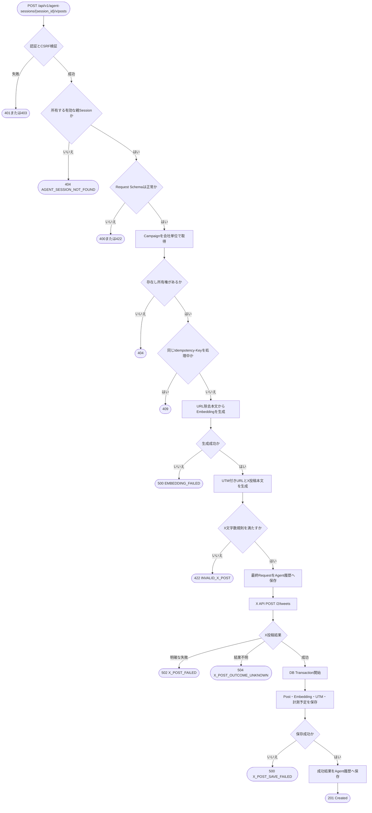
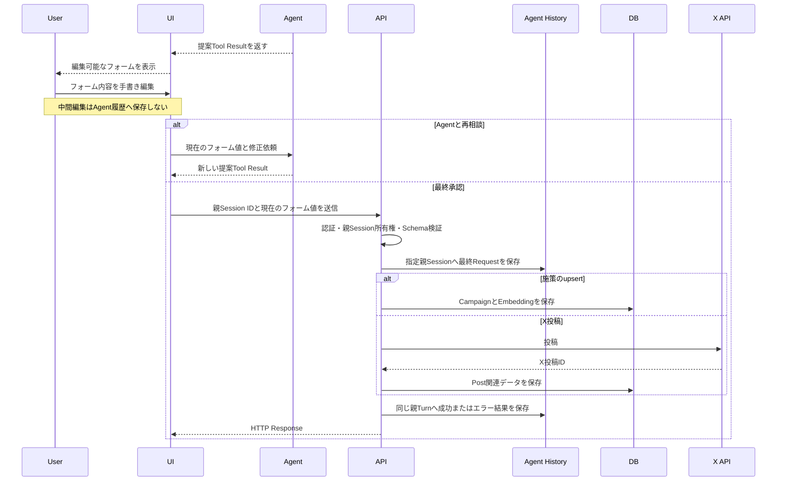

# API設計書

## 1. 目的
本書は、ユーザーがUIで最終確定した施策内容と投稿内容を業務データへ反映するアプリケーションAPIを定義する。

Agentは`propose_campaign`と`propose_x_post`で編集可能な内容を提案する。UIは提案内容をフォームの初期値として表示し、ユーザーは内容を直接編集できる。施策の登録・更新とXへの投稿は、承認ボタン押下時のフォーム値をRequest Bodyへ設定して本APIから実行する。

## 2. 共通仕様

### 2.1 API境界
- Base pathは`/api/v1`とする
- RequestとResponseのContent-Typeは`application/json`とする
- APIは既存の認証済みセッションを使用し、`company_id`と`marketer_id`をRequest Bodyから受け取らない
- Agent履歴を更新する状態変更APIは`/agent-sessions/{session_id}`配下とし、履歴の保存先をPathで明示する
- Cookie認証を使用する場合は、状態変更APIへCSRF対策を適用する
- API呼び出し自体を、Request Bodyに含まれる内容の最終承認として扱う
- API処理ではLLM、Agent Tool、OrcaRouter Agent Firewallを使用しない
- X APIやEmbedding APIの認証情報はサーバー側だけで管理する

### 2.2 入力検証
APIはAgent履歴を入力元として参照せず、Request Bodyの最終フォーム値を正本として使用する。各APIは以下を検証する。

- Pathの`session_id`が正の整数である
- Sessionが認証済みマーケターに属する
- Sessionが`agent = parent`かつ`parent_session_id = null`の親Sessionである
- Sessionがアーカイブされていない
- JSONとフィールド型がAPI Schemaに適合する
- 必須文字列が空ではなく、長さ上限を満たす
- Request内で既存Campaign IDを参照する場合、そのCampaignが存在し、認証済みマーケターの会社に属する
- URLが許可されたSchemeと形式を満たす
- 認証済みマーケターが対象操作を実行できる

`company_id`、`marketer_id`、X投稿ID、UTMパラメータ、Embeddingはクライアント入力を使用せず、アプリケーションが決定する。

存在しないSession、他のマーケターが所有するSession、子Session、アーカイブ済みSessionは、存在確認による情報漏えいを防ぐため、すべて`404 AGENT_SESSION_NOT_FOUND`として扱う。会社IDは検証済み親Sessionのマーケターから決定する。

### 2.3 承認監査
承認ボタンからAPIを呼び出し、認証・親Session所有権・Schema検証に成功した時点で、バックエンドはPathで指定された親Sessionに新しいTurnを作成し、APIが実際に受け取った最終内容を信頼済み`user_message`へ保存する。

```json
{
  "action": {
    "id": "action-uuid",
    "type": "publish_x_post",
    "request": {
      "campaign_id": 12,
      "body": "ユーザーが最終編集した投稿本文",
      "landing_url": "https://example.com/jobs/engineer"
    }
  }
}
```

監査用内容はSchema検証と機密値のマスク後に保存する。API完了後は、HTTP Status、業務レコードID、外部サービスIDまたはマスク済みエラーを、アプリケーション生成の`assistant_message`として同じTurnへ保存する。API処理に`tool_call`、`tool_result`、`tool_executions`は使用しない。

### 2.4 成功Response

```json
{
  "success": true,
  "data": {},
  "error": null
}
```

### 2.5 エラーResponse

```json
{
  "success": false,
  "data": null,
  "error": {
    "code": "ERROR_CODE",
    "message": "利用者向けのマスク済み説明",
    "retryable": false
  }
}
```

### 2.6 HTTP Status
| Status | 用途 |
| --- | --- |
| `200 OK` | 既存施策の上書き成功 |
| `201 Created` | 施策の新規作成またはX投稿成功 |
| `400 Bad Request` | JSON、型、必須項目が不正 |
| `401 Unauthorized` | 未認証 |
| `403 Forbidden` | 対象が別会社に属する、または実行権限がない |
| `404 Not Found` | Campaignなどの対象が存在しない |
| `409 Conflict` | 同一Requestの処理中または処理済み |
| `422 Unprocessable Entity` | 施策内容やX投稿内容の業務検証に失敗 |
| `502 Bad Gateway` | X APIが明確な失敗を返した |
| `504 Gateway Timeout` | X APIの実行結果を確定できない |
| `500 Internal Server Error` | 内部処理またはDB保存に失敗した |

## 3. X投稿API

### 3.1 投稿を公開する
`POST /api/v1/agent-sessions/{session_id}/x/posts`

Request Bodyの投稿内容を最終承認済みとしてXへ投稿する。X APIへの投稿成功後にだけ、投稿と関連データを業務テーブルへ保存する。

#### Request Header

```http
Idempotency-Key: action-uuid
```

#### Request Body

```json
{
  "campaign_id": 12,
  "body": "ユーザーが最終編集した投稿本文",
  "landing_url": "https://example.com/jobs/engineer"
}
```

| Field | Type | 必須 | 説明 |
| --- | --- | :---: | --- |
| `campaign_id` | integer | ○ | 投稿を紐づける施策ID |
| `body` | string | ○ | URLを含まないX投稿本文 |
| `landing_url` | string | ○ | UTMパラメータを付与する遷移先URL |

#### Response: `201 Created`

```json
{
  "success": true,
  "data": {
    "post_id": 45,
    "agent_turn_id": 1901,
    "campaign_id": 12,
    "x_post_id": "1840000000000000000",
    "body": "ユーザーが最終編集した投稿本文",
    "tracked_url": "https://example.com/jobs/engineer?utm_source=x&utm_medium=social&utm_campaign=12&utm_content=action-uuid",
    "published_at": "2026-09-21T10:00:00Z"
  },
  "error": null
}
```

#### 処理フロー



#### X API Request
アプリケーション内部のX API Clientが`POST /2/tweets`を呼び出す。Request Bodyの`body`と、`landing_url`から生成したUTM付きURLを結合した本文を送信する。

```json
{
  "text": "ユーザーが最終編集した投稿本文\nhttps://example.com/jobs/engineer?utm_source=x&utm_medium=social&utm_campaign=12&utm_content=action-uuid"
}
```

- Xの現行文字数計算規則をURL結合後の本文へ適用する
- `utm_source`は`x`、`utm_medium`は`social`とする
- `utm_campaign`はCampaign IDから生成する
- `utm_content`は`Idempotency-Key`から生成する
- X APIが失敗した場合は`posts`を含む業務データを保存しない
- X APIが成功した場合だけ、`posts`、`post_embeddings`、`post_tracking_links`、`post_metrics`を同一Transactionで保存する

#### エラーコード
| HTTP Status | Code | 条件 | 再試行 |
| --- | --- | --- | :---: |
| `400` | `INVALID_ARGUMENT` | JSON、型、必須項目が不正 | × |
| `403` | `POST_ACCESS_DENIED` | 実行権限がない | × |
| `404` | `AGENT_SESSION_NOT_FOUND` | 親Sessionが存在しない、所有していない、または利用できない | × |
| `404` | `CAMPAIGN_NOT_FOUND` | Campaignが存在しない、または別会社に属する | × |
| `409` | `POST_PUBLISH_CONFLICT` | 同じIdempotency-Keyを処理中または処理済み | × |
| `422` | `INVALID_X_POST` | 本文、URL、結合後の文字数などが不正 | × |
| `500` | `EMBEDDING_FAILED` | 投稿検索用Embeddingを生成できない | ○ |
| `502` | `X_POST_FAILED` | X APIが失敗を確定して返した | 条件付き |
| `504` | `X_POST_OUTCOME_UNKNOWN` | TimeoutなどでX投稿結果が不明 | × |
| `500` | `X_POST_SAVE_FAILED` | X成功後にDB保存が失敗 | × |

#### 再試行と既知の制約
- 専用の投稿実行状態テーブルと`posts.status`は設けない
- UIの二重送信防止と、`session_id`と`Idempotency-Key`の組み合わせを単位とするアプリケーションロックで同時実行を抑止する
- 完了済みRequestは指定親SessionのAgent履歴にあるAction IDと結果から検出する
- X APIが明確に失敗し、外部投稿が作成されていないと判断できる場合だけ再試行を許可する
- `X_POST_OUTCOME_UNKNOWN`と`X_POST_SAVE_FAILED`では、X上に投稿が存在する可能性があるため自動再試行しない
- X成功後かつDB保存前に障害が発生するクラッシュ境界はMVPの既知制約とし、マスク済みアプリケーションログとX管理画面で手動確認する

## 4. 施策API

### 4.1 施策をupsertする
`POST /api/v1/agent-sessions/{session_id}/campaigns`

Request Bodyの`id`が省略または`null`なら新規作成し、値があれば既存施策の編集可能な全フィールドを上書きする。部分更新は行わない。

#### Request Body: 新規作成

```json
{
  "title": "経験者Webエンジニア採用",
  "target_profile": "20代後半のWebエンジニア",
  "background": "経験者採用の応募数が減少している",
  "objective": "応募数を増やす",
  "plan": "柔軟な働き方をXで訴求する"
}
```

#### Request Body: 上書き

```json
{
  "id": 12,
  "title": "経験者Webエンジニア採用 第2弾",
  "target_profile": "20代後半のWebエンジニア",
  "background": "経験者採用の応募数が減少している",
  "objective": "応募数を増やす",
  "plan": "訴求内容を更新する"
}
```

| Field | Type | 必須 | 説明 |
| --- | --- | :---: | --- |
| `id` | integer または null |  | 上書き対象の施策ID。省略または`null`なら新規作成 |
| `title` | string | ○ | 施策タイトル |
| `target_profile` | string | ○ | ターゲット像 |
| `background` | string | ○ | 実施背景 |
| `objective` | string | ○ | 施策目的 |
| `plan` | string | ○ | 施策内容 |

#### Response: `201 Created`

```json
{
  "success": true,
  "data": {
    "id": 12,
    "agent_turn_id": 1880,
    "title": "経験者Webエンジニア採用",
    "created_at": "2026-09-21T10:00:00Z"
  },
  "error": null
}
```

#### Response: `200 OK`（上書き）

```json
{
  "success": true,
  "data": {
    "id": 12,
    "agent_turn_id": 1881,
    "title": "経験者Webエンジニア採用 第2弾",
    "updated_at": "2026-09-21T11:00:00Z"
  },
  "error": null
}
```

#### 処理
- Pathの`session_id`から、認証済みマーケターが所有する有効な親Sessionを取得する
- Request Bodyを施策Schemaで検証する
- `id`が省略または`null`の場合は新規作成として処理する
- `id`に値がある場合は認証済みマーケターの会社単位でCampaignを取得し、存在しなければ`404`を返す
- `id`に値がある場合でも、指定IDで新しいCampaignを作成しない
- 会社IDと作成者IDは認証済みContextから設定する
- Schema検証済みの最終Requestを指定親Sessionの新しいTurnへ保存する
- 新規作成では検索用Embeddingと`content_hash`を生成する
- 上書きでは検索対象内容の`content_hash`が変わった場合だけEmbeddingを再生成する
- CampaignとEmbeddingを同一Transactionで保存または更新する
- 上書き時は`updated_at`を処理完了時刻へ変更する
- 成功またはマスク済みエラーを同じ親Turnへ保存する

#### 主なエラー
`INVALID_ARGUMENT`、`AGENT_SESSION_NOT_FOUND`、`CAMPAIGN_NOT_FOUND`、`CAMPAIGN_ACCESS_DENIED`、`INVALID_CAMPAIGN`、`EMBEDDING_FAILED`、`CAMPAIGN_SAVE_FAILED`、`CAMPAIGN_UPDATE_FAILED`。

## 5. 編集・承認フロー



## 6. 非対象
- AgentまたはLLMから本APIを呼び出すこと
- 自由文を最終承認として解釈すること
- UIフォームの手書き編集を変更ごとにAgent履歴へ保存すること
- 未公開投稿案を`posts`へ保存すること
- X投稿の実行状態を管理する専用テーブル
- X投稿結果不明時の自動再投稿
- 公開済み投稿本文の更新と削除
- 施策の削除
