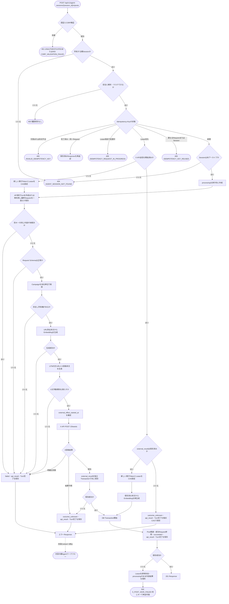
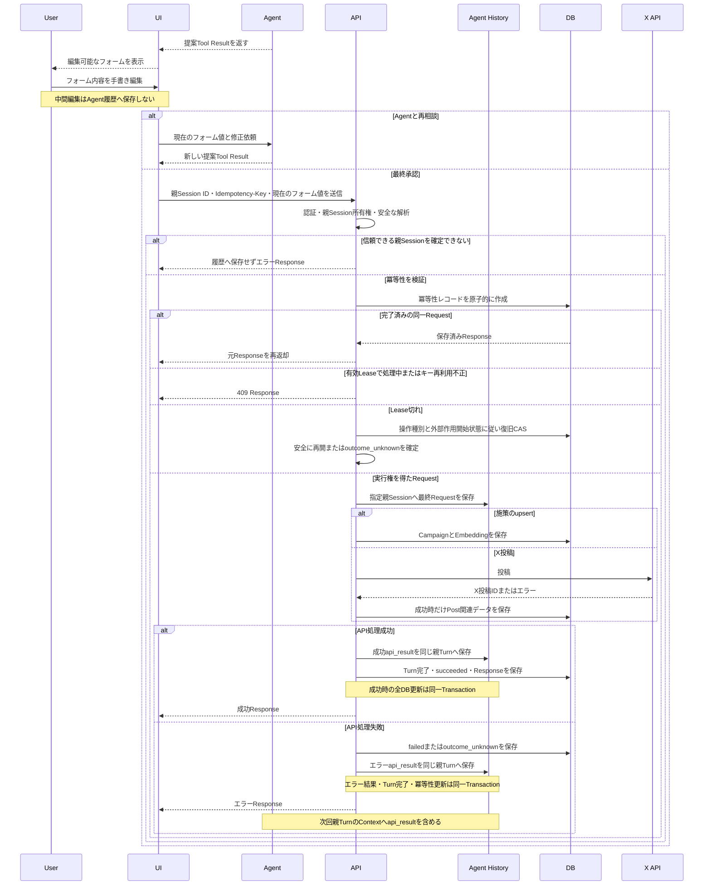

# API設計書

## 1. 目的
本書は、ユーザーがUIで最終確定した施策内容と投稿内容を業務データへ反映するアプリケーションAPIを定義する。

Agentは`propose_campaign`と`propose_x_post`で編集可能な内容を提案する。UIは提案内容をフォームの初期値として表示し、ユーザーは内容を直接編集できる。施策の登録・更新とXへの投稿は、承認ボタン押下時のフォーム値をRequest Bodyへ設定して本APIから実行する。

## 2. 共通仕様

### 2.1 API境界
- Base pathは`/api/v1`とする
- RequestとResponseのContent-Typeは`application/json`とする
- APIは署名付きCookieで認証したマーケターを使用し（2.8）、`company_id`と`marketer_id`をRequest Bodyから受け取らない
- Agent履歴を更新する状態変更APIは`/agent-sessions/{session_id}`配下とし、履歴の保存先をPathで明示する
- 施策upsert APIとX投稿APIは`Idempotency-Key` Headerを必須とする
- 状態変更API（POST・PATCH・DELETE）にはCSRF対策を適用する（2.8）
- API呼び出し自体を、Request Bodyに含まれる内容の最終承認として扱う
- API処理ではLLM、Agent Tool、OrcaRouter Agent Firewallを使用しない
- X APIやEmbedding APIの認証情報はサーバー側だけで管理する

### 2.2 入力検証
APIはAgent履歴を入力元として参照せず、Request Bodyの最終フォーム値を正本として使用する。履歴保存先を安全に確定するため、最初に以下を検証する。

- Pathの`session_id`が正の整数である
- Sessionが認証済みマーケターに属する
- Sessionが`agent = parent`かつ`parent_session_id = null`の親Sessionである
- Requestがサイズ上限内で、安全にJSON解析・マスクできる

親Sessionと安全なRequestを確定した後、冪等性を検証する。完了済みの同一RequestはSessionが後からアーカイブされていても保存済みResponseを返す。新しい処理を開始する場合はSessionがアーカイブされていないことを追加検証し、最初のRequestだけに実行権を付与する。実行権を得たRequestはAPI実行Turnを作成してマスク済みRequestを保存し、以下のSchema・業務条件を検証する。

- JSONのフィールド型がAPI Schemaに適合する
- 必須文字列が空ではなく、長さ上限を満たす
- Request内で既存Campaign IDを参照する場合、そのCampaignが存在し、認証済みマーケターの会社に属する
- URLが許可されたSchemeと形式を満たす

`company_id`、`marketer_id`、X投稿ID、UTMパラメータ、Embeddingはクライアント入力を使用せず、アプリケーションが決定する。

存在しないSession、他のマーケターが所有するSession、子Sessionは、存在確認による情報漏えいを防ぐため、すべて`404 AGENT_SESSION_NOT_FOUND`として扱う。アーカイブ済みSessionでは完了済みの同一Requestの再返却だけを許可し、新しい処理は`404 AGENT_SESSION_NOT_FOUND`とする。会社IDは検証済み親Sessionのマーケターから決定する。

Request内で参照する既存Campaign IDが存在しない場合と、別会社に属する場合も、存在確認による情報漏えいを防ぐため区別せず`404 CAMPAIGN_NOT_FOUND`として扱う。MVPにはロールの概念がないため、テナント境界違反に`403`は使用しない。

### 2.3 冪等性
UIは承認操作ごとにUUIDを生成し、`Idempotency-Key` Headerと監査内容のAction IDへ同じ値を設定する。二重クリック、通信切断後の再送、クライアント内部の再試行では同じキーを使用し、ユーザーが明示的に新しい承認操作を行った場合だけ新しいキーを生成する。

`Idempotency-Key`はUUID形式を必須とする。Headerがない、または形式が不正な場合は`400 INVALID_IDEMPOTENCY_KEY`を返し、冪等性レコードとAPI実行Turnを作成しない。

バックエンドは認証、親Session所有権、安全なJSON解析に成功した後、JSONオブジェクトのキー順など表現上の差を除去したRequest BodyのSHA-256を`request_hash`として計算する。`marketer_id`、操作種別、`Idempotency-Key`の組み合わせで`api_idempotency_requests`を原子的に作成し、作成に成功したRequestだけが業務処理を開始する。実行権取得時はサーバー生成の`execution_token`と`lease_expires_at`を設定する。

| 既存レコード | 処理 |
| --- | --- |
| 同じSession・同じRequest、`succeeded`または`failed` | 保存済みのHTTP StatusとResponse Bodyをそのまま返す。新しいAPI実行Turnと業務データは作成しない |
| 同じSession・同じRequest、`outcome_unknown` | 手動照合までは保存済みの結果不明Responseを返す。外部処理を再実行しない |
| 同じSession・同じRequest、有効なLeaseの`processing` | `409 IDEMPOTENCY_REQUEST_IN_PROGRESS`と`Retry-After`を返し、処理を重複実行しない |
| 同じSession・同じRequest、期限切れの`processing` | Campaignまたは外部作用開始前のX投稿はFencing Tokenを更新して再開する。外部作用開始後のX投稿は、X投稿結果（`external_result`）が保存済みならFencing Tokenを更新してDB保存だけを再開し、未保存なら`outcome_unknown`へ確定する |
| 異なるSessionまたは異なる`request_hash` | `409 IDEMPOTENCY_KEY_REUSED`を返し、処理を実行しない |

- 再送Responseの`agent_turn_id`は最初のRequestで作成したTurn IDとする
- 再送自体はAgent履歴へ重複保存しない
- `succeeded`と`failed`のResponseは確定後に変更しない。`outcome_unknown`のResponseだけは手動照合で`succeeded`または`failed`へ解決した際に確定Responseへ置き換え、以後の再送には解決後のResponseを返す
- `failed`の同じキーは保存済みエラーを再返却する。再実行する場合は、ユーザーの新しい承認操作と新しいキーを必要とする
- 通常の業務処理を完了する最終Transactionは、冪等性レコードが`processing`、`execution_token`が実行中のTokenと一致、かつ`lease_expires_at > now()`の場合だけCommitし、Lease切れ後の古いワーカーによる書き込みを防止する
- 施策またはPost関連データの保存、成功API Result、API実行Turnの完了、および冪等性レコードの`succeeded`への更新は同一DB Transactionで行う
- エラーAPI Result、API実行Turnの完了、および冪等性レコードの`failed`または`outcome_unknown`への更新も同一DB Transactionで行う
- CampaignのLeaseが切れた`processing`は、新しい`execution_token`とLeaseをCompare-and-setで設定してから安全に再実行できる
- X投稿のLeaseが切れた`processing`は、`external_effect_started_at = NULL`なら新しい実行TokenとLeaseで安全に再実行できる。値がある場合は、`external_result`（3章）の有無で分岐する
  - `external_result`が保存済みなら、X投稿は成功済みである。新しい実行TokenとLeaseをCompare-and-setで設定し、X APIを呼ばずDB保存だけを再開する
  - `external_result`が未保存なら、期限切れを条件とする専用の復旧Transactionで、`status`、旧`execution_token`、`lease_expires_at`をCompare-and-setし、`outcome_unknown`のAPI Result保存と元Turnの完了を同時に行う。この復旧遷移には有効なLeaseを要求せず、自動再投稿しない
- Lease再取得時に`agent_turn_id`が設定済みなら同じAPI実行Turnを再利用し、最終Request Itemは`Idempotency-Key`由来の安定したItemキーで重複保存を防ぐ。未設定の場合だけ、冪等性行をロックしたTransaction内でTurnを一度作成して関連付ける
- `retryable = true`は原則として、新しいユーザー承認と新しいキーによる再実行が可能であることを示す。同じキーの`failed` Requestを再実行する意味ではない。`IDEMPOTENCY_REQUEST_IN_PROGRESS`と`X_POST_SAVE_FAILED`だけは、同じキーで再送する
- 冪等性レコードは監査と遅延再送への応答に使用するため、MVPでは削除しない

### 2.4 承認監査とAPI Result
承認ボタンからAPIを呼び出し、認証・親Session所有権・安全なJSON解析・冪等性検証に成功して最初のRequestとして実行権を得た時点で、バックエンドはPathで指定された親Sessionに新しいTurnを作成し、APIが実際に受け取った最終内容をマスクして信頼済み`user_message`へ保存する。

```json
{
  "action": {
    "id": "action-uuid",
    "type": "publish_x_post",
    "request": {
      "campaign_id": 12,
      "body": "ユーザーが最終編集した投稿本文",
      "landing_url": "https://example.com/jobs/engineer"
    }
  }
}
```

APIはSchema検証、業務条件検証、外部API、DB処理の成功またはエラーを構造化`api_result`として同じTurnへ保存する。API処理に`tool_call`、`tool_result`、`tool_executions`は使用しない。

```json
{
  "kind": "api_result",
  "operation": "publish_x_post",
  "success": false,
  "error": {
    "code": "INVALID_X_POST",
    "message": "投稿本文が文字数上限を超えています。",
    "retryable": false
  }
}
```

- API Resultは`item_type = assistant_message`、`llm_call_id = NULL`、`content_source = system`、`context_class = conversation`、`context_status = active`で保存する
- Responseを返す前にAPI Resultを保存し、API実行Turnを終端状態へ変更する
- エラーResponseの`agent_turn_id`は、API Resultを保存したTurnを示す
- API Result保存だけでは親Agentを自動起動しない
- 次のユーザー入力で親Agent Turnを開始した際、通常のContext構築処理がAPI Resultを読み込む
- 親AgentはAPI Resultを観測して回答や修正提案へ利用できるが、副作用を伴うAPIを自動再実行しない
- 認証、親Session所有権、安全なJSON解析のいずれかに失敗した場合は安全な保存先または内容を確定できないため、Agent履歴へ保存せずResponseだけを返す
- `AGENT_SESSION_NOT_FOUND`を受けたUIは、利用可能な親Sessionを選択または作成し、マスク済みエラーを新しいユーザー入力として送信することで親Agentワークフローへ接続する。詳細は`USECASE.md`を参照する

### 2.5 成功Response

```json
{
  "success": true,
  "data": {},
  "error": null
}
```

### 2.6 エラーResponse

```json
{
  "success": false,
  "data": null,
  "error": {
    "code": "ERROR_CODE",
    "message": "利用者向けのマスク済み説明",
    "retryable": false,
    "agent_turn_id": 1902
  }
}
```

Agent履歴へ保存しない認証・Session・JSON解析・冪等性Headerエラーでは`agent_turn_id = null`とする。

### 2.7 HTTP Status
| Status | 用途 |
| --- | --- |
| `200 OK` | 既存施策の上書き成功 |
| `201 Created` | 施策の新規作成またはX投稿成功 |
| `400 Bad Request` | JSON、型、必須項目、Idempotency-Keyが不正 |
| `401 Unauthorized` | 未認証、または認証Cookieの期限切れ・署名不正 |
| `403 Forbidden` | CSRF検証に失敗した。テナント境界違反には使用しない |
| `404 Not Found` | Session・Campaignなどの対象が存在しない、または別のマーケター・別会社に属する |
| `409 Conflict` | 同じ冪等性キーの処理中、異なるRequestへのキー再利用、または施策上書きの競合 |
| `422 Unprocessable Entity` | 施策内容やX投稿内容の業務検証に失敗 |
| `502 Bad Gateway` | X APIが明確な失敗を返した |
| `504 Gateway Timeout` | X APIの実行結果を確定できない |
| `500 Internal Server Error` | 内部処理またはDB保存に失敗した |

### 2.8 認証とCSRF
認証はサーバー側に状態を持たない署名付きCookieで行う。

#### 認証Cookie
- 属性は`HttpOnly`、`Secure`、`SameSite=Lax`とする
- 値には`marketer_id`、ログイン日時、有効期限を含め、サーバーの署名鍵で署名する。署名鍵は環境変数から読み込む
- 有効期限は、アイドル8時間と絶対上限7日とする
  - 認証済みRequestを処理するたびに、Cookieを発行し直してアイドル期限を8時間先へ延長する
  - 絶対上限はログイン日時から7日とし、延長しない
- 署名不正、またはいずれかの期限を超過したCookieは`401 UNAUTHENTICATED`とし、Cookieを削除する
- サーバー側にSession表を持たないため、Cookieを個別に失効させる機能はない。ログアウトはブラウザのCookie削除だけで、盗まれたCookieは期限まで有効である（MVPの既知の制約）

#### CSRF対策
状態変更API（POST・PATCH・DELETE）には、次の2つをどちらも適用する。

1. `Origin` Header（なければ`Referer`）が許可リストのオリジンと一致する。許可リストは環境変数で設定する
2. 署名付きダブルサブミットトークンを検証する。ログイン成功時に発行する`csrf_token` Cookie（`HttpOnly`なし、`Secure`、`SameSite=Lax`）の値と、`X-CSRF-Token` Headerの値が一致し、かつトークンの署名が有効で`marketer_id`に束縛されている

ログインAPIは`csrf_token` Cookieをまだ持たないため、1だけを適用する。ログアウトAPIは未ログインでも同じ結果を返すため、同様に1だけを適用する（強制ログアウトの影響は小さいと判断）。

#### 認証・CSRFのエラー
| HTTP Status | Code | 条件 | 再試行 |
| --- | --- | --- | :---: |
| `401` | `UNAUTHENTICATED` | 認証Cookieがない、署名不正、または期限切れ。UIはログイン画面へ遷移する | × |
| `403` | `CSRF_VALIDATION_FAILED` | Origin不一致、または`X-CSRF-Token`が不正 | × |

- 認証、CSRFの順に検証し、失敗した場合はAgent履歴へ保存せずResponseだけを返す（`agent_turn_id = null`）
- 認証・CSRFに失敗したRequestでは、Session所有権の判定と冪等性の処理を行わない

### 2.9 認証API
ユーザー登録APIは設けない。マーケターは初期データ投入スクリプトで事前登録する。認証APIは`/agent-sessions`配下ではなく、Agent履歴へ保存しない。

#### ログイン
`POST /api/v1/auth/login`

```json
{
  "email": "marketer@example.com",
  "password": "********"
}
```

成功時は`200 OK`を返し、認証Cookieと`csrf_token` Cookieを設定する。

```json
{
  "success": true,
  "data": {
    "marketer_id": 3,
    "email": "marketer@example.com",
    "csrf_token": "signed-token"
  },
  "error": null
}
```

| HTTP Status | Code | 条件 | 再試行 |
| --- | --- | --- | :---: |
| `400` | `INVALID_ARGUMENT` | JSON、型、必須項目が不正 | × |
| `401` | `INVALID_CREDENTIALS` | メールアドレスまたはパスワードが正しくない | × |

- メールアドレスが存在しない場合、パスワードが一致しない場合、ユーザーにマーケタープロファイルがない場合は、`INVALID_CREDENTIALS`と同じメッセージ・同じ形式で返す。応答から登録の有無を判別できないようにする
- パスワードはargon2でハッシュ化した値と照合する。メールアドレスが存在しない場合も同等の照合処理を行い、応答時間から登録の有無を判別できないようにする
- パスワードとCookieの値はログに出さない
- 【要決定】ログイン試行回数の制限（同一メールアドレス・同一IPでの失敗回数と待機時間）

#### ログアウト
`POST /api/v1/auth/logout`

認証Cookieと`csrf_token` Cookieを削除し（`Max-Age=0`）、`200 OK`を返す。未ログインの場合も同じ結果とする。

```json
{
  "success": true,
  "data": null,
  "error": null
}
```

## 3. X投稿API

### 3.1 投稿を公開する
`POST /api/v1/agent-sessions/{session_id}/x/posts`

Request Bodyの投稿内容を最終承認済みとしてXへ投稿する。X APIへの投稿成功後にだけ、投稿と関連データを業務テーブルへ保存する。

#### Request Header

```http
Idempotency-Key: action-uuid
```

#### Request Body

```json
{
  "campaign_id": 12,
  "body": "ユーザーが最終編集した投稿本文",
  "landing_url": "https://example.com/jobs/engineer"
}
```

| Field | Type | 必須 | 説明 |
| --- | --- | :---: | --- |
| `campaign_id` | integer | ○ | 投稿を紐づける施策ID |
| `body` | string | ○ | URLを含まないX投稿本文 |
| `landing_url` | string | ○ | UTMパラメータを付与する遷移先URL |

#### Response: `201 Created`

```json
{
  "success": true,
  "data": {
    "post_id": 45,
    "agent_turn_id": 1901,
    "campaign_id": 12,
    "x_post_id": "1840000000000000000",
    "body": "ユーザーが最終編集した投稿本文",
    "tracked_url": "https://example.com/jobs/engineer?utm_source=x&utm_medium=social&utm_campaign=12&utm_content=action-uuid",
    "published_at": "2026-09-21T10:00:00Z"
  },
  "error": null
}
```

#### 処理フロー



#### X API Request
アプリケーション内部のX API Clientが`POST /2/tweets`を呼び出す。Request Bodyの`body`と、`landing_url`から生成したUTM付きURLを結合した本文を送信する。

```json
{
  "text": "ユーザーが最終編集した投稿本文\nhttps://example.com/jobs/engineer?utm_source=x&utm_medium=social&utm_campaign=12&utm_content=action-uuid"
}
```

- Xの現行文字数計算規則をURL結合後の本文へ適用する
- `utm_source`は`x`、`utm_medium`は`social`とする
- `utm_campaign`はCampaign IDから生成する
- `utm_content`は`Idempotency-Key`から生成する
- X APIへRequestを送信する直前に、現在の実行Tokenと有効なLeaseを条件として`external_effect_started_at`を原子的に設定する
- X APIが失敗した場合は`posts`を含む業務データを保存しない
- X APIが成功した直後、DB保存より先に、現在の実行Tokenと有効なLeaseを条件として、X投稿結果を`api_idempotency_requests.external_result`へ独立した短いTransactionで保存する。保存する値は`x_post_id`、X APIへ送信した`text`、`tracked_url`、`published_at`（X API成功を確認した日時）とする。X API成功後の復旧に必要な値を、DB保存の失敗に関係なく残すためである
- `external_result`の保存自体に失敗した場合は、X投稿結果を復旧できないため、`outcome_unknown`として扱う
- `external_result`の保存後にDB保存が失敗した場合は、Post関連の保存Transactionをロールバックし、`external_result`を保持したまま`processing`に留める。Leaseを即時失効させ（`lease_expires_at = now()`）、`500 X_POST_SAVE_FAILED`（`retryable = true`）を返す。このResponseは確定Responseではないため、冪等性レコードへは保存せず、`agent_turn_id`には作成済みのTurn IDを設定する。API実行Turnは同じキーの再送で完了するまで終端状態にしない
- DB保存は同じRequest内で最大3回まで指数バックオフで再試行し、それでも失敗した場合に上記の`X_POST_SAVE_FAILED`を返す
- 同じキーで再送されたら（Lease切れの`processing`）、X APIを呼ばず、`external_result`の`text`と`published_at`を使ってDB保存だけを再実行する。Embeddingは保存済み本文から再生成し、生成に失敗した場合も`X_POST_SAVE_FAILED`とする。保存に成功すれば通常どおり`succeeded`と確定Responseを保存して`201 Created`を返す
- X APIが成功した場合だけ、`posts`、`post_embeddings`、`post_tracking_links`、`post_metrics`、成功API Result、Turn完了、冪等性の成功状態を同一Transactionで保存する
- `posts.api_idempotency_request_id`には同じTransactionで`succeeded`へ変更する現在の`publish_x_post` Request IDを設定する

#### エラーコード
| HTTP Status | Code | 条件 | 再試行 |
| --- | --- | --- | :---: |
| `400` | `INVALID_ARGUMENT` | JSON、型、必須項目が不正 | × |
| `400` | `INVALID_IDEMPOTENCY_KEY` | Idempotency-Keyがない、またはUUID形式ではない | × |
| `404` | `AGENT_SESSION_NOT_FOUND` | 親Sessionが存在しない、所有していない、または利用できない | × |
| `404` | `CAMPAIGN_NOT_FOUND` | Campaignが存在しない、または別会社に属する | × |
| `409` | `IDEMPOTENCY_REQUEST_IN_PROGRESS` | 同じIdempotency-KeyのRequestを処理中 | ○ |
| `409` | `IDEMPOTENCY_KEY_REUSED` | 同じIdempotency-Keyが異なるRequestまたはSessionで使用された | × |
| `409` | `X_POST_UNRESOLVED` | 別のキーに同じRequest内容の処理中または結果不明X投稿がある | × |
| `422` | `INVALID_X_POST` | 本文、URL、結合後の文字数などが不正 | × |
| `500` | `EMBEDDING_FAILED` | 投稿検索用Embeddingを生成できない | ○ |
| `502` | `X_POST_FAILED` | X APIが失敗を確定して返した | 条件付き |
| `504` | `X_POST_OUTCOME_UNKNOWN` | TimeoutなどでX投稿結果が不明 | × |
| `500` | `X_POST_SAVE_FAILED` | X成功後にDB保存が失敗した。Xへは投稿済みで、`external_result`を保持している | ○（同じキーで再送） |

UIは`X_POST_SAVE_FAILED`を受けた場合、Xへは投稿済みであることを表示し、新しい承認操作ではなく同じ`Idempotency-Key`で再送する。新しいキーで再送するとXへ二重投稿するため、`X_POST_UNRESOLVED`で拒否される。

#### 再試行と既知の制約
- `posts.status`は設けず、API実行状態は共通の`api_idempotency_requests`で管理する
- X投稿の新しい冪等性Requestを予約するTransactionでは、マーケターと`request_hash`を単位とするTransaction-scoped Advisory Lockを取得する。候補の冪等性行とAPI実行Turnを作成したうえで、同じ内容の`processing`または`outcome_unknown`が別キーに存在する場合は候補を`failed`へ確定して`409 X_POST_UNRESOLVED`を保存する。同じキーの再送にはこの保存済みResponseを返す
- 同じキーの完了済みRequestには、Agent履歴ではなく冪等性レコードに保存した確定Responseを返す。手動照合前の`outcome_unknown`では暫定的な結果不明Responseを返す
- X APIが明確に失敗した場合も、同じキーでは保存済み失敗Responseを返す。再試行には新しい承認操作と新しいキーを必要とする
- `X_POST_OUTCOME_UNKNOWN`は`outcome_unknown`として保存し、同じキーでも新しいキーでも自動再投稿しない。X API送信後に`external_result`を保存できなかった場合と、保存前にプロセスがクラッシュした場合が該当する
- `X_POST_SAVE_FAILED`は`external_result`を保存済みのため`outcome_unknown`にせず、同じキーの再送でDB保存だけを再実行する。X APIは再度呼ばない。別キーで同じ内容が送られても、未解決の`processing`があるため`X_POST_UNRESOLVED`で拒否する
- X API送信前の障害は`external_effect_started_at = NULL`なのでLease切れ後に安全に再開できる
- X API送信後で`external_result`が未保存の古い`processing`は、`outcome_unknown`へ変更してX管理画面で手動確認する
- 再送されないまま残った`X_POST_SAVE_FAILED`（`processing`かつ`external_result`あり、Lease切れ）は、運用スクリプトで検出して同じキーの再開処理を実行する。MVPでは手動実行とする

#### 公開済みPostの取得境界
- `get_post`は`posts.api_idempotency_request_id`で`api_idempotency_requests`を内部結合し、`operation = publish_x_post`かつ`status = succeeded`だけを返す
- `search_posts`は`post_embeddings`、`posts`、`api_idempotency_requests`を内部結合し、同じ成功条件を満たすレコードだけを検索する
- `failed`、`processing`、`outcome_unknown`のRequest BodyとAgent履歴上の投稿案をPostの取得元または検索Projectionに使用しない
- `post_metrics.status = failed`は公開後の計測失敗であり、X公開失敗ではないため取得対象から除外しない

#### 結果不明の手動照合
- `outcome_unknown`はX管理画面またはX APIで外部投稿の有無を確認するまで解決しない
- X公開成功を確認した場合は、Xから実際の公開日時を取得し、管理された復旧処理で`posts.published_at`とPost関連データを作成して、元Requestを`succeeded`へ変更し確定Responseを保存する
- Xへ公開されていないことを確認した場合は、元Requestを`failed`へ変更して確定Responseを保存する。その後の投稿には新しいユーザー承認と新しいキーを必要とする
- どちらの解決でも元のAgent Itemは変更せず、元の親Sessionへ照合内容と結果を新しい監査Turnとして保存する
- Post関連データ、冪等性状態、確定Response、新しい監査Turnは同一Transactionで保存する

## 4. 施策API

### 4.1 施策をupsertする
`POST /api/v1/agent-sessions/{session_id}/campaigns`

Request Bodyの`id`が省略または`null`なら新規作成し、値があれば既存施策の編集可能な全フィールドを上書きする。部分更新は行わない。

#### Request Header

```http
Idempotency-Key: action-uuid
```

#### Request Body: 新規作成

```json
{
  "title": "経験者Webエンジニア採用",
  "target_profile": "20代後半のWebエンジニア",
  "background": "経験者採用の応募数が減少している",
  "objective": "応募数を増やす",
  "plan": "柔軟な働き方をXで訴求する"
}
```

#### Request Body: 上書き

```json
{
  "id": 12,
  "expected_updated_at": "2026-09-21T09:30:15.123456Z",
  "title": "経験者Webエンジニア採用 第2弾",
  "target_profile": "20代後半のWebエンジニア",
  "background": "経験者採用の応募数が減少している",
  "objective": "応募数を増やす",
  "plan": "訴求内容を更新する"
}
```

| Field | Type | 必須 | 説明 |
| --- | --- | :---: | --- |
| `id` | integer または null |  | 上書き対象の施策ID。省略または`null`なら新規作成 |
| `expected_updated_at` | string（ISO 8601、マイクロ秒精度） | 上書き時○ | Agentが施策を提案した時点の施策の`updated_at`。`id`に値がある場合は必須。新規作成では指定しない |
| `title` | string | ○ | 施策タイトル |
| `target_profile` | string | ○ | ターゲット像 |
| `background` | string | ○ | 実施背景 |
| `objective` | string | ○ | 施策目的 |
| `plan` | string | ○ | 施策内容 |

#### Response: `201 Created`

```json
{
  "success": true,
  "data": {
    "id": 12,
    "agent_turn_id": 1880,
    "title": "経験者Webエンジニア採用",
    "created_at": "2026-09-21T10:00:00Z"
  },
  "error": null
}
```

#### Response: `200 OK`（上書き）

```json
{
  "success": true,
  "data": {
    "id": 12,
    "agent_turn_id": 1881,
    "title": "経験者Webエンジニア採用 第2弾",
    "updated_at": "2026-09-21T11:00:00Z"
  },
  "error": null
}
```

#### 処理
- Pathの`session_id`から、認証済みマーケターが所有する有効な親Sessionを取得する
- Requestを安全に解析・マスクし、正規化したRequest Bodyから`request_hash`を生成する
- 冪等性レコードを原子的に作成できた最初のRequestだけが、指定親SessionにAPI実行Turnを作成して最終Requestを保存する
- 同じキー、Session、Requestの完了済み処理では、元のHTTP StatusとResponse Bodyを返し、新しいTurnやCampaignを作成しない
- 同じキーでLeaseが有効な処理中は`409 IDEMPOTENCY_REQUEST_IN_PROGRESS`を返す。Lease切れでは新しい実行TokenとLeaseをCAS設定して既存Turnを再利用し、異なるRequestまたはSessionへの再利用は`409 IDEMPOTENCY_KEY_REUSED`を返す
- Request Bodyを施策Schemaで検証する
- `id`が省略または`null`の場合は新規作成として処理する
- `id`に値がある場合は認証済みマーケターの会社単位でCampaignを取得し、存在しない場合と別会社に属する場合は、区別せず`404 CAMPAIGN_NOT_FOUND`を返す
- `id`に値がある場合でも、指定IDで新しいCampaignを作成しない
- `id`に値がある場合は、`expected_updated_at`を必須とする。省略または形式が不正なら`400 INVALID_ARGUMENT`とする
- 取得したCampaignの`updated_at`が`expected_updated_at`と一致しない場合は、Embedding生成の前に`409 CAMPAIGN_CONFLICT`を返す。別のSessionまたは別のマーケターがAgentの提案後に施策を更新したことを示す
- 保存時は`WHERE id = :id AND company_id = :company_id AND updated_at = :expected_updated_at`を条件にUPDATEし、更新行数が0なら同様に`409 CAMPAIGN_CONFLICT`とする。事前確認から保存までの間の更新を検出するためで、同一Transaction内で行う
- `updated_at`の比較は、文字列ではなく`timestamptz`の値として行う。UIは受け取った値を加工せずそのまま送り返す
- `CAMPAIGN_CONFLICT`は`failed`として保存する。同じキーでは保存済みエラーを返し、利用者は最新の施策を確認したうえでAgentと再相談し、新しい承認操作と新しいキーで再実行する
- 会社IDと作成者IDは認証済みContextから設定する
- 新規作成では検索用Embeddingと`content_hash`を生成する
- 上書きでは検索対象内容の`content_hash`が変わった場合だけEmbeddingを再生成する
- CampaignとEmbeddingの保存または更新、成功API Result、Turn完了、および冪等性レコードの`succeeded`への変更を同一Transactionで行う
- 上書き時は`updated_at`を処理完了時刻へ変更する
- Schema、業務条件、Embedding、DB処理のマスク済みエラー、Turn完了、および冪等性レコードの`failed`への変更を同一Transactionで保存する
- 確定Responseを冪等性レコードへ保存してから返す
- 保存したエラーは次回の親Agent TurnでContextへ読み込むが、親Agentを自動起動しない

#### 主なエラー
`INVALID_ARGUMENT`、`INVALID_IDEMPOTENCY_KEY`、`AGENT_SESSION_NOT_FOUND`、`IDEMPOTENCY_REQUEST_IN_PROGRESS`、`IDEMPOTENCY_KEY_REUSED`、`CAMPAIGN_NOT_FOUND`、`CAMPAIGN_CONFLICT`（409、再試行×）、`INVALID_CAMPAIGN`、`EMBEDDING_FAILED`、`CAMPAIGN_SAVE_FAILED`、`CAMPAIGN_UPDATE_FAILED`。

## 5. 編集・承認フロー



## 6. 非対象
- AgentまたはLLMから本APIを呼び出すこと
- 自由文を最終承認として解釈すること
- UIフォームの手書き編集を変更ごとにAgent履歴へ保存すること
- 未公開投稿案を`posts`へ保存すること
- X投稿結果不明時の自動再投稿
- 公開済み投稿本文の更新と削除
- 施策の削除
- ユーザー登録API（マーケターは初期データ投入スクリプトで事前登録する）
- 認証Cookieのサーバー側での個別失効
