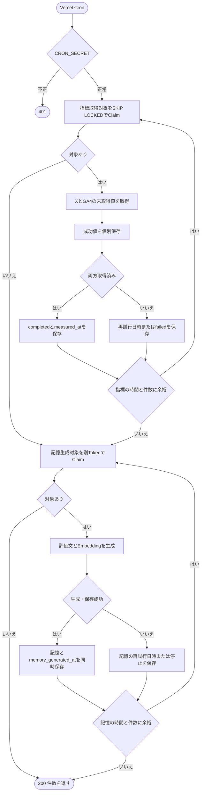

# Cron設計書

## 1. 目的

本書は、ユーザー操作と分離して実行する定期処理を定義する。v0.1では、公開から7日を経過したX投稿の初週指標をX APIとGA4 Data APIから取得し、評価結果と長期記憶を保存する施策評価Cronを扱う。

計測値、計測状態、記憶のデータ構造は`DATABASE.dbml`、外部APIの接続設定と画面向けResponseは`API_DESIGN.md`を正本とする。

## 2. 実行環境

- Vercel Cronから1日1回、`0 0 * * *`（UTC 00:00）に実行する
- Endpointは`GET /api/cron/post-metrics`とし、`/api/v1`のBrowser向けAPIには含めない
- Vercel Hobbyの実行時刻には幅があるため、`scheduled_at`から最大約24時間遅れて計測される場合がある。初週PVは、公開から7日を経過した最初の実行時点にXが返す累積表示回数とする
- 関数の最大実行時間は300秒とし、新しい対象の取得は残り60秒になった時点で停止する。処理中の1件は可能な範囲で状態保存まで完了する
- 指標取得の1回のClaimは`CRON_METRIC_BATCH_SIZE`件（既定20件）、1回の起動上限は`CRON_METRIC_MAX_ITEMS`件（既定100件）とする。記憶生成は`CRON_MEMORY_BATCH_SIZE`件（既定20件）と`CRON_MEMORY_MAX_ITEMS`件（既定100件）を別に適用する

## 3. 認証

Vercelが設定する次のHeaderを検証する。

```http
Authorization: Bearer <CRON_SECRET>
```

- `CRON_SECRET`は環境変数で管理し、コード、ログ、Response、Agent履歴へ保存しない
- Headerがない、Schemeが異なる、または値が一致しない場合は、処理を開始せず`401 Unauthorized`を返す
- Browserの認証Cookie、CSRF Token、`Idempotency-Key`は使用しない
- Responseは処理件数だけを返し、投稿本文、X投稿ID、Campaign ID、外部API Error本文を含めない

```json
{
  "status": "ok",
  "metrics_claimed": 3,
  "metrics_completed": 2,
  "metrics_failed": 0,
  "metrics_deferred": 1,
  "memories_claimed": 2,
  "memories_created": 1,
  "memories_failed": 1
}
```

- `metrics_claimed`はこの起動で指標取得用にClaimした投稿数、`metrics_completed`と`metrics_failed`はそのうち最終状態へ遷移した投稿数、`metrics_deferred`は再試行日時を設定して`pending`を維持した投稿数とする
- `memories_claimed`は評価記憶生成用に別途Claimした投稿数、`memories_created`は新しい評価記憶と`memory_generated_at`を同一Transactionで保存した投稿数、`memories_failed`は最大試行回数へ到達して自動再試行を停止した投稿数とする。指標取得と記憶生成のClaimを合算しない

## 4. 対象

### 4.1 指標取得

次をすべて満たす`post_metrics`を対象とする。

- `status = pending`
- `scheduled_at <= now()`
- `next_attempt_at IS NULL`または`next_attempt_at <= now()`
- `lease_expires_at IS NULL`または`lease_expires_at <= now()`
- `attempt_count < CRON_METRIC_MAX_ATTEMPTS`（既定3）

`x_pv_count`または`landing_user_count`が保存済みの場合は、値がないProviderだけを呼び出す。0は取得済みの実測値であり、未取得を示す`NULL`と区別する。

### 4.2 記憶生成

次をすべて満たす`post_metrics`を対象とする。

- `status = completed`
- `memory_generated_at IS NULL`
- `memory_failed_at IS NULL`
- `memory_next_attempt_at IS NULL`または`memory_next_attempt_at <= now()`
- Leaseがない、または期限切れ
- `memory_attempt_count < CRON_MEMORY_MAX_ATTEMPTS`（既定3）

`memory_generated_at`は、生成した記憶が後から利用者に削除されても変更しない。削除済みの評価記憶をCronが再生成しないための完了印である。

## 5. ClaimとLease

1. 短いDB Transactionを開始する
2. Lease切れかつ試行回数が最大の中断行を先に終端化する。指標取得は`status = failed`と内部Code `WORKER_INTERRUPTED`、記憶生成は`memory_failed_at = now()`、`memory_next_attempt_at = NULL`、`memory_last_error_code = WORKER_INTERRUPTED`にし、LeaseをClearする
3. 対象を`scheduled_at`、`post_id`の昇順で`SELECT ... FOR UPDATE SKIP LOCKED`し、Batch上限まで取得する
4. 各行へ新しい`execution_token`と`lease_expires_at`を設定し、指標取得では`attempt_count`、記憶生成では`memory_attempt_count`を1増やす。Leaseは関数上限より長い330秒とする
5. TransactionをCommitしてから外部APIを呼び出す

状態保存は`post_id`、`execution_token`、`lease_expires_at > now()`を条件に行う。条件に一致しない古いWorkerは結果を書き込まない。外部API呼び出し中にDB Transactionと行Lockを保持しない。

Lease切れで試行回数が最大未満の行は次回のCronが新しいTokenでClaimできる。最大回数のClaim中にWorkerが停止した行は手順2で終端化し、外部APIを最大回数より多く呼ばない。Providerの値がすでに保存済みなら再取得しない。

## 6. 指標取得

### 6.1 X投稿PV

- `posts.x_post_id`を指定して、`API_DESIGN.md`の2.12に定めるX APIを呼び出す
- `public_metrics.impression_count`を0以上の整数として検証し、`post_metrics.x_pv_count`へ保存する
- X API Response全体は保存せず、必要な数値だけを保存する

### 6.2 GA4流入ユーザー

- GA4 PropertyのTime zoneは`Asia/Tokyo`とする。DBの日時はUTCのまま保持し、Data APIの暦日範囲を作るときだけ`Asia/Tokyo`へ変換する
- 公開日時を含むJST暦日から、`scheduled_at`の直前のJST暦日までをDate rangeとする
- `API_DESIGN.md`の2.12に定めるMetricとUTM Dimensionで投稿を識別し、`activeUsers`を0以上の整数として検証する
- 行が0件の場合は実測値`0`として`post_metrics.landing_user_count`へ保存する

### 6.3 部分成功

- 各Providerの成功値は、もう一方の成否を待たず、現在の`execution_token`と`lease_expires_at > now()`を条件とする短いTransactionで保存する
- 一方だけ失敗した場合も成功値をロールバックしない。次回は`NULL`のProviderだけを呼び出す
- 両方の値が保存できたら、現在のTokenと有効なLeaseを条件に、`status = completed`、`measured_at = now()`とし、`next_attempt_at`、`last_error_code`、Leaseをクリアする
- APIと画面は`completed`になるまで部分値を返さず、未計測として扱う

## 7. 失敗と再試行

- Timeout、Rate limit、一時的なProvider Error、Response検証失敗、DB保存失敗は、内部の固定Codeだけを`last_error_code`へ保存する。Providerの本文とCredentialは保存しない
- 再試行可能な失敗では、現在のTokenと有効なLeaseを条件に、Claim時に増加済みの`attempt_count`が最大未満なら`status = pending`を維持し、`next_attempt_at`を指数Backoff（1時間、2時間、4時間。最大24時間）で設定してLeaseをクリアする。実際の再実行は次の日次Cron以降になる場合がある
- `attempt_count`が最大回数に達した場合、または認証・権限など再試行不能な設定Errorの場合は、同じ結果保存Transactionで`status = failed`としてLeaseをクリアする
- `failed`の理由と部分値はBrowser向けAPIへ返さない。運用ログは`post_id`、Provider、内部Error Code、試行回数だけを構造化して記録する
- `failed`はv0.1では終端状態とし、`pending`へ戻す公開Endpointまたは手動DB操作を定義しない。再計測機能は将来版で、状態履歴とSnapshotへの影響を含めて設計する

## 8. 評価記憶

Metricsが`completed`になった後、次の事実から決定論的な評価文を生成する。

- Campaignタイトル
- URLを含まない投稿本文
- 初週PV数
- 流入ユーザー数
- 流入率

外部の生成LLMは使用せず、固定Templateで文章を作る。記憶本文からEmbeddingを生成してから短いTransactionを開始し、次を同時に保存する。

1. `agent_memories`
2. 対象Campaignとの`memory_campaigns`
3. 対象Postとの`memory_posts`
4. `post_metrics.memory_generated_at`

Transactionは記憶生成用Claimの現在の`execution_token`、`lease_expires_at > now()`、`memory_generated_at IS NULL`、`memory_failed_at IS NULL`を条件とし、成功時に記憶、`memory_generated_at = now()`、記憶再試行FieldのClear、LeaseのClearを同時に保存する。これにより、Cronの重複起動でも1投稿につき評価記憶を1件だけ作る。

Embedding生成または保存に失敗した場合もMetricsの`completed`は変更しない。記憶生成用Claimの現在のTokenと有効なLeaseを条件に`memory_last_error_code`を保存する。Claim時に増加済みの`memory_attempt_count`が最大未満なら`memory_next_attempt_at`を設定し、最大に達していれば`memory_failed_at = now()`、`memory_next_attempt_at = NULL`とする。どちらもLeaseをClearし、最大到達時は自動再試行を止める。

指標取得の完了TransactionはLeaseをClearするため、その実行権を記憶生成へ流用しない。記憶生成は4.2の条件で改めてClaimする。同じCron起動内で直後にClaimしてよいが、指標取得と記憶生成は別のTokenとLeaseを持つ。

## 9. 処理フロー



## 10. テスト観点

- 同じ投稿を2つのCronが同時にClaimしても、外部値、Metrics、記憶が重複保存されない
- X成功・GA4失敗、およびX失敗・GA4成功で、成功値を保持して不足分だけ再試行する
- `0`を未取得の`NULL`として再取得しない
- Worker停止とLease切れ後に別Workerが安全に再開できる
- 古い`execution_token`のWorkerが保存できない
- 最大試行回数で`failed`になり、画面へ内部Errorを漏らさない
- Metrics完成後に記憶生成だけ失敗しても、Metricsを`pending`または`failed`へ戻さない
- 利用者が評価記憶を削除した後に同じ記憶を再生成しない
- Credential、投稿本文、GA4 Filter値をログへ出さない
