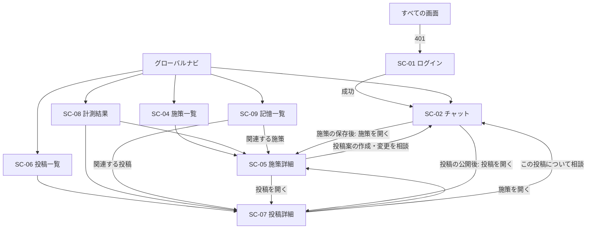

# 画面設計書（v0.5）

対象: hiromeru（AI支援型Xマーケティングシステム）MVP の画面一覧

## 1. 文書の責務

本書は、MVPの画面一覧と、各画面の役割・遷移・使用するAPIを定義する。画面のレイアウトと文言の詳細は、本書の対象外とする。

- 業務フローは`USECASE.md`を正本とする
- APIのRequest、Response、エラーは`API_DESIGN.md`を正本とする
- データ構造は`DATABASE.dbml`を正本とする
- 要件は`REQUIREMENTS.md`を正本とする
- 画面の実装構成（ルーティング、Feature、URL state、画面状態、レスポンシブ）は、`docs/frontend/CODING_STANDARDS.md`に従う
- 本書は、上記を画面の単位に整理したものである。食い違いがある場合は、上記の文書を正とする

## 2. 設計方針

1. **チャット中心にする。** 施策と投稿の作成、Agentの提案を受けた変更、承認は、チャット画面（SC-02）で行う。SC-04からSC-09は、原則として参照用の画面とし、例外は、施策を人が直接書き換えるSC-05の編集だけとする
2. **承認は、フォームの最終承認ボタンで行う。** ボタン押下時のAPI呼び出しが最終承認になる。自由文の同意は承認として扱わない
3. **業務画面には、確定した情報だけを表示する。** 提案中の施策と未公開の投稿案は、チャットの履歴とフォームにだけ存在する。施策一覧と投稿一覧には、承認して保存された施策と、Xへ公開済みの投稿だけを表示する
4. **施策の直接編集は、SC-05で行える。削除の画面は作らない。** Agentに相談して変更する場合はSC-02で提案を受けて承認し、人が自分で書き換える場合はSC-05の編集フォームで保存する。前者は施策のupsert（`API_DESIGN.md`の4.1。Sessionの配下）、後者は施策編集API（同4.2。Sessionに関わらない）を使い、上書きには画面を表示した（または提案を受けた）時点の`updated_at`を使う。公開済みの投稿は、変更も削除もできない
5. **他の会社・他のマーケターの情報は、存在しないものとして扱う。** 該当しないIDを開いた場合は、「見つかりません」を表示する
6. **計測の指標は2つに限る。** X投稿の初週PV数と、応募ページへの流入ユーザー数だけを表示する。いいね数、CTR、CVRなどは表示しない
7. **未認証の場合は、ログイン画面へ移動する**

## 3. 画面一覧

| ID | 画面名 | パス | 目的 | 使用するAPI |
| --- | --- | --- | --- | --- |
| SC-01 | ログイン | `/login` | メールアドレスとパスワードでログインする | `POST /auth/login`、`POST /auth/logout`、`GET /auth/me` |
| SC-02 | チャット | `/chat`、`/chat/new`、`/chat/{session_id}` | 会話一覧から会話を選んで再開する、または新しい会話を始める。親Agentと会話し、施策案・投稿案を編集・再相談・最終承認する | `GET /agent-sessions`、`POST /agent-sessions`、`POST /agent-sessions/{id}/turns`、`GET /agent-sessions/{id}`、`GET /agent-sessions/{id}/turns/{turn_id}`、`POST /agent-sessions/{id}/campaigns`、`POST /agent-sessions/{id}/x/posts` |
| SC-03 | （欠番） | — | SC-02に統合した。旧「会話一覧」（`/sessions`） | — |
| SC-04 | 施策一覧 | `/campaigns` | 承認して保存した施策を一覧・検索する | `GET /campaigns` |
| SC-05 | 施策詳細 | `/campaigns/{campaign_id}` | 施策の内容と、関連する投稿・記憶、投稿ごとの初週PV数を確認する。施策を直接編集する | `GET /campaigns/{campaign_id}`、`PUT /campaigns/{campaign_id}`（施策の編集） |
| SC-06 | 投稿一覧 | `/posts` | 公開済みの投稿を、初週PV数とあわせて一覧・検索する | `GET /posts`、`GET /campaigns`（施策の絞り込みの選択肢） |
| SC-07 | 投稿詳細 | `/posts/{post_id}` | 公開済み投稿の本文、UTM付きURL、計測結果を確認する | `GET /posts/{post_id}` |
| SC-08 | 計測結果 | `/metrics` | 初週PV数と流入ユーザー数を、施策・投稿ごとに比較する | `GET /metrics` |
| SC-09 | 記憶一覧 | `/memories` | 長期記憶を意味検索し、不要な記憶を忘却する | `GET /memories`、`DELETE /memories/{memory_id}` |

- `/`は`/chat`へ移動する
- 会話一覧は、独立した画面にせず、SC-02の一部とする（デスクトップでは会話の横に並べ、モバイルでは`/chat`に一覧だけを表示する）。SC-03は、他の画面の番号を変えないため欠番とする
- APIのパスは、`/api/v1`を前置する
- 参照用のAPI（`GET`）の一覧と共通の扱いは、7章に示す

### 3.1 実装上の対応（Frontend規約）

`docs/frontend/CODING_STANDARDS.md`の4章（`app/`はルーティングと組み立て、`features/`は機能単位）に沿った、画面とFrontendの対応である。Feature名は、利用者が認識する機能を基準にする。

| 画面 | `app/`のルート | Feature | 初期表示の読取 | Clientの操作 |
| --- | --- | --- | --- | --- |
| SC-01 | `app/login/` | `auth` | なし | ログイン、ログアウト |
| SC-02 | `app/chat/`（`layout.tsx`に会話一覧、`page.tsx`が一覧）、`app/chat/new/`、`app/chat/[session_id]/` | `agent` | Server Component（会話一覧の先頭20件、履歴の取得） | 会話一覧の追加読み込み（無限スクロール）、新しい会話の作成、メッセージ送信（SSEの受信）、Turnのポーリング、フォームの編集、承認 |
| SC-04、SC-05 | `app/campaigns/`、`app/campaigns/[campaign_id]/` | `campaigns`（SC-05の編集フォームは`agent`） | Server Component | 検索、絞り込み（URLを更新する）、施策の編集（SC-05。`agent`Featureのフォーム） |
| SC-06、SC-07 | `app/posts/`、`app/posts/[post_id]/` | `posts` | Server Component | 検索、絞り込み（URLを更新する） |
| SC-08 | `app/metrics/` | `metrics` | Server Component | 期間の絞り込み（URLを更新する） |
| SC-09 | `app/memories/` | `memories` | Server Component | 検索、忘却 |

- 業務データの読取は、Server Componentで行う（規約11.1）。Clientの再取得は、Turnの進捗の受信（SSE）と、切断時のTurnのポーリング、施策の選択の検索（6.11）、会話一覧の追加読み込み（6.13）だけとする（規約11.3。Turnは応答が最大200秒かかり、進捗を逐次表示し、応答を受け取れない場合に状態を確認する必要があるため。施策の選択は、入力に応じた候補の表示が必要なため。会話一覧は、スクロールに応じて続きを読み込む必要があるため）
- Feature間の直接参照は原則禁止のため（規約4.4）、複数のFeatureにまたがる画面は`app/`で組み立てる。該当する箇所は、SC-05の編集フォーム（下記）である
- `app/`の`loading.tsx`、`error.tsx`、`not-found.tsx`で、6.8の画面状態を共通に扱う
- 施策のフォーム（項目の入力部品と検証Schema）は、SC-02の提案フォームとSC-05の編集フォームで共通のため、まとめて`agent`Featureに置く。`campaigns`Featureには置かない（重複や`shared`への切り出しは行わない）。`app/campaigns/[campaign_id]/`が、`campaigns`Featureの表示と、`agent`Featureが公開する編集フォームを組み合わせる。投稿フォームも、`agent`Featureに置く
- `app/chat/layout.tsx`が会話一覧を描画し、`page.tsx`、`new/page.tsx`、`[session_id]/page.tsx`をその子とする。一覧と会話は同じFeature（`agent`）に含まれる

## 4. 画面遷移

## 5. 画面の概要

### SC-01 ログイン
- 入力: メールアドレス、パスワード
- ログイン済み（`GET /auth/me`が`200`）の場合は、ログイン画面を表示せず、SC-02へ移動する
- 成功時は、認証Cookieと`csrf_token`を受け取り、元のURL（なければSC-02）へ移動する。`csrf_token`は、以降の状態変更APIの`X-CSRF-Token` Headerへ設定する
- `INVALID_CREDENTIALS`（401）: メールアドレスの登録有無を判別できない、同じ文言で表示する
- `429`（試行回数の超過）: 「しばらくしてから再試行してください」と表示する
- ユーザー登録、パスワード再設定の画面は設けない（マーケターは事前登録する）

### SC-02 チャット
親Agentとの会話と、提案の編集・承認を行う中心の画面である。

**構成**
- 会話エリア: Turnの`user_message`、`assistant_message`、提案フォーム、承認結果（`api_result`）を、時系列に表示する
- 入力欄: メッセージ（上限あり）の入力と送信
- 会話一覧: `/chat`の本体であり、`/chat/new`と`/chat/{session_id}`では画面の左に表示する（`GET /agent-sessions`）。最終更新の新しい順に、無限スクロールで表示する（先頭の20件はServer Componentで取得し、末尾までスクロールしたら次の20件を`next_cursor`で読み込む。6.13）。表示は、会話のタイトルと最終更新日時とする
- 画面ごとの表示: デスクトップでは、`/chat`は左に一覧、右に新しい会話の入力欄を表示する。モバイルでは、`/chat`は一覧と「新しい会話」だけを表示し、`/chat/new`と`/chat/{session_id}`は会話だけを表示して「一覧へ戻る」を出す（6.9）
- 会話のタイトルは、最初のメッセージの先頭部分から自動で付く。タイトルがない会話（作成されたが、メッセージがまだない会話）は、「無題の会話」と表示する。アーカイブと削除の操作は設けない
- 会話がない場合は、一覧に「まだ会話がありません。マーケティングの依頼から始めましょう」と表示する

**送信の流れ**
1. 新しい会話（`/chat`のデスクトップ表示、または`/chat/new`）で最初に送信するとき、`POST /agent-sessions`でSessionを作成してから、`POST .../turns`で送信する。送信が始まったら、`/chat/{session_id}`へ移動する
2. `Accept: text/event-stream`で送信し、Turnが終わるまで待つ（最大200秒）。待つ間は「実行中」と、届いた進捗（`activity_started`／`activity_finished`。例:「施策を立案中」）を表示し、送信ボタンを無効にする。`turn_finished`のTurnを受け取ったら次へ進む
3. 完了したTurnの`items`を表示する。ストリームが`turn_finished`の前に切れたときは、`turn_started`の`agent_turn_id`で`GET .../turns/{turn_id}`（5.4）をポーリングして結果を確認する。`agent_turn_id`を受け取る前に切れたときは、履歴（5.6）を再取得する
4. 提案（`campaign_proposal`、`x_post_proposal`）はフォームとして表示する

**提案フォーム**（`USECASE.md`の4章）
- 施策フォーム: タイトル、ターゲット像、実施背景、施策目的、施策内容。既存施策の変更案では、提案時点の`updated_at`をフォームに保持する（`expected_updated_at`）
- 投稿フォーム: 対象施策（Agentの提案値を初期値とし、アーカイブされていない施策から検索して選び直せる。6.11）、投稿本文、遷移先URL
- 3つの操作: 「手書き修正」（画面上だけで編集。履歴へ保存しない）、「Agentと再相談」（現在の値と指示を新しいメッセージとして送信）、「最終承認」

**最終承認**
- 承認操作ごとに`Idempotency-Key`（UUID）を生成する。二重クリックや通信の再試行では同じキーを使い、新しい承認操作でだけ新しいキーにする
- X投稿と、既存施策の上書きでは、確認ダイアログを表示する（X投稿は「Xに公開される」ことを明記する）
- 結果は、同じ会話の`api_result`として表示する。成功時は、SC-05またはSC-07への導線を出す

**セキュリティ通知**
- Turnの`security_notices`があるとき、そのTurnの下に通知を表示する。一覧画面は設けず、チャットの中で伝える。Turnが`blocked`や`failed`の場合も表示する
- 文言は、次の2つを続けて表示する。検出した内容そのもの（注入された指示、機密値など）は表示しない

  | `event_type` | 種別の文言 |
  | --- | --- |
  | `prompt_injection` | 外部の情報に、AIへの不正な指示が含まれている可能性を検出しました |
  | `sensitive_data` | 機密情報が含まれている可能性を検出しました |
  | `unauthorized_tool_call` | 許可されていない操作を検出しました |
  | `unsafe_external_action` | 外部への安全でない操作を検出しました |

  | `enforcement` | 制御の文言 |
  | --- | --- |
  | `blocked` | 該当の処理は実行していません |
  | `sanitized` | 該当の内容は、安全な内容に置き換えて処理しました |
  | `observed` | 処理は続行しました |

- 同じ種別と制御の通知が複数ある場合は、1つにまとめて件数を添える。`blocked`は`role="alert"`、それ以外は`role="status"`で、支援技術へ通知する（規約19章）
- 詳しい状況は、ユーザーがチャットでAgentに尋ねられる（次のTurnで、Agentが種別と制御内容の範囲で説明する。`AGENT_DESIGN.md`の「セキュリティ通知」）

**状態とエラー**（詳細は6.3）
- 実行中のTurnがある間は、送信を受け付けない（`TURN_IN_PROGRESS`）
- Turnが失敗（上限超過、Guardrailによるブロック、中断など）した場合は、理由を表示し、ユーザーが同じ依頼を再送できるようにする。Agentは自動で再実行しない
- Responseを受け取れなかった場合は、同じメッセージを再送せず、履歴（`GET /agent-sessions/{id}`）で最新のTurnを確認する。実行中なら`GET .../turns/{turn_id}`で終了を待つ
- `AGENT_SESSION_NOT_FOUND`（承認APIで会話が見つからない）: 利用できる会話を選ぶか新しく作成し、マスク済みのエラーを新しいメッセージとして送信する

### SC-03（欠番）
SC-02に統合した。会話一覧の表示と操作は、SC-02の「構成」に示す。

### SC-04 施策一覧
- 表示: 承認して保存した施策のタイトル、施策目的、作成日時、更新日時、投稿数と計測の集計（計測済み・計測待ち・失敗の件数、PV数・流入ユーザー数の合計、流入率（6.12））
- 操作: 検索（キーワードによる意味検索、ID指定）、行を選んでSC-05へ
- 提案中の施策（未承認）は表示しない。「新しい施策を作る」は、SC-02へ移動する導線とする

### SC-05 施策詳細
- 表示: タイトル、ターゲット像、実施背景、施策目的、施策内容、作成日時、更新日時
- 計測の集計: この施策の公開済み投稿すべての、X投稿PV数の合計と流入ユーザー数の合計、流入率（6.12。施策の効果の目安）、計測の状況（計測済み・計測待ち・失敗の件数）。投稿が20件を超えても、すべてを集計する（`metrics_summary`）
- 関連: この施策に紐づく公開済みの投稿（新しい順に最大20件。SC-07へ。それ以上は、施策で絞り込んだSC-06へ）、関連する記憶（最大20件）
- 投稿ごとの初週PV数: 投稿の一覧の各行に、投稿本文（抜粋）、公開日時、初週PV数のバーを表示する（6.10）。施策の中で、どの投稿がPVを集めたかを比較できるようにする。バーの基準は、表示する投稿（最大20件）の最大値とする

- 操作: 「この施策で投稿案を作る」「この施策の変更を相談する」（SC-02へ。施策IDを引用した入力の初期文を設定する）、「編集」（下記）
- 削除の操作は設けない（`REQUIREMENTS.md`のスコープ外）

**編集**
- 「編集」で、タイトル、ターゲット像、実施背景、施策目的、施策内容の5項目を、フォームとして編集できる。Agentは経由しない。フォームは、SC-02の施策フォームと同じ項目とし、同じ部品と検証Schemaを使う（`agent`Featureに置く。3.1）
- 保存は、施策編集API（`API_DESIGN.md`の4.2。`PUT /campaigns/{campaign_id}`）で行う。`expected_updated_at`にSC-05を取得した時点の`updated_at`を、加工せずに設定する。5項目すべてを送る（部分更新はしない）。Sessionに関わらないAPIで、`Idempotency-Key`は使わない
- 保存の前に、確認ダイアログ（「既存の内容を置き換えます」）を表示する
- 保存は、Agent履歴に残らず、会話一覧にも影響しない（構造化ログだけに記録する）
- 保存に成功したら、編集フォームを閉じ、最新の施策を再取得して表示する（`router.refresh()`）
- 保存のResponseを受け取れなかった場合は、施策を再取得し、内容が入力した内容と一致していれば、保存済みとして扱う（成功したRequestの再送は`409 CAMPAIGN_CONFLICT`になるため。`API_DESIGN.md`の4.2）
- `409 CAMPAIGN_CONFLICT`（表示後に、別のSessionまたはマーケターが更新した）の場合は、入力した内容をフォームに残したまま、「他の操作で更新されました」と表示する。「最新の内容を読み込む」で最新の施策を再取得し、入力した内容と見比べて、最新の`updated_at`で、もう一度保存できるようにする
- 未保存の編集がある状態で、別の画面へ移動する場合は、離脱の前に警告する（規約19章）

### SC-06 投稿一覧
- 表示: Xへ公開済みの投稿だけを表示する。投稿本文（抜粋）、対象施策、公開日時、計測の状態（待機中、完了、失敗）、初週PV数のバー（6.10）。バーの基準は、表示している1ページ（最大20件。意味検索では上位の件）の最大値とし、ページや条件を変えると基準も変わる。異なるページのバーの長さは比較できない
- 操作: 施策・期間による絞り込み、検索（キーワードによる意味検索）、並び替え、行を選んでSC-07へ
- 並び替え: 公開日時（新しい順・古い順）、初週PV数（多い順・少ない順）から選ぶ。既定は公開日時の新しい順とする。初週PV数で並べ替えると、計測待ち・失敗の投稿（PV数がない）は、昇順・降順のどちらでも末尾に並ぶ。検索語を入力している間は、意味検索が類似度順のため、並び替えを選べない
- 施策の絞り込みは、施策を検索して選べる選択式とする（6.11）。直近の施策を最初に表示し、それ以前の施策は検索で選ぶ。SC-05からは、施策で絞り込んで開く（`/posts?campaign_id=...`）
- 未公開の投稿案、処理中・結果不明の投稿Requestは表示しない

### SC-07 投稿詳細
- 表示: 投稿本文、X投稿ID（X上の投稿へのリンク）、公開日時、対象施策（SC-05へ）
- UTM: 遷移先URL、UTM付きURL、各UTMパラメータ
- 計測: 計測の状態、計測予定日時（公開の7日後）、X投稿PV数、流入ユーザー数、計測日時。失敗した場合は「計測に失敗しました」と表示する
- 操作: 「この投稿について相談する」（SC-02へ）。編集と削除の操作は設けない

### SC-08 計測結果
- サマリー: 計測が完了した投稿の件数、X投稿PV数の合計、流入ユーザー数の合計、全体の流入率（6.12）
- 施策ごとの比較: 施策ごとのPV数、流入ユーザー数、流入率を、表とグラフで比較する。施策の効果は、流入率で比べる。行を選ぶとSC-05（施策）またはSC-06（その施策で絞り込んだ投稿）へ移動する
- 状況: 計測待ちの件数、失敗した件数。失敗の理由は表示しない（MVPでは、`failed`の状態だけを扱う）
- 2つの指標と、そこから算出する流入率以外（いいね数、CTR、CVRなど）は表示しない

### SC-09 記憶一覧
- 表示: 記憶の内容、関連する施策・投稿（SC-05・SC-07へ）
- 操作: 検索（キーワードによる意味検索）、忘却（確認ダイアログの後に削除する）
- 忘却は、Sessionに関わらないAPI（`API_DESIGN.md`の7.1。`DELETE /memories/{memory_id}`）で実行する。Agent履歴には残らない（構造化ログだけに記録し、記憶の内容は残さない）。Responseを受け取れなかった場合や`404 MEMORY_NOT_FOUND`（すでに削除済み）を受けた場合は、一覧を再取得し、削除済みとして扱う
- 記憶の追加は、チャットで「覚えておいて」と依頼する。この画面には追加の操作を設けない
- 忘却した記憶は、新しい会話からは参照されない。忘却前の会話の履歴には、記憶の内容が残る場合があり、その会話の中では引き続き参照される可能性がある。履歴からの除去は、MVPでは扱わない（`API_DESIGN.md`の7.1）
- 記憶の作成日時と種別は、`DATABASE.dbml`にないため、MVPでは表示しない（日付順の並びと種別の絞り込みも設けない）

## 6. 共通仕様

### 6.1 グローバルナビ
ログイン後の全画面に表示する。項目は、チャット（会話一覧を含む）、施策、投稿、計測結果、記憶、ログアウトとする。ログイン中のメールアドレスは、`GET /auth/me`で取得して表示する（Server Componentで取得し、画面の再読み込み後も表示する）。

### 6.2 認証とCSRF
- 認証は、署名付きCookieで行う。`401 UNAUTHENTICATED`を受けた場合は、SC-01へ移動する（ログイン後は元のURLへ戻る）
- 状態変更API（POST・PATCH・DELETE）には、`X-CSRF-Token` Headerを付ける。`403 CSRF_VALIDATION_FAILED`は、再ログインを促す
- Server Componentの読取で`401`を受けた場合も、SC-01へ移動する（`redirect`で現在のURLを引き継ぐ）
- ログアウトは、Cookieを削除する

### 6.3 エラーの表示
| 状況 | HTTP / Code | 表示と操作 |
| --- | --- | --- |
| 未認証 | `401 UNAUTHENTICATED` | ログイン画面へ移動する |
| ログインの試行超過 | `429`（WAF） | 「しばらくしてから再試行してください」 |
| 他の会社・他のマーケターのID、または存在しないID | `404` | 「見つかりません」を表示し、一覧へ戻る導線を出す |
| Turnが実行中 | `409 TURN_IN_PROGRESS` | 前のTurnの完了を待って再送を促す。送信ボタンは実行中は無効にする |
| Turnの上限超過、ブロック、実行失敗 | `422` / `504` / `500`（`TURN_*`、`CONTEXT_COMPACTION_FAILED`、`AGENT_EXECUTION_FAILED`） | 理由を表示し、ユーザーが同じ依頼を再送できるようにする |
| Turnの中断 | `TURN_INTERRUPTED` | 「処理が中断されました。もう一度送信してください」 |
| Responseを受け取れない（通信断、本文のない`504`） | — | 同じメッセージを再送せず、履歴で最新のTurnを確認する |
| 承認の処理中 | `409 IDEMPOTENCY_REQUEST_IN_PROGRESS` | `Retry-After`の後に、同じキーで再送する |
| 承認の入力内容が不正 | `422 INVALID_X_POST` など | 内容を修正して、新しい承認操作（新しいキー）を行う |
| 施策の競合 | `409 CAMPAIGN_CONFLICT` | SC-02では、最新の施策を確認し、チャットで再提案を受ける。SC-05の編集では、入力を残したまま最新の内容を読み込み、再度保存できるようにする |
| X投稿の結果が不明 | `504 X_POST_OUTCOME_UNKNOWN` | 「投稿の結果を確認できません。自動では再投稿されません」と表示する。手動の照合は運用で行う（画面なし） |
| X投稿は成功したがDB保存に失敗 | `500 X_POST_SAVE_FAILED` | 「Xへは投稿済みです」と表示し、同じキーで保存を再試行する。新しいキーでは再送しない |
| 同じ内容の投稿が未解決 | `409 X_POST_UNRESOLVED` | 未解決の投稿があるため、新しい投稿を受け付けないことを表示する |

### 6.4 確認ダイアログが必須の操作
- X投稿の最終承認（Xに公開される。公開後は変更・削除できない）
- 既存施策の上書きの最終承認（既存の内容を置き換える）と、SC-05の施策の編集の保存
- 記憶の忘却（元に戻せない）

### 6.5 待機と再読み込み
- Turnの実行中は、最大200秒待つ。待つ間は、SSEで届くTool・サブエージェントの呼び出しの進捗を表示する（`API_DESIGN.md`の5.3）。Toolの引数や結果は届かないため表示しない。Tool名は画面用の表示名へ変換し、未知の名前は「処理中」とする
- SSEは`fetch`のストリーム読み取りで受信する（`EventSource`はGETだけでCSRFヘッダーを付けられないため使わない）
- 進捗は再接続では再送されない。切断時は5.4のポーリングで結果を確認する
- 画面を開き直した場合は、会話の履歴を取得して表示する。実行中のTurnがあれば、終了を待つ

### 6.6 履歴の表示範囲
チャットには、会話（`user_message`、`assistant_message`）、提案、承認の結果だけを表示する。Toolの呼び出しと結果、Webの取得内容、隔離された内容は表示しない（`API_DESIGN.md`の5.1）。

### 6.7 URL state（Frontend規約9.4）
再読み込み、共有、ブラウザの戻る操作で復元したい状態は、URLに保持する。Secret、個人情報、未確定のフォーム入力は、URLに保持しない。

| 画面 | パス | Search Params | 備考 |
| --- | --- | --- | --- |
| SC-02 | `/chat`、`/chat/new`、`/chat/{session_id}` | なし | `/chat`は会話一覧。`/chat/new`は新しい会話。会話はPathで指定する。会話一覧は無限スクロール（6.13）のため、`cursor`はURLに持たない |
| SC-04 | `/campaigns` | `query`、`created_from`、`created_to`、`cursor` | |
| SC-05 | `/campaigns/{campaign_id}` | なし | |
| SC-06 | `/posts` | `query`、`campaign_id`、`published_from`、`published_to`、`sort`、`order`、`cursor` | |
| SC-07 | `/posts/{post_id}` | なし | |
| SC-08 | `/metrics` | `published_from`、`published_to` | |
| SC-09 | `/memories` | `query`、`cursor` | |

- Path ParamsとSearch Paramsは、使用する前に検証する。不正な値は、無視して既定の値（絞り込みなし、先頭のページ）に戻し、APIへ送らない（`400 INVALID_ARGUMENT`を画面に出さない）。Path Paramsの`session_id`などが正の整数でない場合は、`404`の画面とする
- SC-02の会話一覧を除く一覧のページングは、`cursor`をURLに持つ「次のページ」リンクにする。`cursor`は前へ戻れない（`API_DESIGN.md`の5.5）ため、ブラウザの戻る操作と「先頭へ」で戻る。意味検索（`query`あり）は、上位の件だけを返し、ページングしない
- 検索・絞り込みの確定は、`router.push`でURLを更新する。`cursor`は、条件を変えたときに取り除く
- SC-06の並び替えは、`sort`（`published_at`または`x_pv_count`）と`order`（`asc`または`desc`）をURLに持つ。並び替えを変えたときは、`cursor`を取り除く。`query`があるときは、`sort`と`order`を取り除く
- SC-02の過去の履歴（`before_turn_number`）は、URLに保持しない（Clientの状態とする）

### 6.8 画面の状態（Frontend規約18章）
Server dataを表示するすべての画面は、次の状態を扱う。

| 状態 | 表示 |
| --- | --- |
| 読み込み中（初期） | `loading.tsx`と、Suspenseによる部分表示 |
| 更新中（絞り込み・検索の変更） | 前の結果を残したまま、更新中であることを示す |
| 空 | 下の表の文言と、次に取れる操作 |
| 成功 | 通常の表示 |
| 回復できるエラー | `500 EMBEDDING_FAILED`、`500 INTERNAL_ERROR`。「もう一度試す」を出す。検索では、条件を保持したまま再実行できる |
| 回復できないエラー | `404`は「見つかりません」と一覧への導線、`401`はSC-01への移動 |

| 画面 | 空の状態 |
| --- | --- |
| SC-02（会話一覧） | 「まだ会話がありません。マーケティングの依頼から始めましょう」＋「新しい会話を始める」 |
| SC-04 | 「まだ施策がありません。チャットで施策を相談しましょう」＋SC-02への導線 |
| SC-06 | 「公開済みの投稿がありません」＋SC-02への導線。絞り込み中は「条件に合う投稿がありません」＋「条件をクリア」 |
| SC-08 | 「集計できる投稿がありません」。計測待ちだけの場合は、計測待ちの件数を示す |
| SC-09 | 「まだ記憶がありません。チャットで『覚えておいて』と依頼できます」 |

- エラー表示では、Backendの内部情報を出さない。表示の分岐は、メッセージ文字列ではなく、エラーコードで行う（規約16章）
- 計測の状態（待機中、完了、失敗）は、色だけでなく、文言またはアイコンでも示す

### 6.9 レスポンシブとアクセシビリティ
- Breakpointは、規約13.6の`mobile`（40rem）、`tablet`（64rem）、`desktop`（80rem）とし、モバイルを基準にする
- グローバルナビは、デスクトップでは常に表示し、モバイルではメニューとして開閉する
- SC-02は、デスクトップでは左に会話一覧、右に会話（または新しい会話の入力欄）を並べる。モバイルでは、`/chat`は一覧だけ、`/chat/new`と`/chat/{session_id}`は会話だけを表示し、会話から一覧へ戻る導線を出す
- 各画面に、本文へ移動するSkip linkと、`h1`から始まる見出しの階層を設ける
- 主要な操作は、キーボードだけで完了できる。確認ダイアログを閉じたときは、開いたボタンへフォーカスを戻す
- SC-02の提案フォームに未確定の手書き修正がある状態、またはSC-05の編集フォームに未保存の編集がある状態で、別の画面や会話へ移動する場合は、離脱の前に警告する（規約19章）
- 非同期の更新（Turnの実行中、承認の処理中、検索）は、`aria-live="polite"`で通知する
- 画面のデザインは、実装の前にDesign plan（規約13.1）を作成して決める。本書は、レイアウトと文言の詳細を対象外とする

### 6.10 初週PV数のバー
SC-05（施策詳細）とSC-06（投稿一覧）の投稿の行に表示する。

- 表示している投稿の中で、`x_pv_count`の最大値を100%として、各行のバーの長さを決める。基準は0とし、値は必ず数字でも表示する（バーだけにしない）
- 計測の状態（`metrics.status`）に応じて、次のように表示する

  | 状態 | 表示 |
  | --- | --- |
  | `completed` | バーと、初週PV数（数字）。あわせて流入ユーザー数を数字で表示する |
  | `pending` | バーは出さず、「計測待ち」と計測予定日（`scheduled_at`）を表示する |
  | `failed` | バーは出さず、「計測に失敗しました」を表示する |

- PV数がすべて0、または計測済みの投稿がない場合は、バーの代わりに「計測できた投稿がまだありません」を表示する
- バーは、ライブラリを使わず、CSSの幅で描く。色だけで意味を伝えず、数字と状態のテキストを併記する。バーは補助の表示として、支援技術には数字のテキストを読み上げる（規約19章）
- 表示するのは、初週PV数と流入ユーザー数の2つの指標だけとする。追加のAPIは不要で、SC-05は`GET /campaigns/{campaign_id}`の`posts[].metrics`（6.3）、SC-06は`GET /posts`の`metrics`（6.4）を使う

### 6.11 施策の選択（検索付き）
SC-06の施策の絞り込みと、SC-02の投稿フォームの対象施策で使う。

- 最初は`GET /campaigns?limit=20`で、直近20件を選択肢に出す。入力があれば、`GET /campaigns?query=...&limit=20`（意味検索。`API_DESIGN.md`の6.2）の結果に切り替える。入力が止まってから300ミリ秒後に取得し、前の取得が終わっていなければ破棄する
- 選べるのは、アーカイブされていない施策だけとする（`GET /campaigns`は`archived_at`がNULLの施策だけを返す。6.2）
- 入力に応じた候補の取得は、Clientの再取得とする（規約11.3の例外。入力のたびにURLを更新してサーバーで再描画すると、候補の表示が遅れるため）。選択の確定は、SC-06ではURLの`campaign_id`を更新し、投稿フォームでは`campaign_id`をフォームの値に設定する
- SC-06で選択中の施策のタイトルは、Server Componentが`GET /campaigns/{campaign_id}`で取得して表示する（直近20件にない施策でも表示できるようにする）
- 検索に失敗した場合（`500 EMBEDDING_FAILED`）は、直近20件の選択肢に戻し、「もう一度検索」を出す。候補が0件の場合は、「該当する施策がありません」を表示する
- キーボードだけで操作できるコンボボックスとし、候補の件数と選択の状態を`aria-live="polite"`で通知する（規約19章）

### 6.12 流入率
施策の効果の目安として、SC-04、SC-05、SC-08に表示する（`API_DESIGN.md`の6.1の`landing_rate`）。

- 流入率 = 流入ユーザー数の合計 ÷ X投稿PV数の合計。計測済み（`completed`）の投稿だけで集計する。計測待ち・失敗の投稿は含めない
- 表示は百分率（小数点以下1桁。例: 3.8%）とする。`landing_rate`が`null`（PV数の合計が0、または計測済みの投稿がない）の場合は、「—」と「計測済みの投稿がありません」などの理由を表示する
- 計測待ちの投稿がある間は、今後の計測で値が変わるため、「計測待ちN件を含まない」を併記する
- 流入率は、新しい指標ではなく、2つの指標（X投稿の初週PV数、応募ページへの流入ユーザー数）から算出する表示上の値とする。投稿ごとの流入率は表示せず、施策と全体の集計だけに表示する。いいね数、CTR、CVRなど、他の指標は追加しない

### 6.13 会話一覧の無限スクロール
SC-02の会話一覧（`/chat`、および`/chat/new`と`/chat/{session_id}`の左の一覧。`GET /agent-sessions`。`API_DESIGN.md`の5.5）で使う。

- 先頭の20件は、Server Componentが取得して描画する。一覧の末尾へスクロールしたら、`next_cursor`で次の20件を、Clientから取得して末尾へ追加する（Clientの再取得。規約11.3の例外。スクロールのたびにURLを更新してサーバーで再描画すると、表示が途切れるため）。`next_cursor`が`null`になったら、読み込みを止める
- `cursor`はURLに持たない。再読み込みやブラウザの戻る操作では、先頭の20件から表示し直す
- 読み込み中は、一覧の末尾に読み込み中の表示を出し、`aria-live="polite"`で通知する。同じ`cursor`の取得を二重に開始しない
- 追加の読み込みに失敗した場合は、すでに表示した会話を残し、末尾に「もう一度読み込む」を出す。`401`はSC-01へ移動する（6.2）
- スクロールだけに頼らず、末尾に「さらに読み込む」ボタンを置き、キーボードだけでも続きを読み込めるようにする（規約19章）
- 表示している間に、会話が更新されて順序が変わる場合がある（最終更新の順のため）。追加で読み込んだ会話が、すでに表示している会話と重複した場合は、`session_id`で除いて、表示済みの行を残す。一覧の再取得は、新しい会話の作成、メッセージ送信、Turnの完了のたびに、先頭の20件を取り直して置き換える（追加で読み込んだ分は、いったん閉じる）

## 7. 参照用のAPI

画面が使用する参照用のAPI（`API_DESIGN.md`の6章）と、記憶の削除API（同7章）、SC-05の施策の編集で使う施策編集API（同4.2）を示す。

| API | 画面 | 内容 | 定義 |
| --- | --- | --- | --- |
| `GET /campaigns` | SC-04、SC-06 | 施策の一覧、キーワードによる意味検索、作成日時による絞り込み。計測の集計を含む | 6.2 |
| `GET /campaigns/{campaign_id}` | SC-05 | 施策の内容、紐づく投稿・記憶、計測の集計 | 6.3 |
| `GET /posts` | SC-06 | 公開済み投稿の一覧、キーワードによる意味検索、施策・公開日時による絞り込み、公開日時・初週PV数による並び替え。計測の状態と値を含む | 6.4 |
| `GET /posts/{post_id}` | SC-07 | 公開済み投稿の内容、対象施策、UTM、計測結果 | 6.5 |
| `GET /metrics` | SC-08 | 全体のサマリーと施策ごとの集計（公開日時による期間の絞り込み） | 6.6 |
| `GET /memories` | SC-09 | 記憶の一覧、キーワードによる意味検索、関連する施策・投稿 | 6.7 |
| `DELETE /memories/{memory_id}` | SC-09 | 記憶の削除（Sessionに関わらない。`Idempotency-Key`不要） | 7.1 |
| `PUT /campaigns/{campaign_id}` | SC-05 | 施策の直接編集（上書き。`expected_updated_at`必須。Sessionに関わらない。`Idempotency-Key`不要） | 4.2 |

- 参照用のAPI（GET）は、読み取り専用とし、Agent履歴へ保存しない。CSRF対策と`Idempotency-Key`は使用しない
- 認証は、署名付きCookieで行う。他社のIDと存在しないIDは、いずれも`404`とする
- 一覧は、`query`を省略すると新しい順（`cursor`で20件ずつ）、指定すると意味検索（類似度の高い上位の件だけ。ページングなし）になる。意味検索のEmbedding生成に失敗した場合は`500 EMBEDDING_FAILED`となるため、UIは検索の再実行を促す
- 公開済み投稿は、成功した`publish_x_post`のRequestに紐づくPostだけを返す（`REQUIREMENTS.md`の3.2）
- 記憶の削除と、SC-05の施策の編集は、状態変更APIとして、CSRF対策と確認ダイアログを必須とする。`Idempotency-Key`は使わない。Responseを受け取れなかった場合は、再取得して結果を確認する（成功したRequestの再送は、施策の編集で`409 CAMPAIGN_CONFLICT`、記憶の削除で`404 MEMORY_NOT_FOUND`になる）

## 8. MVPで作らない画面

| 画面・機能 | 理由 |
| --- | --- |
| コスト、実行履歴、セキュリティイベントの一覧画面 | 専用の画面は必須ではない。完全な履歴は、DBとログで確認する（`API_DESIGN.md`の5.1）。将来の拡張とする。セキュリティイベントは、チャットの通知で伝える（SC-02） |
| ユーザー登録、パスワード再設定、ユーザー管理 | マーケターは事前登録する（`API_DESIGN.md`の2.9） |
| 施策の削除・アーカイブ、投稿の編集・削除・アーカイブの操作 | 施策の編集は、SC-05で行える。削除はMVPの対象外で、公開済みの投稿は変更も削除もできない（`REQUIREMENTS.md`のスコープ外） |
| 未公開の投稿案の一覧 | 未公開案は、履歴とフォームにだけ存在する |
| 投稿の予約、スケジュール投稿 | 対象外。投稿は、明示的な承認操作でだけ実行する |
| X投稿の結果不明の手動照合 | 運用の作業とし、画面は設けない |
| 画像、X以外のSNS、いいね数などの指標 | 対象外（`REQUIREMENTS.md`のスコープ外） |

## 9. 要件・ユースケースとの対応

| 要件・ユースケース | 画面 |
| --- | --- |
| `REQUIREMENTS.md` 2.1 親エージェント、2.5 会話とAgent Turnの実行 | SC-02 |
| 2.4 施策案・投稿案の共通レビュー、`USECASE.md` 4章 | SC-02 |
| `USECASE.md` UC-01 施策を作成・更新する | SC-02（提案・承認）、SC-04、SC-05（確認、直接編集） |
| `USECASE.md` UC-02 X投稿内容を作成・公開する | SC-02（提案・承認）、SC-06、SC-07（確認） |
| 3.1 施策関連情報の管理 | SC-04、SC-05 |
| 3.2 公開済み投稿コンテンツの管理、6 UTM生成 | SC-06、SC-07 |
| 3.3 マーケティング指標の保存、7 施策評価、5 GA4連携 | SC-07、SC-08 |
| 8 記憶管理 | SC-09、SC-02（記憶の保存を依頼） |
| NFR-SEC-007 認証とセッションを保護する | SC-01、6.2 |
| NFR-REL-008 承認APIを冪等にする、NFR-REL-009 中断されたAgent Turnを復旧する | SC-02、6.3 |
| Frontend規約 4章 ディレクトリ構成、11章 サーバー通信 | 3.1 |
| Frontend規約 9.4 URL state | 6.7 |
| Frontend規約 18章 Errorと画面状態 | 6.3、6.8 |
| Frontend規約 13.6 Breakpoint、19章 Accessibility | 6.9 |
