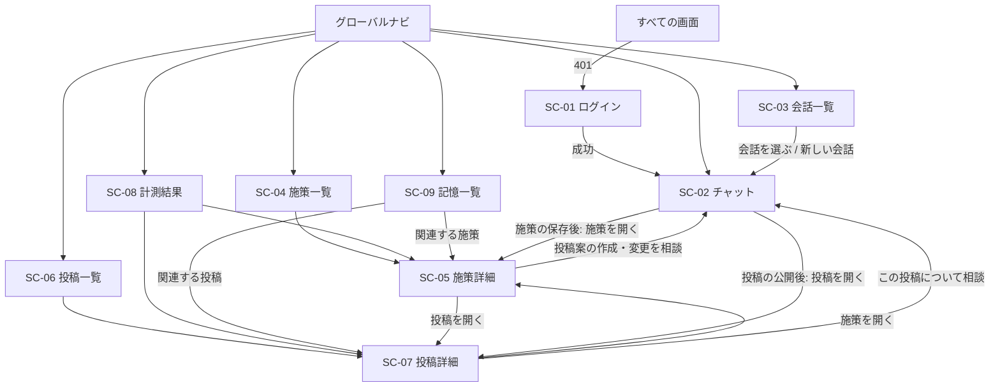

# 画面設計書（v0.4）

対象: hiromeru（AI支援型Xマーケティングシステム）MVP の画面一覧

## 1. 文書の責務

本書は、MVPの画面一覧と、各画面の役割・遷移・使用するAPIを定義する。画面のレイアウトと文言の詳細は、本書の対象外とする。

- 業務フローは`USECASE.md`を正本とする
- APIのRequest、Response、エラーは`API_DESIGN.md`を正本とする
- データ構造は`DATABASE.dbml`を正本とする
- 要件は`REQUIREMENTS.md`を正本とする
- 画面の実装構成（ルーティング、Feature、URL state、画面状態、レスポンシブ）は、`docs/frontend/CODING_STANDARDS.md`に従う
- 本書は、上記を画面の単位に整理したものである。食い違いがある場合は、上記の文書を正とする

## 2. 設計方針

1. **チャット中心にする。** 施策と投稿の作成・変更・承認は、すべてチャット画面（SC-02）で行う。SC-04からSC-09は、参照用の画面とする
2. **承認は、フォームの最終承認ボタンで行う。** ボタン押下時のAPI呼び出しが最終承認になる。自由文の同意は承認として扱わない
3. **業務画面には、確定した情報だけを表示する。** 提案中の施策と未公開の投稿案は、チャットの履歴とフォームにだけ存在する。施策一覧と投稿一覧には、承認して保存された施策と、Xへ公開済みの投稿だけを表示する
4. **直接編集と削除の画面を作らない。** 施策の変更は、チャットで提案を受けて承認する（上書きには提案時点の`updated_at`を使う）。公開済みの投稿は、変更も削除もできない
5. **他の会社・他のマーケターの情報は、存在しないものとして扱う。** 該当しないIDを開いた場合は、「見つかりません」を表示する
6. **計測の指標は2つに限る。** X投稿の初週PV数と、応募ページへの流入ユーザー数だけを表示する。いいね数、CTR、CVRなどは表示しない
7. **未認証の場合は、ログイン画面へ移動する**

## 3. 画面一覧

| ID | 画面名 | パス | 目的 | 使用するAPI |
| --- | --- | --- | --- | --- |
| SC-01 | ログイン | `/login` | メールアドレスとパスワードでログインする | `POST /auth/login`、`POST /auth/logout` |
| SC-02 | チャット | `/chat`、`/chat/{session_id}` | 親Agentと会話し、施策案・投稿案を編集・再相談・最終承認する | `POST /agent-sessions`、`POST /agent-sessions/{id}/turns`、`GET /agent-sessions/{id}`、`GET /agent-sessions/{id}/turns/{turn_id}`、`POST /agent-sessions/{id}/campaigns`、`POST /agent-sessions/{id}/x/posts` |
| SC-03 | 会話一覧 | `/sessions` | 過去の会話を選んで再開する。新しい会話を始める | `GET /agent-sessions` |
| SC-04 | 施策一覧 | `/campaigns` | 承認して保存した施策を一覧・検索する | `GET /campaigns` |
| SC-05 | 施策詳細 | `/campaigns/{campaign_id}` | 施策の内容と、関連する投稿・記憶を確認する | `GET /campaigns/{campaign_id}` |
| SC-06 | 投稿一覧 | `/posts` | 公開済みの投稿を一覧・検索する | `GET /posts`、`GET /campaigns`（施策の絞り込みの選択肢） |
| SC-07 | 投稿詳細 | `/posts/{post_id}` | 公開済み投稿の本文、UTM付きURL、計測結果を確認する | `GET /posts/{post_id}` |
| SC-08 | 計測結果 | `/metrics` | 初週PV数と流入ユーザー数を、施策・投稿ごとに比較する | `GET /metrics` |
| SC-09 | 記憶一覧 | `/memories` | 長期記憶を意味検索し、不要な記憶を忘却する | `GET /memories`、`DELETE /agent-sessions/{id}/memories/{memory_id}`、`GET /agent-sessions`、`POST /agent-sessions`（忘却の保存先Sessionの選択） |

- `/`は`/chat`へ移動する
- APIのパスは、`/api/v1`を前置する
- 参照用のAPI（`GET`）の一覧と共通の扱いは、7章に示す

### 3.1 実装上の対応（Frontend規約）

`docs/frontend/CODING_STANDARDS.md`の4章（`app/`はルーティングと組み立て、`features/`は機能単位）に沿った、画面とFrontendの対応である。Feature名は、利用者が認識する機能を基準にする。

| 画面 | `app/`のルート | Feature | 初期表示の読取 | Clientの操作 |
| --- | --- | --- | --- | --- |
| SC-01 | `app/login/` | `auth` | なし | ログイン、ログアウト |
| SC-02 | `app/chat/`、`app/chat/[session_id]/` | `agent` | Server Component（履歴の取得） | メッセージ送信、Turnのポーリング、フォームの編集、承認 |
| SC-03 | `app/sessions/` | `agent` | Server Component | なし（リンクで遷移する） |
| SC-04、SC-05 | `app/campaigns/`、`app/campaigns/[campaign_id]/` | `campaigns` | Server Component | 検索、絞り込み（URLを更新する） |
| SC-06、SC-07 | `app/posts/`、`app/posts/[post_id]/` | `posts` | Server Component | 検索、絞り込み（URLを更新する） |
| SC-08 | `app/metrics/` | `metrics` | Server Component | 期間の絞り込み（URLを更新する） |
| SC-09 | `app/memories/` | `memories` | Server Component | 検索、忘却 |

- 業務データの読取は、Server Componentで行う（規約11.1）。Clientの再取得は、Turnのポーリングだけとする（規約11.3。Turnは同期の応答が最大200秒かかり、応答を受け取れない場合に状態を確認する必要があるため）
- Feature間の直接参照は原則禁止のため（規約4.4）、複数のFeatureにまたがる画面は`app/`で組み立てる。該当する箇所は10章に示す
- `app/`の`loading.tsx`、`error.tsx`、`not-found.tsx`で、6.8の画面状態を共通に扱う

## 4. 画面遷移

## 5. 画面の概要

### SC-01 ログイン
- 入力: メールアドレス、パスワード
- 成功時は、認証Cookieと`csrf_token`を受け取り、元のURL（なければSC-02）へ移動する。`csrf_token`は、以降の状態変更APIの`X-CSRF-Token` Headerへ設定する
- `INVALID_CREDENTIALS`（401）: メールアドレスの登録有無を判別できない、同じ文言で表示する
- `429`（試行回数の超過）: 「しばらくしてから再試行してください」と表示する
- ユーザー登録、パスワード再設定の画面は設けない（マーケターは事前登録する）

### SC-02 チャット
親Agentとの会話と、提案の編集・承認を行う中心の画面である。

**構成**
- 会話エリア: Turnの`user_message`、`assistant_message`、提案フォーム、承認結果（`api_result`）を、時系列に表示する
- 入力欄: メッセージ（上限あり）の入力と送信
- 会話一覧: 画面の横に、SC-03と同じ内容を表示する（`GET /agent-sessions`）

**送信の流れ**
1. `/chat`（会話なし）で最初に送信するとき、`POST /agent-sessions`でSessionを作成してから、`POST .../turns`で送信する
2. Turnが終わるまで待つ（最大200秒）。待つ間は「実行中」を表示し、送信ボタンを無効にする
3. 完了したTurnの`items`を表示する。提案（`campaign_proposal`、`x_post_proposal`）はフォームとして表示する

**提案フォーム**（`USECASE.md`の4章）
- 施策フォーム: タイトル、ターゲット像、実施背景、施策目的、施策内容。既存施策の変更案では、提案時点の`updated_at`をフォームに保持する（`expected_updated_at`）
- 投稿フォーム: 対象施策、投稿本文、遷移先URL
- 3つの操作: 「手書き修正」（画面上だけで編集。履歴へ保存しない）、「Agentと再相談」（現在の値と指示を新しいメッセージとして送信）、「最終承認」

**最終承認**
- 承認操作ごとに`Idempotency-Key`（UUID）を生成する。二重クリックや通信の再試行では同じキーを使い、新しい承認操作でだけ新しいキーにする
- X投稿と、既存施策の上書きでは、確認ダイアログを表示する（X投稿は「Xに公開される」ことを明記する）
- 結果は、同じ会話の`api_result`として表示する。成功時は、SC-05またはSC-07への導線を出す

**状態とエラー**（詳細は6.3）
- 実行中のTurnがある間は、送信を受け付けない（`TURN_IN_PROGRESS`）
- Turnが失敗（上限超過、Guardrailによるブロック、中断など）した場合は、理由を表示し、ユーザーが同じ依頼を再送できるようにする。Agentは自動で再実行しない
- Responseを受け取れなかった場合は、同じメッセージを再送せず、履歴（`GET /agent-sessions/{id}`）で最新のTurnを確認する。実行中なら`GET .../turns/{turn_id}`で終了を待つ
- `AGENT_SESSION_NOT_FOUND`（承認APIで会話が見つからない）: 利用できる会話を選ぶか新しく作成し、マスク済みのエラーを新しいメッセージとして送信する

### SC-03 会話一覧
- 表示: 会話のタイトル、最終更新日時。最終更新の新しい順で、20件ずつ読み込む（`cursor`）
- 操作: 会話を選ぶ（SC-02を開く）、新しい会話を始める（`/chat`）
- タイトルは、最初のメッセージの先頭部分から自動で付く。アーカイブと削除の操作は設けない
- 空状態: 「まだ会話がありません。マーケティングの依頼から始めましょう」

### SC-04 施策一覧
- 表示: 承認して保存した施策のタイトル、施策目的、作成日時、更新日時、投稿数と計測の集計（計測済み・計測待ち・失敗の件数、PV数・流入ユーザー数の合計）
- 操作: 検索（キーワードによる意味検索、ID指定）、行を選んでSC-05へ
- 提案中の施策（未承認）は表示しない。「新しい施策を作る」は、SC-02へ移動する導線とする

### SC-05 施策詳細
- 表示: タイトル、ターゲット像、実施背景、施策目的、施策内容、作成日時、更新日時
- 関連: この施策に紐づく公開済みの投稿（新しい順に最大20件。SC-07へ。それ以上は、施策で絞り込んだSC-06へ）、関連する記憶（最大20件）
- 操作: 「この施策で投稿案を作る」「この施策の変更を相談する」（SC-02へ。施策IDを引用した入力の初期文を設定する）
- 直接編集と削除の操作は設けない。変更は、チャットで提案を受けて承認する。競合した場合の扱いは、`API_DESIGN.md`の4章に従う

### SC-06 投稿一覧
- 表示: Xへ公開済みの投稿だけを表示する。投稿本文（抜粋）、対象施策、公開日時、計測の状態（待機中、完了、失敗）
- 操作: 施策・期間による絞り込み、検索（キーワードによる意味検索）、行を選んでSC-07へ
- 施策の選択肢は、`GET /campaigns?limit=50`の直近50件とする。それ以前の施策の投稿は、SC-05から施策で絞り込んで開く（`/posts?campaign_id=...`）
- 未公開の投稿案、処理中・結果不明の投稿Requestは表示しない

### SC-07 投稿詳細
- 表示: 投稿本文、X投稿ID（X上の投稿へのリンク）、公開日時、対象施策（SC-05へ）
- UTM: 遷移先URL、UTM付きURL、各UTMパラメータ
- 計測: 計測の状態、計測予定日時（公開の7日後）、X投稿PV数、流入ユーザー数、計測日時。失敗した場合は「計測に失敗しました」と表示する
- 操作: 「この投稿について相談する」（SC-02へ）。編集と削除の操作は設けない

### SC-08 計測結果
- サマリー: 計測が完了した投稿の件数、X投稿PV数の合計、流入ユーザー数の合計
- 施策ごとの比較: 施策ごとのPV数と流入ユーザー数を、表とグラフで比較する。行を選ぶとSC-05（施策）またはSC-06（その施策で絞り込んだ投稿）へ移動する
- 状況: 計測待ちの件数、失敗した件数
- 2つの指標以外（いいね数、CTR、CVRなど）と、その比率は表示しない

### SC-09 記憶一覧
- 表示: 記憶の内容、関連する施策・投稿（SC-05・SC-07へ）
- 操作: 検索（キーワードによる意味検索）、忘却（確認ダイアログの後に削除する）
- 忘却は、親Sessionの配下のAPIで実行する（`API_DESIGN.md`の7.1）。この画面には会話がないため、UIは最終更新が最新の親Session（`GET /agent-sessions?limit=1`）を保存先に指定し、会話がなければ`POST /agent-sessions`で作成する。忘却の結果は、その会話の履歴に承認の結果として残る（記憶の内容は残らない）
- 記憶の追加は、チャットで「覚えておいて」と依頼する。この画面には追加の操作を設けない
- 記憶の作成日時と種別は、`DATABASE.dbml`にないため表示しない

## 6. 共通仕様

### 6.1 グローバルナビ
ログイン後の全画面に表示する。項目は、チャット、会話一覧、施策、投稿、計測結果、記憶、ログアウトとする。ログイン中のメールアドレスを表示する。

### 6.2 認証とCSRF
- 認証は、署名付きCookieで行う。`401 UNAUTHENTICATED`を受けた場合は、SC-01へ移動する（ログイン後は元のURLへ戻る）
- 状態変更API（POST・PATCH・DELETE）には、`X-CSRF-Token` Headerを付ける。`403 CSRF_VALIDATION_FAILED`は、再ログインを促す
- Server Componentの読取で`401`を受けた場合も、SC-01へ移動する（`redirect`で現在のURLを引き継ぐ）
- ログアウトは、Cookieを削除する

### 6.3 エラーの表示
| 状況 | HTTP / Code | 表示と操作 |
| --- | --- | --- |
| 未認証 | `401 UNAUTHENTICATED` | ログイン画面へ移動する |
| ログインの試行超過 | `429`（WAF） | 「しばらくしてから再試行してください」 |
| 他の会社・他のマーケターのID、または存在しないID | `404` | 「見つかりません」を表示し、一覧へ戻る導線を出す |
| Turnが実行中 | `409 TURN_IN_PROGRESS` | 前のTurnの完了を待って再送を促す。送信ボタンは実行中は無効にする |
| Turnの上限超過、ブロック、実行失敗 | `422` / `504` / `500`（`TURN_*`、`CONTEXT_COMPACTION_FAILED`、`AGENT_EXECUTION_FAILED`） | 理由を表示し、ユーザーが同じ依頼を再送できるようにする |
| Turnの中断 | `TURN_INTERRUPTED` | 「処理が中断されました。もう一度送信してください」 |
| Responseを受け取れない（通信断、本文のない`504`） | — | 同じメッセージを再送せず、履歴で最新のTurnを確認する |
| 承認の処理中 | `409 IDEMPOTENCY_REQUEST_IN_PROGRESS` | `Retry-After`の後に、同じキーで再送する |
| 承認の入力内容が不正 | `422 INVALID_X_POST` など | 内容を修正して、新しい承認操作（新しいキー）を行う |
| 施策の競合 | `409 CAMPAIGN_CONFLICT` | 最新の施策を確認し、チャットで再提案を受ける |
| X投稿の結果が不明 | `504 X_POST_OUTCOME_UNKNOWN` | 「投稿の結果を確認できません。自動では再投稿されません」と表示する。手動の照合は運用で行う（画面なし） |
| X投稿は成功したがDB保存に失敗 | `500 X_POST_SAVE_FAILED` | 「Xへは投稿済みです」と表示し、同じキーで保存を再試行する。新しいキーでは再送しない |
| 同じ内容の投稿が未解決 | `409 X_POST_UNRESOLVED` | 未解決の投稿があるため、新しい投稿を受け付けないことを表示する |

### 6.4 確認ダイアログが必須の操作
- X投稿の最終承認（Xに公開される。公開後は変更・削除できない）
- 既存施策の上書きの最終承認（既存の内容を置き換える）
- 記憶の忘却（元に戻せない）

### 6.5 待機と再読み込み
- Turnの実行中は、最大200秒待つ。待つ間の進捗は、「実行中」の表示だけとする（ストリーミングはしない）
- 画面を開き直した場合は、会話の履歴を取得して表示する。実行中のTurnがあれば、終了を待つ

### 6.6 履歴の表示範囲
チャットには、会話（`user_message`、`assistant_message`）、提案、承認の結果だけを表示する。Toolの呼び出しと結果、Webの取得内容、隔離された内容は表示しない（`API_DESIGN.md`の5.1）。

### 6.7 URL state（Frontend規約9.4）
再読み込み、共有、ブラウザの戻る操作で復元したい状態は、URLに保持する。Secret、個人情報、未確定のフォーム入力は、URLに保持しない。

| 画面 | パス | Search Params | 備考 |
| --- | --- | --- | --- |
| SC-02 | `/chat/{session_id}` | なし | 会話はPathで指定する。`/chat`は会話なし |
| SC-03 | `/sessions` | `cursor` | 次のページ |
| SC-04 | `/campaigns` | `query`、`created_from`、`created_to`、`cursor` | |
| SC-05 | `/campaigns/{campaign_id}` | なし | |
| SC-06 | `/posts` | `query`、`campaign_id`、`published_from`、`published_to`、`cursor` | |
| SC-07 | `/posts/{post_id}` | なし | |
| SC-08 | `/metrics` | `published_from`、`published_to` | |
| SC-09 | `/memories` | `query`、`cursor` | |

- Path ParamsとSearch Paramsは、使用する前に検証する。不正な値は、無視して既定の値（絞り込みなし、先頭のページ）に戻し、APIへ送らない（`400 INVALID_ARGUMENT`を画面に出さない）。Path Paramsの`session_id`などが正の整数でない場合は、`404`の画面とする
- 一覧のページングは、`cursor`をURLに持つ「次のページ」リンクにする。`cursor`は前へ戻れない（`API_DESIGN.md`の5.5）ため、ブラウザの戻る操作と「先頭へ」で戻る。意味検索（`query`あり）は、上位の件だけを返し、ページングしない
- 検索・絞り込みの確定は、`router.push`でURLを更新する。`cursor`は、条件を変えたときに取り除く
- SC-02の過去の履歴（`before_turn_number`）は、URLに保持しない（Clientの状態とする）

### 6.8 画面の状態（Frontend規約18章）
Server dataを表示するすべての画面は、次の状態を扱う。

| 状態 | 表示 |
| --- | --- |
| 読み込み中（初期） | `loading.tsx`と、Suspenseによる部分表示 |
| 更新中（絞り込み・検索の変更） | 前の結果を残したまま、更新中であることを示す |
| 空 | 下の表の文言と、次に取れる操作 |
| 成功 | 通常の表示 |
| 回復できるエラー | `500 EMBEDDING_FAILED`、`500 INTERNAL_ERROR`。「もう一度試す」を出す。検索では、条件を保持したまま再実行できる |
| 回復できないエラー | `404`は「見つかりません」と一覧への導線、`401`はSC-01への移動 |

| 画面 | 空の状態 |
| --- | --- |
| SC-03 | 「まだ会話がありません。マーケティングの依頼から始めましょう」＋「新しい会話を始める」 |
| SC-04 | 「まだ施策がありません。チャットで施策を相談しましょう」＋SC-02への導線 |
| SC-06 | 「公開済みの投稿がありません」＋SC-02への導線。絞り込み中は「条件に合う投稿がありません」＋「条件をクリア」 |
| SC-08 | 「集計できる投稿がありません」。計測待ちだけの場合は、計測待ちの件数を示す |
| SC-09 | 「まだ記憶がありません。チャットで『覚えておいて』と依頼できます」 |

- エラー表示では、Backendの内部情報を出さない。表示の分岐は、メッセージ文字列ではなく、エラーコードで行う（規約16章）
- 計測の状態（待機中、完了、失敗）は、色だけでなく、文言またはアイコンでも示す

### 6.9 レスポンシブとアクセシビリティ
- Breakpointは、規約13.6の`mobile`（40rem）、`tablet`（64rem）、`desktop`（80rem）とし、モバイルを基準にする
- グローバルナビは、デスクトップでは常に表示し、モバイルではメニューとして開閉する
- SC-02の会話一覧は、デスクトップでは横に表示し、モバイルでは表示しない（SC-03を使う）
- 各画面に、本文へ移動するSkip linkと、`h1`から始まる見出しの階層を設ける
- 主要な操作は、キーボードだけで完了できる。確認ダイアログを閉じたときは、開いたボタンへフォーカスを戻す
- SC-02の提案フォームに未確定の手書き修正がある状態で、別の画面や会話へ移動する場合は、離脱の前に警告する（規約19章）
- 非同期の更新（Turnの実行中、承認の処理中、検索）は、`aria-live="polite"`で通知する
- 画面のデザインは、実装の前にDesign plan（規約13.1）を作成して決める。本書は、レイアウトと文言の詳細を対象外とする

## 7. 参照用のAPI

画面が使用する参照用のAPI（`API_DESIGN.md`の6章）と、記憶の忘却API（同7章）を示す。

| API | 画面 | 内容 | 定義 |
| --- | --- | --- | --- |
| `GET /campaigns` | SC-04、SC-06 | 施策の一覧、キーワードによる意味検索、作成日時による絞り込み。計測の集計を含む | 6.2 |
| `GET /campaigns/{campaign_id}` | SC-05 | 施策の内容、紐づく投稿・記憶、計測の集計 | 6.3 |
| `GET /posts` | SC-06 | 公開済み投稿の一覧、キーワードによる意味検索、施策・公開日時による絞り込み。計測の状態と値を含む | 6.4 |
| `GET /posts/{post_id}` | SC-07 | 公開済み投稿の内容、対象施策、UTM、計測結果 | 6.5 |
| `GET /metrics` | SC-08 | 全体のサマリーと施策ごとの集計（公開日時による期間の絞り込み） | 6.6 |
| `GET /memories` | SC-09 | 記憶の一覧、キーワードによる意味検索、関連する施策・投稿 | 6.7 |
| `DELETE /agent-sessions/{id}/memories/{memory_id}` | SC-09 | 記憶の忘却（`Idempotency-Key`必須） | 7.1 |

- 参照用のAPI（GET）は、読み取り専用とし、Agent履歴へ保存しない。CSRF対策と`Idempotency-Key`は使用しない
- 認証は、署名付きCookieで行う。他社のIDと存在しないIDは、いずれも`404`とする
- 一覧は、`query`を省略すると新しい順（`cursor`で20件ずつ）、指定すると意味検索（類似度の高い上位の件だけ。ページングなし）になる。意味検索のEmbedding生成に失敗した場合は`500 EMBEDDING_FAILED`となるため、UIは検索の再実行を促す
- 公開済み投稿は、成功した`publish_x_post`のRequestに紐づくPostだけを返す（`REQUIREMENTS.md`の3.2）
- 記憶の忘却は、状態変更APIとして、CSRF対策と確認ダイアログを必須とする。UIは、確認の操作ごとにUUIDを生成して`Idempotency-Key`に設定し、再送では同じ値を使う

## 8. MVPで作らない画面

| 画面・機能 | 理由 |
| --- | --- |
| コスト、実行履歴、セキュリティイベントの画面 | 専用の画面は必須ではない。完全な履歴は、DBとログで確認する（`API_DESIGN.md`の5.1）。将来の拡張とする |
| ユーザー登録、パスワード再設定、ユーザー管理 | マーケターは事前登録する（`API_DESIGN.md`の2.9） |
| 施策・投稿の直接編集、削除、アーカイブの操作 | 変更はチャットの提案と承認に統一する。削除はMVPの対象外（`REQUIREMENTS.md`のスコープ外） |
| 未公開の投稿案の一覧 | 未公開案は、履歴とフォームにだけ存在する |
| 投稿の予約、スケジュール投稿 | 対象外。投稿は、明示的な承認操作でだけ実行する |
| X投稿の結果不明の手動照合 | 運用の作業とし、画面は設けない |
| 画像、X以外のSNS、いいね数などの指標 | 対象外（`REQUIREMENTS.md`のスコープ外） |

## 9. 要件・ユースケースとの対応

| 要件・ユースケース | 画面 |
| --- | --- |
| `REQUIREMENTS.md` 2.1 親エージェント、2.5 会話とAgent Turnの実行 | SC-02、SC-03 |
| 2.4 施策案・投稿案の共通レビュー、`USECASE.md` 4章 | SC-02 |
| `USECASE.md` UC-01 施策を作成・更新する | SC-02（提案・承認）、SC-04、SC-05（確認） |
| `USECASE.md` UC-02 X投稿内容を作成・公開する | SC-02（提案・承認）、SC-06、SC-07（確認） |
| 3.1 施策関連情報の管理 | SC-04、SC-05 |
| 3.2 公開済み投稿コンテンツの管理、6 UTM生成 | SC-06、SC-07 |
| 3.3 マーケティング指標の保存、7 施策評価、5 GA4連携 | SC-07、SC-08 |
| 8 記憶管理 | SC-09、SC-02（記憶の保存を依頼） |
| NFR-SEC-007 認証とセッションを保護する | SC-01、6.2 |
| NFR-REL-008 承認APIを冪等にする、NFR-REL-009 中断されたAgent Turnを復旧する | SC-02、6.3 |
| Frontend規約 4章 ディレクトリ構成、11章 サーバー通信 | 3.1 |
| Frontend規約 9.4 URL state | 6.7 |
| Frontend規約 18章 Errorと画面状態 | 6.3、6.8 |
| Frontend規約 13.6 Breakpoint、19章 Accessibility | 6.9 |

## 10. 未確定事項

| 項目 | 内容 |
| --- | --- |
| 投稿フォームの施策選択 | 投稿案の対象施策を、フォームでどう選ぶか（Agentの提案値のみか、`GET /campaigns`の一覧から選べるか）。APIは定義済みで、UIの判断だけが残る |
| 計測失敗の詳細 | 失敗した理由と再試行可否を表示するか。現在の`DATABASE.dbml`には失敗履歴のテーブルがなく、失敗の状態だけを表示する |
| 記憶の作成日時・種別 | `DATABASE.dbml`にないため、日付順の並びと種別の絞り込みは出さない。必要ならDBへ追加する |
| 記憶の忘却と履歴 | UIからの忘却は、`approval`Turnに記憶の内容を残さない。ただし、過去のTurnの`search_long_term_memory`の`tool_result`に残った内容は削除されない（`API_DESIGN.md`の7.1の既知の制約）。履歴からの除去を扱うか |
| 忘却の保存先Session | 記憶一覧に会話がないため、最終更新が最新の親Sessionを保存先にする。無関係な会話に承認の結果が入る点を、許容するか |
| チャット内の提案フォームの置き場所 | 施策フォームと投稿フォームを、`agent`Featureに含めるか、`campaigns`・`posts`のFeatureに置いて`app/`で組み立てるか。Feature間の直接参照が禁止のため（規約4.4）、決める必要がある |
| 記憶の忘却の保存先Session | 記憶一覧（`memories`）が、最新の親Sessionの取得（`agent`のAPI）を必要とする。Feature間の直接参照を避ける方法（`app/`で取得して渡す、など）を決める |
| 施策の選択肢の件数 | SC-06の絞り込みは直近50件だけを出す。施策が増えた場合に、検索できる選択肢へ変えるか |
| 画面のデザイン | Design plan（規約13.1）を、実装の前に画面ごとに作成する。本書の対象外 |
