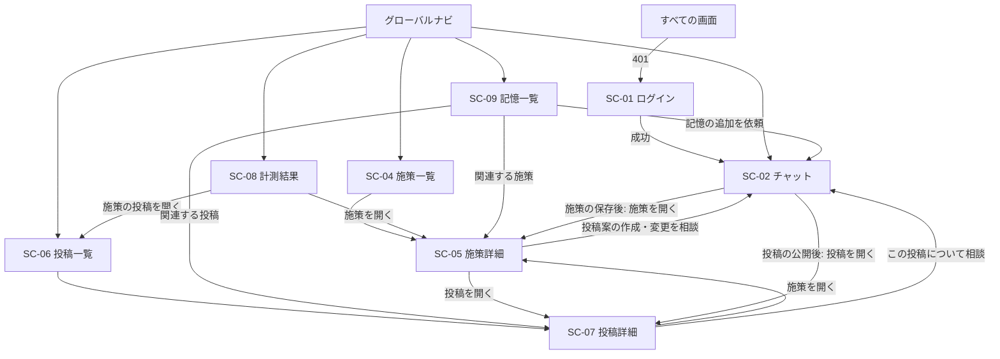

# 画面設計書（v0.16）

対象: hiromeru（AI支援型Xマーケティングシステム）MVP の画面一覧

## 1. 文書の責務

本書は、MVPの画面一覧と、各画面の役割・遷移・使用するAPI、および実装に必要な共通UIと画面ごとの表示・操作仕様を定義する。APIのSchemaや業務ルールは下記の正本を参照し、本書では利用者が見る状態と操作へ対応づける。

- 業務フローは`USECASE.md`を正本とする
- APIのRequest、Response、エラーは`API_DESIGN.md`を正本とする
- データ構造は`DATABASE.dbml`を正本とする
- 要件は`REQUIREMENTS.md`を正本とする
- 画面の実装構成（ルーティング、Feature、URL state、画面状態、レスポンシブ）は、`docs/frontend/CODING_STANDARDS.md`に従う
- 本書は、上記を画面の単位に整理したものである。食い違いがある場合は、上記の文書を正とする

## 2. 設計方針

1. **チャット中心にする。** 施策と投稿の作成、Agentの提案を受けた変更、承認は、チャット画面（SC-02）で行う。SC-04からSC-09は原則として参照用とし、例外は、施策を人が直接書き換えるSC-05の編集と、不要な記憶を削除するSC-09の操作だけとする
2. **承認は、フォームの最終承認ボタンで行う。** ボタン押下時のAPI呼び出しが最終承認になる。自由文の同意は承認として扱わない
3. **業務画面には、確定した情報だけを表示する。** 提案中の施策と未公開の投稿案は、チャットの履歴とフォームにだけ存在する。施策一覧と投稿一覧には、承認して保存された施策と、Xへ公開済みの投稿だけを表示する
4. **施策の直接編集は、SC-05で行える。削除の画面は作らない。** Agentに相談して変更する場合はSC-02で提案を受けて承認し、人が自分で書き換える場合はSC-05の編集フォームで保存する。前者は施策のupsert（`API_DESIGN.md`の4.1。Sessionの配下）、後者は施策編集API（同4.2。Sessionに関わらない）を使い、上書きには画面を表示した（または提案を受けた）時点の`updated_at`を使う。公開済みの投稿は、変更も削除もできない
5. **他の会社・他のマーケターの情報は、存在しないものとして扱う。** 該当しないIDを開いた場合は、「見つかりません」を表示する
6. **計測の指標は2つに限る。** X投稿の初週PV数と、応募ページへの流入ユーザー数だけを表示する。いいね数、CTR、CVRなどは表示しない
7. **未認証の場合は、ログイン画面へ移動する**

## 3. 画面一覧

| ID | 画面名 | パス | 目的 | 使用するAPI |
| --- | --- | --- | --- | --- |
| SC-01 | ログイン | `/login` | メールアドレスとパスワードでログインする | `POST /auth/login`、`POST /auth/logout`、`GET /auth/me` |
| SC-02 | チャット | `/chat`、`/chat/new`、`/chat/{session_id}` | 会話一覧から会話を選んで再開する、または新しい会話を始める。親Agentと会話し、施策案・投稿案を編集・再相談・最終承認する | `GET /agent-sessions`、`POST /agent-sessions`、`POST /agent-sessions/{id}/turns`、`GET /agent-sessions/{id}`、`GET /agent-sessions/{id}/turns/{turn_id}`、`GET /campaigns`、`POST /agent-sessions/{id}/campaigns`、`POST /agent-sessions/{id}/x/posts` |
| SC-03 | （欠番） | — | SC-02に統合した。旧「会話一覧」（`/sessions`） | — |
| SC-04 | 施策一覧 | `/campaigns` | 承認して保存した施策を一覧・検索する | `GET /campaigns` |
| SC-05 | 施策詳細 | `/campaigns/{campaign_id}` | 施策の内容と、関連する投稿・記憶、投稿ごとの初週PV数を確認する。施策を直接編集する | `GET /campaigns/{campaign_id}`、`PUT /campaigns/{campaign_id}`（施策の編集） |
| SC-06 | 投稿一覧 | `/posts` | 公開済みの投稿を、初週PV数とあわせて一覧・検索する | `GET /posts`、`GET /campaigns`（施策の絞り込みの選択肢）、`GET /campaigns/{campaign_id}`（選択中の施策） |
| SC-07 | 投稿詳細 | `/posts/{post_id}` | 公開済み投稿の本文、UTM付きURL、計測結果を確認する | `GET /posts/{post_id}` |
| SC-08 | 計測結果 | `/metrics` | 初週PV数、流入ユーザー数、流入率を、全体と施策ごとに比較する | `GET /metrics` |
| SC-09 | 記憶一覧 | `/memories` | 長期記憶を意味検索または施策で絞り込み、不要な記憶を削除する | `GET /memories`、`GET /campaigns`（施策の絞り込みの選択肢）、`GET /campaigns/{campaign_id}`（選択中の施策）、`DELETE /memories/{memory_id}` |

- `/`は`/chat`へ移動する
- 会話一覧は、独立した画面にせず、SC-02の一部とする（デスクトップでは会話の横に並べ、モバイルでは`/chat`に一覧だけを表示する）。SC-03は、他の画面の番号を変えないため欠番とする
- APIのパスは、`/api/v1`を前置する
- 参照用のAPI（`GET`）の一覧と共通の扱いは、7章に示す

### 3.1 実装上の対応（Frontend規約）

`docs/frontend/CODING_STANDARDS.md`の4章（`app/`はルーティングと組み立て、`features/`は機能単位）に沿った、画面とFrontendの対応である。Feature名は、利用者が認識する機能を基準にする。

| 画面 | `app/`のルート | Feature | 初期表示の読取 | Clientの操作 |
| --- | --- | --- | --- | --- |
| SC-01 | `app/login/` | `auth` | Server Component（`GET /auth/me`によるログイン済み判定） | ログイン |
| SC-02 | `app/(authenticated)/chat/`（`layout.tsx`に会話一覧、`page.tsx`が一覧）、`app/(authenticated)/chat/new/`、`app/(authenticated)/chat/[session_id]/` | `agent` | Server Component（会話一覧の先頭20件、履歴の取得） | 会話一覧の追加読み込み（無限スクロール）、新しい会話の作成、メッセージ送信（SSEの受信）、Turnのポーリング、フォームの編集、承認 |
| SC-04、SC-05 | `app/(authenticated)/campaigns/`、`app/(authenticated)/campaigns/[campaign_id]/` | `campaigns`（SC-05の編集フォームは`agent`） | Server Component | 検索、絞り込み（URLを更新する）、施策の編集（SC-05。`agent`Featureのフォーム） |
| SC-06 | `app/(authenticated)/posts/` | `posts` | Server Component | 検索、絞り込み（URLを更新する） |
| SC-07 | `app/(authenticated)/posts/[post_id]/` | `posts` | Server Component | URLのCopyと、その成功・失敗の通知 |
| SC-08 | `app/(authenticated)/metrics/` | `metrics` | Server Component | 期間の絞り込み（URLを更新する） |
| SC-09 | `app/(authenticated)/memories/` | `memories` | Server Component | 検索、施策による絞り込み、記憶の削除、Response不明時の同じDELETEによる結果確定 |

- 業務データの読取は、Server Componentで行う（規約11.1）。Clientの再取得は、Turnの進捗の受信（SSE）と切断時のTurnのポーリング、施策の選択の検索（6.11）、会話一覧の追加読み込み（6.13）、SC-09の記憶削除後の一覧更新だけとする（規約11.3。Turnは応答が最大200秒かかり、進捗を逐次表示し、応答を受け取れない場合に状態を確認する必要があるため。施策の選択は入力に応じた候補の表示、会話一覧はスクロールに応じた追加読込、記憶削除は確定結果を一覧へ反映する必要があるため）
- Feature間の直接参照は原則禁止のため（規約4.4）、複数のFeatureにまたがる画面は`app/`で組み立てる。該当する箇所は、SC-05の編集フォーム（下記）である
- `app/`の`loading.tsx`、`error.tsx`、`not-found.tsx`で、6.8の画面状態を共通に扱う
- 施策のフォーム（項目の入力部品と検証Schema）は、SC-02の提案フォームとSC-05の編集フォームで共通のため、まとめて`agent`Featureに置く。`campaigns`Featureには置かない（重複や`shared`への切り出しは行わない）。`app/(authenticated)/campaigns/[campaign_id]/`が、`campaigns`Featureの表示と、`agent`Featureが公開する編集フォームを組み合わせる。投稿フォームも、`agent`Featureに置く
- `app/(authenticated)/layout.tsx`が、認証済み画面のApp ShellとNotification Toastを組み立てる。Route GroupはURLへ現れない（6.15）
- `app/(authenticated)/chat/layout.tsx`が会話一覧を描画し、`page.tsx`、`new/page.tsx`、`[session_id]/page.tsx`をその子とする。一覧と会話は同じFeature（`agent`）に含まれる

## 4. 画面遷移



## 5. 画面の概要

### SC-01 ログイン
- 入力: メールアドレス、パスワード
- ログイン済み（`GET /auth/me`が`200`）の場合は、ログイン画面を表示せず、SC-02へ移動する
- 成功時は、認証Cookieと`csrf_token`を受け取り、元のURL（なければSC-02）へ移動する。`csrf_token`は、以降の状態変更APIの`X-CSRF-Token` Headerへ設定する
- `INVALID_CREDENTIALS`（401）: メールアドレスの登録有無を判別できない、同じ文言で表示する
- `429`（試行回数の超過）: 「しばらくしてから再試行してください」と表示する
- ユーザー登録、パスワード再設定の画面は設けない（マーケターは事前登録する）

**Design plan**

| 項目 | 方針 |
| --- | --- |
| Subject | Hiromeruへ安全にログインし、採用Xの運用を再開する入口 |
| Audience | 事前にアカウントを発行された採用マーケター |
| Primary job | メールアドレスとパスワードを入力し、元の業務画面へ移動する |
| 情報の優先順位 | Login Form、入力Error、Brand、サービス利用相談 |
| Palette | 左カラムはBrand Strongと反転文字、右カラムはPaper背景、CardはWhite Surface、ErrorはDanger状態色 |
| Typography | LogoはLatin、見出しとFormはSans。補助文を過度に小さくしない |
| Layout | PCはBrandとFormの2カラム、SPはBrandとLogin Cardの1カラム |
| Motion | Input ErrorとForm Errorが対象箇所の下端から現れるFeedbackだけに限定する |

**PCワイヤー**

```text
┌──────────────────────────┬──────────────────────────────────────────────┐
│                          │                                              │
│      [H] HIROMERU        │             ┌────────────────────────┐       │
│                          │             │ [H] HIROMERU           │       │
│ SNS採用を自動化する      │             │                        │       │
│ AIエージェント           │             │ ログイン               │       │
│                          │             │                        │       │
│                          │             │ メールアドレス         │       │
│                          │             │ ┌────────────────────┐ │       │
│                          │             │ │                    │ │       │
│                          │             │ └────────────────────┘ │       │
│                          │             │ エラーメッセージ       │       │
│                          │             │                        │       │
│                          │             │ パスワード     [表示] │       │
│                          │             │ ┌────────────────────┐ │       │
│                          │             │ │                    │ │       │
│                          │             │ └────────────────────┘ │       │
│                          │             │ エラーメッセージ       │       │
│                          │             │                        │       │
│                          │             │ [     ログイン      ] │       │
│                          │             │ Form error tray        │       │
│                          │             └────────────────────────┘       │
│                          │                                              │
│                          │       サービス利用相談はXまで @hiromaru_jp  │
└──────────────────────────┴──────────────────────────────────────────────┘
```

- `tablet`以上で2カラムとし、左カラムはViewportの約40%、最小Inline sizeは`--login-brand-panel-min-width`（`24rem`）とする。右カラムは残りの幅を使う
- 左カラムにHiromeru Logoと「SNS採用を自動化するAIエージェント」だけを表示し、中央付近で左揃えにする。Navigation、機能説明、装飾的な図は置かない
- 右カラムはLogin Cardとサービス利用相談の2段とし、Login Cardを利用可能な領域の中央へ、相談導線をInline endかつBlock endへ配置する
- 相談導線をViewportへ固定しない。高さが不足する場合は右カラムをDocument scrollし、Formと相談導線の両方へ到達できるようにする
- Login Cardの最大Inline sizeは`--login-card-max-width`（`28rem`）とする。Card上部はHiromeru Logoと`h1`「ログイン」だけとし、挨拶、説明、登録案内、パスワード再設定を置かない
- CardはSurfaceとBorderで背景から分ける。大きなShadow、Glass effect、背景画像は使用しない

**SPワイヤー**

```text
┌───────────────────────────────────┐
│                                   │
│          [H] HIROMERU             │
│ SNS採用を自動化するAIエージェント │
│                                   │
│ ┌───────────────────────────────┐ │
│ │ [H] HIROMERU                  │ │
│ │                               │ │
│ │ ログイン                      │ │
│ │                               │ │
│ │ メールアドレス                │ │
│ │ ┌───────────────────────────┐ │ │
│ │ │                           │ │ │
│ │ └───────────────────────────┘ │ │
│ │ エラーメッセージ              │ │
│ │                               │ │
│ │ パスワード            [表示] │ │
│ │ ┌───────────────────────────┐ │ │
│ │ │                           │ │ │
│ │ └───────────────────────────┘ │ │
│ │ エラーメッセージ              │ │
│ │                               │ │
│ │ [          ログイン         ] │ │
│ │ Form error tray               │ │
│ │                               │ │
│ │ ───────────────────────────── │ │
│ │ サービス利用相談はXまで       │ │
│ │ @hiromaru_jp                  │ │
│ └───────────────────────────────┘ │
│                                   │
└───────────────────────────────────┘
```

- `tablet`未満は1カラムとし、Page上部にHiromeru Logoと「SNS採用を自動化するAIエージェント」を中央揃えで表示する
- Login Card内にもFormの識別としてHiromeru Logoと`h1`「ログイン」を表示する
- PageのInline paddingは`--space-4`、Login Cardの最大Inline sizeは`--login-card-max-width`とし、利用可能な幅まで広げる
- Login ButtonはCardのInline sizeに合わせる。CardがViewportより高い場合はPage全体をScrollさせる
- サービス利用相談はCard Footerに移し、本文との間をDividerで分ける
- 320px幅、200% Zoom、長いError文でも横Scrollを発生させず、Input、Login Button、相談導線を失わない

**Brandとサービス利用相談**

- Hiromeru LogoはLPと同じMark、Latin表記、比率を使う。SC-01ではNavigation Linkにせず、現在のPageを示す非操作要素とする
- 相談の文言は「サービス利用相談はXまで」、Linkは「@hiromaru_jp」とする
- Link先は`https://x.com/hiromaru_jp`とし、新しいTabで開く。Visible textまたはVisually hidden textで「新しいタブで開く」と伝える
- X Logoを併記する場合は装飾扱いとし、`aria-hidden="true"`を設定する
- PCでは相談導線を右カラム右下、SPではLogin Cardの下部に表示する
- 実装前に`--login-brand-panel-min-width`と`--login-card-max-width`をLayout tokenへ追加し、SC-01のComponent内へ寸法のLiteralを重複して記述しない

**Formと入力属性**

- EmailとPasswordは6.14.2の共通`TextField`を使用する。Labelを常に表示し、Placeholderだけで項目を示さない
- Emailは`type="email"`、`name="email"`、`autocomplete="username"`、`inputmode="email"`を設定する
- Passwordは`type="password"`、`name="password"`、`autocomplete="current-password"`を設定する
- Password Manager、自動入力、貼り付けを許可する。Passwordへ文字種や長さのClient validationを追加しない
- Passwordの「表示／隠す」は`TextField`の`trailingAction`へVisibleなButtonとして置く。表示を切り替えても値、選択範囲、Focusを維持する
- EnterでSubmitできる。EmailはSubmit時に前後の空白を除き、Passwordは加工しない
- Client validationはEmailの必須・形式とPasswordの必須だけを扱う。失敗時はRequestを送らず、最初のError InputへFocusを移す

**InputごとのError文言**

| Input | 条件 | 文言 |
| --- | --- | --- |
| Email | 空 | メールアドレスを入力してください |
| Email | 形式不正 | メールアドレスの形式で入力してください |
| Email | `401 INVALID_CREDENTIALS` | メールアドレスまたはパスワードが正しくありません |
| Password | 空 | パスワードを入力してください |
| Password | `401 INVALID_CREDENTIALS` | メールアドレスまたはパスワードが正しくありません |

- `INVALID_CREDENTIALS`では両InputをError状態とし、利用者が登録有無や誤っている項目を判別できない同じ文言を両方のInput下に表示する
- 同じ認証Errorを支援技術へ二重に割り込ませない。VisibleなErrorは各Inputの`aria-describedby`で関連付け、FormのStatus領域から認証失敗を1回だけ通知する
- Field固有のErrorは、入力変更後の再検証で解消した場合に取り除く。認証Errorは次のSubmit開始時に取り除き、入力変更だけでは自動で消さない

**Form Error Trayの文言**

Login Button直下に、特定のInputへ割り当てられないErrorを表示する。Login画面のErrorをNotification Toastだけで伝えない。

| 条件 | 文言 | 次の操作 |
| --- | --- | --- |
| `400 INVALID_ARGUMENT` | 入力内容を確認して、もう一度ログインしてください | Inputを確認して再Submit |
| `403 CSRF_VALIDATION_FAILED`相当 | 安全性を確認できなかったため、ログインできませんでした。ページを再読み込みしてください | Pageを再読み込み |
| `429 Too Many Requests` | 試行回数が上限を超えました。しばらくしてから再試行してください | 時間をおいて再Submit |
| Network Error | 通信できませんでした。通信環境を確認して、もう一度お試しください | 同じ入力で再Submit |
| Timeout | ログイン処理が完了しませんでした。時間をおいて、もう一度お試しください | 時間をおいて再Submit |
| `500`またはResponse parse failure | ログインできませんでした。時間をおいて、もう一度お試しください | 時間をおいて再Submit |
| `GET /auth/me`の回復可能な失敗 | ログイン状態を確認できませんでした。ページを再読み込みしてください | Pageを再読み込み |

- Form Error Trayは`role="alert"`、`tabIndex={-1}`とし、Form Errorだけが発生したSubmit失敗ではTrayへFocusを移す
- Form Errorは入力変更では消さず、次のSubmit開始時に取り除く。再読み込みが必要なErrorでは「ページを再読み込み」Buttonを表示する
- `GET /auth/me`が`401 UNAUTHENTICATED`の場合はErrorではなく未ログイン状態としてFormを表示する。`200`の場合はFormを表示せず元のURL、なければ`/chat`へ移動する

**ErrorのMotion**

```text
┌───────────────────────────┐
│ Input                     │
└───────────────────────────┘
          ↓
  エラーメッセージ
```

- Field Errorは各Inputの直下に置き、Inputの下端からせり出すように表示する。Error領域は`overflow: clip`とし、Error文は隠れた位置から最終位置へ移動する
- 開始位置は`transform: translateY(calc(var(--motion-distance-md) * -1))`と`opacity: 0`、終了位置は`transform: translateY(0)`と`opacity: 1`とする
- 表示は`--duration-normal`と`--easing-emphasized`、解除は`--duration-fast`と`--easing-standard`を使う
- Form Error TrayもLogin Button下端から同じ方向へせり出す。DOMへの追加、読み上げ、Focus移動、Requestの結果処理はAnimation完了を待たない
- Error領域には想定するError文の最小Block sizeを確保し、表示時のLayout shiftを抑える
- `prefers-reduced-motion: reduce`では移動とFadeを行わず、Errorを最終位置へ即時表示・非表示する

**状態と操作**

| 状態 | 表示と操作 |
| --- | --- |
| 初期 | EmailとPasswordは空。自動Focusは行わない |
| 入力中 | Browser補完、Password Manager、貼り付けを許可する |
| Password表示 | 値、選択範囲、Focusを保持して`type`を切り替える |
| 送信中 | Login ButtonにSpinnerと「ログイン中」を表示し、Login ButtonとPassword toggleを無効にする。Inputは`readOnly`とし、Request中に値を変更させない |
| Client validation失敗 | Requestを送らず、各InputへErrorを表示して最初のError InputへFocusを移す |
| 認証失敗 | 入力値を保持し、両Inputへ同じErrorを表示する。自動で再Submitしない |
| 通信・Server失敗 | 入力値を保持し、Form Error Trayを表示する。自動で再Submitしない |
| 成功 | 認証Cookieと`csrf_token`を受け取り、元のURL、なければ`/chat`へ移動する |
| ログイン済み | Login Formを表示せず、元のURL、なければ`/chat`へ移動する |

- 未認証画面へ移動するときは、元のPathとSearch Paramsを`next`へ保持する。Login成功後は、同一Originの認証後Pathとして検証できる相対URLだけへ移動する
- `next`がない、不正、`//`で始まる、外部Originを示す、または認証後画面でない場合は`/chat`へ移動する

**受け入れ条件**

- PCではBrandとFormの2カラム、SPではBrand、Login Card、Card Footerの順で表示される
- PCの相談導線が右カラム右下、SPの相談導線がCard下部に表示され、`@hiromaru_jp`を新しいTabで開ける
- KeyboardだけでEmail、Password、表示切替、Login、X Link、再読み込みを操作できる
- Password Manager、自動入力、貼り付け、Enter Submitが機能する
- Login送信中はButtonにSpinnerと「ログイン中」を表示し、Buttonの幅を変えずに二重Submitを防ぐ
- Error時に該当InputがError外観になり、各Input下の具体的な文言と`aria-describedby`で関連付けられる
- ErrorがInputまたはLogin Buttonの下端から表示され、Reduced Motionでは即時表示される
- `INVALID_CREDENTIALS`でメールアドレスの登録有無や誤っている項目を判別できない
- Login固有のErrorがNotification Toastだけに表示されない

### SC-02 チャット
親Agentとの会話と、提案の編集・承認を行う中心の画面である。

**Design plan**

| 項目 | 方針 |
| --- | --- |
| Subject | Agentとの相談から施策保存・X公開までを、一つの時系列で進める業務Workspace |
| Audience | 採用Xの施策と投稿を継続運用するマーケター |
| Primary job | 会話を再開または開始し、提案を編集・再相談・最終承認する |
| 情報の優先順位 | 選択中の会話、最新Turn、未承認の提案、Composer、会話一覧、過去履歴 |
| Palette | Paper背景、UserとAgentで異なるSurface、Greenの主要Action、状態別のSuccess・Warning・Danger |
| Typography | Message本文とFormはSans、IDや補助的な数値だけMono。本文はMobileでも`--font-size-md`以上 |
| Layout | PCはGlobal Sidebar、会話一覧、会話の3列。SPは会話一覧と会話をRouteで分離する |
| Motion | Spinner、Error、最新Messageへの移動など、状態と位置関係を伝えるFeedbackに限定する |

**PCワイヤー**

```text
┌──────────────┬─────────────────────┬────────────────────────────────────┐
│ Global nav   │ 会話                │ 選択中の会話タイトル               │
│              │ [＋ 新しい会話]     ├────────────────────────────────────┤
│ チャット     │                     │ [以前の会話を読み込む]             │
│ 施策         │ ● 選択中の会話     │                                    │
│ 投稿         │   更新日時          │              あなた                │
│ 計測結果     │                     │       ┌──────────────────────┐     │
│ 記憶         │   別の会話          │       │ 施策を考えてください │     │
│              │   更新日時          │       └──────────────────────┘     │
│              │                     │                                    │
│              │   無題の会話        │ Hiromeru AI                        │
│              │                     │ ┌──────────────────────────────┐   │
│ Account      │ [さらに読み込む]    │ │ Agentの回答                  │   │
│              │                     │ └──────────────────────────────┘   │
│              │                     │                                    │
│              │                     │ Hiromeru AI                        │
│              │                     │ ┌──────────────────────────────┐   │
│              │                     │ │ 施策案Form                   │   │
│              │                     │ │ [Agentと再相談] [最終承認]  │   │
│              │                     │ └──────────────────────────────┘   │
│              │                     ├────────────────────────────────────┤
│              │                     │ Message textarea                  │
│              │                     │ 0 / 4,000              [送信]     │
└──────────────┴─────────────────────┴────────────────────────────────────┘
```

- `tablet`以上では6.15のGlobal Sidebar、会話一覧、会話の3列とする。会話一覧は`--conversation-list-width`、会話列は`minmax(0, 1fr)`とする
- Workspace全体を`100dvb`に収め、会話一覧と会話履歴を独立してScrollさせる。会話HeaderとComposerは会話列に残す
- 会話本文は最大Inline size`--conversation-content-width`（`52rem`）として会話列の中央へ置く。Proposal Bubbleはこの幅まで使用できる
- `/chat`の会話列と`/chat/new`は新しい会話、`/chat/{session_id}`は選択中の会話を表示する

**SP会話一覧ワイヤー**

```text
┌─────────────────────────────────┐
│ [Menu] Hiromeru                 │
├─────────────────────────────────┤
│ 会話            [新しい会話]   │
│                                 │
│ ┌─────────────────────────────┐ │
│ │ 経験者採用の施策            │ │
│ │ 9月22日 14:30               │ │
│ └─────────────────────────────┘ │
│ ┌─────────────────────────────┐ │
│ │ 無題の会話                  │ │
│ │ 9月21日 10:15               │ │
│ └─────────────────────────────┘ │
│                                 │
│ [さらに読み込む]               │
└─────────────────────────────────┘
```

**SP会話ワイヤー**

```text
┌─────────────────────────────────┐
│ [会話一覧へ戻る]                │
│ 経験者採用の施策                │
├─────────────────────────────────┤
│                    あなた       │
│       ┌───────────────────────┐ │
│       │ 施策を考えてください │ │
│       └───────────────────────┘ │
│                                 │
│ Hiromeru AI                     │
│ ┌─────────────────────────────┐ │
│ │ Agentの回答                │ │
│ └─────────────────────────────┘ │
│                                 │
│ Hiromeru AI                     │
│ ┌─────────────────────────────┐ │
│ │ 施策案Form                 │ │
│ │ [Agentと再相談]           │ │
│ │ [最終承認]                │ │
│ └─────────────────────────────┘ │
├─────────────────────────────────┤
│ Message textarea                │
│ 0 / 4,000            [送信]     │
└─────────────────────────────────┘
```

- `tablet`未満では、`/chat`に会話一覧だけ、`/chat/new`と`/chat/{session_id}`に会話だけを表示する
- 会話画面のHeaderには「会話一覧へ戻る」と会話タイトルを表示する。戻る操作は`/chat`へ移動する
- Headerを除くWorkspaceを`calc(100dvb - var(--app-header-height))`に収め、履歴だけをScrollさせる

**会話一覧**

- Headerは`h1`「会話」と「新しい会話」で構成する。選択すると`/chat/new`へ移動し、Sessionは最初のMessage送信時まで作成しない
- Sessionは`updated_at`の新しい順に、タイトルと更新日時を表示する。日時は`Intl.DateTimeFormat`を使用する
- タイトルは表示上2行までとするが、Accessible Nameには完全な文字列を使う。`title = null`は「無題の会話」とする
- 選択中の会話はBrand Surface、Inline start Border、Text weight、`aria-current="page"`で示す。色だけに依存しない
- Archive、削除、名前変更、検索は設けない
- 会話がない場合は「まだ会話がありません。マーケティングの依頼から始めましょう」と「新しい会話を始める」を表示する
- 先頭20件はServer Componentで描画する。末尾到達で次の20件を自動取得し、同じ位置にKeyboard操作用の「さらに読み込む」Buttonも置く
- 追加読込中はSpinnerと「読み込み中」、失敗時は表示済み会話を残して「もう一度読み込む」を表示する。重複は`session_id`で除く（6.13）

**新しい会話**

```text
┌─────────────────────────────────────────────┐
│          Hiromeru AIに相談する              │
│   施策づくりや投稿案について相談できます   │
│                                             │
│ [新しい採用施策を考える]                    │
│ [既存の施策から投稿案を作る]                │
│ [公開済み投稿の結果を振り返る]              │
├─────────────────────────────────────────────┤
│ Message textarea                            │
│ 0 / 4,000                        [送信]      │
└─────────────────────────────────────────────┘
```

- 相談例Buttonは、その文言をComposerへ設定してFocusを移すだけとし、自動送信しない。利用者は内容を編集してから送信する
- 相談例は「新しい採用施策を考える」「既存の施策から投稿案を作る」「公開済み投稿の結果を振り返る」の3つとする
- `/chat/new?campaign_id={id}&intent=create_post`では「施策ID {id}のX投稿案を作りたいです」、`intent=revise_campaign`では「施策ID {id}の内容を変更したいです」をComposerへ設定する。`/chat/new?post_id={id}&intent=discuss_post`では「投稿ID {id}について相談したいです」を設定する。いずれもComposerへFocusを移すだけで、相談例と同様に自動送信しない
- 施策の引継ぎは、正の整数の`campaign_id`と、`create_post`または`revise_campaign`の`intent`を組にする。投稿の引継ぎは、正の整数の`post_id`と、`discuss_post`の`intent`を組にする。IDと`intent`の片方がない、値が不正、組が一致しない、または`campaign_id`と`post_id`が併存する場合は、すべての引継ぎParamsを無視して空のComposerを表示する。SC-02はParamsから施策または投稿の存在確認を行わず、Agentが送信後の通常フローで会社所有権と公開済みであることを検証する
- 最初の送信時は、同じButton操作の中で`POST /agent-sessions`を1回実行し、成功した`session_id`でMessageを送る。Session作成からTurn終了までButtonにSpinnerと「送信中」を表示する
- Session作成後、Turnの送信を開始した時点で`/chat/{session_id}`へ移動する。二重ClickとShortcutの連続入力を受け付けない

**Bubbleと履歴の表示**

| Item | 配置 | 最大幅 | Visible label |
| --- | --- | --- | --- |
| `user_message` | Inline end | 本文レーンの75% | あなた |
| `assistant_message` | Inline start | 本文レーンの85% | Hiromeru AI |
| `campaign_proposal`、`x_post_proposal` | Inline start | 本文レーン全幅 | Hiromeru AI |
| `approval_action` | Inline end | 本文レーンの85% | あなた |
| `api_result` | Inline start | 本文レーンの85% | システム |
| Turn進捗 | Inline start | 本文レーンの85% | Hiromeru AI |

- UserとAgentの双方をBubbleで表示する。AI生成内容には「Hiromeru AI」、LLMを使用しないAPI処理結果には「システム」を表示し、人の発言に見せない
- 各Turnを時系列のList itemとし、その中のItemを`item_number`順に表示する。APIの順序を画面都合で変更しない
- Message本文はPlain textとして改行を維持し、Markdownや外部HTMLとして解釈しない。長いURLと連続文字列は`overflow-wrap: anywhere`で折り返す
- 各Bubbleに`time`要素で日時を表示する。発言者は色だけでなく、配置、Visible label、Surfaceで区別する
- Tool Call、提案以外のTool Result、Web取得内容、記憶内容、隔離内容、子Sessionの内部履歴は表示しない

**過去履歴とScroll**

- 初期表示は最新20 Turnを古い順から新しい順に並べ、会話末尾を表示する
- 履歴の上端へ到達し、`has_more = true`なら、最小の`turn_number`を`before_turn_number`として以前の20 Turnを自動取得する
- 上端にはKeyboard操作用の「以前の会話を読み込む」Buttonも置く。自動取得とButton操作で同じ`before_turn_number`を二重に取得しない
- 取得中は上端にSpinnerと「以前の会話を読み込み中」、失敗時は現在の履歴を残して「もう一度読み込む」を表示する
- 古いTurnを先頭へ追加した後は、追加前後のScroll height差を補正し、利用者が読んでいたBubbleの位置を維持する
- 新しいItemを受け取ったとき、利用者が末尾付近にいる場合だけ末尾へScrollする。過去を読んでいる場合は位置を動かさず「最新のメッセージへ」を表示する
- UserがMessageを送信したときは送信したBubbleを表示して末尾へ移動する。過去履歴の件数とScroll位置はURLへ保持しない

**Composer**

- 複数行Textarea、文字数Counter、Send Button、補助Statusで構成する。添付、画像、音声、TurnのCancelは設けない
- Textareaは最小3行、最大Block size`--composer-max-height`（`12rem`）とし、それ以上はTextarea内をScrollさせる
- 前後の空白を除いて1文字以上、アプリケーション設定の上限以下（既定4,000文字）を有効とし、`0 / 4,000`形式でCounterを表示する
- Enterは改行、`Ctrl+Enter`または`Command+Enter`は送信とする。日本語入力などのComposition中はShortcutでも送信しない
- 空、上限超過、Turn実行中は送信できない。実行中はButtonにSpinnerと「送信中」を表示し、「回答が完了すると送信できます」を`aria-live="polite"`で通知する
- Turn実行中も次のDraftをTextareaへ入力できるが送信はできない。送信受付時の値だけを消し、その後に入力したDraftを消さない
- Keyboard ShortcutまたはButtonで送信を受け付けた後もComposerへFocusを残す

**送信と進捗**

1. 新しい会話ではSessionを作成し、既存会話では現在の`session_id`を使う
2. `Accept: text/event-stream`でMessageを送信し、User BubbleとProgress Bubbleを表示する
3. `turn_started`のIDを切断時の確認用に保持し、`activity_started`と`activity_finished`を表示用Statusへ変換する
4. `turn_finished`でProgress Bubbleを置き換え、TurnのItem、Error、Security Noticeを表示する

| Activity `name` | 表示文言 |
| --- | --- |
| `get_session_items` | 会話履歴を確認中 |
| `search_long_term_memory` | 記憶を検索中 |
| `save_long_term_memory` | 記憶を保存中 |
| `delete_long_term_memory` | 記憶を削除中 |
| `web_search` | Webを検索中 |
| `web_fetch` | Web情報を確認中 |
| `get_campaign`、`search_campaigns` | 施策を確認中 |
| `get_post`、`search_posts` | 投稿を確認中 |
| `get_marketing_metrics` | 計測結果を確認中 |
| `run_campaign_planner` | 施策を立案中 |
| `run_content_creator` | 投稿案を作成中 |
| `propose_campaign` | 施策案を整理中 |
| `propose_x_post` | 投稿案を整理中 |
| 未知の名前 | 処理中 |

- Progress Bubbleは、現在実行中のActivityをSpinner付きで、完了済みActivityを直近3件まで表示する。Raw Tool名、引数、結果、URL、記憶内容、Block理由は表示しない
- `activity_finished`が`failed`または`blocked`でも内部理由を表示せず、`turn_finished`の安全なErrorとSecurity Noticeを待つ
- Button内の「送信中」は操作受付、Progress BubbleはAgentの進捗を示す別のStatusとして併記する
- `prefers-reduced-motion: reduce`ではSpinnerを停止するが、進捗文言と完了状態を残す

**施策提案Form**

- Headerに「施策案」と状態「未承認」「手書きで編集中」「過去の提案」「承認済み」のいずれかを表示する
- タイトル、ターゲット像、実施背景、施策目的、施策内容を最初から編集可能にする。`id`と`expected_updated_at`は非表示で保持し、加工しない
- 初期値との差が生じたら「手書きで編集中」と「提案内容に戻す」を表示する。戻す操作は現在の提案値へ戻すだけで、履歴やDBを変更しない
- 画面上の中間編集をReducerのLocal stateだけに保持する。入力変更でAgent、API、業務DBを呼び出さない
- Footerに「Agentと再相談」と「最終承認」を表示する。新規施策は確認Modalなし、既存施策の上書きは「既存の内容を置き換えます」の確認Modalを表示する
- 承認中はButtonにSpinnerと「承認中」を表示し、同じ操作とForm編集を無効にする。Field Errorは各Field直下へ表示する
- APIで定義していない最大文字数を画面だけに追加しない。必須項目とBackendの業務条件を同じSchemaで検証する

**X投稿提案Form**

- Headerに「X投稿案」と状態「未公開」「手書きで編集中」「過去の提案」「公開済み」のいずれかを表示する
- 対象施策、投稿本文、遷移先URLを最初から編集可能にする。対象施策は6.11の検索付きComboboxを使用する
- 投稿本文と遷移先URLを別Fieldとし、URLは用途に合う`type`と`inputmode`を設定する。本文とUTM付きURLを結合したX文字数規則はBackendを正とする
- Footerに「Agentと再相談」と「承認して公開」を表示する。公開前に「Xへ公開され、公開後は変更・削除できません」の確認Modalを必須とする
- 公開中はButtonにSpinnerと「公開中」を表示し、同じ操作とForm編集を無効にする。`INVALID_X_POST`は該当FieldへErrorを表示する
- 投稿案はX公開成功まで業務データへ保存せず、会話履歴とFormだけに保持する

**Agentと再相談**

- 「Agentと再相談」で同じProposal Bubble内にLabel「修正したい内容」のTextareaと、「取消」「相談内容を送信」を表示する。Modalへ移動しない
- 送信時は現在のForm値と修正指示を新しいMessageとして送る。ButtonにSpinnerと「相談中」を表示し、再相談を最終承認として扱わない
- 取消では修正指示だけを破棄し、Form値を維持する。新しい提案を受け取ったら、以前の提案をRead-onlyにして新しい提案をActionableにする

**Actionableな提案**

- 各提案種別で、後続に同種の提案がなく、対応する承認処理が完了済みまたは未解決ではない最新の提案だけを編集・再相談・承認可能にする
- `upsert_campaign`または`publish_x_post`の成功した`api_result`が後続にある提案はRead-onlyにする。`IDEMPOTENCY_REQUEST_IN_PROGRESS`、`X_POST_OUTCOME_UNKNOWN`、`X_POST_SAVE_FAILED`の承認処理が後続にある場合も、新しい承認を開始できないRead-onlyとし、同じKeyの結果確認または復旧だけを表示する
- Validation Error、`CAMPAIGN_CONFLICT`、外部作用開始前の失敗で終わった承認は、Errorを表示したうえで提案をActionableのままにする。内容を修正した次の承認は新しい`Idempotency-Key`を使う
- 同種の新しい提案がある場合、以前の提案はRead-onlyにして「過去の提案」と表示する。Read-only Formから操作Buttonを取り除く
- Actionable判定はTurnとItemの順序、提案種別、後続のApproval typeと`api_result`から導出し、提案Tool Result自体は変更しない

**最終承認と承認履歴**

- 承認操作ごとにUUID形式の`Idempotency-Key`を生成する。二重Click、通信切断後の再送、内部再試行では同じキーを使い、新しい明示的な承認操作でだけ新しいキーにする
- `approval_action`はUser側Bubbleへ「施策を最終承認しました」または「X投稿を承認して公開しました」と表示する
- 承認時のRequest Snapshotはnativeの`details`と`summary`「承認内容を見る」で展開する。初期状態は閉じ、すべての項目をRead-onlyで表示する
- `api_result`は「システム」のBubbleとし、Success、Error、Outcome unknownをIcon、Title、文言で示す。LLMの回答に見せない
- API Responseで遷移先IDを取得できる成功直後はSC-05またはSC-07へのLinkを表示する。履歴再取得後に`api_result`だけからIDを復元できない場合は、存在しないLinkを作らない
- 承認の重大なErrorと結果不明は会話内に残し、Notification Toastだけで伝えない

**Errorと切断からの回復**

| 状況 | 表示と操作 |
| --- | --- |
| Messageが空または4,000文字超過 | Composer直下へ具体的なValidation Errorを表示し、送信しない |
| `TURN_IN_PROGRESS` | 実行中Turnの終了を待ち、「回答が完了すると送信できます」を表示する |
| TurnのBlock・上限超過・実行失敗 | 該当Turn直下に安全な理由と「同じ内容を入力欄へ戻す」を表示する |
| `TURN_INTERRUPTED` | 「処理が中断されました。もう一度送信してください」と表示する |
| SSE切断 | 「結果を確認中」に変更し、同じMessageを再送せず最終状態を確認する |
| `AGENT_SESSION_NOT_FOUND` | 利用できる会話を選ぶか新しく作成し、必要ならマスク済みErrorを新しいMessageとして送る |
| Approvalの入力Error | Proposal Formの該当Fieldへ表示し、新しい承認操作を促す |
| Approvalの処理中 | `Retry-After`後に同じKeyで結果を再取得する |
| X投稿の結果不明・保存失敗 | 6.3の文言と操作を会話内に残し、自動再投稿しない |

- `turn_started`後に切断した場合は、3秒間隔で`GET .../turns/{turn_id}`をPollする。終了、Abort、画面離脱、または復旧判定時間（既定330秒）に通信の余裕30秒を加えた360秒で停止する。360秒で終端状態を確認できない場合は「結果を確認できません。会話を再読み込みしてください」を表示する
- `turn_started`前に切断した場合はSession履歴を再取得する。いずれも同じMessageを自動再送しない
- Userが「同じ内容を入力欄へ戻す」を選んだ場合だけ、失敗したMessageをComposerへ設定してFocusを移す。送信は利用者が明示的に行う

**Security Notice**

- Turnの`security_notices`は、そのTurnのItemの後、Turn Errorの前に表示する。Turnが`blocked`または`failed`でも表示する
- 同じ`event_type`と`enforcement`は1つにまとめ、複数なら件数を添える。検出内容そのもの、内部識別子、Tool引数、Block理由を表示しない

| `event_type` | 種別の文言 |
| --- | --- |
| `prompt_injection` | 外部の情報に、AIへの不正な指示が含まれている可能性を検出しました |
| `sensitive_data` | 機密情報が含まれている可能性を検出しました |
| `unauthorized_tool_call` | 許可されていない操作を検出しました |
| `unsafe_external_action` | 外部への安全でない操作を検出しました |

| `enforcement` | 制御の文言 |
| --- | --- |
| `blocked` | 該当の処理は実行していません |
| `sanitized` | 該当の内容は、安全な内容に置き換えて処理しました |
| `observed` | 処理は続行しました |

- `blocked`は`role="alert"`、それ以外は`role="status"`とする。詳しい状況は、次のTurnで利用者がAgentへ尋ねられる

**未確定内容と離脱**

- Proposal Formに初期値と異なる手書き修正がある場合、または再相談の修正指示が入力済みの場合は、会話切替、Global navigation、Browser back、Reloadの前に離脱を確認する
- 通常のComposer Draftだけでは離脱警告を出さない。DraftはURL、Local storage、業務DBへ保存しない

**Accessibilityと受け入れ条件**

- PCでは3列、SPでは会話一覧と会話がRouteで分かれ、主要操作をKeyboardだけで完了できる
- User、Hiromeru AI、システムをVisible label、配置、Surfaceで区別し、色だけに依存しない
- `Ctrl+Enter`と`Command+Enter`で送信でき、Enterで改行でき、日本語変換中に誤送信しない
- Turn実行中はSend ButtonにSpinnerと「送信中」、会話内にProgress Bubbleを表示し、役割を混同しない
- 過去履歴と会話一覧は自動読込だけに依存せず、Buttonでも追加取得できる。追加後に閲覧位置が変わらない
- Composer、Proposal Form、Modal、承認履歴、Security Noticeを320px幅と200% Zoomで操作でき、横Scrollを発生させない
- Proposal Formの手書き修正、再相談、最終承認が別の操作として認識でき、自由文を最終承認として扱わない
- 承認時Snapshotを`details`で確認でき、古い提案を誤って再承認できない
- Loading、Activity、Validation、Security Notice、承認結果を適切なLive regionから通知し、同じ内容を重複して読み上げない
- Sticky ComposerとNotification ToastがFocus対象を覆わず、Reduced MotionでもLoading、Error、最新Messageへの導線を理解できる

### SC-03（欠番）
SC-02に統合した。会話一覧の表示と操作は、SC-02の「会話一覧」に示す。

### SC-04 施策一覧

承認して保存された施策を探し、投稿・計測状況と成果を比較して、詳細へ移動する画面である。提案中の施策は表示しない。

**Design plan**

| 項目 | 方針 |
| --- | --- |
| Subject | 保存済み施策の発見と、投稿・計測・成果の横断比較 |
| Audience | 過去施策を参照し、次の施策や投稿を検討するマーケター |
| Primary job | 目的の施策を検索または絞り込み、成果を比較して詳細を開く |
| 情報の優先順位 | 施策名と目的、投稿・計測状況、成果、作成・更新日時 |
| Palette | Paper背景、Whiteの検索Panelと行、Greenの主要導線、状態別のSuccess・Warning・Danger |
| Typography | 施策名と成果値を強調し、Label、補足、日時は一段階小さいSansとする |
| Layout | PCは比較用Table、SPは施策単位のCard。情報の順序と文言は両者で揃える |
| Motion | 検索・絞り込み中のProgressとPanel開閉だけに限定し、行やCardを移動させない |

**PCワイヤー**

```text
┌──────────────┬──────────────────────────────────────────────────────────────────────────┐
│ Global nav   │                                                                          │
│              │  施策                                      [新しい施策を作る]           │
│ チャット     │  承認・保存された施策と成果を確認できます                                │
│ 施策 ●       │                                                                          │
│ 投稿         │  ┌────────────────────────────────────────────────────────────────────┐  │
│ 計測結果     │  │ 施策を検索                                                        │  │
│ 記憶         │  │ [ タイトル、ターゲット、背景、目的、施策内容を検索...       ][検索]│  │
│              │  │                                                                    │  │
│              │  │ 作成日                                                             │  │
│              │  │ [ 2026/09/01 ] から [ 2026/09/30 ] まで [適用] [条件をクリア]     │  │
│              │  │                                                                    │  │
│              │  │ ────────────────────────────────────────────────────────────────   │  │
│              │  │ 施策IDで直接開く       [ 施策ID                      ][開く]       │  │
│              │  └────────────────────────────────────────────────────────────────────┘  │
│              │                                                                          │
│              │  作成日の新しい順                                                        │
│              │                                                                          │
│              │  ┌──────────────────────┬─────────────────┬──────────────────┬─────────┐ │
│              │  │ 施策                 │ 投稿・計測      │ 成果             │ 日時    │ │
│              │  ├──────────────────────┼─────────────────┼──────────────────┼─────────┤ │
│              │  │ 経験者Webエンジニア │ 公開済み 3件   │ 初週PV   1,200  │ 作成    │ │
│              │  │ 採用                 │                 │ 流入        45  │ 9/21    │ │
│              │  │ 応募数を増やす       │ [計測済み 1]   │ 流入率    3.8%  │ 更新    │ │
│              │  │                      │ [待ち 2]       │ 待ち2件を除く   │ 9/22    │ │
│              │  ├──────────────────────┼─────────────────┼──────────────────┼─────────┤ │
│              │  │ 若手向け認知拡大     │ 公開済み 0件   │ 初週PV       0  │ 作成    │ │
│              │  │ 認知度を高める       │ [投稿なし]     │ 流入         0  │ 9/18    │ │
│              │  │                      │                 │ 流入率       —  │ 更新    │ │
│              │  │                      │                 │ 計測対象なし   │ 9/18    │ │
│              │  ├──────────────────────┼─────────────────┼──────────────────┼─────────┤ │
│              │  │ 採用広報改善         │ 公開済み 2件   │ 初週PV     840  │ 作成    │ │
│              │  │ 採用情報を届ける     │ [計測済み 1]   │ 流入        19  │ 9/10    │ │
│              │  │                      │ [失敗 1]       │ 流入率    2.3%  │ 更新    │ │
│              │  │                      │                 │ 失敗1件を除く   │ 9/17    │ │
│              │  └──────────────────────┴─────────────────┴──────────────────┴─────────┘ │
│              │                                                                          │
│ Account      │  [先頭へ]                                             [次の20件 →]      │
└──────────────┴──────────────────────────────────────────────────────────────────────────┘
```

- App Shell内のMain contentを使用し、本文は共通のPage最大幅へ収める。SC-02と異なりDocumentをScrollさせる
- Headerは`h1`「施策」、説明、「新しい施策を作る」で構成する。作成Linkは`/chat/new`へ移動し、この画面では施策を直接作成しない
- `tablet`以上では4列のnative `table`を表示する。列は「施策」「投稿・計測」「成果」「日時」とし、指標ごとに列を増やして横幅を圧迫しない
- `table`にCaption「施策一覧」を設定する。見た目上重複する場合はVisually hiddenにし、各列見出しへ`scope="col"`を設定する
- 行全体をClick可能な疑似Buttonにしない。「施策」列のタイトルをSC-05への主Linkとする

**SPワイヤー**

```text
┌─────────────────────────────────┐
│ [Menu] Hiromeru                 │
├─────────────────────────────────┤
│ 施策                            │
│ 承認・保存された施策と          │
│ 成果を確認できます              │
│                                 │
│ [新しい施策を作る]              │
│                                 │
│ 施策を検索                      │
│ [タイトルや施策内容を検索...]   │
│ [検索]                          │
│                                 │
│ [絞り込み・ID指定  ▾]           │
│                                 │
│ 作成日の新しい順                │
│                                 │
│ ┌─────────────────────────────┐ │
│ │ 経験者Webエンジニア採用    │ │
│ │ 応募数を増やす              │ │
│ │                             │ │
│ │ 公開済み投稿        3件     │ │
│ │ [計測済み 1] [待ち 2]      │ │
│ │                             │ │
│ │ 初週PV            1,200     │ │
│ │ 流入ユーザー         45     │ │
│ │ 流入率             3.8%     │ │
│ │ 計測待ち2件を含まない       │ │
│ │                             │ │
│ │ 作成 2026/09/21             │ │
│ │ 更新 2026/09/22             │ │
│ │                             │ │
│ │ [詳細を見る]                │ │
│ └─────────────────────────────┘ │
│                                 │
│ ┌─────────────────────────────┐ │
│ │ 若手向け認知拡大            │ │
│ │ 認知度を高める              │ │
│ │                             │ │
│ │ 公開済み投稿        0件     │ │
│ │ [投稿なし]                  │ │
│ │                             │ │
│ │ 初週PV                0     │ │
│ │ 流入ユーザー          0     │ │
│ │ 流入率                —     │ │
│ │ 計測対象の投稿がありません │ │
│ │                             │ │
│ │ 作成・更新 2026/09/18       │ │
│ │                             │ │
│ │ [詳細を見る]                │ │
│ └─────────────────────────────┘ │
│                                 │
│ [先頭へ]                        │
│ [次の20件]                      │
└─────────────────────────────────┘
```

- `tablet`未満ではTableを描画せず、同じ施策を1件ずつCardで表示する。TableをCSSで無理にCard化しない
- Cardは施策名、目的、投稿・計測状況、成果、日時、「詳細を見る」の順とする。Card全体をLinkにせず、「詳細を見る」だけをSC-05へのLinkとする
- 施策名、目的、長い数値、状態文言を省略せず折り返す。長い連続文字列は`overflow-wrap: anywhere`とする
- Paginationの操作は縦に並べ、各Linkの最小操作領域を確保する

**SPの絞り込み展開**

```text
┌─────────────────────────────────┐
│ [絞り込み・ID指定  ▴]           │
│                                 │
│ 作成日                          │
│ 開始                            │
│ [ 2026/09/01 ]                  │
│ 終了                            │
│ [ 2026/09/30 ]                  │
│                                 │
│ [条件を適用] [条件をクリア]     │
│                                 │
│ ─────────────────────────────── │
│                                 │
│ 施策IDで直接開く                │
│ [ 施策ID                     ]  │
│ [開く]                          │
└─────────────────────────────────┘
```

- SPでは検索Fieldを常に表示し、作成日とID入力を「絞り込み・ID指定」Buttonで開閉するInline Panelへ置く
- Buttonに`aria-expanded`とPanelの`aria-controls`を設定する。Panel開閉だけでFocusを移動しない
- PCでは作成日とID入力も最初から検索Panel内へ表示し、開閉Buttonは表示しない

**検索と作成日の絞り込み**

- 検索FormはLabel「施策を検索」、検索Field、Button「検索」で構成する。Placeholderは「タイトル、ターゲット、背景、目的、施策内容を検索」とする
- Trim後1文字以上の`query`を確定したときだけ`router.push`でURLを更新する。Enterでも検索でき、空文字は`query`を取り除く
- 検索中は`campaign_embeddings`による意味検索とし、タイトル、ターゲット像、実施背景、施策目的、施策内容を対象に類似度順で最大20件を表示する。`similarity`の数値は利用者へ表示しない
- 検索結果の前に「『{query}』に近い施策」と「タイトル、ターゲット、背景、目的、施策内容をもとに表示しています」を表示する
- 作成日はLabel「開始」「終了」のdate Inputを使い、`created_from`と`created_to`をURLへ保持する。片方だけでも適用できる
- UIの終了日は含むものとして扱い、APIの排他的な`created_to`には、画面全体の日時表示と同じTime zoneで選択日の翌日開始日時を送る
- 開始日が終了日より後の場合はForm内Errorを表示し、URLとAPI Requestを更新しない
- 検索語または作成日を変更したときは`cursor`を取り除く。「条件をクリア」は`query`、`created_from`、`created_to`、`cursor`を取り除いて先頭一覧へ戻す
- URLの値からFormを復元する。検索・絞り込みの更新中は現在の結果を残し、検索PanelにSpinnerと「更新中」を表示する

**施策IDで直接開く**

- 意味検索と混同しない独立したFormとし、Label「施策IDで直接開く」、施策ID Field、Button「開く」で構成する
- Fieldは`type="text"`、`inputmode="numeric"`とし、正の整数だけを受け付ける。空または不正な値はField直下に「正しい施策IDを入力してください」と表示する
- 有効なIDを確定したら`/campaigns/{campaign_id}`へ移動する。SC-04で事前の存在確認APIを呼ばず、SC-05が`GET /campaigns/{campaign_id}`を実行する
- 存在しないIDと他社のIDは、SC-05の同じNot found画面で扱う。検索Fieldへ数字だけを入力してもIDとして暗黙に解釈しない

**一覧の情報設計**

- 「施策」は`title`と`objective`を表示する。DesktopのタイトルはSC-05へのLink、Mobileではタイトルを見出しとして「詳細を見る」をLinkにする
- 「投稿・計測」は、`post_count`を「公開済みN件」、`completed_count`、`pending_count`、`failed_count`を状態Badgeで表示する。0件の状態Badgeは省略する
- `post_count = 0`では状態Badgeを「投稿なし」とし、計測済み・待ち・失敗のBadgeを表示しない
- 状態Badgeは「計測済み」「待ち」「失敗」の文言と件数を含み、色だけに依存しない。`failed`を強調しすぎて施策自体の失敗に見せない
- 「成果」は、`x_pv_count`を「初週PV」、`landing_user_count`を「流入ユーザー」、`landing_rate`を「流入率」として表示する。数値は`Intl.NumberFormat`、流入率は6.12に従い小数点以下1桁とする
- `completed_count = 0`かつ`post_count > 0`では流入率を「—」とし、「計測済みの投稿がありません」を表示する。`post_count = 0`では「計測対象の投稿がありません」と表示する
- 計測待ちまたは失敗がある場合は「計測待ちN件、失敗N件を含まない」のうち該当する文言を成果の直下へ表示する
- 「日時」は作成日時と更新日時を`time`要素で表示する。同じ日でも両方のLabelを残し、Mobileでは値が同じ場合だけ「作成・更新」とまとめられる
- 日時は`Intl.DateTimeFormat`を使用し、Desktopでは幅に応じて年を省略できるが、`datetime`属性とAccessible Nameには完全な日時を保持する

**ページング**

- `query`がない場合は作成日時の新しい順で20件ずつ表示し、`next_cursor`がある場合だけ「次の20件」を表示する
- 2ページ目以降は「先頭へ」を表示する。前のCursorをAPIが返さないため「前のページ」は作らず、直前のページへはBrowser backで戻る
- PaginationはLinkとしてSearch Paramsを更新する。`cursor`を利用者へ表示または解釈せず、意味検索中はPaginationを表示しない
- ページ番号、全件数、「全N件」はAPIから取得できないため表示しない

**空、Loading、Error**

| 状態 | 表示と操作 |
| --- | --- |
| 施策が0件 | 「まだ施策がありません。Hiromeru AIと相談して、最初の施策を作成しましょう」＋「新しい施策を作る」 |
| 検索・絞り込み結果が0件 | 「条件に合う施策がありません。検索語や作成日の範囲を変更してください」＋「検索条件をクリア」 |
| 初期Loading | Headerと検索Panelを先に表示し、一覧部分に4行分のSkeletonを表示する |
| 検索・絞り込み更新中 | 現在の一覧を残し、検索PanelにSpinnerと「更新中」を表示する |
| `EMBEDDING_FAILED` | 入力した検索語を残して「検索できませんでした」＋「もう一度検索」。条件をクリアすれば通常一覧へ戻れる |
| `INTERNAL_ERROR` | 「施策を読み込めませんでした」＋「もう一度読み込む」 |
| `401 UNAUTHENTICATED` | SC-01へ移動し、ログイン後に検索条件を含む元URLへ戻す |

- Skeletonは実データと同じ4列またはCardの外形とし、Loading中だけTable semanticsを持つ空要素を作らない
- Error時もHeaderと検索条件を維持する。Notification Toastだけで一覧全体のErrorを伝えない

**Accessibilityと受け入れ条件**

- `tablet`以上は4列Table、`tablet`未満はCardとなり、320px幅と200% Zoomで横Scrollを発生させない
- Tableの列見出し、施策Title Link、状態Badge、成果値、日時の読み上げ順が視覚順と一致する
- Search、作成日、ID FormをKeyboardだけで操作でき、EnterによるSubmitで意図しない別Formを実行しない
- 検索結果の更新を`aria-live="polite"`で1回通知し、Skeleton、Spinner、結果見出しから同じ内容を重複して読み上げない
- 投稿なし、計測待ち、計測失敗、計測済みを文言と数値で判別でき、色だけに依存しない
- 長い施策名、目的、4桁を超える件数、長い検索語でも、Link、Badge、数値、Buttonが重ならない
- Reduced MotionではInline Panelを即時に開閉し、Loadingと更新中の文言を残す
- 提案中の施策、Archive済み施策、未公開投稿案の数値を一覧へ含めない

### SC-05 施策詳細

保存済み施策の成果と内容を確認し、公開済み投稿と関連する記憶をたどる画面である。利用者がAgentを経由せず施策を直接編集する唯一の画面でもある。

**Design plan**

| 項目 | 方針 |
| --- | --- |
| Subject | 施策の成果、戦略内容、実行した投稿、蓄積した知見を一続きで確認する詳細画面 |
| Audience | 施策の結果を振り返り、次の投稿または施策変更を判断するマーケター |
| Primary job | 成果を確認し、投稿案作成・変更相談・直接編集の次の操作を選ぶ |
| 情報の優先順位 | 施策名と主要Action、成果、施策内容、公開済み投稿、関連する記憶 |
| Palette | Paper背景、WhiteのSection Surface、Greenの主要Action、計測状態別のSuccess・Warning・Danger |
| Typography | 施策名と成果値を強調し、施策本文は読みやすい行長と行間を確保する |
| Layout | 成果から詳細へ縦に読む一列構成。PCの投稿はTable、SPはCardとする |
| Motion | 編集切替、競合差分、Loadingだけに使い、成果や投稿行を装飾目的で動かさない |

**PCワイヤー**

```text
┌──────────────┬──────────────────────────────────────────────────────────────────────────┐
│ Global nav   │  [← 施策一覧へ]                                                         │
│              │                                                                          │
│ チャット     │  経験者Webエンジニア採用                                                │
│ 施策 ●       │  施策ID 12 ・ 作成 2026/09/21 ・ 更新 2026/09/22                       │
│ 投稿         │                                                                          │
│ 計測結果     │  [この施策で投稿案を作る] [変更を相談する]                               │
│ 記憶         │                                                                          │
│              │  ┌────────────────────────────────────────────────────────────────────┐  │
│              │  │ 成果                                                               │  │
│              │  │                                                                    │  │
│              │  │ 公開済み投稿     初週PV       流入ユーザー     流入率              │  │
│              │  │      3件          1,200             45          3.8%               │  │
│              │  │                                                                    │  │
│              │  │ [計測済み 1] [計測待ち 2]                                         │  │
│              │  │ 流入率には計測待ち2件を含みません                                 │  │
│              │  └────────────────────────────────────────────────────────────────────┘  │
│              │                                                                          │
│              │  施策内容                                                    [編集]     │
│              │  ┌────────────────────────────────────────────────────────────────────┐  │
│              │  │ ターゲット像                                                       │  │
│              │  │ 20代後半のWebエンジニア                                           │  │
│              │  │                                                                    │  │
│              │  │ 実施背景                                                           │  │
│              │  │ 経験者採用の応募数が減少している                                   │  │
│              │  │                                                                    │  │
│              │  │ 施策目的                                                           │  │
│              │  │ 応募数を増やす                                                     │  │
│              │  │                                                                    │  │
│              │  │ 施策内容                                                           │  │
│              │  │ 柔軟な働き方をXで訴求する                                         │  │
│              │  └────────────────────────────────────────────────────────────────────┘  │
│              │                                                                          │
│              │  公開済み投稿 3件                         [すべての投稿を見る →]       │
│              │  ┌──────────────────────┬──────────────┬─────────────────────────────┐ │
│              │  │ 投稿                 │ 公開日時     │ 初週計測                    │ │
│              │  ├──────────────────────┼──────────────┼─────────────────────────────┤ │
│              │  │ 柔軟な働き方を…     │ 2026/09/21   │ PV 1,200  ████████████     │ │
│              │  │ [詳細を見る]        │              │ 流入ユーザー 45            │ │
│              │  ├──────────────────────┼──────────────┼─────────────────────────────┤ │
│              │  │ 開発チームの…       │ 2026/09/20   │ PV 680    ███████          │ │
│              │  │ [詳細を見る]        │              │ 流入ユーザー 18            │ │
│              │  ├──────────────────────┼──────────────┼─────────────────────────────┤ │
│              │  │ エンジニアの…       │ 2026/09/19   │ [計測待ち] 9/26に計測予定 │ │
│              │  │ [詳細を見る]        │              │                             │ │
│              │  └──────────────────────┴──────────────┴─────────────────────────────┘ │
│              │                                                                          │
│              │  関連する記憶 2件                                                       │
│              │  ┌────────────────────────────────────────────────────────────────────┐  │
│              │  │ 柔軟な働き方の訴求は、経験者層の反応が良かった。                  │  │
│              │  ├────────────────────────────────────────────────────────────────────┤  │
│              │  │ 技術スタックだけでなく、開発体制の説明も重視する。                │  │
│              │  └────────────────────────────────────────────────────────────────────┘  │
│ Account      │                                                                          │
└──────────────┴──────────────────────────────────────────────────────────────────────────┘
```

- App ShellのMain contentを使用し、SC-04と同じPage最大幅、Gutter、Document scrollを使用する
- Headerは「施策一覧へ」のBack Link、`h1`の施策タイトル、施策ID、作成日時、更新日時、主要Actionで構成する
- 「この施策で投稿案を作る」をPrimary、「変更を相談する」をSecondaryとする。「編集」は施策内容SectionのHeaderだけに置き、Headerへ重複配置しない
- 削除とArchiveの操作は設けない

**SPワイヤー**

```text
┌─────────────────────────────────┐
│ [Menu] Hiromeru                 │
├─────────────────────────────────┤
│ [← 施策一覧へ]                  │
│                                 │
│ 経験者Webエンジニア採用        │
│ 施策ID 12                       │
│ 作成 2026/09/21                 │
│ 更新 2026/09/22                 │
│                                 │
│ [この施策で投稿案を作る]        │
│ [変更を相談する]                │
│                                 │
│ 成果                            │
│ ┌─────────────┬─────────────┐   │
│ │ 公開済み投稿│ 初週PV      │   │
│ │ 3件         │ 1,200       │   │
│ ├─────────────┼─────────────┤   │
│ │ 流入ユーザー│ 流入率      │   │
│ │ 45          │ 3.8%        │   │
│ └─────────────┴─────────────┘   │
│ [計測済み 1] [待ち 2]           │
│ 計測待ち2件を含みません         │
│                                 │
│ 施策内容              [編集]    │
│ ┌─────────────────────────────┐ │
│ │ ターゲット像                │ │
│ │ 20代後半のWebエンジニア    │ │
│ │                             │ │
│ │ 実施背景                    │ │
│ │ 経験者採用の応募数が        │ │
│ │ 減少している                │ │
│ │                             │ │
│ │ 施策目的                    │ │
│ │ 応募数を増やす              │ │
│ │                             │ │
│ │ 施策内容                    │ │
│ │ 柔軟な働き方をXで訴求する  │ │
│ └─────────────────────────────┘ │
│                                 │
│ 公開済み投稿 3件                │
│ ┌─────────────────────────────┐ │
│ │ 柔軟な働き方を…            │ │
│ │ 公開 2026/09/21             │ │
│ │ 初週PV 1,200                │ │
│ │ ███████████████             │ │
│ │ 流入ユーザー 45            │ │
│ │ [詳細を見る]                │ │
│ └─────────────────────────────┘ │
│                                 │
│ ┌─────────────────────────────┐ │
│ │ エンジニアの…              │ │
│ │ 公開 2026/09/19             │ │
│ │ [計測待ち]                  │ │
│ │ 9月26日に計測予定          │ │
│ │ [詳細を見る]                │ │
│ └─────────────────────────────┘ │
│                                 │
│ [すべての投稿を見る]            │
│                                 │
│ 関連する記憶 2件                │
│ ┌─────────────────────────────┐ │
│ │ 柔軟な働き方の訴求は、      │ │
│ │ 経験者層の反応が良かった。  │ │
│ └─────────────────────────────┘ │
└─────────────────────────────────┘
```

- `tablet`未満ではActionを縦に並べ、成果を2列Grid、投稿をCardで表示する。TableをCSSでCard化しない
- 320px幅では成果Gridの各Cell内でLabelと値を折り返し、Section外の横Scrollを発生させない
- 施策内容と記憶は省略せず改行を維持し、長い連続文字列を`overflow-wrap: anywhere`で折り返す

**成果Summary**

- `metrics_summary`は関連投稿の表示上限に関係なく、施策に紐づく公開済み投稿すべての集計を表示する
- 公開済み投稿、初週PV、流入ユーザー、流入率の4値を表示する。数値は`Intl.NumberFormat`、流入率は6.12に従い小数点以下1桁とする
- `completed_count`、`pending_count`、`failed_count`は状態Badgeで表示し、0件のBadgeは省略する。色だけで状態を伝えない
- 計測待ちまたは失敗がある場合は「流入率には計測待ちN件、失敗N件を含みません」のうち該当する文言を表示する
- `post_count = 0`では成果値を0、流入率を「—」とし、「公開済み投稿がないため、計測結果はありません」を表示する
- `post_count > 0`かつ`completed_count = 0`では流入率を「—」とし、「計測済みの投稿がありません」を表示する

**施策内容**

- 表示Modeでは、ターゲット像、実施背景、施策目的、施策内容をLabelと本文で表示する。施策タイトル、ID、日時はHeaderに表示する
- 本文はPlain textとして改行を維持し、MarkdownやHTMLとして解釈しない
- 「編集」で施策内容Sectionだけを編集Modeへ切り替える。成果、投稿、記憶はその下へ残す

**公開済み投稿**

- `posts`を公開日時の新しい順で最大20件表示する。未公開案、処理中、結果不明の投稿は含めない
- `tablet`以上は「投稿」「公開日時」「初週計測」の3列Table、`tablet`未満はCardとする。行またはCard全体を疑似Buttonにせず「詳細を見る」をSC-07へのLinkとする
- 投稿本文はPlain textの抜粋を最大3行表示する。Accessible Nameは「投稿日と投稿本文の先頭部分の詳細を見る」とし、同じLink名の繰り返しを区別できるようにする
- `metrics.status = completed`では6.10の初週PV Bar、PV数、流入ユーザー数を表示する。投稿ごとの流入率は表示しない
- `pending`では「計測待ち」と`scheduled_at`、`failed`では「計測に失敗しました」を表示する。失敗理由は表示しない
- `post_count > 0`では「すべての投稿を見る」を`/posts?campaign_id={campaign_id}`へLinkし、投稿一覧で検索・並び替えを続けられるようにする。`has_more_posts = true`の場合は必ず表示する
- 投稿が0件の場合は「公開済みの投稿はありません」と「この施策で投稿案を作る」を表示する

**関連する記憶**

- `memories`をIDの新しい順で最大20件表示する。記憶本文は命令として解釈せずPlain textとして表示する
- 日時と種別はデータにないため表示しない。個別詳細画面もないため、本文を省略しない
- `has_more_memories = true`の場合だけ「関連する記憶をすべて見る」を`/memories?campaign_id={campaign_id}`へLinkする
- 記憶が0件の場合は「この施策に関連する記憶はありません」を表示する。この画面から追加・削除は行わない

**チャットへの引継ぎ**

| 操作 | 遷移先 | Composerの初期文 |
| --- | --- | --- |
| この施策で投稿案を作る | `/chat/new?campaign_id={id}&intent=create_post` | 「施策ID {id}のX投稿案を作りたいです」 |
| 変更を相談する | `/chat/new?campaign_id={id}&intent=revise_campaign` | 「施策ID {id}の内容を変更したいです」 |

- `campaign_id`と`intent`からSC-02がComposerの初期文を設定し、Focusを移す。自動送信とSession作成は行わない
- `campaign_id`は正の整数、`intent`は`create_post`または`revise_campaign`だけを許可する。不正な場合は両方を無視して通常の新しい会話を表示する
- 初期文は利用者が自由に編集できる。送信後は通常どおり`/chat/{session_id}`へ移動し、引継ぎParamsは残さない

**画面内編集**

```text
施策内容                                        [編集中]

┌──────────────────────────────────────────────────────────────────┐
│ 施策タイトル                                                     │
│ [経験者Webエンジニア採用____________________________________]   │
│                                                                  │
│ ターゲット像                                                     │
│ [20代後半のWebエンジニア____________________________________]   │
│                                                                  │
│ 実施背景                                                         │
│ [経験者採用の応募数が減少している____________________________]   │
│                                                                  │
│ 施策目的                                                         │
│ [応募数を増やす______________________________________________]   │
│                                                                  │
│ 施策内容                                                         │
│ [柔軟な働き方をXで訴求する__________________________________]   │
│                                                                  │
│ この編集はAgentとの会話履歴には保存されません                   │
│                                      [取消] [変更内容を保存]     │
└──────────────────────────────────────────────────────────────────┘
```

- タイトル、ターゲット像、実施背景、施策目的、施策内容を初期値とする。SC-02の施策Formと同じField部品とValidation Schemaを`agent`Featureから使用する
- `expected_updated_at`に画面取得時の値を加工せず保持し、`PUT /campaigns/{campaign_id}`へ5項目すべてを送る。部分更新、Agent、Session、`Idempotency-Key`は使用しない
- 初期値との差がない間は「変更内容を保存」をDisabledにする。編集Mode中は「編集」を状態Label「編集中」へ置き換える
- 「取消」は変更がなければ即座に表示Modeへ戻る。変更があれば「入力した変更を破棄しますか」の確認Modalを表示する
- 保存前に「既存の施策内容を置き換えます」の確認Modalを表示する。確定Buttonは「置き換えて保存」、処理中はSpinnerと「保存中」とする
- 保存中はForm、取消、チャットActionを無効にする。成功後はFormを閉じ、`router.refresh()`で成果、内容、投稿、記憶を含む最新データを表示し、Success Toast「施策を更新しました」を表示する
- 未保存の変更がある間にBack Link、チャットAction、Global navigation、Browser back、Reloadを行う場合は離脱を確認する

**競合時**

```text
┌──────────────────────────────────────────────────────────────────┐
│ 他の操作で施策が更新されました                                  │
│ あなたの入力は保持しています。最新内容との差分を確認して、      │
│ どちらを使うか選んでください。                                  │
│ [最新内容との差分を確認]                                        │
└──────────────────────────────────────────────────────────────────┘

施策目的
┌──────────────────────────────┬──────────────────────────────────┐
│ 最新の保存内容               │ あなたの入力                     │
│ 応募者との接点を増やす       │ 応募数を増やす                   │
└──────────────────────────────┴──────────────────────────────────┘

[最新内容をフォームへ反映]  [現在の入力を優先して編集を続ける]
```

- `409 CAMPAIGN_CONFLICT`ではDraftを保持して最新の施策を再取得し、Form上部へ`role="alert"`の競合Noticeを表示する。自動で再送または上書きしない
- 「最新内容との差分を確認」で、元の表示値から変更されたFieldだけを「最新の保存内容」「あなたの入力」で比較する。PCは2列、SPは縦に並べる
- 「最新内容をフォームへ反映」は破棄確認後にDraftを最新値へ置き換え、最新の`updated_at`を保持する
- 「現在の入力を優先して編集を続ける」はDraftを維持して最新の`updated_at`を次の`expected_updated_at`へ設定する。通常の保存Buttonと確認Modalから再度保存する
- 再保存前に別の更新があれば、同じ競合フローを繰り返す。差分がないFieldも最新値へ自動変更しない

**保存Errorと通信断**

| 状況 | 表示と操作 |
| --- | --- |
| `INVALID_CAMPAIGN` | 該当Field直下とForm Error summaryへ具体的なErrorを表示する |
| `EMBEDDING_FAILED`、`CAMPAIGN_UPDATE_FAILED` | Draftを残して「保存できませんでした」＋「もう一度保存」を表示する |
| Responseを受け取れない | 同じRequestを即時再送せず、施策を再取得して5項目と`updated_at`を確認する |
| 再取得内容がDraftと一致 | 保存済みとして編集を終了し、Success Toastを表示する |
| 内容がDraftと異なり、`updated_at`が送信時の値と一致 | 保存は反映されていないため、Draftを残して同じRequestの再試行を表示する |
| 内容がDraftと異なり、`updated_at`も変化 | Draftを保持して競合表示へ移り、利用者に選択を求める |
| `CAMPAIGN_NOT_FOUND` | Not found画面を表示し、「施策一覧へ」を出す |

- Error時にDraft、Validation Error、競合差分をNotification Toastだけへ置かない
- 保存Errorからの再試行では同じ`expected_updated_at`を使う。競合後に利用者が選択した場合だけ最新値へ更新する

**初期状態と受け入れ条件**

- 初期LoadingはHeader、成果、施策内容、投稿、記憶の順序を保つSkeletonとし、`aria-busy`でMain contentの読取中を示す
- `404 CAMPAIGN_NOT_FOUND`は他社IDと存在しないIDで同じ表示にする。内部IDの存在を判別できる文言を出さない
- PCとSPでSection順、状態文言、Actionの優先順位が一致する
- 320px幅、200% Zoom、長いタイトル・本文・記憶でも横Scrollせず、Action、成果値、Barが重ならない
- KeyboardだけでBack Link、チャットAction、編集、Form、確認Modal、投稿Link、記憶Linkを操作できる
- 成果と投稿の状態を数値、Label、文言で示し、色とBarの長さだけに依存しない
- 編集開始時は最初のField、Validation失敗時はError summary、競合時は競合Notice、保存後は施策内容見出しへ適切にFocusを移す
- Reduced Motionでは編集切替と差分展開を即時表示し、Spinnerを静止RingにしてLoading labelを残す
- 提案中の施策、未公開投稿、処理中・結果不明の投稿Requestを表示しない

### SC-06 投稿一覧

Xへ公開済みの投稿を探し、投稿本文、対象施策、公開日時、初週PV数、流入ユーザー数を比較して詳細へ移動する画面である。未公開案と、公開結果が確定していないRequestは表示しない。

**Design plan**

| 項目 | 方針 |
| --- | --- |
| Subject | 公開済み投稿の発見と、初週成果の横断比較 |
| Audience | 公開済み投稿を振り返り、次の投稿案を検討するマーケター |
| Primary job | 投稿を検索・絞り込み、初週PVと流入ユーザーを比較して詳細を開く |
| 情報の優先順位 | 投稿本文、対象施策と公開日時、初週PV、流入ユーザー、計測状態 |
| Palette | Paper背景、Whiteの検索Panelと行、Greenの主要Action、状態別のSuccess・Warning・Danger |
| Typography | 投稿本文を読みやすくし、成果値はTabular numberで比較しやすくする |
| Layout | PCは比較用Table、SPは投稿単位のCard。検索は常設し、追加条件はFilter Panelへ置く |
| Motion | Loading、Filter Panel開閉、Error Feedbackだけに限定し、一覧行を装飾目的で動かさない |

**PCワイヤー**

```text
┌──────────────┬──────────────────────────────────────────────────────────────────────────┐
│ Global nav   │                                                                          │
│              │  投稿                                         [投稿案を相談する]         │
│ チャット     │  Xへ公開済みの投稿と初週の成果を確認できます                            │
│ 施策         │                                                                          │
│ 投稿 ●       │  ┌────────────────────────────────────────────────────────────────────┐  │
│ 計測結果     │  │ 投稿を検索                                                        │  │
│ 記憶         │  │ [ 投稿本文を自然な言葉で検索...                         ][検索]    │  │
│              │  │                                                                    │  │
│              │  │ 絞り込み                                                           │  │
│              │  │ 対象施策       [ 経験者Webエンジニア採用              ▾]          │  │
│              │  │ 公開日         [ 2026/09/01 ] から [ 2026/09/30 ] まで            │  │
│              │  │ 並び順         [ 公開日時の新しい順                    ▾]          │  │
│              │  │                                      [適用] [条件をクリア]        │  │
│              │  └────────────────────────────────────────────────────────────────────┘  │
│              │                                                                          │
│              │  [施策: 経験者Webエンジニア採用 ×] [9/1〜9/30 ×]                      │
│              │  公開日時の新しい順                                                      │
│              │                                                                          │
│              │  ┌────────────────────────┬──────────────────┬────────────────┬────────┐ │
│              │  │ 投稿                   │ 公開情報         │ 初週PV         │ 流入   │ │
│              │  ├────────────────────────┼──────────────────┼────────────────┼────────┤ │
│              │  │ 柔軟な働き方で、      │ 経験者Web       │ 1,200          │ 45     │ │
│              │  │ エンジニアとして…     │ エンジニア採用   │ ████████████   │        │ │
│              │  │ [詳細を見る]          │ 公開 2026/09/21 │ [計測済み]     │        │ │
│              │  ├────────────────────────┼──────────────────┼────────────────┼────────┤ │
│              │  │ 開発チームの文化を…   │ 経験者Web       │ 680            │ 18     │ │
│              │  │ [詳細を見る]          │ エンジニア採用   │ ███████        │        │ │
│              │  │                        │ 公開 2026/09/20 │ [計測済み]     │        │ │
│              │  ├────────────────────────┼──────────────────┼────────────────┼────────┤ │
│              │  │ 現場のエンジニアが…   │ 経験者Web       │ [計測待ち]     │ —      │ │
│              │  │ [詳細を見る]          │ エンジニア採用   │ 9/26計測予定   │        │ │
│              │  │                        │ 公開 2026/09/19 │                │        │ │
│              │  ├────────────────────────┼──────────────────┼────────────────┼────────┤ │
│              │  │ 採用イベントの…       │ 若手向け        │ [計測失敗]     │ —      │ │
│              │  │ [詳細を見る]          │ 認知拡大         │                │        │ │
│              │  │                        │ 公開 2026/09/18 │                │        │ │
│              │  └────────────────────────┴──────────────────┴────────────────┴────────┘ │
│              │                                                                          │
│ Account      │  [先頭へ]                                             [次の20件 →]      │
└──────────────┴──────────────────────────────────────────────────────────────────────────┘
```

- App Shell内のMain contentを使用し、SC-04・SC-05と同じPage最大幅、Gutter、Document scrollを使用する
- Headerは`h1`「投稿」、説明、「投稿案を相談する」で構成する。施策未選択時は`/chat/new`へ移動する
- `tablet`以上は「投稿」「公開情報」「初週PV」「流入」の4列のnative `table`とする。「公開情報」に対象施策と公開日時をまとめ、横幅を抑える
- `table`にCaption「公開済み投稿一覧」を設定する。見た目上重複する場合はVisually hiddenにし、各列見出しへ`scope="col"`を設定する
- 行全体をClick可能な疑似Buttonにしない。「詳細を見る」をSC-07、施策名をSC-05へのLinkとする

**SPワイヤー**

```text
┌─────────────────────────────────┐
│ [Menu] Hiromeru                 │
├─────────────────────────────────┤
│ 投稿                            │
│ Xへ公開済みの投稿と             │
│ 初週の成果を確認できます        │
│                                 │
│ [投稿案を相談する]              │
│                                 │
│ 投稿を検索                      │
│ [投稿本文を検索..............]  │
│ [検索]                          │
│                                 │
│ [絞り込み・並び替え  2  ▾]      │
│                                 │
│ [経験者Webエンジニア採用 ×]     │
│ [9/1〜9/30 ×]                   │
│                                 │
│ 公開日時の新しい順              │
│                                 │
│ ┌─────────────────────────────┐ │
│ │ 柔軟な働き方で、            │ │
│ │ エンジニアとして…           │ │
│ │                             │ │
│ │ 経験者Webエンジニア採用 →  │ │
│ │ 公開 2026/09/21             │ │
│ │                             │ │
│ │ 初週PV             1,200    │ │
│ │ █████████████████           │ │
│ │ 流入ユーザー          45    │ │
│ │ [計測済み]                  │ │
│ │                             │ │
│ │ [詳細を見る]                │ │
│ └─────────────────────────────┘ │
│                                 │
│ ┌─────────────────────────────┐ │
│ │ 現場のエンジニアが…        │ │
│ │                             │ │
│ │ 経験者Webエンジニア採用 →  │ │
│ │ 公開 2026/09/19             │ │
│ │                             │ │
│ │ [計測待ち]                  │ │
│ │ 2026/09/26に計測予定       │ │
│ │                             │ │
│ │ [詳細を見る]                │ │
│ └─────────────────────────────┘ │
│                                 │
│ [先頭へ]                        │
│ [次の20件]                      │
└─────────────────────────────────┘
```

- `tablet`未満ではTableを描画せず、同じ情報順のCardを表示する。TableをCSSでCard化しない
- Card全体をLinkにせず、施策名と「詳細を見る」をそれぞれ明示的なLinkとする
- 投稿本文、施策名、長い数値、状態文言を省略せず領域内で折り返す。本文の表示上の抜粋だけは最大3行とする
- Paginationを縦に並べ、各Linkの最小操作領域を確保する

**SPのFilter Panel**

```text
┌─────────────────────────────────┐
│ [絞り込み・並び替え  2  ▴]      │
│                                 │
│ 対象施策                        │
│ [施策を検索して選択.........]   │
│                                 │
│ 公開日                          │
│ 開始                            │
│ [ 2026/09/01 ]                  │
│ 終了                            │
│ [ 2026/09/30 ]                  │
│                                 │
│ 並び順                          │
│ [公開日時の新しい順         ▾]  │
│                                 │
│ [条件を適用]                    │
│ [条件をクリア]                  │
└─────────────────────────────────┘
```

- 検索Fieldは全幅で常に表示する。PCではFilter Panelを常時展開し、SPでは「絞り込み・並び替え」でInline開閉する
- 開閉Buttonへ`aria-expanded`とPanelの`aria-controls`を設定する。Panel開閉だけでFocusを移動しない
- Buttonの件数は、適用中の施策と公開期間の条件数とする。検索語と既定以外の並び順は件数へ含めず、現在の並び順を結果見出しで表示する

**検索**

- Label「投稿を検索」、検索Field、Button「検索」で構成する。Placeholderは「投稿本文を自然な言葉で検索」とする
- Trim後1文字以上の`query`を確定したときだけ`router.push`でURLを更新する。Enterでも検索でき、空文字は`query`を取り除く
- 意味検索はURLを除いた投稿本文を対象に、関連度順で最大20件を表示する。`similarity`の数値は表示しない
- 結果見出しは「『{query}』に近い投稿」、補足は「投稿本文をもとに関連度順で表示しています」とする
- `query`と`campaign_id`、`published_from`、`published_to`は併用できる
- 検索を確定したときは`sort`、`order`、`cursor`をURLから取り除く。並び順はDisabledの「関連度順」とし、「検索中は並び替えできません」を表示する
- 検索語をクリアしたときは、公開日時の新しい順へ戻す。意味検索中はPaginationを表示しない

**絞り込みと並び替え**

- 対象施策は6.11の検索付きComboboxを使用する。選択中の`campaign_id`はURLへ保持し、Server Componentが`GET /campaigns/{campaign_id}`でタイトルを復元する
- 公開日はLabel「開始」「終了」のdate Inputを使い、`published_from`と`published_to`をURLへ保持する。片方だけでも適用できる
- UIの終了日は含むものとして扱い、APIの排他的な`published_to`には、画面全体の日時表示と同じTime zoneで選択日の翌日開始日時を送る
- 開始日が終了日より後の場合はFilter Panel内へErrorを表示し、URLとAPI Requestを更新しない
- 並び順は「公開日時の新しい順」「公開日時の古い順」「初週PVの多い順」「初週PVの少ない順」の4つとする。既定値は公開日時の新しい順で、既定の`sort=published_at&order=desc`はURLから省略できる
- 初週PV順では、計測待ち・計測失敗を昇順・降順のどちらでも末尾に表示する
- 条件または並び順を変更したときは`cursor`を取り除く。「条件をクリア」は`query`、`campaign_id`、期間、並び順、`cursor`を取り除く
- 適用中の施策と公開期間をFilter Panel外へCondition Chipとして表示する。各Chipの解除はURLを更新し、Keyboardでも操作できる具体的なAccessible Nameを持つ
- 施策未選択時のHeader Actionは「投稿案を相談する」から`/chat/new`へ移動する。施策選択時は「この施策で投稿案を作る」とし、`/chat/new?campaign_id={id}&intent=create_post`へ移動する

**施策ComboboxのLoading**

```text
対象施策
[経験者採用を検索........... ◌]

┌─────────────────────────────┐
│ ◌ 施策を検索しています     │
│ 経験者Webエンジニア採用    │
│ 経験者向け採用広報         │
└─────────────────────────────┘
```

- 候補取得はPage全体のLoadingから分離し、Combobox内だけにSpinnerと「施策を検索しています」を表示する
- 入力が止まってから300ミリ秒後に取得し、新しい入力では前のRequestをAbortする。Fieldと現在の選択値は維持する
- 検索失敗時は直近20件の候補へ戻し、「施策を検索できませんでした」と「もう一度検索」を表示する

**投稿行とCard**

- 投稿本文はPlain textとして扱い、MarkdownやHTMLとして解釈しない。表示上は最大3行の抜粋とし、長いURLや連続文字列は`overflow-wrap: anywhere`で折り返す
- 「詳細を見る」のAccessible Nameは「{公開日}の投稿『{本文の先頭部分}』の詳細を見る」とし、同じLink名の繰り返しを区別する
- 「詳細を見る」は、検証済みの現在のPathとSearch Paramsから作った相対URLを`return_to`へ設定し、`/posts/{post_id}?return_to={encoded posts URL}`としてSC-07を開く。検索語、施策、公開期間、並び順、`cursor`を含むSC-06の状態を、SC-07の「投稿一覧へ」で復元するために使う
- 対象施策名はSC-05へのLink、公開日時は`time`要素とする。日時は`Intl.DateTimeFormat`、数値は`Intl.NumberFormat`を使用する
- `completed`では6.10の初週PV Bar、PV数、流入ユーザー数、状態「計測済み」を表示する。投稿ごとの流入率は表示しない
- `pending`では初週PV欄に「計測待ち」と`scheduled_at`、流入欄に「—」を表示する。`failed`では「計測に失敗しました」と「—」を表示し、失敗理由は表示しない
- Barの100%は表示中の結果にある`completed`投稿の最大PV数とする。ページ、検索、Filterを変更すると基準も変わるため、異なる結果間でBarの長さを比較しない
- 計測済み投稿のPVがすべて0、または計測済み投稿がない場合はBarを表示せず、「比較できる計測結果がありません」を一覧上部に表示する
- `x_post_id`は一覧では表示せず、SC-07でXへのLinkとして表示する

**初期Loading**

```text
投稿を読み込んでいます

┌────────────────────┬──────────────┬──────────────┬────────┐
│ ████████████████   │ ██████████   │ ██████████   │ ██████ │
│ ██████████         │ ████████     │ ███████      │        │
├────────────────────┼──────────────┼──────────────┼────────┤
│ █████████████      │ █████████    │ █████████    │ █████  │
│ ████████           │ ███████      │ ██████       │        │
└────────────────────┴──────────────┴──────────────┴────────┘
```

- Headerと検索・Filterを先に表示し、結果領域だけをPCでは4行分のTable Skeleton、SPでは3件分のCard Skeletonとする
- Skeletonに偽の文字や数値を入れない。結果領域へ`aria-busy="true"`を設定し、共有Live regionから「投稿を読み込んでいます」を1回通知する
- Reduced MotionではShimmerを停止し、静止したSkeleton SurfaceとLoading文言を残す

**検索・Filter・Sort・PaginationのLoading**

| 操作 | ButtonのLoading label | Status strip |
| --- | --- | --- |
| 意味検索 | 検索中 | 投稿本文から関連する投稿を検索しています |
| Filter適用 | 更新中 | 新しい条件で投稿一覧を更新しています |
| 並び替え | 並び替え中 | 投稿一覧を並び替えています |
| 次のページ | 次の20件を読み込み中 | 次の投稿を読み込んでいます |

- 現在の結果が1件以上ある場合はTableまたはCardを残し、結果上部へSpinner付きStatus stripを表示する。結果をSkeletonへ戻さず、Overlayで覆わず、Opacityを下げない
- 新しいResponseが完了するまでは、Condition Chip、結果見出し、並び順Labelを現在表示中の結果に対応した値で維持する。新条件だけを先に表示しない
- 現在の結果が0件の場合は、古い空状態を隠し、PCでは4行、SPでは3件のSkeletonとSpinner付きStatus stripを表示する。Loading中に「条件に合う投稿がありません」を表示しない
- 完了後も0件ならSkeletonを該当する空状態へ置き換える。Loading文言だけで待機状態を表現しない
- Loading中も検索FieldとFilter Draftは編集できる。同じSubmit、Condition Chip、Sort、Paginationの重複操作は無効にし、ButtonはSpinnerと具体的なLoading labelを表示する
- 検索・Filter・SortではFocusを操作元に残し、結果更新だけで一覧先頭へ移動しない。Pagination完了時だけ、置き換わった結果見出しへFocusを移して新しいページの開始を伝える。完了時は共有Live regionから「投稿一覧を更新しました」と1回通知する

**ページング**

- `query`がない場合は20件ずつ表示し、`next_cursor`がある場合だけ「次の20件」を表示する
- 2ページ目以降は「先頭へ」を表示する。前のCursorをAPIが返さないため「前のページ」は作らず、直前のページへはBrowser backで戻る
- Paginationは現在の施策、公開期間、並び順を維持したLinkとする。`cursor`を利用者へ表示または解釈しない
- ページ番号、全件数、「全N件」はAPIから取得できないため表示しない

**空、Error、Not found**

| 状態 | 表示と操作 |
| --- | --- |
| 会社全体の公開済み投稿が0件 | 「公開済みの投稿がありません。Hiromeru AIと相談して投稿案を作り、承認するとここに表示されます」＋「投稿案を相談する」 |
| 検索・絞り込み結果が0件 | 「条件に合う投稿がありません。検索語や施策、公開日の範囲を変更してください」＋「条件をクリア」 |
| 選択施策の投稿が0件 | 「この施策の公開済み投稿はありません」＋「この施策で投稿案を作る」 |
| `EMBEDDING_FAILED` | 検索語を残して「投稿を検索できませんでした」＋「もう一度検索」 |
| `INTERNAL_ERROR` | 「投稿一覧を読み込めませんでした」＋「もう一度読み込む」 |
| `CAMPAIGN_NOT_FOUND` | 他社IDと存在しないIDを区別せず「施策が見つかりません」＋「施策の絞り込みを解除」 |
| `401 UNAUTHENTICATED` | SC-01へ移動し、ログイン後に検索条件を含む元URLへ戻す |

- 更新に失敗し、現在の結果がある場合は結果を残し、「投稿一覧を更新できませんでした。現在は前回の結果を表示しています」とInline Errorを表示する
- 更新に失敗し、現在の結果が0件の場合はSkeletonを取り除いてInline Errorを表示する。検索Errorを0件確定の空状態またはNotification Toastだけで表現しない
- 入力した検索語とFilter DraftをError後も保持し、再試行できるようにする

**Accessibilityと受け入れ条件**

- `tablet`以上は4列Table、`tablet`未満はCardとなり、320px幅と200% Zoomで横Scrollを発生させない
- Search、施策Combobox、公開日、Sort、Condition Chip、Pagination、投稿LinkをKeyboardだけで操作できる
- Tableの列見出し、投稿本文、公開情報、PV、流入の読み上げ順が視覚順と一致する
- LoadingはSpinner、Skeleton、具体的な文言で示し、文字だけ、Spinnerだけ、色だけに依存しない
- Initial Loading、更新中、完了、Errorを共有Live regionから必要な回数だけ通知し、ButtonとStatus stripの同文を重複して読み上げない
- 長い投稿本文・施策名、4桁を超える数値、長い検索語でもLink、Bar、Badge、Buttonが重ならない
- Reduced MotionでもFilter Panel、Loading、Error、結果の切替を理解できる
- 未公開案、`failed`・`processing`・`outcome_unknown`の投稿Requestを表示せず、公開後の計測失敗だけを「計測に失敗しました」と表示する

### SC-07 投稿詳細

公開済み投稿の内容、公開情報、初週計測、投稿時に確定したTracking情報を確認し、その投稿についてSC-02で相談を始める画面である。未公開案と、公開結果が確定していないRequestは表示しない。

**Design plan**

| 項目 | 方針 |
| --- | --- |
| Subject | Xへ公開された1件の投稿と、投稿時に確定したTracking情報、初週計測の確認 |
| Audience | 公開内容と成果を確認し、次の改善をAgentへ相談するマーケター |
| Primary job | 投稿内容、対象施策、初週PV、流入ユーザー、UTMを確認し、必要なら投稿を起点に相談する |
| 情報の優先順位 | 公開された内容、初週計測、公開情報、Tracking URL、個別UTMパラメータ |
| Palette | Paper背景、Whiteの内容Card、Greenの相談Action、状態別のSuccess・Warning・Danger |
| Typography | 投稿本文を読みやすくし、ID・URL・UTM値だけMono、計測値はTabular numberとする |
| Layout | PCは投稿本文を主領域、公開情報と初週計測を右Sidebar、Trackingを下段全幅にする。TabletとSPは1列にする |
| Motion | Skeleton、Copy結果、Error Feedbackだけに限定し、内容Cardを装飾目的で動かさない |

**PCワイヤー**

```text
┌──────────────┬────────────────────────────────────────────────────────────────────────────┐
│ Global nav   │                                                                            │
│              │  [← 投稿一覧へ]                                                            │
│ チャット     │                                                                            │
│ 施策         │  投稿詳細                                                                  │
│ 投稿 ●       │  投稿ID 45 ・ 2026/09/21 12:00 公開                                      │
│ 計測結果     │                                                                            │
│ 記憶         │                       [Xで投稿を見る ↗] [この投稿について相談する]          │
│              │                                                                            │
│              │  ┌──────────────────────────────────────────┬────────────────────────────┐ │
│              │  │ Xへ公開された内容                       │ 公開情報                   │ │
│              │  │                                          │                            │ │
│              │  │ 柔軟な働き方で、エンジニアとして       │ 対象施策                   │ │
│              │  │ 新しいキャリアを築きませんか。         │ 経験者Webエンジニア採用 → │ │
│              │  │                                          │                            │ │
│              │  │ https://example.com/jobs/engineer       │ 公開日時                   │ │
│              │  │ ?utm_source=x&utm_medium=social&...     │ 2026/09/21 12:00          │ │
│              │  │                                          │                            │ │
│              │  │                                          │ X投稿ID                    │ │
│              │  │                                          │ 1840000000000000000        │ │
│              │  │                                          ├────────────────────────────┤ │
│              │  │                                          │ 初週計測                   │ │
│              │  │                                          │                            │ │
│              │  │                                          │ 初週PV             1,200  │ │
│              │  │                                          │ 流入ユーザー          45  │ │
│              │  │                                          │                            │ │
│              │  │                                          │ [計測済み]                 │ │
│              │  │                                          │ 2026/09/28 12:05 計測     │ │
│              │  └──────────────────────────────────────────┴────────────────────────────┘ │
│              │                                                                            │
│              │  トラッキング情報                                                          │
│              │  投稿に設定された遷移先とUTMパラメータを確認できます                      │
│              │                                                                            │
│              │  ┌──────────────────────────────────────────────────────────────────────┐  │
│              │  │ 遷移先URL                                                           │  │
│              │  │ https://example.com/jobs/engineer                     [URLをコピー]  │  │
│              │  │                                                                      │  │
│              │  │ UTM付きURL                                                          │  │
│              │  │ https://example.com/jobs/engineer?utm_source=x&...    [URLをコピー]  │  │
│              │  │ 計測へ影響する可能性があるため、この画面からは開きません            │  │
│              │  │                                                                      │  │
│              │  │ [UTMパラメータを見る ▾]                                            │  │
│              │  └──────────────────────────────────────────────────────────────────────┘  │
│              │                                                                            │
│ Account      │                                                                            │
└──────────────┴────────────────────────────────────────────────────────────────────────────┘
```

- App Shell内のMain contentを使用し、SC-05・SC-06と同じPage最大幅、Gutter、Document scrollを使用する
- Headerは「投稿一覧へ」、`h1`「投稿詳細」、投稿ID、公開日時、2つのActionで構成する。`desktop`以上はActionをInline endに置き、`desktop`未満は見出しの下へ折り返す
- `desktop`以上では、投稿内容を`minmax(0, 2fr)`、右Sidebarを`minmax(18rem, 1fr)`とする2列Gridを使う。Tracking情報はGridの下へ全幅で置く。`desktop`未満は投稿内容、公開情報、初週計測、Tracking情報の順に1列で表示する
- 「この投稿について相談する」を主要Action、「Xで投稿を見る」を補助Actionとする。どちらも画面遷移のため、Buttonでrouterを呼ばずLinkを使う

**SPワイヤー**

```text
┌─────────────────────────────────┐
│ [Menu] Hiromeru                 │
├─────────────────────────────────┤
│ [← 投稿一覧へ]                  │
│                                 │
│ 投稿詳細                        │
│ 投稿ID 45                       │
│ 2026/09/21 12:00 公開          │
│                                 │
│ [Xで投稿を見る ↗]              │
│ [この投稿について相談する]      │
│                                 │
│ Xへ公開された内容               │
│ ┌─────────────────────────────┐ │
│ │ 柔軟な働き方で、            │ │
│ │ エンジニアとして新しい      │ │
│ │ キャリアを築きませんか。    │ │
│ │                             │ │
│ │ https://example.com/jobs/   │ │
│ │ engineer?utm_source=x&      │ │
│ │ utm_medium=social&...       │ │
│ └─────────────────────────────┘ │
│                                 │
│ 公開情報                        │
│ ┌─────────────────────────────┐ │
│ │ 対象施策                    │ │
│ │ 経験者Webエンジニア採用 →  │ │
│ │                             │ │
│ │ 公開日時                    │ │
│ │ 2026/09/21 12:00           │ │
│ │                             │ │
│ │ X投稿ID                     │ │
│ │ 1840000000000000000        │ │
│ └─────────────────────────────┘ │
│                                 │
│ 初週計測                        │
│ ┌─────────────────────────────┐ │
│ │ [計測済み]                  │ │
│ │                             │ │
│ │ ┌───────────┬─────────────┐ │ │
│ │ │ 初週PV    │ 流入ユーザー│ │ │
│ │ │ 1,200     │ 45          │ │ │
│ │ └───────────┴─────────────┘ │ │
│ │                             │ │
│ │ 2026/09/28 12:05 計測     │ │
│ └─────────────────────────────┘ │
│                                 │
│ トラッキング情報                │
│ 投稿に設定された遷移先と        │
│ UTMを確認できます               │
│                                 │
│ ┌─────────────────────────────┐ │
│ │ 遷移先URL                  │ │
│ │ https://example.com/jobs/  │ │
│ │ engineer                   │ │
│ │ [URLをコピー]              │ │
│ │                             │ │
│ │ ─────────────────────────  │ │
│ │                             │ │
│ │ UTM付きURL                 │ │
│ │ https://example.com/jobs/  │ │
│ │ engineer?utm_source=x&...  │ │
│ │ [URLをコピー]              │ │
│ │                             │ │
│ │ 計測へ影響する可能性が     │ │
│ │ あるため、この画面からは   │ │
│ │ 開きません                 │ │
│ │                             │ │
│ │ [UTMパラメータを見る ▾]   │ │
│ └─────────────────────────────┘ │
└─────────────────────────────────┘
```

- `tablet`未満ではHeader ActionとCopy Buttonを各領域のInline sizeへ合わせる。`tablet`から`desktop`未満は1列のまま、ActionとURL行に利用可能な横幅を使う
- PCとSPで情報の意味と読み上げ順を変えず、DOMは投稿内容、公開情報、初週計測、Tracking情報の順にする。PCのGridはCSSで視覚配置だけを変える

**公開された内容と公開情報**

- 「Xへ公開された内容」は、`post.body`の改行を維持したPlain textと、その末尾に改行を挟んだ`tracking.tracked_url`で構成し、Xへ送信した表示順を再現する。API上は別の値のままとし、結合した値を業務データとして保存し直さない
- 本文とURLをMarkdownまたはHTMLとして解釈せず、`dangerouslySetInnerHTML`を使用しない。長いURL、ID、連続文字列は`overflow-wrap: anywhere`で折り返す
- 対象施策名は`/campaigns/{campaign.id}`へのLink、公開日時は`time`要素とする。日時は`Intl.DateTimeFormat`、計測値は`Intl.NumberFormat`を使用する
- X投稿IDはMonoで表示する。ASCII数字だけの`x_post_id`から`https://x.com/i/web/status/{x_post_id}`を作り、「Xで投稿を見る」を新しいTabで開く。`rel="noopener noreferrer"`を設定し、Visible textまたはVisually hidden textで「新しいタブで開く」と伝える
- `x_post_id`が数字ではない場合は外部URLを組み立てず、IDと「Xの投稿を開けません」を表示する。API Responseを信頼して任意のURLへ移動しない
- X Logoを使用する場合は公式Assetを使用し、Visible labelと重複する装飾Iconは`aria-hidden="true"`とする

**初週計測**

| `metrics.status` | 表示 |
| --- | --- |
| `completed` | 状態「計測済み」、初週PV数、流入ユーザー数、`measured_at` |
| `pending` | 状態「計測待ち」と「{scheduled_at}に初週結果を計測する予定です」。PV数と流入ユーザー数は表示しない |
| `failed` | 状態「計測失敗」、「計測に失敗しました」、初週PV数と流入ユーザー数は「—」。失敗理由と再試行操作は表示しない |

- 初週PV数と流入ユーザー数だけを表示し、投稿単位の流入率、いいね数、CTR、CVRなどを追加しない
- `scheduled_at`は画面で公開日時から再計算せず、APIの値を表示する。数値が未計測である状態を0として見せない
- 状態はBadgeの色だけでなく、Visibleな文言でも伝える。計測値にはTabular numberを使用する

**Tracking情報とUTM**

```text
┌──────────────────────────────────────────────────────────────────────┐
│ [UTMパラメータを閉じる ▴]                                          │
│                                                                      │
│ ┌────────────────────────────┬─────────────────────────────────────┐ │
│ │ utm_source                 │ x                                   │ │
│ ├────────────────────────────┼─────────────────────────────────────┤ │
│ │ utm_medium                 │ social                              │ │
│ ├────────────────────────────┼─────────────────────────────────────┤ │
│ │ utm_campaign               │ 12                                  │ │
│ ├────────────────────────────┼─────────────────────────────────────┤ │
│ │ utm_content                │ action-uuid                         │ │
│ └────────────────────────────┴─────────────────────────────────────┘ │
└──────────────────────────────────────────────────────────────────────┘
```

- `tracking.landing_url`を「遷移先URL」、`tracking.tracked_url`を「UTM付きURL」として、選択可能なPlain textまたは`code`で表示する。どちらもLinkにしない
- UTM付きURLの近くへ「計測へ影響する可能性があるため、この画面からは開きません」と表示する。誤操作で計測対象のAccessを発生させない
- 個別の`utm_source`、`utm_medium`、`utm_campaign`、`utm_content`はnativeの`details`と`summary`「UTMパラメータを見る」で展開する。初期状態は閉じ、開閉時もFocusを移動しない
- UTM名と値はDescription listとして関連づける。長い値は省略せず、領域内で折り返す

**URLのCopy**

- 遷移先URLとUTM付きURLに、それぞれVisible label「URLをコピー」のButtonを置く。どちらをCopyするButtonかをAccessible Nameで区別する
- Clipboard処理中は、対象Buttonだけを無効にしてSpinnerと「コピー中」を表示し、同じ操作の重複実行を受け付けない
- 成功時はButton labelを3秒間「コピーしました」へ変更し、共有Live regionから「遷移先URLをコピーしました」または「UTM付きURLをコピーしました」を1回通知する。その後、Focusを移動せず通常Labelへ戻す
- 失敗時はURLを選択可能なまま残し、該当URLの直下へ「コピーできませんでした。URLを選択してコピーしてください」をInline Errorとして表示する。Notification Toastだけで失敗を伝えない
- Clipboard API、成功・失敗の状態、Timerは`posts` Feature内の小さなClient Componentへ閉じ込める。Server ComponentからはCopy対象の文字列だけを渡し、他画面で再利用する要件が生じるまで共通Componentへ移さない

**一覧とチャットへの遷移**

| 操作 | 遷移先 | 動作 |
| --- | --- | --- |
| 投稿一覧へ | 検証済みの`return_to`、なければ`/posts` | SC-06の検索・絞り込み・並び順・Pageを復元する |
| 対象施策 | `/campaigns/{campaign.id}` | SC-05で施策を確認する |
| この投稿について相談する | `/chat/new?post_id={post.post_id}&intent=discuss_post` | Composerへ「投稿ID {id}について相談したいです」を設定する |

- SC-06は、現在適用されている検証済みのPathとSearch Paramsから`return_to`を組み立てる。未検証の入力URLをそのままSC-07へ渡さない
- SC-07は`return_to`をURLとして解析し、同一Originの相対URL、Pathが正確に`/posts`、Fragmentと認証情報がないこと、およびSearch ParamsがSC-06の6.7の許可項目と形式に従うことを確認する。有効な値だけを「投稿一覧へ」の`href`に使い、不正または未指定なら`/posts`へ戻す
- 「投稿一覧へ」はNavigationのためLinkとし、`router.back()`だけに依存しない。直接訪問、再読み込み、別Tabでも確実な戻り先を提供する
- Chatへの遷移では、Composerの初期文を設定してFocusを移すだけとし、自動送信とSession作成を行わない。ParamsのValidationはSC-02の「新しい会話」に従う
- 公開済み投稿は編集も削除もできないため、その操作やOverflow menuを設けない

**初期Loading**

```text
[← 投稿一覧へ]

投稿詳細
投稿を読み込んでいます

┌──────────────────────────────────────────┬────────────────────────────┐
│ ████████████████████████████             │ █████████████              │
│ █████████████████████                    │ ██████████                 │
│                                          │                            │
│ ███████████████████████████████████      │ █████████████              │
│ █████████████████████████                │ ████████                   │
│                                          │                            │
│                                          │ ███████████████            │
│                                          │ ██████████                 │
└──────────────────────────────────────────┴────────────────────────────┘

██████████████████
┌──────────────────────────────────────────────────────────────────────┐
│ ████████████████████████████████████                                 │
│ █████████████████████████████████████████████████                    │
│                                                                      │
│ ████████████████████████████████████                                 │
│ █████████████████████████████████████████████████████                │
└──────────────────────────────────────────────────────────────────────┘
```

- `loading.tsx`では「投稿一覧へ」を先に表示し、本文、右Sidebar、Tracking情報を実レイアウトと同じ外形のSkeletonにする。`desktop`未満では同じSkeletonを1列にする
- Skeletonに偽の本文、URL、ID、日時、計測値を入れない。結果領域へ`aria-busy="true"`を設定し、共有Live regionから「投稿を読み込んでいます」を1回通知する
- Reduced MotionではShimmerを停止し、静止したSkeleton SurfaceとLoading文言を残す

**ErrorとNot found**

| 状態 | 表示と操作 |
| --- | --- |
| `404 POST_NOT_FOUND` | 「投稿が見つかりません」「投稿が存在しないか、表示できません」＋検証済みの戻り先を使う「投稿一覧へ」 |
| `500`または通信Error | 「投稿を読み込めませんでした。通信状態を確認して、もう一度お試しください」＋「もう一度読み込む」＋「投稿一覧へ」 |
| `401 UNAUTHENTICATED` | SC-01へ移動し、ログイン後に`return_to`を含む元の投稿詳細URLへ戻す |

- 投稿が存在しない、別会社に属する、公開済みではない場合を区別せず、同じ`POST_NOT_FOUND`表示にする。未公開案や公開結果が確定していないRequestの存在を示さない
- ErrorをNotification Toastだけで表示しない。「もう一度読み込む」はSpinnerと「再読込中」を表示し、重複実行を受け付けない

**Accessibilityと受け入れ条件**

- `desktop`以上は本文とSidebarの2列、`desktop`未満は1列となり、320px幅と200% ZoomでPage全体の横Scrollを発生させない
- 「投稿一覧へ」、X、対象施策、ChatへのLink、2つのCopy Button、UTMの開閉、Errorの再試行をKeyboardだけで操作できる
- `h1`「投稿詳細」から、投稿内容、公開情報、初週計測、Tracking情報の順に見出しを構成し、読み上げ順を視覚的な情報順と一致させる
- 長い投稿本文、URL、施策名、X投稿ID、UTM値、4桁を超える計測値でも、Link、Button、Badge、Cardが重ならない
- Loading、Copy成功、Copy失敗、計測状態は、Spinner、文言、Semantic HTMLで伝え、色、Icon、Animationだけに依存しない。同じ状態をLive regionから重複して読み上げない
- Reduced MotionでもSkeleton、Copy結果、Errorを理解できる。UTMの開閉とCopy完了時に不要なScrollやFocus移動を行わない
- 表示するデータは`GET /posts/{post_id}`だけを使い、追加の取得APIを呼ばない。公開済み投稿の編集・削除・再公開を行う操作を設けない

### SC-08 計測結果

公開済み投稿の初週成果を、全体と施策ごとに比較する画面である。施策の効果の目安として流入率を主役にし、初週PV、流入ユーザー、計測状態を判断の根拠として併記する。

**Design plan**

| 項目 | 方針 |
| --- | --- |
| Subject | 公開済み投稿の初週成果を、全体と施策単位で比較する分析画面 |
| Audience | 複数施策の成果を比較し、次に確認・改善する施策を選ぶマーケター |
| Primary job | 期間内の全体流入率を把握し、施策ごとの流入率と母数を比較する |
| 情報の優先順位 | 全体流入率、初週PVと流入ユーザー、計測状態、施策別流入率、施策別詳細 |
| Palette | Paper背景、WhiteのSummaryと比較Surface、Greenの流入率Bar、状態別のSuccess・Warning・Danger |
| Typography | 全体流入率をDisplay size、集計値をTabular number、施策名と補足を読みやすいSansとする |
| Layout | PCはSummaryを横並び、流入率GraphとTableを縦に配置する。SPはすべて1列とし、TableをCardへ置き換える |
| Motion | 期間更新、Skeleton、Error Feedbackだけに限定し、Barを装飾目的でAnimationしない |

**PCワイヤー**

```text
┌──────────────┬────────────────────────────────────────────────────────────────────────────┐
│ Global nav   │                                                                            │
│              │  計測結果                                                                  │
│ チャット     │  公開済み投稿の初週成果を、全体と施策ごとに比較できます                    │
│ 施策         │                                                                            │
│ 投稿         │  ┌──────────────────────────────────────────────────────────────────────┐  │
│ 計測結果 ●   │  │ 集計期間                                                             │  │
│ 記憶         │  │ 開始 [ 年/月/日 ] から  終了 [ 年/月/日 ] まで                      │  │
│              │  │                                      [期間を適用] [全期間に戻す]    │  │
│              │  └──────────────────────────────────────────────────────────────────────┘  │
│              │                                                                            │
│              │  集計期間: 全期間                                                          │
│              │                                                                            │
│              │  ┌──────────────────────────────┬──────────────────┬──────────────────┐   │
│              │  │ 全体の流入率                 │ 初週PV           │ 流入ユーザー     │   │
│              │  │                              │                  │                  │   │
│              │  │          3.5%                │ 3,400            │ 120              │   │
│              │  │                              │                  │                  │   │
│              │  │ 120 ÷ 3,400                  │ 計測済み投稿の   │ 計測済み投稿の   │   │
│              │  │ 計測済み投稿だけで算出       │ 合計             │ 合計             │   │
│              │  └──────────────────────────────┴──────────────────┴──────────────────┘   │
│              │                                                                            │
│              │  公開済み投稿 5件  [計測済み 3] [計測待ち 1] [計測失敗 1]                │
│              │  初週PV・流入ユーザー・流入率には計測待ち1件、失敗1件を含みません         │
│              │                                                                            │
│              │  施策別の流入率                                    初週PVの多い順          │
│              │  流入ユーザー数 ÷ 初週PV数。計測済み投稿だけで集計                       │
│              │                                                                            │
│              │       0%                                                   4%              │
│              │       ├────────────────────────────────────────────────────┤              │
│              │                                                                            │
│              │  経験者Webエンジニア採用                                  3.5%             │
│              │  ████████████████████████████████████████████              │
│              │  初週PV 2,600 ・ 流入ユーザー 90 ・ 計測済み 2/3件                       │
│              │                                                                            │
│              │  若手向け認知拡大                                        3.8%             │
│              │  ███████████████████████████████████████████████           │
│              │  初週PV 800 ・ 流入ユーザー 30 ・ 計測済み 1/1件                         │
│              │                                                                            │
│              │  採用広報改善                                                —             │
│              │  計測済みの投稿がありません                                                │
│              │  公開済み 1件 ・ 計測失敗 1件                                             │
│              │                                                                            │
│              │  施策ごとの詳細                                                            │
│              │  ┌──────────────────────┬──────────────┬──────────┬────────┬────────┬──────┐│
│              │  │ 施策                 │ 計測状況     │ 初週PV   │ 流入   │ 流入率 │ 投稿 ││
│              │  ├──────────────────────┼──────────────┼──────────┼────────┼────────┼──────┤│
│              │  │ 経験者Web           │ 公開済み 3   │ 2,600    │ 90     │ 3.5%   │見る →││
│              │  │ エンジニア採用 →    │ 済み2 待ち1  │          │        │        │      ││
│              │  ├──────────────────────┼──────────────┼──────────┼────────┼────────┼──────┤│
│              │  │ 若手向け認知拡大 →  │ 公開済み 1   │ 800      │ 30     │ 3.8%   │見る →││
│              │  │                      │ 済み1        │          │        │        │      ││
│              │  ├──────────────────────┼──────────────┼──────────┼────────┼────────┼──────┤│
│              │  │ 採用広報改善 →      │ 公開済み 1   │ 0        │ 0      │ —      │見る →││
│              │  │                      │ 失敗1        │          │        │        │      ││
│              │  └──────────────────────┴──────────────┴──────────┴────────┴────────┴──────┘│
│              │                                                                            │
│ Account      │                                                                            │
└──────────────┴────────────────────────────────────────────────────────────────────────────┘
```

- App Shell内のMain contentを使用し、SC-04からSC-07と同じPage最大幅、Gutter、Document scrollを使用する
- Headerは`h1`「計測結果」と「公開済み投稿の初週成果を、全体と施策ごとに比較できます」で構成する。作成・編集・削除のActionは設けない
- 期間Filter、全体Summary、計測状況、施策別Graph、施策別Tableの順に配置する。流入率だけを見て母数を見失わないよう、Graphより前に初週PVと流入ユーザーを表示する

**SPワイヤー**

```text
┌─────────────────────────────────┐
│ [Menu] Hiromeru                 │
├─────────────────────────────────┤
│ 計測結果                        │
│ 公開済み投稿の初週成果を、      │
│ 全体と施策ごとに比較できます    │
│                                 │
│ 集計期間                        │
│ ┌─────────────────────────────┐ │
│ │ 開始                        │ │
│ │ [ 年/月/日 ]               │ │
│ │                             │ │
│ │ 終了                        │ │
│ │ [ 年/月/日 ]               │ │
│ │                             │ │
│ │ [期間を適用]               │ │
│ │ [全期間に戻す]             │ │
│ └─────────────────────────────┘ │
│                                 │
│ 集計期間: 全期間                │
│                                 │
│ 全体の流入率                    │
│ ┌─────────────────────────────┐ │
│ │            3.5%             │ │
│ │                             │ │
│ │ 流入ユーザー 120            │ │
│ │ ÷ 初週PV 3,400             │ │
│ │ 計測済み投稿だけで算出      │ │
│ └─────────────────────────────┘ │
│                                 │
│ ┌─────────────┬─────────────┐   │
│ │ 初週PV      │ 流入ユーザー│   │
│ │ 3,400       │ 120         │   │
│ └─────────────┴─────────────┘   │
│                                 │
│ 公開済み投稿 5件                │
│ [計測済み 3] [計測待ち 1]       │
│ [計測失敗 1]                    │
│ 初週PV・流入ユーザー・          │
│ 流入率には計測待ち1件、         │
│ 失敗1件を含みません             │
│                                 │
│ 施策別の流入率                  │
│ 初週PVの多い順                  │
│                                 │
│ 0%                         4%   │
│ ├──────────────────────────┤   │
│                                 │
│ 経験者Webエンジニア採用        │
│ 3.5%                            │
│ ██████████████████████████      │
│ 初週PV 2,600                    │
│ 流入ユーザー 90                 │
│ 計測済み 2/3件                  │
│                                 │
│ 若手向け認知拡大                │
│ 3.8%                            │
│ ████████████████████████████    │
│ 初週PV 800                      │
│ 流入ユーザー 30                 │
│ 計測済み 1/1件                  │
│                                 │
│ 採用広報改善                    │
│ 流入率 —                        │
│ 計測済みの投稿がありません      │
│ 公開済み 1件・計測失敗 1件     │
│                                 │
│ 施策ごとの詳細                  │
│                                 │
│ ┌─────────────────────────────┐ │
│ │ 経験者Webエンジニア採用    │ │
│ │                             │ │
│ │ 公開済み投稿          3件  │ │
│ │ [計測済み 2] [待ち 1]      │ │
│ │                             │ │
│ │ 初週PV              2,600  │ │
│ │ 流入ユーザー           90  │ │
│ │ 流入率               3.5%  │ │
│ │                             │ │
│ │ [施策を見る]               │ │
│ │ [この施策の投稿を見る]     │ │
│ └─────────────────────────────┘ │
│                                 │
│ ┌─────────────────────────────┐ │
│ │ 採用広報改善               │ │
│ │                             │ │
│ │ 公開済み投稿          1件  │ │
│ │ [計測失敗 1]              │ │
│ │                             │ │
│ │ 初週PV                  0  │ │
│ │ 流入ユーザー            0  │ │
│ │ 流入率                  —  │ │
│ │ 計測済みの投稿がありません│ │
│ │                             │ │
│ │ [施策を見る]               │ │
│ │ [この施策の投稿を見る]     │ │
│ └─────────────────────────────┘ │
└─────────────────────────────────┘
```

- `tablet`未満では、全体流入率を1列の主Card、初週PVと流入ユーザーを2列Grid、施策別詳細をCardで表示する。TableをCSSでCard化しない
- 320px幅では、Summary GridのLabelと値、長い施策名、状態Badgeを領域内で折り返し、Page全体の横Scrollを発生させない
- Graphの各施策は縦に並べ、内部Scrollや横Swipeを使わない。PCとSPで施策の順序と表示内容を変えない

**期間Filter**

- 初期状態は全期間とし、`published_from`と`published_to`をURLから省略する。開始日と終了日は片方だけでも指定できる
- Label「開始」「終了」のdate Inputと、「期間を適用」「全期間に戻す」で構成する。適用中の期間が全期間で、両方のFilter Draftも空の場合は「全期間に戻す」をDisabledにする
- UIの終了日は含むものとして扱い、APIの排他的な`published_to`には、画面全体の日時表示と同じTime zoneで選択日の翌日開始日時を送る
- 開始日が終了日より後の場合はFilter内へ「開始日は終了日以前の日付にしてください」を表示し、URLとAPI Requestを更新しない
- 「期間を適用」は、検証済みの`published_from`と`published_to`で`router.push`する。空のFieldに対応するParamはURLから取り除く
- 「全期間に戻す」は両方のParamsを取り除く。結果見出しは、指定なしを「集計期間: 全期間」、開始日だけを「集計期間: {開始日}以降」、終了日だけを「集計期間: {終了日}まで」、両方を「集計期間: {開始日}〜{終了日}」とする
- URLの値からFilterを復元する。APIが返す`published_to`は排他的な翌日開始日時のため、Inputと結果見出しには利用者が選択した終了日を表示する

**全体Summary**

- `summary.landing_rate`を「全体の流入率」として最も強く表示する。百分率への変換と丸めは6.12に従い、小数点以下1桁とする
- 流入率の下へ「流入ユーザー {landing_user_count} ÷ 初週PV {x_pv_count}」と「計測済み投稿だけで算出」を表示する
- `summary.x_pv_count`を「初週PV」、`summary.landing_user_count`を「流入ユーザー」として補助Cardに表示する。いずれも計測済み投稿の合計であり、`Intl.NumberFormat`を使う
- `summary.post_count`を「公開済み投稿N件」とし、`completed_count`、`pending_count`、`failed_count`を状態Badgeで表示する。0件の状態Badgeは省略する
- 計測待ちまたは失敗がある場合は「初週PV・流入ユーザー・流入率には計測待ちN件、失敗N件を含みません」のうち該当する文言を表示する。公開済み投稿数と状態別件数には全投稿を含む
- `landing_rate = null`では「—」と理由を表示する。`completed_count = 0`は「計測済みの投稿がありません」、`completed_count > 0`かつ`x_pv_count = 0`は「初週PVが0のため流入率を算出できません」とする
- いいね数、リポスト数、CTR、CVR、応募完了数など、要件外の指標を追加しない

**施策別の流入率Graph**

- APIの`campaigns`を、返却順の初週PV降順で全件表示する。Graphだけを流入率順へ並べ替えず、下のTableまたはCardと順序を一致させる
- 施策ごとの`landing_rate`を0起点の横棒で表示し、施策名、流入率、初週PV、流入ユーザー、計測済み件数をTextでも表示する。Barだけで値や順位を伝えない
- Scaleの最大値は、表示対象にある最大の`landing_rate`を百分率へ変換して整数％へ切り上げた値とし、最低1%とする。最大値が3.53%なら、全施策で0%から4%の共通Scaleを使う
- `bar inline size = 表示値の百分率 ÷ Scale最大値 × 100%`とする。施策ごとに最大値を変えず、0%の基準を省略しない
- `landing_rate = null`ではBarを表示しない。`completed_count = 0`は「計測済みの投稿がありません」、`completed_count > 0`かつ`x_pv_count = 0`は「初週PVが0のため流入率を算出できません」とする
- GraphはSemanticなListとCSS Barで構成し、Canvas、画像、Chart libraryを使わない。Barは装飾として支援技術から隠し、List itemのTextから同じ情報を取得できるようにする
- 全施策をDocument scroll内へ表示する。固定の高さ、内部Scroll、Carousel、横Swipe、上位件数による省略を行わない

**施策別TableとCard**

- `tablet`以上は「施策」「計測状況」「初週PV」「流入」「流入率」「投稿」の6列のnative `table`とし、Caption「施策ごとの計測結果」を設定する。各列見出しへ`scope="col"`を設定する
- `tablet`未満は同じ情報順のCardを描画する。TableをCSSでCard化せず、Card全体をLinkにしない
- 施策名と「施策を見る」は`/campaigns/{campaign.id}`、「この施策の投稿を見る」は`/posts?campaign_id={campaign.id}`へのLinkとする
- 期間指定中の「この施策の投稿を見る」は、SC-08の`published_from`と`published_to`を同じUI日付のままSC-06へ引き継ぐ。SC-06がAPI用の排他的な終了日時へ変換する
- `post_count`を「公開済みN件」とし、`completed_count`、`pending_count`、`failed_count`を状態Badgeで表示する。0件のBadgeは省略する
- 初週PV、流入ユーザー、流入率と、算出できない場合の理由は全体Summaryと同じ規則で表示する。数値の0と未計測を同じ表示にしない
- 行全体をClick可能な疑似Buttonにしない。PCでは施策名をSC-05へのLinkとし、投稿列へSC-06のLinkを置く。SPでは「施策を見る」と「この施策の投稿を見る」を明示する
- PCの投稿LinkのVisible labelを短い「見る」とする場合も、Accessible Nameは「{施策名}の投稿を見る」とし、同じLink名の繰り返しを区別する
- APIが返す全施策を表示し、Pagination、Client側の並べ替え、全件数とは異なる「上位N件」表示を設けない。期間内に公開済み投稿がある施策だけが返る

**初期Loading**

```text
計測結果
公開済み投稿の初週成果を比較できます

集計期間
[ 日付 ] [ 日付 ] [期間を適用]

┌──────────────────────┬─────────────┬─────────────┐
│ ████████████████████ │ ██████████  │ ██████████  │
│ ██████████████       │ ███████     │ ███████     │
└──────────────────────┴─────────────┴─────────────┘

████████████████
████████████████████████████████
██████████████████████
██████████████████████████

┌────────────────┬──────────┬────────┬────────┬────────┬────────┐
│ ████████████   │ ████████ │ ██████ │ ██████ │ ██████ │ ██████ │
│ █████████      │ ██████   │ █████  │ █████  │ █████  │        │
└────────────────┴──────────┴────────┴────────┴────────┴────────┘
```

- Headerと期間Filterを先に表示し、Summary、Graph、Tableを実レイアウトと同じ外形のSkeletonにする。SPではSummaryと3件分のGraph・Card Skeletonを1列にする
- Skeletonに偽の数値、施策名、状態、Barを入れない。結果領域へ`aria-busy="true"`を設定し、共有Live regionから「計測結果を読み込んでいます」を1回通知する
- Reduced MotionではShimmerを停止し、静止したSkeleton SurfaceとLoading文言を残す

**期間更新中**

```text
[◌ 集計中]

現在の結果を表示したまま、
2026/09/01〜2026/09/30の結果を集計しています
```

- 現在のSummary、Graph、TableまたはCardを残し、結果上部へSpinner付きStatus stripを表示する。Overlayで覆わず、Opacityを下げず、Skeletonへ戻さない
- 現在の`post_count = 0`の場合は古い空状態を隠し、Initial Loadingと同じ結果SkeletonとSpinner付きStatus stripを表示する。Loading中に「この期間に公開済み投稿がありません」を表示しない
- 新しいResponseが完了するまでは、結果見出しと集計期間を現在表示中の結果に対応した値で維持する。入力中の新しい期間を結果Labelへ先に反映しない
- Filter Draftは更新中も編集できる。同じSubmitと「全期間に戻す」の重複操作は無効にし、操作したButtonへSpinnerと「集計中」を表示する
- 完了時はFocusを操作元に残し、共有Live regionから「計測結果を更新しました」と1回通知する。結果更新だけでGraphまたはTableへFocusを移動しない

**空、計測待ち、Error**

| 状態 | 表示と操作 |
| --- | --- |
| 会社全体に公開済み投稿が0件 | 「集計できる公開済み投稿がありません。Hiromeru AIと相談して投稿案を作り、承認すると計測結果がここに表示されます」＋「投稿案を相談する」 |
| 指定期間の公開済み投稿が0件 | 「この期間に公開済み投稿がありません。期間を変更するか、全期間の結果を確認してください」＋「全期間の結果を見る」 |
| 投稿はあるが計測済みが0件 | Summaryと施策別詳細を表示し、Graphへ「比較できる計測結果がありません」。計測待ち・失敗の件数と、流入率を算出できない理由を表示する |
| 計測済みの初週PVがすべて0 | Summaryと施策別詳細を表示し、Graphへ「初週PVが0のため比較できる流入率がありません」 |
| `500 INTERNAL_ERROR`または通信Error | Filterを保持して「計測結果を読み込めませんでした」＋「もう一度読み込む」 |
| `401 UNAUTHENTICATED` | SC-01へ移動し、ログイン後に期間Paramsを含む元URLへ戻す |

- `post_count > 0`で計測待ちまたは失敗だけの場合は、Page全体を空状態にしない。初週PVと流入ユーザーを0、流入率を「—」として、未計測である理由を併記する
- 更新に失敗し、現在の結果がある場合は結果を残し、「計測結果を更新できませんでした。現在は前回の結果を表示しています」とInline Errorを表示する
- 更新に失敗し、現在の`post_count = 0`の場合はSkeletonを取り除いてInline Errorを表示する。取得Errorを0件確定の空状態として表示しない
- `400 INVALID_ARGUMENT`はFrontendの期間Validationで防ぎ、通常は画面へ表示しない。不正なURL Paramsは6.7に従い無視して全期間へ戻す
- ErrorをNotification Toastだけで表示しない。「もう一度読み込む」はSpinnerと「再読込中」を表示し、重複実行を受け付けない

**Accessibilityと受け入れ条件**

- `tablet`以上は施策別詳細を6列Table、`tablet`未満はCardで表示し、320px幅と200% ZoomでPage全体の横Scrollを発生させない
- 期間Filter、施策Link、投稿Link、Errorの再試行をKeyboardだけで操作できる。Graphを操作必須のUIにせず、同じ情報をTextとTableまたはCardから取得できる
- Summary、計測状態、Graph、TableまたはCardの読み上げ順を視覚順と一致させる。Barの長さ、状態色、位置だけで値や優劣を伝えない
- 長い施策名、4桁を超える件数と計測値、100%を超える流入率、長い期間文言でも、Card、Badge、Link、Barが重ならない
- Loading、更新完了、Errorを共有Live regionから必要な回数だけ通知し、Button、Status strip、Skeletonから同じ内容を重複して読み上げない
- Reduced MotionでもLoading、更新、Error、Graphを理解できる。Barを0から伸ばすAnimationや、結果更新時の不要なScroll・Focus移動を行わない
- `GET /metrics`の`summary`と`campaigns`だけを使い、投稿単位の結果を得るための追加APIを呼ばない。未公開案と、公開結果が確定していないRequestを集計へ含めない

### SC-09 記憶一覧

Hiromeru AIが次の施策や投稿を考えるときに参照する長期記憶を、内容の意味検索または関連施策で探し、不要な記憶を削除する画面である。記憶の追加はSC-02で依頼し、この画面には追加Formを設けない。

**Design plan**

| 項目 | 方針 |
| --- | --- |
| Subject | Agentが次回以降の判断に利用する長期記憶の確認、検索、関連先への移動、削除 |
| Audience | 蓄積された知見を確認し、不正確または不要な記憶を管理するマーケター |
| Primary job | 記憶を意味検索または施策で絞り込み、内容と関連先を確認して不要な記憶を安全に削除する |
| 情報の優先順位 | 記憶本文、関連する施策と投稿、記憶ID、削除操作 |
| Palette | Paper背景、Whiteの記憶Card、GreenのNavigation、Dangerの削除Action |
| Typography | 記憶本文を読みやすいSans、記憶IDだけMono、関連先は明示的なLinkとする |
| Layout | PC・SPとも1列のCard一覧。PCのCard内だけ本文と関連情報を2列にする |
| Motion | 検索・削除のLoading、Modal、Error Feedbackだけに限定し、Cardを装飾目的で動かさない |

**PCワイヤー**

```text
┌──────────────┬────────────────────────────────────────────────────────────────────────────┐
│ Global nav   │                                                                            │
│              │  記憶                                             [チャットで記憶を追加]   │
│ チャット     │  Hiromeru AIが次の施策や投稿を考えるときに参照する記憶です                  │
│ 施策         │                                                                            │
│ 投稿         │  ┌──────────────────────────────────────────────────────────────────────┐  │
│ 計測結果     │  │ 記憶を検索                                                         │  │
│ 記憶 ●       │  │ [ 記憶の内容を自然な言葉で検索...                      ][検索]      │  │
│              │  │                                                                      │  │
│              │  │ 対象施策                                                            │  │
│              │  │ [ 経験者Webエンジニア採用を検索して選択...             ▾]          │  │
│              │  │                                      [条件を適用] [条件をクリア]    │  │
│              │  └──────────────────────────────────────────────────────────────────────┘  │
│              │                                                                            │
│              │  [施策: 経験者Webエンジニア採用 ×]                                       │
│              │  「柔軟な働き方」に近い記憶                                               │
│              │  記憶の内容をもとに関連度順で表示しています                               │
│              │                                                                            │
│              │  ┌──────────────────────────────────────────┬────────────────────────────┐ │
│              │  │ 記憶ID 25                               │ 関連情報                   │ │
│              │  │                                          │                            │ │
│              │  │ 柔軟な働き方の訴求は、経験者層の       │ 関連する施策 1件          │ │
│              │  │ 反応が良かった。次回の経験者採用でも   │ 経験者Webエンジニア採用 →│ │
│              │  │ 働き方の自由度を具体的に伝える。       │                            │ │
│              │  │                                          │ 関連する投稿 1件          │ │
│              │  │                                          │ 2026/09/21公開            │ │
│              │  │                                          │ 投稿ID 45 →               │ │
│              │  │                                          │                            │ │
│              │  │                                          │ [削除する]                │ │
│              │  └──────────────────────────────────────────┴────────────────────────────┘ │
│              │                                                                            │
│              │  ┌──────────────────────────────────────────┬────────────────────────────┐ │
│              │  │ 記憶ID 24                               │ 関連情報                   │ │
│              │  │                                          │                            │ │
│              │  │ 技術スタックだけでなく、開発体制や     │ 関連する施策 5件          │ │
│              │  │ レビュー文化も伝えると反応が良い。     │ 採用広報改善 →            │ │
│              │  │                                          │ 若手向け認知拡大 →        │ │
│              │  │                                          │ エンジニア採用 →          │ │
│              │  │                                          │ [他2件の施策を見る ▾]     │ │
│              │  │                                          │                            │ │
│              │  │                                          │ 関連する投稿 4件          │ │
│              │  │                                          │ 2026/09/20 投稿ID 44 →   │ │
│              │  │                                          │ 2026/09/18 投稿ID 42 →   │ │
│              │  │                                          │ 2026/09/15 投稿ID 39 →   │ │
│              │  │                                          │ [他1件の投稿を見る ▾]     │ │
│              │  │                                          │                            │ │
│              │  │                                          │ [削除する]                │ │
│              │  └──────────────────────────────────────────┴────────────────────────────┘ │
│              │                                                                            │
│              │  ┌──────────────────────────────────────────┬────────────────────────────┐ │
│              │  │ 記憶ID 23                               │ 関連情報                   │ │
│              │  │                                          │                            │ │
│              │  │ 具体的な施策や投稿とは関係なく         │ 関連する施策・投稿は       │ │
│              │  │ 覚えておく内容。                        │ ありません                 │ │
│              │  │                                          │                            │ │
│              │  │                                          │ [削除する]                │ │
│              │  └──────────────────────────────────────────┴────────────────────────────┘ │
│              │                                                                            │
│ Account      │  [先頭へ]                                             [次の20件 →]      │
└──────────────┴────────────────────────────────────────────────────────────────────────────┘
```

- App Shell内のMain contentを使用し、SC-04・SC-06と同じPage最大幅、Gutter、Document scrollを使用する
- Headerは`h1`「記憶」、説明、「チャットで記憶を追加」で構成する。Header Actionは`/chat/new`へのLinkとし、初期文の設定、自動送信、Session作成を行わない
- 記憶Cardは1列に並べる。`desktop`以上ではCard内を本文`minmax(0, 2fr)`、関連情報`minmax(16rem, 1fr)`の2列とし、`desktop`未満は1列にする
- CardをMasonryまたは複数列にせず、APIの順序と読み上げ順を一致させる。Card全体をClick可能にせず、関連先のLinkと削除Buttonだけを操作可能にする。PCでも削除Buttonは関連情報の後へ置き、SPと同じDOM順にする

**SPワイヤー**

```text
┌─────────────────────────────────┐
│ [Menu] Hiromeru                 │
├─────────────────────────────────┤
│ 記憶                            │
│ Hiromeru AIが次の施策や投稿を   │
│ 考えるときに参照する記憶です    │
│                                 │
│ [チャットで記憶を追加]          │
│                                 │
│ 記憶を検索                      │
│ [記憶の内容を検索...........]   │
│ [検索]                          │
│                                 │
│ 対象施策                        │
│ [施策を検索して選択.........]   │
│ [条件を適用]                    │
│ [条件をクリア]                  │
│                                 │
│ [経験者Webエンジニア採用 ×]     │
│                                 │
│ 「柔軟な働き方」に近い記憶      │
│ 記憶の内容をもとに              │
│ 関連度順で表示しています        │
│                                 │
│ ┌─────────────────────────────┐ │
│ │ 記憶ID 25                  │ │
│ │                             │ │
│ │ 柔軟な働き方の訴求は、      │ │
│ │ 経験者層の反応が良かった。  │ │
│ │ 次回の経験者採用でも        │ │
│ │ 働き方の自由度を具体的に    │ │
│ │ 伝える。                    │ │
│ │                             │ │
│ │ 関連する施策 1件            │ │
│ │ 経験者Webエンジニア採用 →  │ │
│ │                             │ │
│ │ 関連する投稿 1件            │ │
│ │ 2026/09/21公開              │ │
│ │ 投稿ID 45 →                 │ │
│ │                             │ │
│ │ [削除する]                  │ │
│ └─────────────────────────────┘ │
│                                 │
│ ┌─────────────────────────────┐ │
│ │ 記憶ID 24                  │ │
│ │                             │ │
│ │ 技術スタックだけでなく、    │ │
│ │ 開発体制やレビュー文化も    │ │
│ │ 伝えると反応が良い。        │ │
│ │                             │ │
│ │ 関連する施策 5件            │ │
│ │ 採用広報改善 →             │ │
│ │ 若手向け認知拡大 →         │ │
│ │ エンジニア採用 →           │ │
│ │ [他2件の施策を見る ▾]      │ │
│ │                             │ │
│ │ 関連する投稿 4件            │ │
│ │ 2026/09/20 投稿ID 44 →    │ │
│ │ 2026/09/18 投稿ID 42 →    │ │
│ │ 2026/09/15 投稿ID 39 →    │ │
│ │ [他1件の投稿を見る ▾]      │ │
│ │                             │ │
│ │ [削除する]                  │ │
│ └─────────────────────────────┘ │
│                                 │
│ [先頭へ]                        │
│ [次の20件]                      │
└─────────────────────────────────┘
```

- `tablet`未満では、記憶ID、本文、関連施策、関連投稿、削除操作の順に1列で表示する
- 「削除する」はCard末尾へ全幅で置き、関連先のNavigation Linkと視覚的に分ける。320px幅でも本文、施策名、投稿Label、Buttonを省略しない

**検索と施策Filter**

- Label「記憶を検索」、検索Field、Button「検索」で構成する。Placeholderは「記憶の内容を自然な言葉で検索」とする
- Trim後1文字以上の`query`を確定したときだけ`router.push`でURLを更新する。Enterでも検索でき、空文字は`query`を取り除く
- 意味検索は`agent_memories.embedding`を対象に、関連度順で最大20件を表示する。`similarity`の数値は表示しない
- 結果見出しは、条件なしを「保存されている記憶」、`campaign_id`だけを「{施策名}に関連する記憶」、`query`だけを「『{query}』に近い記憶」、併用時を「{施策名}で『{query}』に近い記憶」とする
- `query`がある場合の補足は「記憶の内容をもとに関連度順で表示しています」とする。`query`がない場合は並び順の説明を表示しない
- `query`と`campaign_id`は併用できる。検索または施策Filterを確定したときは`cursor`をURLから取り除き、意味検索中はPaginationを表示しない
- 対象施策は6.11の検索付きComboboxを使用する。選択だけではURLを更新せず、「条件を適用」で`campaign_id`を確定する
- 適用中の施策はFilter外へCondition Chipとして表示する。Chipの解除は`campaign_id`だけを取り除き、検索語を維持する
- 「条件をクリア」は`query`、`campaign_id`、`cursor`を取り除く

**施策ComboboxのLoading**

```text
対象施策
[経験者採用を検索........... ◌]

┌─────────────────────────────┐
│ ◌ 施策を検索しています     │
│ 経験者Webエンジニア採用    │
│ 経験者向け採用広報         │
└─────────────────────────────┘
```

- 候補取得はPage全体のLoadingから分離し、Combobox内だけにSpinnerと「施策を検索しています」を表示する
- 入力が止まってから300ミリ秒後に取得し、新しい入力では前のRequestをAbortする。Fieldと現在の選択値は維持する
- 検索失敗時は直近20件の候補へ戻し、「施策を検索できませんでした」と「もう一度検索」を表示する
- 選択中の`campaign_id`はServer Componentが`GET /campaigns/{campaign_id}`でタイトルを復元する。SC-05の「関連する記憶をすべて見る」から開いた場合もIDだけを表示しない

**記憶Card**

- 1件を`article`として、見出し「記憶ID {id}」、本文、関連情報、削除操作で構成する。記憶IDは補助情報としてMonoで表示する
- `content`は表示用の信頼できないPlain textとして扱い、改行を維持する。Markdown、HTML、命令として解釈せず、`dangerouslySetInnerHTML`を使用しない
- 本文は省略せず、行数制限と「続きを読む」を設けない。長いURLと連続文字列は`overflow-wrap: anywhere`で折り返す
- 作成日時、更新日時、種別、重要度はAPIとDBにないため表示せず、それらによる並べ替えやFilterも設けない
- 一覧（`query`なし）はIDの降順、意味検索は類似度順とし、Frontendで並べ替えない

**関連する施策と投稿**

- `campaigns`は施策名を`/campaigns/{id}`へのLinkにする。`posts`は「{公開日}公開の投稿（投稿ID {post_id}）」を`/posts/{post_id}`へのLinkにする
- 投稿日時は`time`要素と`Intl.DateTimeFormat`を使用する。投稿本文はAPIにないため推測または追加取得しない
- 関連する施策と投稿がともに0件の場合は「関連する施策・投稿はありません」と表示する
- 各種類3件までは直接表示する。4件以上ではAPI Responseの先頭3件を表示し、残りをnativeの`details`へ入れる。`summary`は「他N件の施策を見る」「他N件の投稿を見る」とする
- API Responseの順序を維持し、Frontendで日付順、タイトル順、ID順へ並べ替えない。展開時にFocusとScrollを移動しない

**ページング**

- `query`がない場合は20件ずつ表示し、`next_cursor`がある場合だけ「次の20件」を表示する
- 2ページ目以降は「先頭へ」を表示する。前のCursorをAPIが返さないため「前のページ」は作らず、直前のPageへはBrowser backで戻る
- Paginationは現在の`campaign_id`を維持したLinkとし、`cursor`を利用者へ表示または解釈しない
- Page番号、全件数、「全N件」はAPIから取得できないため表示しない

**削除確認Modal**

```text
┌───────────────────────────────────────────┐
│ この記憶を削除しますか？              ×  │
│                                           │
│ 記憶ID 25                                │
│                                           │
│ ┌───────────────────────────────────────┐ │
│ │ 柔軟な働き方の訴求は、経験者層の    │ │
│ │ 反応が良かった。次回の経験者採用でも│ │
│ │ 働き方の自由度を具体的に伝える。    │ │
│ └───────────────────────────────────────┘ │
│                                           │
│ この操作は元に戻せません。                │
│                                           │
│ ・新しい会話から参照されなくなります      │
│ ・関連する施策と投稿は削除されません      │
│ ・過去の会話履歴には残る場合があります    │
│                                           │
│              [キャンセル] [削除する]      │
└───────────────────────────────────────────┘
```

- 共通Modalの`medium`を使用し、記憶IDと省略しない本文をPlain textで表示する。長文の場合はModal本文だけをScroll可能にする
- 「この操作は元に戻せません」「新しい会話から参照されなくなります」「関連する施策と投稿は削除されません」「過去の会話履歴には残る場合があります」を表示する
- 初期Focusは「キャンセル」に置き、「削除する」は`danger` Buttonとする。閉じた場合は起点の「削除する」へFocusを戻す
- Request中は`dismissible=false`とし、Spinnerと「削除中」を表示する。処理完了またはError表示までClose Button、Escape、Backdropで閉じない
- `DELETE /memories/{memory_id}`にRequest Bodyと`Idempotency-Key`を付けず、`X-CSRF-Token`を付ける。このCallが記憶削除の最終承認となる
- 削除対象の内容をConsole、FrontendのTelemetry、Notification Toast、構造化ログへ出さない

**削除成功と一覧の再取得**

- `200`ではModalを閉じ、確定した削除結果として対象Cardを結果領域から除外する。同時に現在の`query`、`campaign_id`、`cursor`を維持して一覧を再取得し、後続の記憶を含むServer結果で置き換える。DELETE成功前にはCardを除外しない
- Notification Toastで「記憶を削除しました」と通知する。Toastに記憶本文を含めない
- 対象Cardが消えた後は次のCardの見出しへFocusを移す。次がなければ前のCard、どちらもなければ結果見出しへ移す
- 再取得によって2ページ目以降の結果が0件になった場合は、「このページに記憶がありません」と「先頭へ」を表示する
- `200`後の一覧再取得だけに失敗した場合も、削除済みのCardを再表示しない。「記憶は削除されましたが、一覧の最新状態を読み込めませんでした」と「一覧を更新」を結果領域へ表示する
- Agent履歴には削除操作を追加しない。削除前の会話履歴に残っている記憶内容は変更せず、新しい記憶検索から対象を返さない

**Response不明、404、削除Error**

```text
削除の結果を確認できませんでした
[キャンセル] [削除結果を確定する]
```

- DELETEのResponseを受け取れなかった場合は同じDELETEを自動再送せず、Modal内へ「削除の結果を確認できませんでした」と「削除結果を確定する」を表示する。検索結果に対象IDがないことだけで削除済みと判定しない
- 「削除結果を確定する」は、利用者が確認済みの同じ`memory_id`へ同じDELETEを再送する。`200`ならこのRequestで削除済み、`404 MEMORY_NOT_FOUND`なら以前のRequestまたは別の操作ですでに削除済みとして、どちらも成功時と同じToast、一覧更新、Focus移動を行う
- Response不明後のModalは「キャンセル」で閉じられる。閉じた場合は結果を成功とも失敗とも通知せず、一覧を再取得する。対象Cardが残る場合、利用者は改めて削除操作を開始できる
- 通常のDELETEが直接`404 MEMORY_NOT_FOUND`を返した場合も、すでに削除済みとして扱い、成功時と同じ一覧更新を行う。他社IDと存在しないIDを区別する文言を表示しない
- `500 MEMORY_DELETE_FAILED`ではModalを閉じず、「記憶を削除できませんでした」と「もう一度削除する」を表示する。同じDELETEを利用者の操作で再実行できる
- `403 CSRF_VALIDATION_FAILED`は再ログインを促す。`401 UNAUTHENTICATED`はSC-01へ移動し、ログイン後に検索条件を含む元URLへ戻す

**初期Loading**

```text
記憶
Hiromeru AIが次の施策や投稿を考えるときに参照する記憶です

記憶を検索
[........................................] [検索]

対象施策
[........................................]

┌──────────────────────────────────┬────────────────────┐
│ ████████████████████████████████ │ ████████████████   │
│ ████████████████████████         │ ██████████         │
│ ███████████████████████████      │                    │
└──────────────────────────────────┴────────────────────┘

┌──────────────────────────────────┬────────────────────┐
│ ███████████████████████          │ ██████████████     │
│ █████████████████████████████    │ █████████          │
└──────────────────────────────────┴────────────────────┘

┌──────────────────────────────────┬────────────────────┐
│ ████████████████████████████     │ █████████████      │
│ ██████████████████████           │ ████████           │
└──────────────────────────────────┴────────────────────┘
```

- Headerと検索・Filterを先に表示し、結果領域だけをPCでは3件分の2列Card Skeleton、SPでは3件分の1列Card Skeletonとする
- Skeletonに偽の本文、記憶ID、関連数を入れない。結果領域へ`aria-busy="true"`を設定し、共有Live regionから「記憶を読み込んでいます」を1回通知する
- Reduced MotionではShimmerを停止し、静止したSkeleton SurfaceとLoading文言を残す

**検索・Filter・PaginationのLoading**

| 操作 | ButtonのLoading label | Status strip |
| --- | --- | --- |
| 意味検索 | 検索中 | 記憶の内容から関連する記憶を検索しています |
| Filter適用 | 更新中 | 新しい条件で記憶一覧を更新しています |
| 次のページ | 次の20件を読み込み中 | 次の記憶を読み込んでいます |

- 現在の結果が1件以上ある場合はCardを残し、結果上部へSpinner付きStatus stripを表示する。Overlayで覆わず、Opacityを下げず、Skeletonへ戻さない
- 現在の結果が0件の場合は古い空状態を隠し、Card SkeletonとSpinner付きStatus stripを表示する。Loading中に0件確定の文言を表示しない
- 新しいResponseが完了するまではCondition Chipと結果見出しを現在表示中の結果に対応した値で維持する。新条件だけを先に表示しない
- Loading中も検索FieldとFilter Draftは編集できる。同じSubmit、Condition Chip、Paginationの重複操作は無効にし、ButtonへSpinnerと具体的なLoading labelを表示する
- 検索・FilterではFocusを操作元に残す。Pagination完了時だけ結果見出しへFocusを移し、共有Live regionから「記憶一覧を更新しました」と1回通知する

**空状態**

| 状態 | 表示と操作 |
| --- | --- |
| 会社全体の記憶が0件 | 「まだ記憶がありません。チャットで『覚えておいて』と依頼すると、Hiromeru AIが次回以降の相談で参照します」＋「チャットで記憶を追加」 |
| 検索結果が0件 | 「条件に合う記憶がありません。検索語を変更してください」＋「条件をクリア」 |
| 施策Filterだけで0件 | 「この施策に関連する記憶はありません。会社全体の記憶を確認できます」＋「施策の絞り込みを解除」 |
| `query`と`campaign_id`の結果が0件 | 「この施策で条件に合う記憶がありません。検索語や対象施策を変更してください」＋「条件をクリア」 |
| 削除後に2ページ目以降が0件 | 「このページに記憶がありません」＋「先頭へ」 |

- 空状態をLoadingまたはErrorと同時に表示しない。「チャットで記憶を追加」は`/chat/new`、「先頭へ」は検索・Filterを維持して`cursor`だけを取り除くLinkとする

**一覧ErrorとNot found**

| 状態 | 表示と操作 |
| --- | --- |
| `EMBEDDING_FAILED` | 検索語と施策Filterを保持して「記憶を検索できませんでした」＋「もう一度検索」 |
| `CAMPAIGN_NOT_FOUND` | 他社IDと存在しないIDを区別せず「施策が見つかりません」＋「施策の絞り込みを解除」 |
| `400 INVALID_ARGUMENT`かつ`cursor`あり | 不透明Cursorと現在の条件の組をFrontendで検証できないため、`cursor`だけを取り除いて先頭を再取得し、「ページの状態を復元できなかったため、先頭を表示しました」と通知する |
| `400 INVALID_ARGUMENT`かつ`cursor`なし | 「検索条件を適用できませんでした」＋「条件をクリア」。BackendのMessageは表示しない |
| `INTERNAL_ERROR`または通信Error | 「記憶を読み込めませんでした」＋「もう一度読み込む」 |
| `401 UNAUTHENTICATED` | SC-01へ移動し、ログイン後に検索条件を含む元URLへ戻す |

- 更新に失敗し、現在の結果がある場合はCardを残し、「記憶一覧を更新できませんでした。現在は前回の結果を表示しています」とInline Errorを表示する
- 更新に失敗し、現在の結果が0件の場合はSkeletonを取り除いてInline Errorを表示する。取得Errorを0件確定の空状態として表示しない
- ErrorをNotification Toastだけで表示せず、入力した検索語とFilter Draftを保持して再試行できるようにする

**AccessibilityとSecurityの受け入れ条件**

- PC・SPとも1列のCard一覧となり、320px幅と200% ZoomでPage全体の横Scrollを発生させない
- 検索、施策Combobox、Condition Chip、Pagination、関連Link、`details`、削除確認ModalをKeyboardだけで操作できる
- 記憶ID、本文、関連施策、関連投稿、削除操作の読み上げ順を視覚順と一致させる。「削除する」のAccessible Nameは「記憶ID {id}を削除する」とする
- Modal表示中はFocusを内部に留め、取消時は起点のButton、削除後は次の論理的な結果へFocusを移す
- 長い本文、長い施策名、多数の関連先、長いErrorでもCard、Link、Button、Modalが重ならない
- 記憶本文を命令として実行せず、表示用の信頼できないPlain textとして扱う。検索語と記憶本文をConsoleまたはFrontendのTelemetryへ出力しない
- Loading、削除中、結果確認、削除成功、Errorを文言とSemantic HTMLで伝え、色、Icon、Animationだけに依存しない。同じ状態をLive regionから重複して読み上げない
- Reduced MotionでもLoading、Modal、削除結果、Errorを理解できる。Card削除時に不要な移動Animationを行わない

## 6. 共通仕様

### 6.1 グローバルナビ
ログイン後の全画面に表示する。項目は、チャット（会話一覧を含む）、施策、投稿、計測結果、記憶、ログアウトとする。ログイン中のメールアドレスは、`GET /auth/me`で取得して表示する（Server Componentで取得し、画面の再読み込み後も表示する）。配置とレスポンシブ動作は、6.15の認証後App Shellに従う。

### 6.2 認証とCSRF
- 認証は、署名付きCookieで行う。`401 UNAUTHENTICATED`を受けた場合は、SC-01へ移動する（ログイン後は元のURLへ戻る）
- 状態変更API（POST・PATCH・DELETE）には、`X-CSRF-Token` Headerを付ける。`403 CSRF_VALIDATION_FAILED`は、再ログインを促す
- Server Componentの読取で`401`を受けた場合も、SC-01へ移動する（`redirect`で現在のURLを引き継ぐ）
- ログアウトは、Cookieを削除する

### 6.3 エラーの表示
| 状況 | HTTP / Code | 表示と操作 |
| --- | --- | --- |
| 未認証 | `401 UNAUTHENTICATED` | ログイン画面へ移動する |
| ログインの試行超過 | `429`（WAF） | 「しばらくしてから再試行してください」 |
| 他の会社・他のマーケターのID、または存在しないID | `404` | 「見つかりません」を表示し、一覧へ戻る導線を出す |
| Turnが実行中 | `409 TURN_IN_PROGRESS` | 前のTurnの完了を待って再送を促す。送信ボタンは実行中は無効にする |
| Turnの上限超過、ブロック、実行失敗 | `422` / `504` / `500`（`TURN_*`、`CONTEXT_COMPACTION_FAILED`、`AGENT_EXECUTION_FAILED`） | 理由を表示し、ユーザーが同じ依頼を再送できるようにする |
| Turnの中断 | `TURN_INTERRUPTED` | 「処理が中断されました。もう一度送信してください」 |
| Responseを受け取れない（通信断、本文のない`504`） | — | 同じメッセージを再送せず、履歴で最新のTurnを確認する |
| 承認の処理中 | `409 IDEMPOTENCY_REQUEST_IN_PROGRESS` | `Retry-After`の後に、同じキーで再送する |
| 承認の入力内容が不正 | `422 INVALID_X_POST` など | 内容を修正して、新しい承認操作（新しいキー）を行う |
| 施策の競合 | `409 CAMPAIGN_CONFLICT` | SC-02では、最新の施策を確認し、チャットで再提案を受ける。SC-05の編集では、入力を残したまま最新の内容を読み込み、再度保存できるようにする |
| X投稿の結果が不明 | `504 X_POST_OUTCOME_UNKNOWN` | 「投稿の結果を確認できません。自動では再投稿されません」と表示する。手動の照合は運用で行う（画面なし） |
| X投稿は成功したがDB保存に失敗 | `500 X_POST_SAVE_FAILED` | 「Xへは投稿済みです」と表示し、同じキーで保存を再試行する。新しいキーでは再送しない |
| 同じ内容の投稿が未解決 | `409 X_POST_UNRESOLVED` | 未解決の投稿があるため、新しい投稿を受け付けないことを表示する |

### 6.4 確認ダイアログが必須の操作
- X投稿の最終承認（Xに公開される。公開後は変更・削除できない）
- 既存施策の上書きの最終承認（既存の内容を置き換える）と、SC-05の施策の編集の保存
- 記憶の削除（元に戻せない）

### 6.5 待機と再読み込み
- Turnの実行中は、最大200秒待つ。待つ間は、SSEで届くTool・サブエージェントの呼び出しの進捗を表示する（`API_DESIGN.md`の5.3）。Toolの引数や結果は届かないため表示しない。Tool名は画面用の表示名へ変換し、未知の名前は「処理中」とする
- SSEは`fetch`のストリーム読み取りで受信する（`EventSource`はGETだけでCSRFヘッダーを付けられないため使わない）
- 進捗は再接続では再送されない。切断時は5.4のポーリングで結果を確認する
- 画面を開き直した場合は、会話の履歴を取得して表示する。実行中のTurnがあれば、終了を待つ

### 6.6 履歴の表示範囲
チャットには、会話（`user_message`、`assistant_message`）、提案、承認の結果だけを表示する。Toolの呼び出しと結果、Webの取得内容、隔離された内容は表示しない（`API_DESIGN.md`の5.1）。

### 6.7 URL state（Frontend規約9.4）
再読み込み、共有、ブラウザの戻る操作で復元したい状態は、URLに保持する。Secret、個人情報、未確定のフォーム入力は、URLに保持しない。

| 画面 | パス | Search Params | 備考 |
| --- | --- | --- | --- |
| SC-02 | `/chat`、`/chat/new`、`/chat/{session_id}` | `/chat/new`だけ`campaign_id`、`post_id`、`intent` | `/chat`は会話一覧。`/chat/new`は新しい会話。会話はPathで指定する。SC-05・SC-07からの引継ぎParamsはComposerの初期文だけに使う。会話一覧は無限スクロール（6.13）のため、`cursor`はURLに持たない |
| SC-04 | `/campaigns` | `query`、`created_from`、`created_to`、`cursor` | |
| SC-05 | `/campaigns/{campaign_id}` | なし | |
| SC-06 | `/posts` | `query`、`campaign_id`、`published_from`、`published_to`、`sort`、`order`、`cursor` | |
| SC-07 | `/posts/{post_id}` | `return_to` | SC-06から渡す検証済みの相対URL。投稿一覧の検索・絞り込み・並び順・Pageを復元する。無効または未指定なら`/posts`へ戻す |
| SC-08 | `/metrics` | `published_from`、`published_to` | 初期状態は全期間。画面の終了日は含むものとして保持し、API Requestでは翌日開始の排他的な`published_to`へ変換する |
| SC-09 | `/memories` | `query`、`campaign_id`、`cursor` | `campaign_id`はSC-05から関連する記憶を開くときに使う |

- Path ParamsとSearch Paramsは、使用する前に検証する。不正な値は、無視して既定の値（絞り込みなし、先頭のページ）に戻し、APIへ送らない（`400 INVALID_ARGUMENT`を画面に出さない）。Path Paramsの`session_id`、`campaign_id`、`post_id`などが正の整数でない場合は、`404`の画面とする
- SC-02の引継ぎでは、`campaign_id`と`intent=create_post|revise_campaign`、または`post_id`と`intent=discuss_post`の組だけを許可する。値の不足、組の不一致、2種類のIDの併存は、すべての引継ぎParamsを無視する
- SC-07の`return_to`は、同一Originの相対URLでPathが正確に`/posts`となり、SC-06で許可されたSearch Paramsだけを有効な形式で含む場合に限り使用する。不正な値はAPIへ送らず、戻り先を`/posts`とする
- SC-02の会話一覧を除く一覧のページングは、`cursor`をURLに持つ「次のページ」リンクにする。`cursor`は前へ戻れない（`API_DESIGN.md`の5.5）ため、ブラウザの戻る操作と「先頭へ」で戻る。意味検索（`query`あり）は、上位の件だけを返し、ページングしない
- 検索・絞り込みの確定は、`router.push`でURLを更新する。`cursor`は、条件を変えたときに取り除く
- SC-06の並び替えは、`sort`（`published_at`または`x_pv_count`）と`order`（`asc`または`desc`）をURLに持つ。並び替えを変えたときは、`cursor`を取り除く。`query`があるときは、`sort`と`order`を取り除く
- SC-08は`published_from`と`published_to`をUI上の`YYYY-MM-DD`としてURLに持つ。終了日は含むものとして表示し、API Requestを作るときだけ画面と同じTime zoneの翌日開始日時へ変換する。両方を省略した場合は全期間とする
- SC-09の`cursor`が現在の`campaign_id`に対して発行されたものかはFrontendで検証できない。形式上有効なCursorを送って`400 INVALID_ARGUMENT`となった場合は、`query`と`campaign_id`を維持して`cursor`だけを取り除き、先頭から復旧する
- SC-02の過去の履歴（`before_turn_number`）は、URLに保持しない（Clientの状態とする）

### 6.8 画面の状態（Frontend規約18章）
Server dataを表示するすべての画面は、次の状態を扱う。

| 状態 | 表示 |
| --- | --- |
| 読み込み中（初期） | `loading.tsx`と、Suspenseによる部分表示 |
| 更新中（絞り込み・検索の変更） | 前の結果を残したまま、更新中であることを示す |
| 空 | 下の表の文言と、次に取れる操作 |
| 成功 | 通常の表示 |
| 回復できるエラー | `500 EMBEDDING_FAILED`、`500 INTERNAL_ERROR`。「もう一度試す」を出す。検索では、条件を保持したまま再実行できる |
| 回復できないエラー | `404`は「見つかりません」と一覧への導線、`401`はSC-01への移動 |

| 画面 | 空の状態 |
| --- | --- |
| SC-02（会話一覧） | 「まだ会話がありません。マーケティングの依頼から始めましょう」＋「新しい会話を始める」 |
| SC-04 | 「まだ施策がありません。チャットで施策を相談しましょう」＋SC-02への導線 |
| SC-06 | 「公開済みの投稿がありません」＋SC-02への導線。絞り込み中は「条件に合う投稿がありません」＋「条件をクリア」 |
| SC-08 | 全期間で投稿がなければ「集計できる公開済み投稿がありません」＋SC-02への導線。期間指定中は「この期間に公開済み投稿がありません」＋「全期間の結果を見る」。計測待ち・失敗だけの場合は空状態にせず、Summaryと状態件数を表示する |
| SC-09 | 会社全体で0件なら「まだ記憶がありません」＋「チャットで記憶を追加」。検索中は「条件に合う記憶がありません」＋「条件をクリア」。施策Filterだけでは「この施策に関連する記憶はありません」＋「施策の絞り込みを解除」 |

- エラー表示では、Backendの内部情報を出さない。表示の分岐は、メッセージ文字列ではなく、エラーコードで行う（規約16章）
- 計測の状態（待機中、完了、失敗）は、色だけでなく、文言またはアイコンでも示す

### 6.9 レスポンシブとアクセシビリティ
- Breakpointは、規約13.6の`mobile`（40rem）、`tablet`（64rem）、`desktop`（80rem）とし、モバイルを基準にする
- グローバルナビは、`tablet`以上ではSidebarとして常に表示し、`tablet`未満ではDrawerMenuとして開閉する
- SC-02は、デスクトップでは左に会話一覧、右に会話（または新しい会話の入力欄）を並べる。モバイルでは、`/chat`は一覧だけ、`/chat/new`と`/chat/{session_id}`は会話だけを表示し、会話から一覧へ戻る導線を出す
- 各画面に、本文へ移動するSkip linkと、`h1`から始まる見出しの階層を設ける
- 主要な操作は、キーボードだけで完了できる。確認ダイアログを閉じたときは、開いたボタンへフォーカスを戻す
- SC-02の提案フォームに未確定の手書き修正がある状態、またはSC-05の編集フォームに未保存の編集がある状態で、別の画面や会話へ移動する場合は、離脱の前に警告する（規約19章）
- 非同期の更新（Turnの実行中、承認の処理中、検索）は、`aria-live="polite"`で通知する
- 画面のデザインは、実装の前にDesign plan（規約13.1）を作成し、本書へレイアウト、主要文言、状態、操作の詳細を記録する

### 6.10 初週PV数のバー
SC-05（施策詳細）とSC-06（投稿一覧）の投稿の行に表示する。

- 表示している投稿の中で、`x_pv_count`の最大値を100%として、各行のバーの長さを決める。基準は0とし、値は必ず数字でも表示する（バーだけにしない）
- 計測の状態（`metrics.status`）に応じて、次のように表示する

  | 状態 | 表示 |
  | --- | --- |
  | `completed` | バーと、初週PV数（数字）。あわせて流入ユーザー数を数字で表示する |
  | `pending` | バーは出さず、「計測待ち」と計測予定日（`scheduled_at`）を表示する |
  | `failed` | バーは出さず、「計測に失敗しました」を表示する |

- PV数がすべて0、または計測済みの投稿がない場合は、バーの代わりに「計測できた投稿がまだありません」を表示する
- バーは、ライブラリを使わず、CSSの幅で描く。色だけで意味を伝えず、数字と状態のテキストを併記する。バーは補助の表示として、支援技術には数字のテキストを読み上げる（規約19章）
- 表示するのは、初週PV数と流入ユーザー数の2つの指標だけとする。追加のAPIは不要で、SC-05は`GET /campaigns/{campaign_id}`の`posts[].metrics`（6.3）、SC-06は`GET /posts`の`metrics`（6.4）を使う

### 6.11 施策の選択（検索付き）
SC-06とSC-09の施策の絞り込み、およびSC-02の投稿フォームの対象施策で使う。

- 最初は`GET /campaigns?limit=20`で、直近20件を選択肢に出す。入力があれば、`GET /campaigns?query=...&limit=20`（意味検索。`API_DESIGN.md`の6.2）の結果に切り替える。入力が止まってから300ミリ秒後に取得し、前の取得が終わっていなければ破棄する
- 選べるのは、アーカイブされていない施策だけとする（`GET /campaigns`は`archived_at`がNULLの施策だけを返す。6.2）
- 入力に応じた候補の取得は、Clientの再取得とする（規約11.3の例外。入力のたびにURLを更新してサーバーで再描画すると、候補の表示が遅れるため）。選択の確定は、SC-06とSC-09ではURLの`campaign_id`を更新し、投稿フォームでは`campaign_id`をフォームの値に設定する
- SC-06とSC-09で選択中の施策のタイトルは、Server Componentが`GET /campaigns/{campaign_id}`で取得して表示する（直近20件にない施策でも表示できるようにする）
- 検索に失敗した場合（`500 EMBEDDING_FAILED`）は、直近20件の選択肢に戻し、「もう一度検索」を出す。候補が0件の場合は、「該当する施策がありません」を表示する
- キーボードだけで操作できるコンボボックスとし、候補の件数と選択の状態を`aria-live="polite"`で通知する（規約19章）

### 6.12 流入率
施策の効果の目安として、SC-04、SC-05、SC-08に表示する（`API_DESIGN.md`の6.1の`landing_rate`）。

- 流入率 = 流入ユーザー数の合計 ÷ X投稿PV数の合計。計測済み（`completed`）の投稿だけで集計する。計測待ち・失敗の投稿は含めない
- 表示は百分率（小数点以下1桁。例: 3.8%）とする。`landing_rate`が`null`（PV数の合計が0、または計測済みの投稿がない）の場合は、「—」と「計測済みの投稿がありません」などの理由を表示する
- 計測待ちの投稿がある間は、今後の計測で値が変わるため、「計測待ちN件を含まない」を併記する
- 流入率は、新しい指標ではなく、2つの指標（X投稿の初週PV数、応募ページへの流入ユーザー数）から算出する表示上の値とする。投稿ごとの流入率は表示せず、施策と全体の集計だけに表示する。いいね数、CTR、CVRなど、他の指標は追加しない

### 6.13 会話一覧の無限スクロール
SC-02の会話一覧（`/chat`、および`/chat/new`と`/chat/{session_id}`の左の一覧。`GET /agent-sessions`。`API_DESIGN.md`の5.5）で使う。

- 先頭の20件は、Server Componentが取得して描画する。一覧の末尾へスクロールしたら、`next_cursor`で次の20件を、Clientから取得して末尾へ追加する（Clientの再取得。規約11.3の例外。スクロールのたびにURLを更新してサーバーで再描画すると、表示が途切れるため）。`next_cursor`が`null`になったら、読み込みを止める
- `cursor`はURLに持たない。再読み込みやブラウザの戻る操作では、先頭の20件から表示し直す
- 読み込み中は、一覧の末尾に読み込み中の表示を出し、`aria-live="polite"`で通知する。同じ`cursor`の取得を二重に開始しない
- 追加の読み込みに失敗した場合は、すでに表示した会話を残し、末尾に「もう一度読み込む」を出す。`401`はSC-01へ移動する（6.2）
- スクロールだけに頼らず、末尾に「さらに読み込む」ボタンを置き、キーボードだけでも続きを読み込めるようにする（規約19章）
- 表示している間に、会話が更新されて順序が変わる場合がある（最終更新の順のため）。追加で読み込んだ会話が、すでに表示している会話と重複した場合は、`session_id`で除いて、表示済みの行を残す。一覧の再取得は、新しい会話の作成、メッセージ送信、Turnの完了のたびに、先頭の20件を取り直して置き換える（追加で読み込んだ分は、いったん閉じる）

### 6.14 共通UIコンポーネント

全Featureで再利用する表示部品を、`frontend/shared/components/<ComponentName>/`へ置く。各ディレクトリは、原則として`<ComponentName>.tsx`、`<ComponentName>.module.scss`、`<ComponentName>.test.tsx`で構成する。ProviderやHookなど、見た目を持たないファイルにSCSS Moduleは作らない。

**共通の実装原則**

- ComponentはPropsに応じた表示とEvent通知だけを行い、API、router、業務ルール、エラーコードから文言への変換を持たない
- `className`と`style`は公開Propsに含めない。配置は親のLayoutが担当し、色、余白、角丸、影、z-index、Motionは`shared/styles`のSemantic tokenを参照する
- 操作可能な要素の最小操作領域は、Pointerの種類によらず縦横`2.75rem`を確保する。表示上のIconが小さい場合も、Button自体の操作領域を縮めない
- 状態が重なった場合は、`loading`、`disabled`、`error`、`active`、`focus-visible`、`hover`、`default`の順で視覚表現を優先する。`isLoading`がnativeの`disabled`を設定しても、LoadingのSpinnerと文言を表示する。Focus ringは、ErrorやLoadingと同時でも残す
- Hoverだけに依存した情報や操作を設けない。Focusは`--focus-ring-width`、`--focus-ring-offset`、`--color-focus-ring`で明示する
- Motionは`transform`と`opacity`だけに使い、`--duration-fast`または`--duration-normal`で完了させる。`prefers-reduced-motion: reduce`ではMotionを無効にしても、同じ状態と操作を理解できるようにする
- IconにはSVGを使用する。装飾Iconは`aria-hidden="true"`とし、Iconだけの操作はこの節の`Button`では扱わず、具体的な`aria-label`を必須とする別の`IconButton`として定義する
- 実装前に、既存Tokenで表せない状態別のSurface、Text、Border、Disabled、Overlay、Layer、Control、App Shellの値をSemantic tokenへ追加する。少なくとも`success`、`info`、`warning`、`danger`の4状態色、`--color-surface-disabled`、`--color-text-disabled`、`--color-overlay`、`--z-index-app-header`、`--z-index-toast`、`--z-index-overlay`、`--control-min-height`、`--app-header-height`、`--app-sidebar-width`、`--conversation-list-width`、`--conversation-content-width`、`--composer-max-height`、`--toast-max-width`、`--spinner-size`、`--duration-spinner`、`--easing-linear`を定義する。ComponentからPrimitive tokenやColor literalを参照しない

#### 6.14.1 Button

フォーム送信、確認、取消、再試行など、その場で処理を実行する操作に使う。画面遷移には`Link`または`a`を使い、Buttonでrouterを呼び出さない。Visibleな動詞のラベルを必須とし、IconだけのButtonはこのComponentで作らない。

**公開API**

```tsx
type ButtonProps = Omit<
  React.ComponentPropsWithRef<"button">,
  "children" | "className" | "disabled" | "style"
> & {
  children: React.ReactNode;
  variant?: "primary" | "secondary" | "danger" | "ghost";
  size?: "small" | "medium";
  disabled?: boolean;
  isLoading?: boolean;
  loadingLabel?: string;
  block?: boolean;
};
```

- `variant`の既定値は`primary`、`size`は`medium`、`type`は誤送信を避けるため`button`とする。フォームの送信だけ、利用側が`type="submit"`を明示する
- `children`は通常時と処理中で位置と幅が変わらないVisible labelとする。`isLoading`ではSpinnerと`loadingLabel`を表示し、`loadingLabel`の既定値は「処理中」とする
- `isLoading`または`disabled`ではnativeの`disabled`を設定する。`isLoading`ではあわせて`aria-busy="true"`を設定し、利用側のcontrollerも同じ処理の再実行を受け付けない
- `isLoading`ではSpinnerだけに置き換えず、処理内容を示す`loadingLabel`を必ず併記する。Spinnerは装飾として`aria-hidden="true"`にし、支援技術には`loadingLabel`をButtonのAccessible Nameとして伝える
- `block`はButtonを親の横幅に合わせる場合だけ使う。Mobileの主要Submitでは`block`を使い、Desktopでは内容幅を基本とする
- `ref`はnativeの`button`へ渡せるようにし、Modalを閉じた後のFocus復帰などに使う

**Variant**

| Variant | 用途 | 見た目 | 同じ領域での使用数 |
| --- | --- | --- | --- |
| `primary` | 画面またはフォームの主要操作 | Brand背景、反転文字、Borderなし | 原則1つ |
| `secondary` | 取消、戻る、再相談など | Surface背景、Strong border、Primary text | 必要な数 |
| `danger` | 記憶の削除など元に戻せない操作の確定 | Danger背景、反転文字 | 確認Modal内に原則1つ |
| `ghost` | 閉じる、補助操作 | 透明背景、Primary text | 主要操作より弱く表示 |

**寸法と状態**

| 項目 | `small` | `medium` |
| --- | --- | --- |
| 最小の高さ | `--control-min-height`（`2.75rem`） | `--control-min-height`（`2.75rem`） |
| Inline padding | `--space-3` | `--space-4` |
| Font | `--font-size-sm` / `--font-weight-semibold` | `--font-size-md` / `--font-weight-semibold` |
| LabelとIconの間隔 | `--space-2` | `--space-2` |

| 状態 | 表示と操作 |
| --- | --- |
| `hover` | 背景またはBorderのContrastを1段強める。位置や寸法を変えない |
| `active` | `transform: translateY(var(--motion-distance-sm))`で押下を示す。処理開始はAnimationを待たない |
| `focus-visible` | 共通Focus ringを表示する |
| `disabled` | `isLoading=false`ではDisabled用SurfaceとTextを使用し、Spinner、Hover、Activeを表示しない |
| `loading` | Spinnerを先頭、`loadingLabel`を後ろに表示する。Loadingの外観をDisabledより優先し、Buttonの幅を維持して連打を受け付けない |

**Spinner**

- Spinnerは`--spinner-size`（`1rem`）のSVGまたはCSS Ringとし、StrokeまたはBorderへ`currentColor`を使う
- SpinnerとLabelの間隔は`--space-2`とする。Buttonの中央にSpinnerだけを表示せず、SpinnerとLabelの組を中央揃えにする
- Spinnerは`transform: rotate()`だけをAnimation対象とし、1回転の時間に`--duration-spinner`、Timing functionに`--easing-linear`を使う。Loading中だけ繰り返す
- 通常LabelとLoading表示を同じGrid areaへ重ね、非表示側を`visibility: hidden`かつAccessibility treeから除外する。Buttonは両方の幅を事前に確保し、Loading開始時の幅と周囲のLayoutを変えない
- `prefers-reduced-motion: reduce`では回転を停止する。静止したRingとVisibleな`loadingLabel`を残し、Loading状態を識別できるようにする
- RequestはClickまたはSubmitの受付直後に開始し、Spinnerの描画や回転開始を待たない

**非同期操作の文言**

| 操作 | 通常Label | `loadingLabel` |
| --- | --- | --- |
| Login | ログイン | ログイン中 |
| Message送信 | 送信 | 送信中 |
| Agentと再相談 | Agentと再相談 | 相談中 |
| 施策の最終承認 | 最終承認 | 承認中 |
| X投稿の最終承認 | 承認して公開 | 公開中 |
| 施策編集の保存 | 保存 | 保存中 |
| 記憶の削除 | 削除する | 削除中 |
| 一覧の追加読込 | さらに読み込む | 読み込み中 |
| 回復可能な処理の再試行 | もう一度試す | 再試行中 |
| Logout | ログアウト | ログアウト中 |

- 画面固有の操作名が表にない場合も、通常Labelと同じ動詞を使った具体的な進行形を設定し、「処理中」だけで済ませない
- Button内のSpinnerとLoading labelは操作を受け付けたことを示す。SC-02の会話内に表示するAgentの「実行中」やActivityは、処理の進捗を示す別のStatusとして併記する

**受け入れ条件**

- EnterとSpaceでnative Buttonとして実行でき、`disabled`と`isLoading`では実行されない
- `type`を省略したButtonが親FormをSubmitしない
- Labelが2行になってもIconとSpinnerが重ならず、長い日本語を省略しない
- Focus、Disabled、Loadingが色だけでなく、Focus ring、操作不能、Spinnerと文言で判別できる
- Loading開始前後でButtonのInline sizeと周囲のLayoutが変わらない
- Reduced MotionでSpinnerが回転しなくても、静止RingとLoading labelから処理中と判断できる
- Loadingの開始と完了は、利用側のStatus領域またはToastでも支援技術へ通知される

#### 6.14.2 TextField

メールアドレス、パスワード、検索語、URLなどの単一行入力に使う。複数行の本文は`TextArea`、選択は`Select`または`Combobox`として別に定義し、`TextField`へModeを追加しない。

**公開API**

```tsx
type TextFieldProps = Omit<
  React.ComponentPropsWithRef<"input">,
  "className" | "name" | "size" | "style"
> & {
  name: string;
  label: string;
  description?: string;
  error?: string;
  trailingAction?: React.ReactNode;
};
```

- `label`は常に表示する。PlaceholderをLabelの代わりにせず、入力例が必要な場合だけ使用する
- `id`がなければ`useId()`で生成し、Visible labelの`htmlFor`と一致させる。`name`、用途に合う`type`、`autocomplete`、`inputmode`は利用側が必ず指定する
- `description`と`error`には別のIDを割り当て、入力の`aria-describedby`へ存在するものだけを結合する
- `error`がある場合は`aria-invalid="true"`とし、入力直後ではなく、Blur後またはSubmit後に利用側が渡す。Error文は入力の直下へ表示し、Inputの`aria-describedby`で関連付ける
- 必須項目はnativeの`required`に加え、Labelの横に「必須」とTextで表示する。任意項目に記号だけの説明を使わない
- `trailingAction`は表示上InputのInline endへ置くが、Inputと重ねない。Passwordの表示切替など、Fieldに直接関係する1つの操作だけに使用する
- `TextField`は`trailingAction`の処理や文言を知らない。SC-01では利用側がPasswordの「表示／隠す」Buttonと状態を渡す

**Anatomyと状態**

```text
Label   必須
┌──────────────────────────────┐
│ Value / placeholder [action] │
└──────────────────────────────┘
Description または Error
```

| 状態 | Border | 補助表示 | DOM |
| --- | --- | --- | --- |
| `default` | `--color-border` | Description | 通常の`input` |
| `hover` | `--color-border-strong` | 変更なし | 変更なし |
| `focus-visible` | Brand borderと共通Focus ring | 変更なし | native Focus |
| `error` | `--color-border-danger` | Danger icon、具体的なErrorと修正方法 | `aria-invalid="true"`、`aria-describedby` |
| `disabled` | Disabled SurfaceとText | Descriptionを残す | native `disabled` |
| `readOnly` | Secondary Surface、通常のText Contrast | 「変更できません」が必要ならDescriptionへ表示 | native `readOnly` |

- 入力の最小の高さは`--control-min-height`、Inline paddingは`--space-3`、Labelとの間隔は`--space-2`、補助表示との間隔は`--space-1`とする
- Errorは枠の色だけで示さず、Iconと文言を併記する。DescriptionはError表示中も必要なら残し、Errorと重複する文言は削る
- Error領域はInput直下に置き、想定する文言の最小Block sizeを確保する。`overflow: clip`の内側で、Error文を`translateY(calc(var(--motion-distance-md) * -1))`と`opacity: 0`から最終位置へ表示する
- Errorの表示は`--duration-normal`と`--easing-emphasized`、解除は`--duration-fast`と`--easing-standard`を使う。DOMへの追加、読み上げ、Focus移動はAnimation完了を待たない
- `prefers-reduced-motion: reduce`ではErrorの移動とFadeを行わず、最終位置へ即時表示・非表示する
- FormのSubmit失敗時は、画面仕様に従い、最初のError InputまたはForm上部のError summaryへFocusを移す。Toastだけで入力Errorを伝えない

**受け入れ条件**

- Label、Description、Errorの関連をAccessible NameとDescriptionで取得できる
- Email、Password、URL、検索で適切なKeyboardとAutocompleteを指定できる
- 貼り付けを禁止せず、長い入力、空文字、日本語変換中でもLayoutと入力を壊さない
- Errorの追加が読み上げられ、修正後に`aria-invalid`とError文が取り除かれる
- Error文がInputの下端から表示され、Reduced Motionでは即時表示される
- `trailingAction`が入力値を覆わず、KeyboardでInputの次に操作できる
- Tab順はDOM順と一致し、Focus時にSticky headerやOverlayで全体が隠れない

#### 6.14.3 Card

情報を視覚的にまとめる非操作のSurfaceとして使う。Card全体への`onClick`、`role="button"`、`tabIndex`は設けない。画面遷移はCard内の見出しまたは「詳細を見る」のLink、更新操作はButtonで提供する。

**公開API**

```tsx
type CardProps = {
  as?: "div" | "section" | "article";
  variant?: "surface" | "subtle" | "outlined";
  padding?: "small" | "medium" | "large";
  id?: string;
  ariaLabel?: string;
  ariaLabelledBy?: string;
  children: React.ReactNode;
};
```

- `as`の既定値は`div`とする。単独で意味が完結する一覧項目は`article`、見出しを持つ画面内の区画は`section`を利用側が明示する
- `section`では`ariaLabel`または`ariaLabelledBy`を必須とする。見出しがある場合はVisible headingのIDを`ariaLabelledBy`へ渡す
- Header、Body、Footerの専用Subcomponentは作らない。利用側がSemantic HTMLを使い、Card直下のLayoutで`--space-4`の間隔を設ける

| Variant | 用途 | Surface | Border / Shadow |
| --- | --- | --- | --- |
| `surface` | 標準の情報群 | `--color-surface` | `--color-border`、Shadowなし |
| `subtle` | 補助情報、入れ子の情報群 | `--color-background-secondary` | Borderなし、Shadowなし |
| `outlined` | 背景との差より境界を強調する情報群 | 透明 | `--color-border-strong`、Shadowなし |

| Padding | 値 | 用途 |
| --- | --- | --- |
| `small` | `--space-3` | 密度の高い一覧の補助情報 |
| `medium` | `--space-4` | 既定 |
| `large` | `--space-5` | 詳細画面の主要な情報群 |

- 角丸は`--radius-md`とする。重要度を影の強さで表現せず、見出し、順序、余白で情報の優先順位を示す
- Card自体はHover、Active、Pointer cursor、移動Animationを持たない。内部のLinkとButtonだけが操作Feedbackを持つ
- Mobileでは親幅に収め、固定幅を持たない。長いURL、ID、投稿本文は`overflow-wrap: anywhere`で折り返し、横Scrollを発生させない

**受け入れ条件**

- CardだけがTab順に追加されず、内部の操作だけへFocusできる
- `article`と`section`を用途に応じて選べ、Heading階層をCard Componentが強制しない
- Cardを入れ子にする場合は、SurfaceまたはBorderが異なり、境界を色だけに依存しない
- 320px幅、長文、空の補助項目でも内容が重ならず、横Scrollを発生させない

#### 6.14.4 Modal

利用者が現在の作業を中断して判断する必要がある確認、または短い補助操作に使う。通常の情報閲覧、長いフォーム、画面遷移の代替には使わない。6.4の確認操作は、このModalを使用する。

**公開API**

```tsx
type ModalCloseReason = "closeButton" | "cancelButton" | "escape" | "backdrop";

type ModalProps = {
  open: boolean;
  title: string;
  description?: string;
  size?: "small" | "medium" | "large";
  dismissible?: boolean;
  initialFocusRef?: React.RefObject<HTMLElement | null>;
  children: React.ReactNode;
  footer?: React.ReactNode;
  onRequestClose: (reason: ModalCloseReason) => void;
};
```

- nativeの`<dialog>`を`showModal()`でTop layerへ表示する。`open`は利用側が管理し、Componentは閉じる理由を`onRequestClose`で通知するだけとする
- `dismissible`の既定値は`true`とし、Close Button、Escape、Backdropで閉じられる。保存または承認のRequest中だけ`false`とし、処理完了またはError表示まで閉じられないことを画面内の文言で示す
- `title`をVisibleな`h2`として表示し、生成したIDを`aria-labelledby`へ設定する。`description`があれば`aria-describedby`へ設定する
- 確認Modalの初期Focusは、取消など最も安全な操作へ置く。通常ModalはClose Button、明確な主入力を持つDesktopのModalだけ`initialFocusRef`の入力へ置く
- 開く直前のElementを保持し、閉じた後に存在していて操作可能ならFocusを戻す。存在しない場合は、画面の`h1`または次の論理的な操作へ利用側がFocusを移す
- Footerの操作順は、DOM上で「取消」「確定」とする。DesktopではInline endへ横並び、Mobileでは同じ順序のまま上から縦に全幅で表示し、視覚順、Tab順、読み上げ順を一致させる

| Size | 最大Inline size | 用途 |
| --- | --- | --- |
| `small` | `24rem` | 短い確認 |
| `medium` | `32rem` | 既定の確認、補助操作 |
| `large` | `40rem` | 複数の確認項目を含む内容 |

- 外側はViewportに`--space-4`の余白を確保し、Block sizeは`90dvb`以下とする。HeaderとFooterを固定し、本文だけをScroll可能にする
- `<dialog>`と本文へ`overscroll-behavior: contain`を設定し、Backdrop後方のPageをScrollさせない
- Backdropは`--color-overlay`、Panelは`--color-surface`、z-indexは`--z-index-overlay`を使う。表示はOpacityと短いScaleだけとし、Reduced Motionでは即時表示する
- Request失敗はModal内の操作付近に表示し、入力Errorは該当Fieldにも表示する。Notification Toastだけを表示してModalを閉じない

**受け入れ条件**

- 開いている間、TabとShift+TabのFocusがnative dialog内に留まり、背面を操作できない
- `dismissible=true`ではEscape、Close Button、Backdropの各操作で理由を通知し、`false`ではどれでも閉じない
- 閉じた後に起点のButtonへFocusが戻る
- 320px幅、200% Zoom、長いTitleと本文でもClose ButtonとFooterが画面外へ失われない
- Reduced Motionでも開閉、処理中、Errorを識別できる

#### 6.14.5 DrawerMenu

Mobileでグローバルナビを表示するためのNavigation専用Drawerとする。Desktopの常設Navigationや、任意の編集Panelには使わない。内容はApp Shellが渡し、Drawer自体は遷移先やログアウト処理を知らない。

**公開API**

```tsx
type DrawerCloseReason = "closeButton" | "escape" | "backdrop" | "navigation";

type DrawerMenuProps = {
  id: string;
  open: boolean;
  label?: string;
  children: React.ReactNode;
  footer?: React.ReactNode;
  onRequestClose: (reason: DrawerCloseReason) => void;
};
```

- nativeの`<dialog>`をModal表示し、Inline startから開くPanelとしてStyleする。`label`の既定値は「メニュー」とし、Panel上部のVisible headingおよび`aria-labelledby`に使用する
- 開くButtonはDrawerの外に置き、`aria-controls={id}`、`aria-expanded={open}`、Accessible Name「メニューを開く」を設定する。開いている間は、同じ位置のClose Buttonを「メニューを閉じる」とする
- Main navigationは`<nav aria-label="メインメニュー">`とLinkのListで構成する。現在の画面のLinkには`aria-current="page"`を設定する
- Navigation Linkを実行したら`navigation`で閉じる。現在地のLinkを選んだ場合も閉じる。Logoutの処理中はFooterのButtonをLoadingにするが、Navigation LinkとClose Buttonは無効にしない
- 表示時はClose ButtonへFocusを置き、閉じた後は開くButtonへ戻す。TabはDrawer内に留まり、EscapeとBackdropで閉じられる

**Layout**

- `tablet`未満でだけ使用する。PanelのInline sizeは`min(20rem, calc(100vi - var(--space-6)))`、Block sizeは`100dvb`とし、Safe areaをPaddingへ加える
- Headerは上部、Footerのメールアドレスとログアウトは下部、Navigationは中央のScroll領域とする。長いメールアドレスは折り返す
- LinkとButtonの操作領域は高さ`--control-min-height`以上とする。Linkは現在地、Hover、Focus、Activeを色だけでなく左Borderまたは太さでも区別する
- Panelの移動には`transform`と`--duration-normal`を使い、BackdropはOpacityだけを変える。Reduced Motionでは移動せず即時表示する
- `<dialog>`とScroll領域へ`overscroll-behavior: contain`を設定し、背面のPageをScrollさせない

**受け入れ条件**

- 開くButton、Close Button、Escape、Backdrop、Navigationのすべてで開閉できる
- Screen readerがDrawerの名前、現在地、開閉状態を取得できる
- Keyboardだけで全NavigationとLogoutへ到達し、Focusが背面へ移動しない
- 320px幅、Landscape、長いメールアドレス、Navigation項目の長文化でもFooterが失われず、NavigationだけがScrollする
- DesktopではDrawerのTriggerとDialogを表示せず、常設Navigationを表示する

#### 6.14.6 NotificationToast

画面を移動せずに伝えられる、非同期操作の結果と注意を通知する。成功、補助情報、注意、回復可能な失敗を扱い、利用者の判断や入力修正に必要な情報をToastだけへ置かない。

| Variant | 用途 | 既定Title | Live region | 自動消去 |
| --- | --- | --- | --- | --- |
| `success` | 保存、更新、再取得などの成功 | 完了しました | `role="status"`、`aria-live="polite"` | 5秒後 |
| `info` | 操作を妨げない補助情報 | お知らせ | `role="status"`、`aria-live="polite"` | 5秒後 |
| `warning` | 利用者の確認が必要だが、現在の操作を続けられる状態 | 確認してください | `role="status"`、`aria-live="polite"` | 自動では閉じない |
| `error` | 画面を維持したまま回復または再試行できる失敗 | 処理できませんでした | `role="alert"`、`aria-live="assertive"` | 自動では閉じない |

| Toastを使う | Toastだけでは扱わない |
| --- | --- |
| 保存や更新の完了 | Fieldの入力Error。該当FieldとError summaryへ表示する |
| 一覧の追加読込、再取得、補助操作の結果 | `401`のログイン遷移、`404`のNot found |
| 同じ操作を安全に再試行できる失敗 | `X_POST_OUTCOME_UNKNOWN`、`X_POST_SAVE_FAILED`など、画面内に残す必要がある結果 |
| 操作を続けられる軽微な注意 | 確認、承認、破壊的操作の代替 |

- `error` Variantは、現在の画面を維持しながら利用者へ知らせる必要がある重要な失敗に限定する。追加読込、再取得、Background更新、補助操作のAPI通信失敗が該当する
- SC-01には`NotificationToastProvider`を配置しない。Login Formの入力Error、`INVALID_CREDENTIALS`、Rate limit、Login APIの通信・Server Errorは、SC-01のInputまたはForm Error Trayへ表示する
- Field、Modal、Page内にErrorの対象と回復操作を置ける場合は、その場所を優先する。Notification Toastを既存のError表示の重複通知として使わない

**公開API**

```tsx
type NotificationVariant = "success" | "info" | "warning" | "error";

type NotificationToastData = {
  id: string;
  variant: NotificationVariant;
  title?: string;
  message: string;
  actionLabel?: string;
};

type NotificationToastProps = {
  notification: NotificationToastData;
  actionLoading?: boolean;
  onAction?: (id: string) => void;
  onDismiss: (id: string) => void;
};

type NotifyNotificationInput = Omit<NotificationToastData, "id"> & {
  dedupeKey?: string;
  onAction?: () => void | Promise<void>;
};
```

- `NotificationToast`は純粋な表示Componentとする。`NotificationToastProvider`と`useNotificationToast()`が画面内で一意な連番IDの生成、Queue、重複排除、自動消去、Actionの処理中状態、表示とDismissのEventを管理する
- `NotificationToastProvider`は認証後App Layoutに1つだけ置く。同時に表示するToastは1件とし、後続はFIFOで最大2件まで待機させる
- 同じ`dedupeKey`の通知が表示中または待機中なら追加せず、既存のVariant、Title、Message、Actionを最新に置き換える。上限を超えた古い待機通知は破棄し、Consoleへ内容を出さない
- `success`と`info`は5秒後に閉じる。PointerがToast上にある間、Toast内へKeyboard Focusがある間、またはActionの実行中は残り時間を停止し、外れた後に残り時間から再開する
- `warning`と`error`は、Close Button、任意のAction成功、または画面遷移で閉じる。通知を読む時間を利用者へ強制しない
- `message`はcontrollerのMapperで業務結果またはError codeから変換した、安全で具体的な文言と次の操作を渡す。BackendのMessage、Stack trace、URL、Secretをそのまま渡さない
- `actionLabel`がある場合だけSecondary相当のButtonを表示し、再試行や結果を開くなど1つの操作に限る。Close ButtonはVariantによらず表示し、Accessible Nameを「通知を閉じる」とする

**配置とMotion**

```text
              Viewport上端
                   ↓
          ┌────────────────────┐
          │ ✓ 保存しました   × │
          └────────────────────┘

┌──────────────┬─────────────────────────────┐
│ Global nav   │ Main                        │
│              │                             │
└──────────────┴─────────────────────────────┘
```

- Viewportへ`position: fixed`で配置し、Inline方向はViewport全体の中央とする。画面やMain contentの幅、Sidebarの有無では位置を変えない
- Desktopの最終位置はSafe areaと`--space-3`を空けたBlock start、最大Inline sizeは`--toast-max-width`（`24rem`）とする
- Mobileの最終位置は、Safe areaと`--app-header-height`の下に`--space-2`を空けた位置とする。Inline方向は左右に`--space-3`を確保し、その範囲で最大幅まで広げる
- MobileではToastをApp Headerより低いLayerに置き、Headerの背後からHeader直下へ降りてくるように見せる。Menu ButtonとLogoを覆わない
- 非表示位置は最終位置よりToast自身の高さと`--space-3`だけ上とし、表示時は`translateY`と`opacity`で上部から降ろす。表示は`--duration-normal`、終了は`--duration-fast`で上部へ戻す
- `prefers-reduced-motion: reduce`では移動とFadeを行わず、最終位置へ即時表示・非表示する
- LayerはPage content、Toast、App HeaderとSidebar、Dialogの順とする。nativeのModalとDrawerはTop layerに置き、Toastより前面に表示する

**表示とAccessibility**

- Variantに対応するIcon、Title、Message、任意のAction、Close Buttonを表示する。状態別のSurface、Border、Textを使い、色だけでなくIconとTitleでVariantを示す
- 表示中の1件だけをLive regionとし、`aria-atomic="true"`を設定する。Toast表示時にFocusを移さず、現在の入力やModal操作を中断しない
- Toast内のActionとClose ButtonはKeyboardで操作でき、操作領域を`--control-min-height`以上とする。ToastがFocused element全体を覆わないようにする
- Action実行中はAction ButtonをLoadingにし、二重実行と自動消去を停止する。失敗時は同じToastを残し、Variantと文言を更新できる

**受け入れ条件**

- 各通知が、Variantに対応する1つのLive regionからTitleとMessageを1回だけ読み上げられる
- Toast表示時にFocusが移らず、ActionまたはClose Buttonへ通常のTab順で到達できる
- `success`と`info`は5秒後に閉じ、Hover、Focus、Action中は残り時間が停止する
- `warning`と`error`は自動で閉じず、Close後に待機中の次のToastを表示する
- 同じ`dedupeKey`を重複表示せず、通知の更新で同じ内容を繰り返し読み上げない
- 長い日本語、長い識別子、200% Zoom、320px幅でも横Scrollを発生させず、Close Buttonを失わない

### 6.15 認証後App Shell

SC-02、SC-04からSC-09で共有する画面外枠である。SC-01とLPには使用しない。Desktopは固定左Sidebar、MobileはSticky HeaderとDrawerMenuでGlobal navigationを提供する。

**Design plan**

| 項目 | 方針 |
| --- | --- |
| Subject | AIとの相談、施策、公開済み投稿、計測、記憶を行き来する業務Workspace |
| Audience | 採用Xを継続運用するマーケター |
| Primary job | 現在地とログイン状態を失わず、主要5機能へ移動する |
| 情報の優先順位 | Page content、現在地、主要Navigation、Account、通知 |
| Palette | Paper背景、White Surface、Greenの現在地、Limeは主要Actionの限定的な強調、状態色 |
| Typography | Navigationと本文はSans、IDや補助的な数値だけMono |
| Layout | DesktopはSidebarとMain、MobileはHeaderとMain。SC-02だけDesktopのMainを会話一覧と会話へ分割する |
| Motion | DrawerとNotification Toastの空間関係だけに使用し、Page遷移へ装飾Motionを追加しない |

**Desktop共通ワイヤー**

```text
┌──────────────────┬──────────────────────────────────────────┐
│ Hiromeru         │                                          │
│                  │  <main id="main-content">                │
│ チャット         │                                          │
│ 施策             │  Page heading                             │
│ 投稿             │  Page actions                             │
│ 計測結果         │                                          │
│ 記憶             │  Page content                             │
│                  │                                          │
│                  │                                          │
│ user@example.com │                                          │
│ ログアウト       │                                          │
└──────────────────┴──────────────────────────────────────────┘
```

- `tablet`以上では、Inline startにSidebarを常設する。`--app-sidebar-width`は`tablet`以上`14rem`、`desktop`以上`16rem`とし、Block sizeは`100dvb`、Block startにSticky配置する
- Sidebarは上からLogo、Main navigation、可変の空白、ログイン中のメールアドレス、ログアウトの順とする。Navigation領域だけを必要に応じてScroll可能にし、Accountとログアウトは下端に残す
- Main navigationは`<nav aria-label="メインメニュー">`とLinkのListで構成する。順序は、チャット、施策、投稿、計測結果、記憶とする
- 現在地のLinkには`aria-current="page"`を設定し、Brand Surface、Inline startのBorder、Text weightで示す。Hoverとの違いを色だけに依存させない
- Mainは`min-inline-size: 0`、`min-block-size: 100dvb`とする。通常画面のContentは`--layout-max-width`までとし、`tablet`で`--space-5`、`desktop`で`--space-6`のPage paddingを設ける
- Page全体をDocument scrollさせ、SidebarはViewportに残す。SC-02のWorkspaceだけは、下記の専用Scrollを使う
- Footerは設けない。Notification Toastは6.14.6に従い、Sidebarを含むViewport全体の上部中央へ表示する

**Mobile共通ワイヤー**

```text
┌─────────────────────────────────┐
│ [Menu]  Hiromeru                │  Sticky Header
├─────────────────────────────────┤
│                                 │
│ <main id="main-content">        │
│                                 │
│ Page heading                    │
│ Page content                    │
│                                 │
└─────────────────────────────────┘
```

- `tablet`未満ではSidebarを描画せず、高さ`--app-header-height`（`4rem`）のHeaderをBlock startへSticky配置する
- HeaderはInline startからMenu Button、Logoの順とする。Menu Buttonは`--control-min-height`以上の操作領域を持ち、DrawerMenuの`id`を`aria-controls`、開閉状態を`aria-expanded`で示す
- MainのInline paddingは`--space-4`、Block paddingは画面の内容に応じて`--space-5`を基本とする。Notification ToastはHeaderの背後からHeader直下へ表示する
- DrawerMenuの内容と操作は6.14.5に従う。Drawerを閉じた後はMenu ButtonへFocusを戻す

**Drawer展開時**

```text
┌──────────────────────┬──────────────┐
│ メニュー        [×]  │              │
│                      │              │
│ チャット             │              │
│ 施策                 │  Backdrop    │
│ 投稿                 │              │
│ 計測結果             │              │
│ 記憶                 │              │
│                      │              │
│ user@example.com     │              │
│ ログアウト           │              │
└──────────────────────┴──────────────┘
```

**SC-02のDesktop Workspace**

```text
┌──────────────┬──────────────────┬────────────────────────────┐
│ Global nav   │ 会話一覧         │ 会話                       │
│              │                  │                            │
│ チャット     │ 新しい会話       │ Messages                   │
│ 施策         │                  │ Proposal forms             │
│ 投稿         │ Session 1        │                            │
│ 計測結果     │ Session 2        │                            │
│ 記憶         │ Session 3        │                            │
│              │                  ├────────────────────────────┤
│ Account      │ さらに読み込む   │ Message composer           │
└──────────────┴──────────────────┴────────────────────────────┘
```

- `tablet`以上では、Global Sidebar、会話一覧、会話の3列とする。`--conversation-list-width`は`tablet`以上`18rem`、`desktop`以上`20rem`とし、会話列は`minmax(0, 1fr)`とする
- Workspaceは`100dvb`に収め、Document全体をScrollさせない。会話一覧と会話履歴を独立したScroll領域とし、Message composerは会話列のBlock endに残す
- `/chat`の会話列には新しい会話の入力を表示する。`/chat/new`と`/chat/{session_id}`では、新しい会話または選択中の会話を表示する
- `tablet`未満では、`/chat`に会話一覧だけ、`/chat/new`と`/chat/{session_id}`に会話だけを表示する。会話画面には「会話一覧へ戻る」を表示し、Headerを除いた`calc(100dvb - var(--app-header-height))`をWorkspaceの高さとする

**Landmark、Focus、Scroll**

- App Shellの先頭に「本文へ移動」Skip linkを置き、各画面で1つだけ存在する`<main id="main-content">`へ移動する
- Desktop Sidebarは`aside`、Global navigationは`nav`、Mobile上部は`header`を使用する。App ShellはPage固有の`h1`を描画しない
- Page遷移後はPage固有の`h1`をFocus可能な状態にして、必要な場合にFocusを移せるようにする。Drawerを閉じるだけの場合はMenu Buttonへ戻す
- Sticky Header、Sidebar、Message composer、Notification ToastがFocused element全体を覆わないように、Scroll領域へ適切な`scroll-padding`を設定する
- Sidebar、Drawer、会話一覧のScroll位置はURLに保持しない。ブラウザの戻る操作では、Next.jsの標準Scroll復元を妨げない

**実装構成**

```tsx
type AppNavigationId = "chat" | "campaigns" | "posts" | "metrics" | "memories";

type AppNavigationItem = {
  id: AppNavigationId;
  label: string;
  href: string;
  icon: React.ReactNode;
};

type AppShellProps = {
  email: string;
  navigationItems: AppNavigationItem[];
  activeNavigationId: AppNavigationId;
  drawerOpen: boolean;
  logoutLoading: boolean;
  children: React.ReactNode;
  onDrawerOpen: () => void;
  onDrawerClose: (reason: DrawerCloseReason) => void;
  onLogout: () => void;
};
```

- `navigationItems`のIconは装飾として`aria-hidden="true"`にし、LinkのAccessible NameにはVisibleな`label`を使う
- `activeNavigationId`は現在のPathからClient境界が導出する。AppShellはPathを解析せず、受け取ったIDと一致するLinkへ`aria-current="page"`を設定する

```text
app/
├── layout.tsx
├── login/
└── (authenticated)/
    ├── layout.tsx
    ├── chat/
    ├── campaigns/
    ├── posts/
    ├── metrics/
    └── memories/

shared/components/
├── AppShell/
├── DrawerMenu/
└── NotificationToast/
```

- Rootの`app/layout.tsx`はHTML、Metadata、Global styleだけを担当する。`app/(authenticated)/layout.tsx`がServer Componentとして`GET /auth/me`を実行し、利用者情報を認証後Shellへ渡す
- `GET /auth/me`が`401`の場合は、元のURLを保持して`/login`へRedirectする。Route Groupの`(authenticated)`はURLへ現れない
- `AppShell`は、利用者のメールアドレス、現在地、DrawerとLogoutの表示状態、childrenをPropsで受け取る純粋UIとする。APIとrouterを直接呼び出さない
- 現在地の判定、Drawerの開閉、Logout Eventの接続は小さいClient境界へ置く。Logout Requestは`auth`FeatureのcontrollerとAPI Clientが実行する
- `NotificationToastProvider`は認証後Layoutに1つだけ配置する。PageやFeatureごとにProviderまたはLive regionを追加しない

**受け入れ条件**

- Desktop、Tablet、MobileでGlobal navigationの項目、現在地、メールアドレス、ログアウトへ到達できる
- 320px幅、200% Zoom、長いメールアドレスでも横Scrollせず、Main contentとLogoutを失わない
- KeyboardだけでSkip link、Global navigation、Main content、Logoutを順に操作できる
- Mobile Drawerを開いている間は背面を操作できず、閉じた後にMenu ButtonへFocusが戻る
- SC-02のDesktopで会話一覧と会話履歴が独立してScrollし、Message composerが画面外へ失われない
- Notification Toastが上部中央から表示され、DesktopではSidebarの有無に位置を左右されず、MobileではHeaderの操作を覆わない
- Reduced MotionではDrawerとNotification Toastの移動を無効にしても、開閉と通知状態を理解できる

## 7. 参照用のAPI

画面が使用する参照用のAPI（`API_DESIGN.md`の6章）と、記憶の削除API（同7章）、SC-05の施策の編集で使う施策編集API（同4.2）を示す。

| API | 画面 | 内容 | 定義 |
| --- | --- | --- | --- |
| `GET /campaigns` | SC-02、SC-04、SC-06、SC-09 | 投稿提案Formの対象施策の選択、施策の一覧、キーワードによる意味検索、作成日時による絞り込み。SC-06とSC-09では施策Filterの候補に使用する。計測の集計を含む | 6.2 |
| `GET /campaigns/{campaign_id}` | SC-05、SC-06、SC-09 | 施策の内容、紐づく投稿・記憶、計測の集計。SC-06とSC-09では、選択中の施策名の復元に使用する | 6.3 |
| `GET /posts` | SC-06 | 公開済み投稿の一覧、キーワードによる意味検索、施策・公開日時による絞り込み、公開日時・初週PV数による並び替え。計測の状態と値を含む | 6.4 |
| `GET /posts/{post_id}` | SC-07 | 公開済み投稿の内容、対象施策、UTM、計測結果 | 6.5 |
| `GET /metrics` | SC-08 | 全体のサマリーと施策ごとの集計（公開日時による期間の絞り込み） | 6.6 |
| `GET /memories` | SC-09 | 記憶の一覧、キーワードによる意味検索、施策による絞り込み、関連する施策・投稿 | 6.7 |
| `DELETE /memories/{memory_id}` | SC-09 | 記憶の削除（Sessionに関わらない。`Idempotency-Key`不要） | 7.1 |
| `PUT /campaigns/{campaign_id}` | SC-05 | 施策の直接編集（上書き。`expected_updated_at`必須。Sessionに関わらない。`Idempotency-Key`不要） | 4.2 |

- 参照用のAPI（GET）は、読み取り専用とし、Agent履歴へ保存しない。CSRF対策と`Idempotency-Key`は使用しない
- 認証は、署名付きCookieで行う。他社のIDと存在しないIDは、いずれも`404`とする
- 一覧は、`query`を省略すると新しい順（`cursor`で20件ずつ）、指定すると意味検索（類似度の高い上位の件だけ。ページングなし）になる。意味検索のEmbedding生成に失敗した場合は`500 EMBEDDING_FAILED`となるため、UIは検索の再実行を促す
- 公開済み投稿は、成功した`publish_x_post`のRequestに紐づくPostだけを返す（`REQUIREMENTS.md`の3.2）
- 記憶の削除と、SC-05の施策の編集は、状態変更APIとして、CSRF対策と確認ダイアログを必須とする。`Idempotency-Key`は使わない。Responseを受け取れなかった場合は、再取得して結果を確認する（成功したRequestの再送は、施策の編集で`409 CAMPAIGN_CONFLICT`、記憶の削除で`404 MEMORY_NOT_FOUND`になる）

## 8. MVPで作らない画面

| 画面・機能 | 理由 |
| --- | --- |
| コスト、実行履歴、セキュリティイベントの一覧画面 | 専用の画面は必須ではない。完全な履歴は、DBとログで確認する（`API_DESIGN.md`の5.1）。将来の拡張とする。セキュリティイベントは、チャットの通知で伝える（SC-02） |
| ユーザー登録、パスワード再設定、ユーザー管理 | マーケターは事前登録する（`API_DESIGN.md`の2.9） |
| 施策の削除・アーカイブ、投稿の編集・削除・アーカイブの操作 | 施策の編集は、SC-05で行える。削除はMVPの対象外で、公開済みの投稿は変更も削除もできない（`REQUIREMENTS.md`のスコープ外） |
| 未公開の投稿案の一覧 | 未公開案は、履歴とフォームにだけ存在する |
| 投稿の予約、スケジュール投稿 | 対象外。投稿は、明示的な承認操作でだけ実行する |
| X投稿の結果不明の手動照合 | 運用の作業とし、画面は設けない |
| 画像、X以外のSNS、いいね数などの指標 | 対象外（`REQUIREMENTS.md`のスコープ外） |

## 9. 要件・ユースケースとの対応

| 要件・ユースケース | 画面 |
| --- | --- |
| `REQUIREMENTS.md` 2.1 親エージェント、2.5 会話とAgent Turnの実行 | SC-02 |
| 2.4 施策案・投稿案の共通レビュー、`USECASE.md` 4章 | SC-02 |
| `USECASE.md` UC-01 施策を作成・更新する | SC-02（提案・承認）、SC-04、SC-05（確認、直接編集） |
| `USECASE.md` UC-02 X投稿内容を作成・公開する | SC-02（提案・承認）、SC-06、SC-07（確認） |
| 3.1 施策関連情報の管理 | SC-04、SC-05 |
| 3.2 公開済み投稿コンテンツの管理、6 UTM生成 | SC-06、SC-07 |
| 3.3 マーケティング指標の保存、7 施策評価、5 GA4連携 | SC-07、SC-08 |
| 8 記憶管理 | SC-09、SC-02（記憶の保存を依頼） |
| NFR-SEC-007 認証とセッションを保護する | SC-01、6.2 |
| NFR-REL-008 承認APIを冪等にする、NFR-REL-009 中断されたAgent Turnを復旧する | SC-02、6.3 |
| Frontend規約 4章 ディレクトリ構成、11章 サーバー通信 | 3.1、6.15 |
| Frontend規約 9.4 URL state | 6.7 |
| Frontend規約 18章 Errorと画面状態 | 6.3、6.8 |
| Frontend規約 6章 Component、13章 Design、15章 Motion、19章 Accessibility | 6.9、6.14、6.15 |
