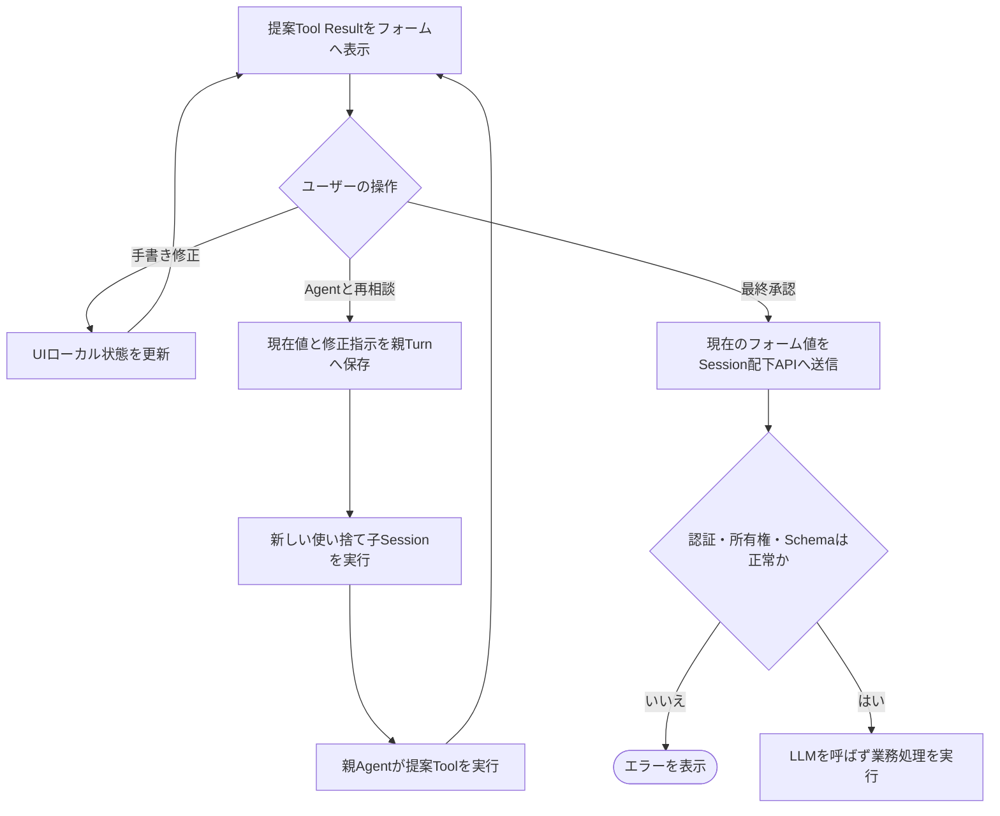
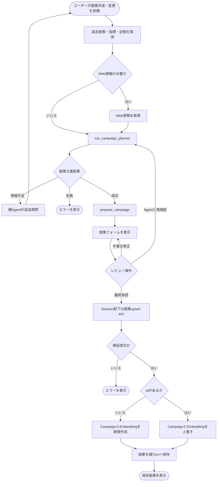
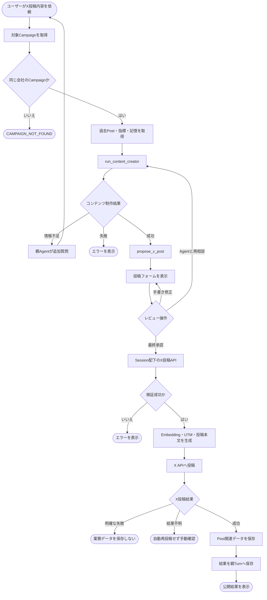

# ユースケース設計書

## 1. 文書の責務
本書は、ユーザーが親Agentへ依頼してから、施策が保存されるかX投稿が公開されるまでの業務フローを定義する。

- Agent、Tool、Session、内部ループの実装仕様は`AGENT_DESIGN.md`を正本とする
- アプリケーションAPIのRequest、Response、エラー仕様は`API_DESIGN.md`を正本とする
- データ構造と制約は`DATABASE.dbml`を正本とする
- 本書は各コンポーネントを横断するユーザー起点のフローを正本とする

## 2. 共通アクター
| アクター | 責務 |
| --- | --- |
| ユーザー | 依頼、フォーム編集、Agentとの再相談、最終承認を行う |
| UI | Agentの提案をフォーム表示し、最終フォーム値をAPIへ送信する |
| 親エージェント | ユーザーとの対話、子Agentの起動、提案Toolの実行を行う |
| 施策立案エージェント | 過去情報を踏まえた施策案を作成する |
| コンテンツ制作エージェント | 承認済み施策をもとにX投稿案を作成する |
| アプリケーションAPI | 最終承認されたフォーム値を検証し、業務処理と履歴保存を行う |
| X API | X投稿を公開し、X投稿IDを返す |

## 3. 共通前提
- ユーザーは認証済みで、マーケタープロファイルを持つ
- UIはユーザーが現在利用している未アーカイブの親Session IDを保持する
- 子Sessionはユーザーから直接操作しない
- 提案Toolは業務テーブルへの保存と外部公開を行わない
- 施策保存とX投稿は、認証済みUIからSession配下のAPIを呼び出して実行する
- 自由文による同意は最終承認として扱わない

## 4. 提案内容の共通レビュー
施策案とX投稿案は、提案ToolのTool Resultをフォーム初期値として表示する。ユーザーは「手書き修正」「Agentと再相談」「最終承認」のいずれかを選択する。

### 4.1 手書き修正
- UIフォームのローカル状態だけを変更する
- 中間編集はAgent履歴へ保存しない
- LLMとAgent Toolを実行しない
- 修正後も同じフォームでレビューを継続する

### 4.2 Agentと再相談
- UIは現在のフォーム値と修正指示を親Agentへ送信する
- バックエンドは入力を新しい親Turnの`user_message`へ保存する
- 親Agentは対象に応じた新しい使い捨て子Sessionを起動する
- 親Agentは子Agentの結果をもとに提案Toolを実行する
- UIは新しいTool Resultでフォームを置き換える

### 4.3 最終承認
- UIは承認時点のフォーム値をSession配下のAPIへ送信する
- API呼び出し自体を、送信内容に対する最終承認として扱う
- APIは認証、親Session所有権、会社所有権、入力Schemaを検証する
- 検証済みRequestを指定親Sessionの新しいTurnへ保存する
- API処理後、成功結果またはマスク済みエラーを同じTurnへ保存する
- 最終承認後の処理にLLMを使用しない

## 5. UC-01 施策を作成・更新する

### 5.1 目的
ユーザーの依頼をもとに施策案を作成し、ユーザーが最終確定した内容を新規施策として保存するか、既存施策へ上書きする。

### 5.2 事前条件
- 共通前提を満たしている
- 既存施策を変更する場合、対象施策がユーザーの会社に属する

### 5.3 トリガー
ユーザーが親Agentへ施策の新規作成または変更を依頼する。

### 5.4 基本フロー
1. バックエンドはユーザー依頼を親Sessionの新しいTurnへ保存する
2. 親Agentは類似する過去施策、評価指標、Long-term Memoryを取得する
3. 親Agentは必要に応じてWeb情報を取得する
4. 親Agentは`run_campaign_planner`を実行する
5. 施策立案エージェントは使い捨て子Sessionで施策案を作成する
6. 子Agentの最終結果だけを親AgentのTool Resultへ返す
7. 親Agentは実際の施策内容を引数に`propose_campaign`を実行する
8. UIは`propose_campaign`のTool Resultを編集可能なフォームとして表示する
9. ユーザーは共通レビューを行う
10. 最終承認時、UIは`POST /api/v1/agent-sessions/{session_id}/campaigns`を呼び出す
11. Request Bodyの`id`が省略または`null`なら新規作成として処理する
12. `id`に値があれば、同じ会社の既存Campaignを全項目上書きする
13. APIはCampaignと検索用Embeddingを同一Transactionで保存する
14. APIは結果を指定親Sessionの同じTurnへ保存する
15. UIは保存結果をユーザーへ表示する

### 5.5 完了条件
- 新規作成ではCampaignとCampaign Embeddingが作成されている
- 上書きではCampaignと必要なCampaign Embeddingが同期されている
- 最終RequestとAPI結果が指定親Sessionに保存されている

### 5.6 代替・エラーフロー
| 条件 | 処理 |
| --- | --- |
| 情報不足 | 親Agentがユーザーへ追加質問し、回答を新しいTurnで受け付ける |
| 手書き修正 | UIローカル状態を更新し、共通レビューへ戻る |
| Agentと再相談 | 現在値と修正指示から新しい子Sessionと提案Toolを実行する |
| 子Agent失敗 | マスク済みエラーを親へ返し、業務データを保存しない |
| 提案Schema不正 | `propose_campaign`を失敗させ、フォームへ不正な案を表示しない |
| 親Session不正 | `404 AGENT_SESSION_NOT_FOUND`を返す |
| 上書き対象なし | `404 CAMPAIGN_NOT_FOUND`を返し、指定IDで新規作成しない |
| Embedding生成失敗 | Campaignを保存せずエラーを返す |
| DB保存失敗 | TransactionをRollbackしてエラーを返す |

## 6. UC-02 X投稿内容を作成・公開する

### 6.1 目的
承認済み施策をもとにX投稿案を作成し、ユーザーが最終確定した内容をXへ公開する。

### 6.2 事前条件
- 共通前提を満たしている
- 対象Campaignが存在し、ユーザーの会社に属する
- 対象Campaignは施策APIで保存済みである

### 6.3 トリガー
ユーザーが親Agentへ、対象Campaignに紐づくX投稿内容の作成を依頼する。

### 6.4 基本フロー
1. バックエンドはユーザー依頼を親Sessionの新しいTurnへ保存する
2. 親Agentは対象Campaignを取得する
3. 親Agentは関連する過去Post、評価指標、Long-term Memoryを取得する
4. 親Agentは`run_content_creator`を実行する
5. コンテンツ制作エージェントは使い捨て子Sessionで投稿案を作成する
6. 子Agentの最終結果だけを親AgentのTool Resultへ返す
7. 親Agentは実際の投稿内容を引数に`propose_x_post`を実行する
8. UIは`propose_x_post`のTool Resultを編集可能なフォームとして表示する
9. ユーザーは共通レビューを行う
10. 最終承認時、UIは`POST /api/v1/agent-sessions/{session_id}/x/posts`を呼び出す
11. APIは親Session、Campaign所有権、本文、遷移先URLを検証する
12. APIは投稿検索用EmbeddingとUTM付きURLを生成する
13. APIはURL結合後の本文がX文字数規則を満たすことを検証する
14. APIは最終Requestを指定親Sessionの新しいTurnへ保存する
15. APIはX APIへ投稿する
16. X投稿成功後、Post、Post Embedding、UTM情報、計測予定を同一Transactionで保存する
17. APIは結果を指定親Sessionの同じTurnへ保存する
18. UIは公開結果をユーザーへ表示する

### 6.5 完了条件
- Xに投稿が公開され、X投稿IDを取得している
- Postと関連データが保存されている
- 最終RequestとAPI結果が指定親Sessionに保存されている
- 投稿から1週間後の評価処理が予定されている

### 6.6 代替・エラーフロー
| 条件 | 処理 |
| --- | --- |
| Campaignなし・別会社 | `404 CAMPAIGN_NOT_FOUND`を返す |
| 情報不足 | 親Agentがユーザーへ追加質問し、回答を新しいTurnで受け付ける |
| 手書き修正 | UIローカル状態を更新し、共通レビューへ戻る |
| Agentと再相談 | 現在値と修正指示から新しい子Sessionと提案Toolを実行する |
| 子Agent失敗 | マスク済みエラーを親へ返し、X投稿を行わない |
| 提案Schema不正 | `propose_x_post`を失敗させ、フォームへ不正な案を表示しない |
| 親Session不正 | `404 AGENT_SESSION_NOT_FOUND`を返す |
| 投稿内容不正 | `422 INVALID_X_POST`を返し、X投稿を行わない |
| Embedding生成失敗 | X投稿を行わずエラーを返す |
| X API明確失敗 | `502 X_POST_FAILED`を返し、業務データを保存しない |
| X投稿結果不明 | `504 X_POST_OUTCOME_UNKNOWN`を返し、自動再投稿しない |
| X成功後のDB保存失敗 | `500 X_POST_SAVE_FAILED`を返し、自動再投稿しない |

