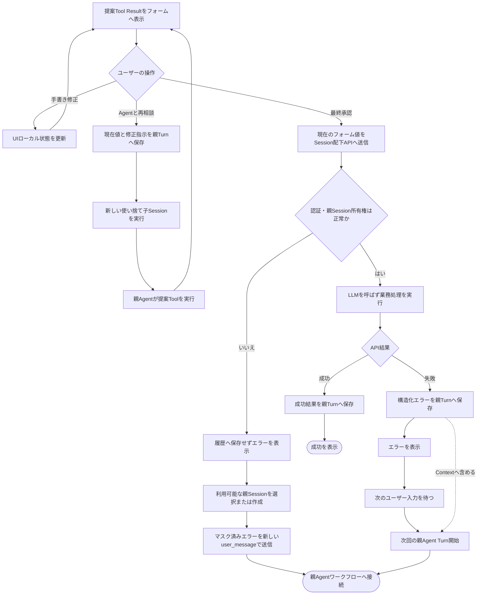
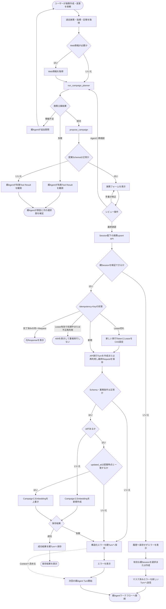
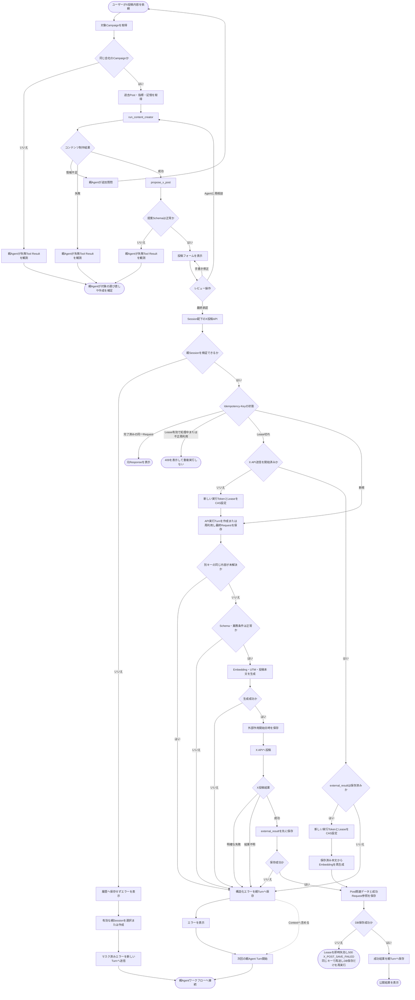

# ユースケース設計書

## 1. 文書の責務
本書は、ユーザーが親Agentへ依頼してから、施策が保存されるかX投稿が公開されるまでの業務フローを定義する。

- Agent、Tool、Session、内部ループの実装仕様は`AGENT_DESIGN.md`を正本とする
- アプリケーションAPIのRequest、Response、エラー仕様は`API_DESIGN.md`を正本とする
- データ構造と制約は`DATABASE.dbml`を正本とする
- 本書は各コンポーネントを横断するユーザー起点のフローを正本とする

## 2. 共通アクター
| アクター | 責務 |
| --- | --- |
| ユーザー | 依頼、フォーム編集、Agentとの再相談、最終承認を行う |
| UI | Agentの提案をフォーム表示し、最終フォーム値をAPIへ送信する |
| 親エージェント | ユーザーとの対話、子Agentの起動、提案Toolの実行を行う |
| 施策立案エージェント | 過去情報を踏まえた施策案を作成する |
| コンテンツ制作エージェント | 承認済み施策をもとにX投稿案を作成する |
| アプリケーションAPI | 最終承認されたフォーム値を検証し、業務処理と履歴保存を行う |
| X API | X投稿を公開し、X投稿IDを返す |

## 3. 共通前提
- ユーザーは署名付きCookieでログイン済みで、マーケタープロファイルを持つ。認証とCSRF対策は`API_DESIGN.md`の2.8を参照する
- UIはユーザーが現在利用している未アーカイブの親Session IDを保持する
- 子Sessionはユーザーから直接操作しない
- 提案Toolは業務テーブルへの保存と外部公開を行わない
- 施策保存とX投稿は、認証済みUIからSession配下のAPIを呼び出して実行する
- UIは最終承認操作ごとに`Idempotency-Key`を生成し、二重送信と通信再試行では同じキーを使用する
- APIは同じキーの同一Requestを一度だけ実行し、完了後の再送には保存済みの確定Responseを返す。`outcome_unknown`は手動照合後の確定結果へ更新できる
- 自由文による同意は最終承認として扱わない

## 4. 提案内容の共通レビュー
施策案とX投稿案は、提案ToolのTool Resultをフォーム初期値として表示する。ユーザーは「手書き修正」「Agentと再相談」「最終承認」のいずれかを選択する。

### 4.1 手書き修正
- UIフォームのローカル状態だけを変更する
- 中間編集はAgent履歴へ保存しない
- LLMとAgent Toolを実行しない
- 修正後も同じフォームでレビューを継続する

### 4.2 Agentと再相談
- UIは現在のフォーム値と修正指示を親Agentへ送信する
- バックエンドは入力を新しい親Turnの`user_message`へ保存する
- 親Agentは対象に応じた新しい使い捨て子Sessionを起動する
- 親Agentは子Agentの結果をもとに提案Toolを実行する
- UIは新しいTool Resultでフォームを置き換える

### 4.3 最終承認
- UIは承認操作用の`Idempotency-Key`を生成し、承認時点のフォーム値とともにSession配下のAPIへ送信する
- API呼び出し自体を、送信内容に対する最終承認として扱う
- APIは認証、CSRF、親Session所有権、安全なJSON解析、冪等性を検証する
- 実行権を得たRequestを、指定親Sessionの新しいTurnへ保存する
- APIは保存後に、入力Schemaと会社所有権を検証する
- API処理後、成功結果またはマスク済みエラーを同じTurnへ保存する
- 同じキーの再送では新しいTurnや業務データを作成せず、保存済みResponseを返す
- 最終承認後の処理にLLMを使用しない

### 4.4 APIエラー後のAgent接続
- 認証と親Session所有権を検証できた後のAPIエラーは、構造化した`api_result`としてAPI実行Turnへ保存する
- APIはエラー保存後にTurnを完了し、同じエラーをUIへ返して表示する
- APIエラーだけでは親Agentを自動起動しない
- 次のユーザー入力で親Agent Turnを開始した際、Context構築処理が`api_result`を通常の会話履歴として読み込む
- 親Agentは失敗した操作、エラーコード、利用者向け説明、再試行可否を観測して回答や修正提案へ利用する
- 親Agentがエラーを観測しても、施策保存やX投稿などの副作用を自動再実行しない
- 認証失敗、CSRF検証の失敗、親Session所有権の検証失敗、安全に解析・マスクできないRequestは保存先または安全な内容を確定できないため、そのRequestをAgent履歴へ保存せずUIへエラーを返す
- `AGENT_SESSION_NOT_FOUND`では、UIが利用可能な親Sessionを再取得し、ユーザーが既存Sessionを選択するか新しい親Sessionを作成した後、マスク済みエラーを新しい`user_message`として送信して親Agentワークフローへ接続する

```json
{
  "kind": "api_result",
  "operation": "publish_x_post",
  "success": false,
  "error": {
    "code": "INVALID_X_POST",
    "message": "投稿本文が文字数上限を超えています。",
    "retryable": false
  }
}
```



## 5. UC-01 施策を作成・更新する

### 5.1 目的
ユーザーの依頼をもとに施策案を作成し、ユーザーが最終確定した内容を新規施策として保存するか、既存施策へ上書きする。

### 5.2 事前条件
- 共通前提を満たしている
- 既存施策を変更する場合、対象施策がユーザーの会社に属する

### 5.3 トリガー
ユーザーが親Agentへ施策の新規作成または変更を依頼する。

### 5.4 基本フロー
1. バックエンドはユーザー依頼を親Sessionの新しいTurnへ保存する
2. 親Agentは類似する過去施策、評価指標、Long-term Memoryを取得する
3. 親Agentは必要に応じてWeb情報を取得する
4. 親Agentは`run_campaign_planner`を実行する
5. 施策立案エージェントは使い捨て子Sessionで施策案を作成する
6. 子Agentの最終結果だけを親AgentのTool Resultへ返す
7. 親Agentは実際の施策内容を引数に`propose_campaign`を実行する
8. UIは`propose_campaign`のTool Resultを編集可能なフォームとして表示する
9. ユーザーは共通レビューを行う
10. 最終承認時、UIは承認操作用の`Idempotency-Key`とフォーム値（既存施策の変更では`expected_updated_at`を含む）を指定して`POST /api/v1/agent-sessions/{session_id}/campaigns`を呼び出す
11. APIは認証、CSRF、親Session所有権、冪等性を検証し、実行権を得たRequestの最終内容を指定親Sessionの新しいTurnへ保存する
12. APIはRequest Bodyを施策Schemaと業務条件で検証する
13. Request Bodyの`id`が省略または`null`なら新規作成として処理する
14. `id`に値があれば、同じ会社の既存Campaignの`updated_at`が`expected_updated_at`と一致する場合だけ、全項目を上書きする
15. APIはCampaign、検索用Embedding、成功API Result、Turn完了、冪等性の成功状態を同一Transactionで保存する
16. UIは保存結果をユーザーへ表示する

### 5.5 完了条件
- 新規作成ではCampaignとCampaign Embeddingが作成されている
- 上書きではCampaignと必要なCampaign Embeddingが同期されている
- 上書きでは、Agentの提案後に別のSessionまたは別のマーケターが施策を更新していた場合に上書きされない
- 最終RequestとAPI結果が指定親Sessionに保存されている
- 同じ承認操作が再送されてもCampaignとAgent履歴が重複作成されない

### 5.6 代替・エラーフロー
| 条件 | 処理 |
| --- | --- |
| 情報不足 | 親Agentがユーザーへ追加質問し、回答を新しいTurnで受け付ける |
| 手書き修正 | UIローカル状態を更新し、共通レビューへ戻る |
| Agentと再相談 | 現在値と修正指示から新しい子Sessionと提案Toolを実行する |
| 子Agent失敗 | 失敗Tool Resultを現在の親Agentが観測し、ユーザーへ原因と次の選択肢を補足する。業務データは保存しない |
| 提案Schema不正 | `propose_campaign`の失敗Tool Resultを現在の親Agentが観測し、不正なフォームを表示せず再生成または修正方法を補足する |
| 親Session不正 | `404 AGENT_SESSION_NOT_FOUND`を返す。UIで有効な親Sessionを選択または作成し、マスク済みエラーを新しいTurnへ送信して親Agentワークフローへ接続する |
| 同一Requestの再送 | 保存済みの確定HTTP StatusとResponse Bodyを返し、新しいCampaignとAgent Turnを作成しない |
| 同一Requestを処理中 | Leaseが有効なら`409 IDEMPOTENCY_REQUEST_IN_PROGRESS`を返し、UIは処理完了後に同じキーで結果を再取得する |
| Campaign処理のLease切れ | 新しい実行TokenとLeaseをCAS設定し、既存のAPI実行Turnを再利用して安全に再開する |
| キーの不正再利用 | 異なるRequestまたはSessionでは`409 IDEMPOTENCY_KEY_REUSED`を返し、施策を保存しない |
| 上書き対象なし | 存在しない場合も別会社に属する場合も`404 CAMPAIGN_NOT_FOUND`を親Turnへ保存し、指定IDで新規作成せず次回Agentワークフローへ接続する |
| 上書きの競合 | `expected_updated_at`が現在の`updated_at`と一致しない場合は`409 CAMPAIGN_CONFLICT`を親Turnへ保存し、上書きしない。次回Agentワークフローで親Agentが最新の施策を取得し、新しい提案を作成する。再実行には新しい承認操作と新しいキーを必要とする |
| Embedding生成失敗 | Campaignを保存せず、構造化エラーを親Turnへ保存して次回Agentワークフローへ接続する |
| DB保存失敗 | TransactionをRollbackし、構造化エラーを親Turnへ保存して次回Agentワークフローへ接続する |



## 6. UC-02 X投稿内容を作成・公開する

### 6.1 目的
承認済み施策をもとにX投稿案を作成し、ユーザーが最終確定した内容をXへ公開する。

### 6.2 事前条件
- 共通前提を満たしている
- 対象Campaignが存在し、ユーザーの会社に属する
- 対象Campaignは施策APIで保存済みである

### 6.3 トリガー
ユーザーが親Agentへ、対象Campaignに紐づくX投稿内容の作成を依頼する。

### 6.4 基本フロー
1. バックエンドはユーザー依頼を親Sessionの新しいTurnへ保存する
2. 親Agentは対象Campaignを取得する
3. 親Agentは関連する過去Post、評価指標、Long-term Memoryを取得する
4. 親Agentは`run_content_creator`を実行する
5. コンテンツ制作エージェントは使い捨て子Sessionで投稿案を作成する
6. 子Agentの最終結果だけを親AgentのTool Resultへ返す
7. 親Agentは実際の投稿内容を引数に`propose_x_post`を実行する
8. UIは`propose_x_post`のTool Resultを編集可能なフォームとして表示する
9. ユーザーは共通レビューを行う
10. 最終承認時、UIは承認操作用の`Idempotency-Key`とフォーム値を指定して`POST /api/v1/agent-sessions/{session_id}/x/posts`を呼び出す
11. APIは認証、CSRF、親Session所有権、冪等性を検証し、実行権を得たRequestの最終内容を指定親Sessionの新しいTurnへ保存する
12. APIはCampaign所有権、本文、遷移先URLを検証する
13. APIは投稿検索用EmbeddingとUTM付きURLを生成する
14. APIはURL結合後の本文がX文字数規則を満たすことを検証する
15. APIはX API送信直前に外部作用開始日時を保存し、X APIへ投稿する
16. X投稿成功直後、APIはDB保存より先にX投稿結果（X投稿ID、送信本文、UTM付きURL、公開日時）を冪等性レコードの`external_result`へ保存する
17. APIはPost、Post Embedding、UTM情報、計測予定、成功API Result、Turn完了、冪等性の成功状態を同一Transactionで保存し、Postから成功Requestを参照する
18. UIは公開結果をユーザーへ表示する

### 6.5 完了条件
- Xに投稿が公開され、X投稿IDを取得している
- Postと関連データが保存されている
- 最終RequestとAPI結果が指定親Sessionに保存されている
- 投稿から1週間後の評価処理が予定されている
- 同じ承認操作が再送されてもX投稿、Post、Agent履歴が重複作成されない
- X投稿成功後にDB保存が失敗した場合も、同じキーの再送でDB保存だけが再実行され、Xへ再投稿されない
- `get_post`と`search_posts`の対象になるのは、成功状態の`publish_x_post` Requestを参照するPostだけである

### 6.6 代替・エラーフロー
| 条件 | 処理 |
| --- | --- |
| AgentによるCampaign取得失敗 | 失敗Tool Resultを現在の親Agentが観測し、対象の選び直しや作成をユーザーへ補足する |
| 情報不足 | 親Agentがユーザーへ追加質問し、回答を新しいTurnで受け付ける |
| 手書き修正 | UIローカル状態を更新し、共通レビューへ戻る |
| Agentと再相談 | 現在値と修正指示から新しい子Sessionと提案Toolを実行する |
| 子Agent失敗 | 失敗Tool Resultを現在の親Agentが観測し、ユーザーへ原因と次の選択肢を補足する。X投稿は行わない |
| 提案Schema不正 | `propose_x_post`の失敗Tool Resultを現在の親Agentが観測し、不正なフォームを表示せず再生成または修正方法を補足する |
| 親Session不正 | `404 AGENT_SESSION_NOT_FOUND`を返す。UIで有効な親Sessionを選択または作成し、マスク済みエラーを新しいTurnへ送信して親Agentワークフローへ接続する |
| 同一Requestの再送 | 保存済みResponseを返し、X投稿とAgent Turnを重複作成しない。`outcome_unknown`の手動照合後は解決後の確定Responseを返す |
| 同一Requestを処理中 | Leaseが有効なら`409 IDEMPOTENCY_REQUEST_IN_PROGRESS`を返し、Xへ重複投稿しない |
| X送信前のLease切れ | 新しい実行TokenとLeaseをCAS設定し、既存のAPI実行Turnを再利用して安全に再開する |
| X送信後のLease切れ | `external_result`が保存済みなら新しい実行TokenとLeaseをCAS設定し、Xを呼ばずDB保存だけを再開する。未保存なら専用の復旧CASで`outcome_unknown`へ変更し、Postを作成せず手動照合へ送る |
| キーの不正再利用 | 異なるRequestまたはSessionでは`409 IDEMPOTENCY_KEY_REUSED`を返し、Xへ投稿しない |
| 別キーの同一投稿が未解決 | `409 X_POST_UNRESOLVED`を返し、処理中または結果不明の投稿が解決するまでXへ投稿しない |
| APIによるCampaign取得失敗 | `404 CAMPAIGN_NOT_FOUND`を親Turnへ保存し、X投稿を行わず次回Agentワークフローへ接続する |
| 投稿内容不正 | `422 INVALID_X_POST`を親Turnへ保存し、X投稿を行わず次回Agentワークフローへ接続する |
| Embedding生成失敗 | 構造化エラーを親Turnへ保存し、X投稿を行わず次回Agentワークフローへ接続する |
| X API明確失敗 | `502 X_POST_FAILED`を親Turnへ保存し、Postを保存せず次回Agentワークフローへ接続する |
| X投稿結果不明 | `504 X_POST_OUTCOME_UNKNOWN`を親Turnへ保存し、Postを保存せず、自動再投稿せずに手動照合へ送る。成功確認後だけ復旧TransactionでPostを作成する |
| 外部結果の保存失敗 | X API成功後に`external_result`を保存できない場合は、X投稿結果を復旧できないため`504 X_POST_OUTCOME_UNKNOWN`と同様に`outcome_unknown`として保存し、手動照合へ送る |
| X成功後のDB保存失敗 | Post関連の保存Transactionをロールバックし、`external_result`を保持したまま`processing`に留めてLeaseを即時失効させ、`500 X_POST_SAVE_FAILED`（同じキーで再送可）を返す。この時点では確定Responseを保存せず、API実行Turnも終端にしない。UIは投稿済みであることを表示して同じキーで再送し、再送時はXを呼ばずDB保存だけを再実行して確定Responseを保存する。再送されないまま残った場合は運用スクリプトで検出する |


