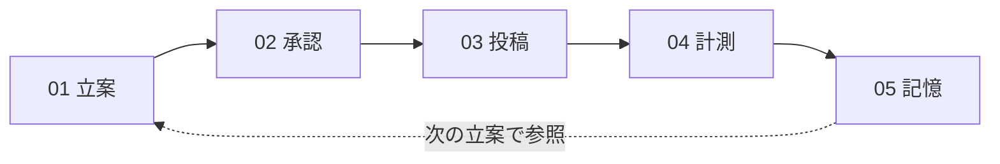

# hiromeru 画面デザイン 概要

AIエージェントが、あなたの承認を得ながら、Xマーケティングの「立案 → 承認 → 投稿 → 計測 → 記憶」を回すシステムの、MVP画面デザインの概要です。

- 詳細な画面仕様: [`../SCREEN_DESIGN.md`](../SCREEN_DESIGN.md)
- 要件・DB: [`../REQUIREMENTS.md`](../REQUIREMENTS.md) / [`../DATABASE.dbml`](../DATABASE.dbml)
- 画面デザインのソース: このフォルダの `*.dc.html`（配置は `canvas.json`）。デザインキャンバスで開いて操作できます。

---

## 1. 改善サイクル

| ステップ | 内容 | 主な画面 |
|---------|------|----------|
| 01 立案 | 親エージェントが過去の記憶とWeb情報を集め、施策立案エージェントが施策案を作る | SC-01 ホーム |
| 02 承認（人） | 施策と投稿内容は、あなたが承認するまで確定しない | SC-01 / SC-03 / SC-05 |
| 03 投稿 | 承認済みの内容だけを、UTM付きURLとともにXへ投稿する | SC-05 投稿詳細 |
| 04 計測 | 投稿の1週間後に、初週PV数と応募ページへの流入ユーザー数を自動取得する | SC-06 計測結果 |
| 05 記憶 | 結果を長期記憶として保存し、次の施策立案で参照する | SC-07 記憶 |

---

## 2. 画面一覧（12画面）

### 01 入口・対話・記憶

| ID | 画面 | ファイル | 概要 |
|----|------|----------|------|
| SC-00 | ログイン | `Login.dc.html` | 外部アカウントで1ボタンログイン |
| SC-01 | ホーム（親エージェントチャット） | `Chat.dc.html` | 会話しながら、施策案・投稿案をカードで承認する |
| SC-07 | 記憶一覧 | `Memories.dc.html` | 意味検索、覚えさせる、忘却 |

### 02 施策と計測

| ID | 画面 | ファイル | 概要 |
|----|------|----------|------|
| SC-02 | 施策一覧 | `Campaigns.dc.html` | ステータス別に施策を一覧し、承認待ちを見つける |
| SC-03 | 施策詳細・編集 | `CampaignDetail.dc.html` | 内容、承認情報、関連する投稿と記憶 |
| SC-06 | 計測結果 | `Metrics.dc.html` | 初週PVと流入ユーザー数を施策ごとに比較 |

### 03 投稿の承認とX投稿

| ID | 画面 | ファイル | 概要 |
|----|------|----------|------|
| SC-04 | 投稿一覧 | `Posts.dc.html` | 対応が必要な投稿を先頭に、状態を一覧 |
| SC-05 | 投稿詳細・承認・投稿 | `PostDetail.dc.html` | 本文・UTM・承認状況の確認と、Xへの投稿 |
| SC-05 | Xに投稿の確認ダイアログ | `PostConfirm.dc.html` | 公開前の最終確認 |

### 04 運用

| ID | 画面 | ファイル | 概要 |
|----|------|----------|------|
| SC-08 | コスト | `Cost.dc.html` | LLM利用コストの合計とエージェント別の内訳 |
| SC-09 | 実行履歴 | `Sessions.dc.html` | ツール実行、失敗の原因、隔離された内容の記録 |
| SC-10 | セキュリティイベント | `Security.dc.html` | Prompt Injectionなどの検出とブロックの記録（追記専用） |

---

## 3. 安心のしくみ（画面で強制する規則）

| 規則 | 内容 |
|------|------|
| 施策は承認するまで確定しない | 施策案は、承認するまでエージェント履歴に留まり、施策として保存されない |
| 公開できるのは承認済みの版だけ | 承認済みの改訂と一致する投稿だけが、Xへ公開される |
| 承認後に編集すると再承認 | 編集して保存すると改訂が上がり、承認が取り消される。保存前に画面で確認する |
| 公開済みは削除できない | 公開済みの投稿と完了済みの監査記録は、削除の操作を出さず、アーカイブのみ |
| Web内の命令を実行しない | 外部から取得した内容は信頼できないデータとして扱い、命令文を検出・隔離・記録する |
| コストと履歴が見える | LLM呼び出しごとのコスト、ツール実行、失敗の原因を運用画面で確認できる |

---

## 4. MVPの範囲

| 含むもの | 含まないもの（将来の拡張） |
|----------|----------------------------|
| X（テキスト投稿）のみ | 画像の生成・編集・画像付き投稿 |
| 評価指標は初週PV数と応募ページへの流入ユーザー数の2つ | X以外のSNS、いいね・リポストなどの指標 |
| 記憶はベクトル検索で保存・想起し、必要なら忘却できる | 投稿頻度の最適化、記憶の自動整理 |
| 投稿は明示的な操作でのみ実行 | 完全自動での立案から投稿まで |

---

## 5. 未確定事項

画面デザインで仮置きにしている点は、[`../SCREEN_DESIGN.md`](../SCREEN_DESIGN.md) の「未確定事項・要判断事項」（U-1〜U-11）に一覧があります。特に、使用モデルの記録先（DBにカラムなし）、記憶の作成日時・種別（DBにカラムなし）、施策の未承認案の置き場所、応募ページURLの入力主体は、DBまたは要件の判断が必要です。

画面内の数値・施策名・本文は、すべてサンプルです。
